链接:https://zhuanlan.zhihu.com/p/464774687

声明

这篇文章关于x86_64指令编码方式的相关文字并非笔者自己原创,笔者在拜读原文章的基础上,还添加自己个人的理解的内容.原文章的如下链接.

[Encoding x86-64 instructions: some worked examplespyokagan.name/blog/2019-09-20-x86encoding/](https://link.zhihu.com/?target=https%3A//pyokagan.name/blog/2019-09-20-x86encoding/)

翻译原文站的动机是因为笔者最近想深刻理解JIT编译技术,那么最好的方式是自己去实现一次,目前源代码使用Python语言已经实现了从CPython字节码到生成汇编代码的转换.见如下图,现在这些代码还处于玩具级别,等到解决了一些真正的技术难题再上传到Github.

JIT前端实现无非有两种:

- 迭代Python的AST语法树对Python代码的关键字节点替换成等效的C代码或汇编指令集.
- 对Python字节码进行解码,并对特定的字节码指令替换成更底层的汇编指令集.

笔者选择的是第二种方式,因为这种方式省去转换为C代码的中间步骤.

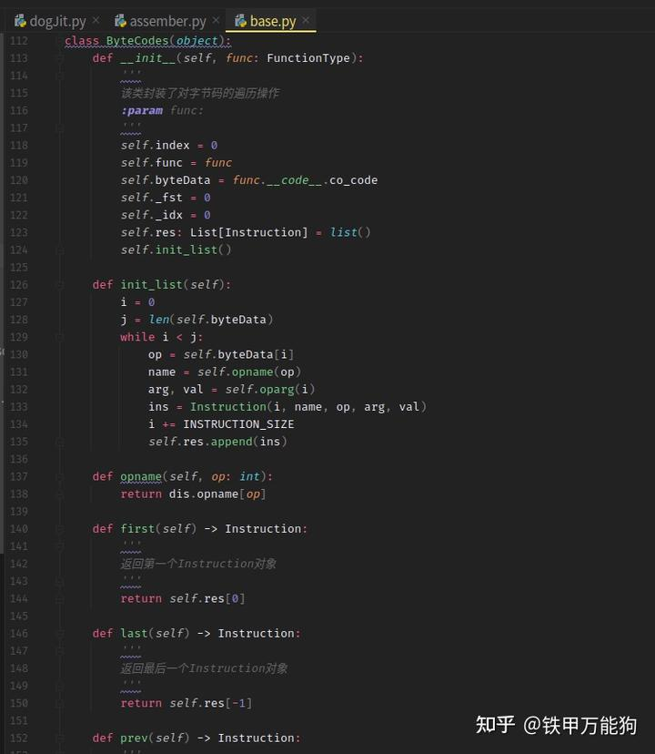

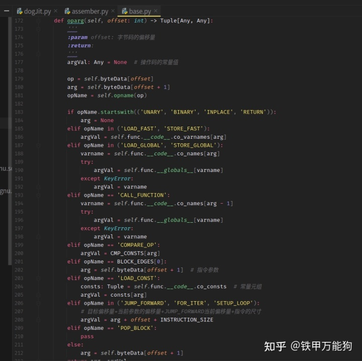

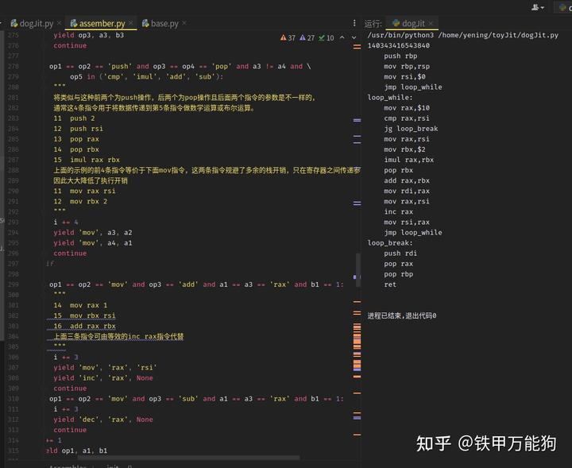

这些JIT代码还在玩具级别,所以完整的代码在笔者解决碰到的技术难题后,再上传到Github

笔者已经实现了JIT编译器的前端工作自动生成汇编,目前的难题就是如何将Python运行时编译器生成的汇编代码在运行时自动编码成机器码,这是所有JIT编译器实现遇到共同的难题.网上有一大堆现成的C/C++实现例如asmJIT、GNUlightning会在运行时将C代码自动编译成机器码.但这不符合笔者的需求.安装第三方库时,又冒出一大堆依赖问题.于是就选择自己去实现,刚好笔者可以去填补汇编编码成机器码这一块的知识空白.

当然目前的JIT实现还存在运行时慢的问题,等这个项目成型了将Python代码修改成Cython的代码实现,最后编译成C扩展,就可以很好地解决了这个问题.

许多网站解释了如何对一些简单mov指令进行编码,基本上是东抄西拼没自己的见解.几乎很少文章会教您如何对任何x86-64指令进行编码的原理,而刚好笔者找到一篇很好的文章.为原文章的博主[Pyokagan](https://link.zhihu.com/?target=https%3A//pyokagan.name/blog/index.html)点赞.他解决了我的难题.

本文还用到以下参考资源

- [https://wiki.osdev.org/X86-64_Instruction_Encoding](https://link.zhihu.com/?target=https%3A//wiki.osdev.org/X86-64_Instruction_Encoding)
- [http://ref.x86asm.net/geek64.h](https://link.zhihu.com/?target=http%3A//ref.x86asm.net/geek64.html)

## **开始之前:使用 objdump 验证我们的编码**

手动编码 x86-64 指令时,验证您的编码指令是否正确非常有用(为您省去一些痛苦的调试).这可以通过 objdump 轻松完成.将以下内容另存为 [disasm.sh](https://link.zhihu.com/?target=http%3A//disasm.sh/):

```shell
#!/bin/sh
objdump -D -b binary -mi386:x86-64 -M intel "$@"
```

## 从一些 x86 指令示例开始

由于 x86-64 指令集只是简单地扩展了 x86 指令集,因此最好先看一些 x86 编码示例,以便我们稍后更好地了解 x86-64 编码是如何从 x86 编码衍生而来的.

x86有8个32位宽的寄存器:eax、ecx、edx、ebx、rsp、ebp、esi、edi.它们的内部编号分别为0到7.

现在,让我们看一些例子,没什么

```assembly
add eax,0x4351ff23
```

让我们从一个将 32 位立即数添加到 eax 寄存器的简单示例开始. (值 0x4351ff23 只是我选择的一个随机值,你可以使用你自己的).

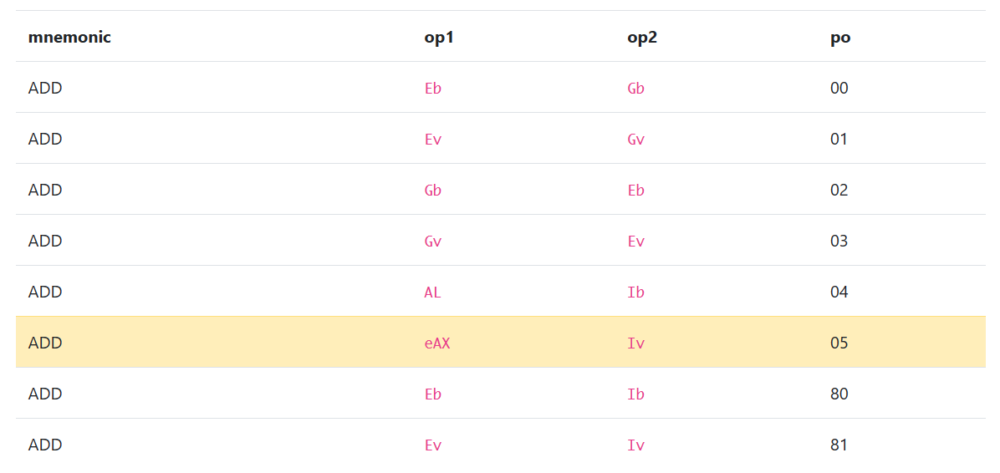

(自从表格离开屏幕以来,我已经删除了表格的大部分列)完整的汇编指令编码,可以查阅这一个网站.笔者[http://ref.x86asm.net/geek32-abc.html](https://link.zhihu.com/?target=http%3A//ref.x86asm.net/geek32-abc.html),

这是因为虽然程序集可能会调用所有"add"指令,但它们在内部都有不同的操作码.您应该使用哪个操作码(以及总体而言,指令的编码)取决于您的操作数的类型.此信息列在表的 op1 和 op2 列下.

对于我们的指令,我们希望将 eax 作为操作数op1 和 Iv(意思是常数或叫立即数 Immediate Value 是32 位值)作为操作数 2 进行操作.查看表格,我们可以看到第 6 行(突出显示的黄色)与我们想要的匹配.指令的操作码列在 po 列下,为 0x05.所以,我们指令的第一个字节的机器码应该是 0x05:

```shell
+------+
| 0x05 |
+------+
  ^ 第一字节是opcode.
```

接下来是我们的立即数,它是 32 位(4 字节)长.请注意,立即数以小端字节顺序编码 --- 即最低有效字节在前.

```shell
+------+------+------+------+------+
| 0x05 | 0x23   0xff   0x51   0x43 |
+------+------+------+------+------+
            ^ 立即数 (最低有效字节在前)
```

这样就结束！将这些字节转储到文件(foo.bin)中,然后使用反汇编脚本反汇编:

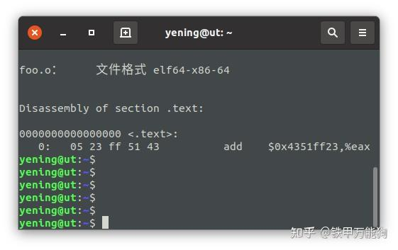

现在,您可能会注意到,虽然我们通过操作码和立即数告诉处理器要执行哪个操作,但我们并没有明确告诉处理器使用 eax 寄存器.这是因**为操作码 0x05 只能与 EAX 寄存器一起使用(这就是为什么将 eax寄存器称为累加器寄存器的原因).这类带有特殊寄存器的操作码在 x86 指令集中非常频繁地出现——它们牺牲了一些灵活性来获得更短的指令编码**.

现在来一个更为复杂的示例,它会用到的 ModR/M 字节

```assembly
 add ecx,esi 
```

现在考虑指令 add ecx, esi,它将寄存器 esi 的值与 ecx 进行32位相加.这里随机选择了 ecx 和 esi --- 如果你愿意,你可以使用自己的.

对于这条指令,应该使用的 add 操作码是一个接受 Ev 作为 operand1 和 Gv 作为 operand2 的操作码.(E 和 G 表示操作数在 ModR/M 字节中指定,v 表示操作数为 32 位大小).查看表格,应该使用的操作码是 0x01,在下表中将其涂成黄色:

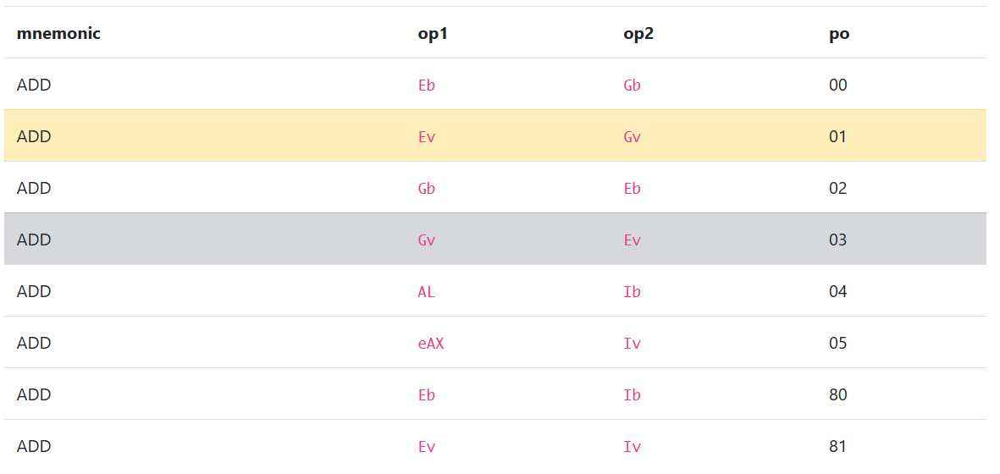

我还将操作码0x03涂成灰色.我以后再谈.

现在,和往常一样,从第一个字节开始的操作码字节是0x01:

```text
+------+
| 0x01 |
+------+
  ^ First byte is the opcode.
```

当处理器看到操作码 0x01 时,它会期望 ModR/M 字节接下来出现. ModR/M 字节允许我们指定采用 E 和 G 操作数的指令的寄存器操作数.在这个链接中 [X86-64 Instruction Encoding](https://link.zhihu.com/?target=https%3A//wiki.osdev.org/X86-64_Instruction_Encoding) 关于 ModR/M 字节的格式有这样的说法:

```shell
7                               0
+---+---+---+---+---+---+---+---+
|  mod  |    reg    |     r/m    |
+---+---+---+---+---+---+---+---+
```

上图中的ModR/M字节,前两位表示操作的模式、后面两个3位的空间标记着操作数的寄存器编号、或内存地址取址方式

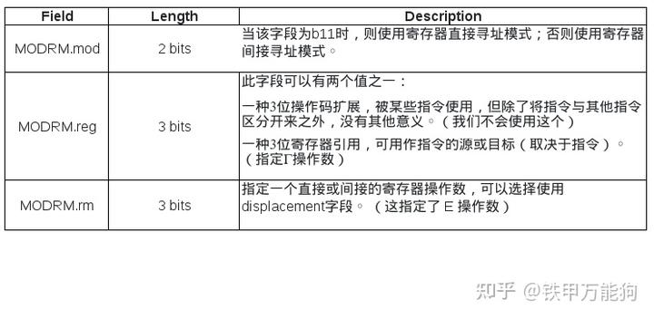

因此,对于指令 add ecx, esi,我们对 ModR/M 字节字段的值是:

- MODRM.mod = b11(因为我们使用的是寄存器直接寻址模式)
- MODRM.reg = b110(esi,即寄存器 6)
- MODRM.r/m = b001(ecx,即寄存器 1)

源文章没有提到的是,ModR/M字段中的,reg位表示寄存器作为操作数、M表示寄存器或者内存地址可以作为操作数

注意到的是,上表中的描述还提到了寄存器间接寻址模式. ModR/M 字节以及 SIB 字节可用于编码从内存加载操作数的 add指令(例如 add ecx,[esp + 0x4]),但不会在这里介绍.

这里另外附带参考完整的x86_64寄存器列表以备自己日后备查

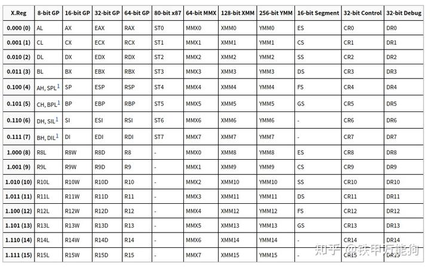

所以,把这些位放在一起,我们得到字节b11110001=0xf1.那么,整个add ecx,esi指令的机器编码形式:

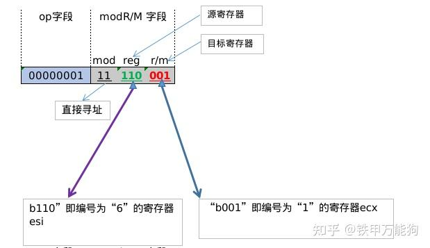

而objdump中反汇编的机器码的十六进程形式,应该是这样的

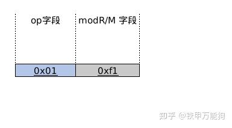

用objdump反编译验证:

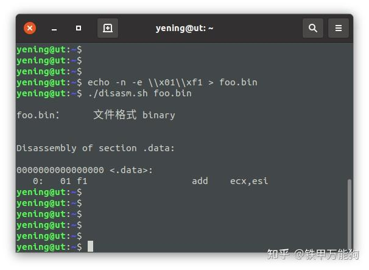

## 操作码 0x01 与 0x03的区别

虽然在此示例中我们使用了操作码 0x01,但您可能会注意到操作码 0x03(我在上表中以灰色突出显示)也将 Ev 和 Gv 作为操作数——只是它们的位置被交换了. 对于操作码 0x01,Ev 是操作数op1,Gv 是操作数op2,但对于操作码 0x01,Ev 是操作数op2,Gv是操作数op1.那么,你能猜到如果我们使用操作码 0x03 而不是操作码 0x01 会发生什么吗？

事实上,我们实际上可以同时使用操作码 0x01 和 0x03 来实现相同的指令**add ecx,esi**

## **X86_64指令编码**

现在,让我们继续了解x86-64指令是如何编码成机器码的. x86-64增加了8个新寄存器,总共16个寄存器.所有16个寄存器也扩展为64位宽.寄存器的完整列表是:rax、rcx、rdx、rbx、rsp、rbp、rsi、rdi、r8、r9、r10、r11、r12、r13、r14、r15.它们的内部编号分别为0到15.完整的寄存器一览表如下

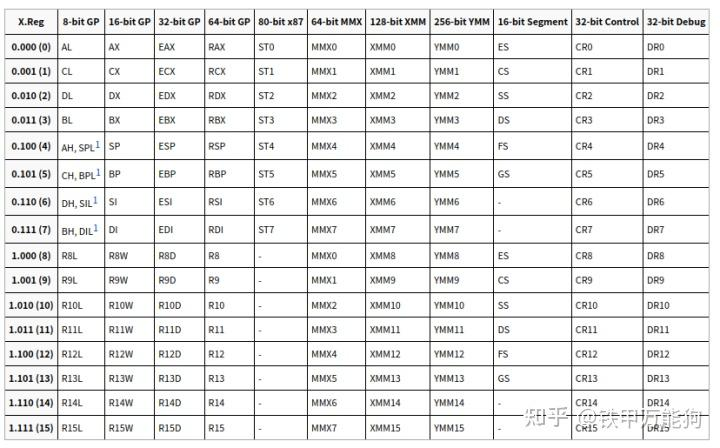

所有8个32位x86寄存器仍然存在于x86-64中,但它们现在映射到各自64位寄存器的低32位.例如eax映射到rax的低32位,ecx映射到rcx的低32位等等....

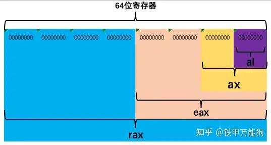

- **r8**到**r15**这8个物理寄存器是x86_64架构新增的
- **rax**到**rsp**这8个物理寄存器其实分别对应x86中的**eax**到**esp**扩展版本,数据宽度扩展至64位,也就是64位的寄存器在每个CPU周期吞吐数据量相比32位的寄存器翻了一倍.
- 32bit那一列的**r8d**到**r15d**这8个寄存器只是逻辑上的寄存器, IA32硬件中是不可能存在的,因为他们是有x86_64中的 **r8**到**r15**这8个物理寄存器的低阶32位模拟出来的.
  

从上面最后一点,我们顺便讨论一下x86和x86_64之间寄存器的关系,我们已经知道x86_64的寄存器的数据宽度都是64位,但我们可以将它们的低阶的32位作为一个"逻辑上"的x86寄存器来访问,例如我们熟悉的x86寄存器eax,就是使用x86_64寄存器rax的低阶32位来模拟的,这也从硬件特征上已经回答了一个常见的问题,这就是"**为什么x86_64的硬件能够兼容32位程序？**"的原因,当然还少不了操作系统的x86的api支持.

此外,对于x86-64,默认操作数尺寸与x86相同,即32位.这意味着在x86-64的机器中可以使用上面介绍的完全相同的操作码和指令编码来表示相同的内容(32位加法).因此,例如,0x01 0xf1,这意味着**add ecx,esi**(上面讨论过)将获取rsi的低32位,将在执行加法运算后的值拷贝到rcx寄存器的低32位,rcx的高32位以0填充. 

但是如果我们想在64位寄存器上进行64位加法,会发生什么呢？

要将**add ecx,es**i指令的编码转换为**add rcx,rsi**的编码,我们需要告诉处理器以64位操作数大小运行add指令.这可以通过在指令前面添加REX前缀字节来实现.

REX 前缀字节具有以下格式

```text
7                               0
+---+---+---+---+---+---+---+---+
| 0   1   0   0 | W | R | X | B |
+---+---+---+---+---+---+---+---+
```

| 字段 | 位宽   | 描述                                                         |
| ---- | ------ | ------------------------------------------------------------ |
| 0100 | 4 bits | 固定的位模式                                                 |
| W    | 1 bit  | 为 1 时,使用 64 位操作数大小. 否则为0时,默认使用操作数大小(大多数但不是所有指令都是 32 位的) |
| R    | 1 bit  | 此 1 位值是 MODRM.reg 字段的扩展.                           |
| X    | 1 bit  | 这个 1 位值是 SIB.index 字段的扩展.                         |
| B    | 1 bit  | 此 1 位值是 MODRM.rm 字段或 SIB.base 字段的扩展.            |

正如在上表中看到的,W字段是这里需要设定的位.那么将其设置为1,其余字段设置为0.结果位模式为b01001000,即0x48.因此,我们在前面的**add rcx,rsi**(0x01 0xf1)编码之前添加字节0x48:

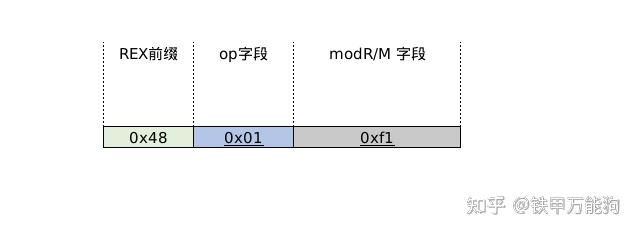

原文章没有提及add rcx,rsi指令的二进制的表示形式,我加上自己的理解,绘制成如下图

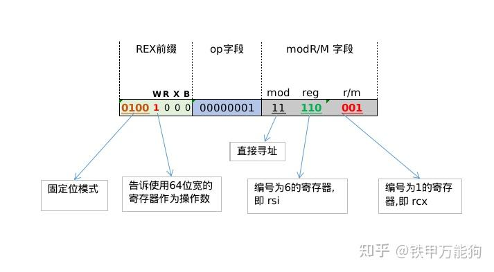

x86-64不是有16个从0到15的寄存器吗？然而,ModR/M字节只为我们分配3位来指定寄存器操作数.那么,我们如何指定寄存器8到15呢？那么对于这条汇编如何进行x86_64的编码呢？

```text
add rcx,r9 
```

正如上面 REX 字节表中提到的,可以使用 R 和 B 字段.

r9 的寄存器编号为 9,即二进制的 b1001. 但是,MODRM.reg 只有 3 位长,即b001. 因此,我们在 MODRM.reg 字段中编码低 3 位,在 REX 前缀字段中的R位设定为高 1 位.前后拼接即可组成b1001.

这里我没有照搬原有文章的对add rcx,r9 指令如何编码成机器码的描述**,而是自己绘制了一个二进制表示形式的图来帮助自己记忆和以后备查.这个图浓缩了x86_64指令编码的所有细节**

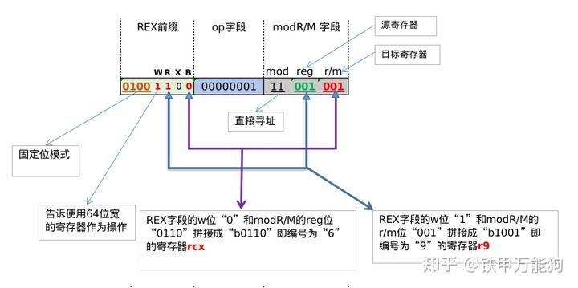

原文章的描述

> *As such, our final REX byte configuration is:*
> *REX.W = b1 (since we still want to do a 64-bit ADD)*
> *REX.R = b1 (upper 1-bit of b1001 (`r9`))*
> *REX.X = b0*
> *REX.B = b0 (upper 1-bit of b0001 (`rcx`))*
> *And our final MODRM byte configuration is:*
> *MODRM.mod = b11 (since we are still using register-direct addressing mode)*
> *MODRM.reg = b001 (lower 3-bits of b1001 (`r9`))*
> *MODRM.rm = b001 (lower 3-bits of b0001 (`rcx`))*

因此,我们的最终 REX 字节是 b01001100 = 0x4c,我们最终的 MODRM 字节是 b11001001 = 0xc9. 我们仍然像往常一样使用操作码 0x01. 那么十六进制的编码形式是:

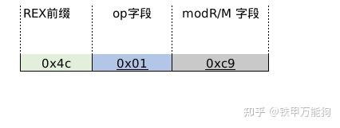

现在用objdump进行验证一下,呵呵,这么笔者今天收获不少,开始有些思路知道如何实现在运行时将x86_64汇编指令编译成机器码了.

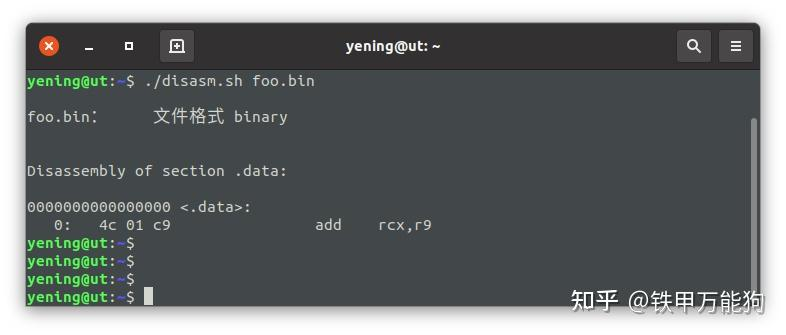

其实还有一种很low的方法,与其说low,不如说是自欺欺人的方法,就是用subproess生成一个Python的子进程实例并在运行时调用nasm编译器编译代码.这么做的弊端是会产生一些不必要的内存开销和系统接口的调度,另外nasm命令编译的机器码必须以文件的形成写回硬盘中的,那么为了在Python运行时加载已编译的机器码就导致不必要的I/O开销.严格来说,生产环境中的JIT实现是不会这么做的.