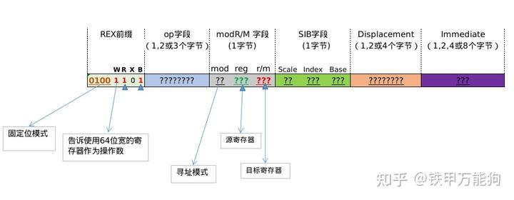
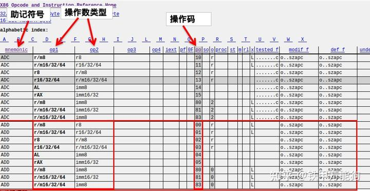
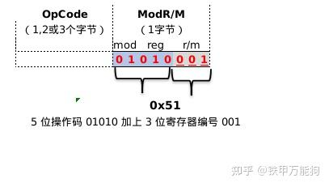
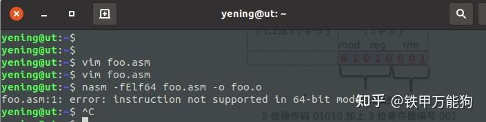
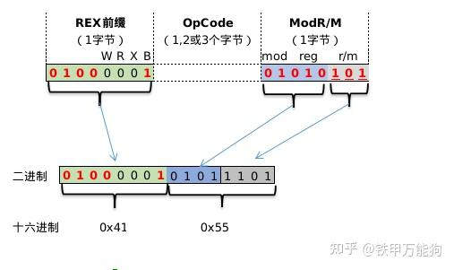

作者:铁甲万能狗
链接:https://zhuanlan.zhihu.com/p/466458209

## 前言

在前一篇的基础上,笔者梳理了一下x86_64指令编码的知识碎片,下面是一个完整的x86_64指令在64位模式下的完整编码格式.翻阅了大部分中文资料要么是有错误,要么是残缺不全(国内找资料,纯粹是浪费时间).主要的信息的来源还是外文网站,或者一些国外公开课的相关资料.



- **opCode**字段:同一个操作名会根据操作数的类型和位宽存在不同的操作码,例如add指令的操作码可以是十进制的1、2、3、4、5、80、81和85.

- **ModR/M**字段:指定了指令编码中的寻址模式,源寄存器、目标寄存器等参数.

- - **mod:**跟寻址模式相关,
  - **reg:**这是源操作数,它的操作数类型是寄存器.
  - **r/m:**这是目标操作数,它的操作数类型可以是寄存器、或内存.

REX前缀这个字段,前面有谈及,这里不谈论.另外的SIB字段、Displacement字段跟modR/M字段中的mod字段会构成非常复杂的x86_64寻址编码格式.后面的碎片知识整理到再说.

## 操作数类型

刚才提到add指令可以根据操作数类型和位宽有对应的操作码.可以看下表,红色线标注的po列正是上面add指令提到不同操作数类型情况下对应的字节码值.

下表有些相关术语在经常在一些反编译工具中会用到的,另外不得不说,下面这个网站对x86_64指令编码高度概括和分类所有指令编码的详细信息.可以作为反编译分析或者写编译器工具用到速查字典(鬼才去翻那4000多页的intel手册).

[http://ref.x86asm.net/coder64-abc.htmlref.x86asm.net/coder64-abc.html](http://link.zhihu.com/?target=http%3A//ref.x86asm.net/coder64-abc.html)

- **mnemonic:** 助记符,即汇编指令中的操作名
- **op1、op2**:故名思意是opCode的缩写,分别表示单条汇编指令中的左右操作数.而下表中即是和操作数类型分类相关的.
- **po**那一列是表示对应op1、op2操作数类型想匹配的操作码.



例如:add  cl,al这条指令的用到了源寄存器cl和目标寄存器al,这里的cl、al寄存器都属于8位寄存器,这里add的操作码就是0,我们说8位的寄存器类型可以用"**r8**"来表示.

由此类推,RAX,RCX,RDX,RBX这些原生的的64位寄存器,我们可以用"r64"来表示吗？事实上不完全正确的,因为64位的物理寄存器,它们可以用低字节位模拟16位、32位这些寄存器.因此,64位的寄存器涵盖了这些16位/32位寄存器的类型.

若64位的物理寄存器模拟出低于64位的寄存器作为操作数的话,其操作数类型可以用"**r16/32/64**"来表示.这里为什么不用"r8/16/32/64"表示呢？因为Intel单独将"r8"这一符号作为的独立的操作数类型来表示.这可以从也一些实际的运用实例中得到其合理性.

- 处理布尔运算、位运算时,cpu中处理最小的数据单位也是1个字节.
- 处理char、unsigned char、或者0~255无符号整数、-128～127符号整数.

在64位的CPU中,即便一次性"吞入"8个字节的数据,而CPU在处理上面所说的场景,实质上读取完低字节位的1个字节就完事了这比读取8个字节消耗更小的CPU时间.

也就是说表示有效数据为一个字节,使用r8类型的操作数,就告知CPU只处理载入寄存器的低字节位的一个字节就OK了.若使用r16/32/64"类型的操作数来表示一个字节不合理之外,CPU开销还会很大.因为CPU会按照对应类型的位宽16字节/32字节/64字节的去处理载入寄存器的数据.

话说回来,"r8"和"r16/32/64"可以统称为**寄存器类型(Register Operand Type)**.如果熟悉汇编寻址的,应该知道寄存器本身不仅用来加载有效的"**数据值**",还可以加载"**内存地址**",也就是当我们在C/C++涉及到指针偏移的运算,那么在汇编的层面会用到寄存器和x86_64编码格式中额外字段("Mod字段+SIB字段+Displacement字段")构成一个非常复杂的寻址运算模型.例如下面这条汇编指令.

```assembly
mov rsi 0x4837(eax,esi,6)
```

0x4837(eax,esi,6)这个就是一条**寻址表达式**,也是汇编指令中的操作数.这样一来,就需要引入一个操作数类型叫**内存类型(Memory Operand Type).**

**同理,**内存类型在intel的惯用术语表述中可以分为

- "**m8**":表示8位的寻址表达式.
- "**m16/32/64**",表示16位/32位/64位的寻址表达式.

又因为在绝大部分情况下,寄存器即可加载有效的业务数据运算,也可用于寻址运算在操作数中使用.**所以寄存器的操作数类型,即是寄存器类型,也是内存类型.例如:**

对于8位长的物理寄存器的操作数类型,可以表示为"**r/m8**",对于64位的物理寄存器的操作数类型,可以表示为"**r/m16/32/64**".

上表中的,还处于某些特定的用途,会使用**具体**的**寄存器名称**作为**操作数类型**,例如"eax/rax"约定俗成地称为返回数据的专用寄存器,esi/rsi可以作为循环迭代中的计数寄存器来使用.因此他们可以作为单独的操作数类型来表示.

**特殊的汇编编码分类**

在x86_64指令编码中,一些指令用到编码位不足以占用一个字节,或和操作数刚好可以凑成一个字节.它们实际上会用到ModR/M这个字段位,而不会使用opCode这个字段.下面是这些特殊的指令的编码实例

push eax会被编码为0x50的机器码,那么笔者理解的二进制机器码形式如下,下图opCode实质上是不会用到的.而是在ModR/M字段中在高字节填充push指令的操作码"**b01010**"和寄存器eax编号"**b000**"组装成"**b01010000**",即十六进制的**0x50**


下面这个示例是**push rcx**的编码示例,寄存器编号是二进制的"b001",在ModR/M字段中用push的操作码"**b01010**"不足1个字节,它和寄存器的编号"**b001**"组装成1个字节的机器码"**b01010001**",即十六进制的**0x51**.



有一个非常特殊的问题,可以考虑一下,"push eax"和"push rax"这两条指令的关系.

- **首先,它们的机器编码都是同样的"b01010000",即十六进制的0x50.这个读者可以自行去验证.**
- **另外,在x86_64中是不会允许使用"push eax"这条语句,仅允许使用"push rax".**

```shell
vim foo.asm
#在vim中输入这条指令做测试
push eax

nasm -fElf64 foo.asm -o foo.o
```

nasm编译出错.**对于pop操作同样如此**.



对于push、pop这些基础运行时,压栈和入栈的操作,在x86_64架构中intel做了严格的限定.push、pop仅支持64位的寄存器,就是intel手册中说到的64位长模式.如果你对**内存对齐**深刻理解的话,应该就理解intel这么做的用意.

再来考虑一个更为复杂的示例 "push r13",这个指令用到了编号为13的目标寄存器r13,其二进制编号为"b1101",因此本身寄存器编号超出7,所以需要用到REX前缀字节的B标记的扩展位.逻辑上拼接成"b1101".

另外需要注意的是这里的W位设定为0,你前一篇不是说过使用操作数位宽为8字节,W位设定为1吗？呵,Intel对push/pop本身在额外指定仅为64模模式下的指令.这么做本来就多此一举.



因此,上面的示例会按着如图组装的机器码是"0x41 0x55"