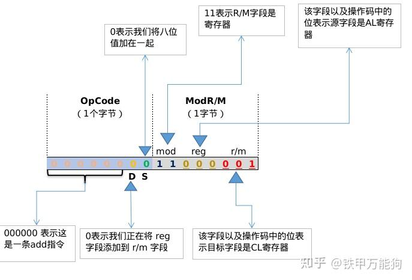
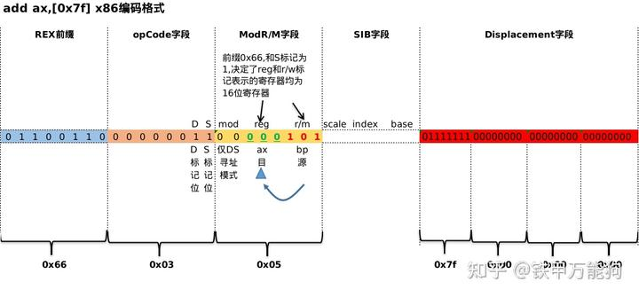
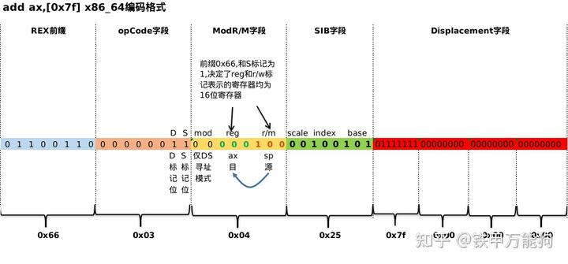
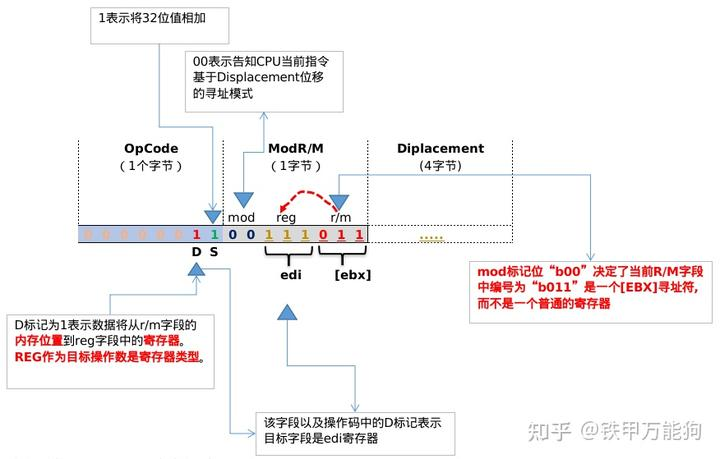

作者:铁甲万能狗
链接:https://zhuanlan.zhihu.com/p/466640891

## 操作数的流动方向

下面用一个简单的示例导入,add cl,al这条指令的二进制形式的编码如下,带0标记的位指定ADD指令操作的操作数的大小



- 若S=0,则操作数为8位寄存器和内存位置.
- 若S=1,则操作数为16位或32位,在32位操作系统下,如果S=1,默认为32位操作数.

一般来说,S标记(**Size Bit** )位不需要太在意的,重点是D标记位. 

要指定16位操作数(在Windows或Linux下),必须在指令前面插入一个特殊的操作数大小十六进制为"**0x66**"前缀字节,请看如下示例是分别是x86模式和x64模式下的关于**add ax,[0x76]** 指令编码示例,**S标记和前缀头0x66告知了CPU这条指令的操作数类型是"r/m16"**.





**D标记位(Destination Bit),**指定了数据传输的方向

- 若D=0,则目标操作数是一个内存位置,表示操作数是从**寄存器类型(Register Operand Type)**到**内存类型(Memory Operand Type)**的操作.
- 若D=1,则目标操作数是一个寄存器,表示操作数是从**内存类型(Memory Operand Type)**到**寄存器类型(Register Operand Type)**的操作.

 例如,当D标记位是0,则"a**dd [ebx],al**",反之则为**add al [ebx]**.请务必注意,我这里所列举的示例的汇编示例全部遵循以下的汇编语法风格

```text
<操作名> <目标操作数> <源操作数>
```

因此仅从汇编的表达式来看,我觉得即便有些汇编基础的读者也有会搞懵圈的.这里可以结合ModR/M这个字段来说,R/M字段与MOD一起指定 双操作数指令中的第二个操作数,或 单操作数指令中唯一的操作数,如NOT指令或NEG指令.

- 对于操作码不足一个字节长的指令,例如not、neg、push、pop等这些指令,当D标记为0时,操作数的方向从reg字段到r/m字段.这意味着:

- - D标记为位于ModR/M字段内.下图ModR/M高字节位的第一位0就是D标记.
  - **源操作数是reg标记位,操作数类型是寄存器类型,目标操作数是r/m标记位**.

前一篇列举的图例,同样说明这一点


- 对于操作码至少一个字节长的指令来说,若D标记为是0时,,操作数的方向从reg字段到r/m字段.这意味着:**源操作数是reg标记位,操作数类型是寄存器类型,目标操作数是r/m标记位,其目标操作数类型是Memory Operand Type**.这个情况也是最常见的,这也是大部分网上提及到reg字段默认为源操作数,且没提及其原因.这里不再贴图说明,常见本文开头的图例就可以.


- 对于操作码**至少一个字节长**的指令来说,若D标记为是1时,操作数的方向从r/m字段到reg字段.这意味着:**源操作数是r/m标记位,操作数类型是Memory Operand Type,目标操作数是reg标记位,且目标操作数类型是Register Operand Type**.见下图是关于"**add edi,[ebx]**"示例的指令编码.

下图的mod标记位为"b00"是间接寻址模式中最简单的一种,目前暂时不用理会,重点放在理解图中的字段的含义.

