作者:铁甲万能狗
链接:https://zhuanlan.zhihu.com/p/466695371


本篇的思路,笔者会先从x86模式的寻址模拟开始,有浅入深去理解x86_64中指令相关寻址模式是如何编码成机器码.

## 寻址模式

寻址模式指定如何使用寄存器和/或机器指令或其他地方包含的常量中的信息来计算操作数的有效内存地址,并在在内存位置和寄存器之间拷贝数据.

回顾一下,操作数的类型

- **立即数类型(Immediate Operand Type)** 可以将其视为常数,和C语言的常量类似,但是以"$"为前缀,例如十进制500在汇编中0x1FA
- **寄存器类型(Register Operand Type):,当寄存器作为普通寄存器使用时候,那么存储**在寄存器中是一般的数据值.
- **内存类型(Memory Operand Type)**: 当寄存器作为内存地址的容器来使用时,即CPU通过寄存器缓存的内存地址来间接去操作或者经过复杂的偏移计算得到一个新内存地址,最终CPU访问该内存地址所指向的RAM中的数据.

这里要重点讲解的是内存类型直接跟寻址模式,例如:"**mov  (eax),$123**"或"**mov [eax],$123**"的内存地址,表示将常量保存到eax寄存器中的内存地址所指向的内存位置,类似于C/C++中

```text
 int *a=0x123; 
```

例如:"mov (eax),ebx" 或 "mov [eax],ebx",表示将ebx中的值保存到eax寄存器中的内存地址所指向的内存位置.

 还有最后一种,有从"**内存**"到"**内存**"传递的指令类型吗？单一的一条指令是不可能的.只能通过两步实现.

- 首先"**内存**"到"**寄存器**"例如:"**mov eax,(edx)** "
- 然后"**寄存器**"到"**内存**"例如:"**mov (ecx),eax**"

C代码中每声明一个基本数据类型的变量都映射到一个寄存器中,而寄存器则是在内存和CPU之间交换数据的一个"高速中转站",不同内存位置中的值传递,必须经过寄存器参与内存地址移位寻址运算后得到的新地址,才能数据的值传递.

##  内存寻址的一般形式

**汇编中的寻址表达式的**的一般形式"**Disp(Rb,Ri,K)**",有些资料也叫Scale-Index-Base-Displacement"寻址

其中:

- **Disp**是**移位常量**("**Displacement**"),可以是1,2或4字节.
- **Rb**是**基址寄存器(Base Register)**,寄存器的使用条件见参照下表.
- **Ri**是**索引寄存器(Index Register)**,寄存器的使用条件见参照下表.
- **K是**一个2的倍数,可以是1,2,4或8等.
- **Disp**是**移位常量**("**Displacement**"),可以是1,2或4字节.

## 基址寄存器和索引寄存器的限制

x86模式下的基址寄存器和索引寄存器的限定表如下所示,下面红色标记的寄存器,绝大部分汇编编译器是不允许的.

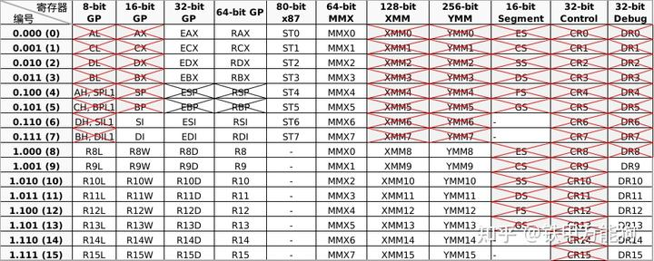

上表的测试结果,可以用下图的在线反编译工具验证

x64模式下的基址寄存器和索引寄存器的限定表如下,下面红色标记的寄存器,绝大部分汇编编译器是不允许的.

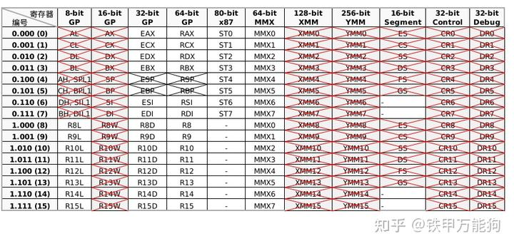

还有4个特殊寄存器,虽然编译器不报错,但他们都是作为特殊用途存在的,也是不建议作为索引寄存器和基址寄存器使用.

- 编号为"b100"的esp/rsp寄存器约定保存指向程序栈的栈顶的内存地址,它是跟踪当前函数栈状态的专用寄存器,
- 编号为"b101"的ebp/rbp寄存器约定保存指向程序栈的栈底的内存地址,该地址就是当前被调用函数栈(Callee)被使用完后,恢复上一层函数栈桢(Caller)的上次执行点所在函数行的地址.

这里比较抽象,可以用一个例如:**leal eax,(edx,ecx,4)** 就表示**%eax=%edx+4\*%ecx,**这里的Disp的值是1,索引寄存器(Ri)是ecx,基址内存(Rb)是edx,K是4**.** 

对于操作系统来说,RAM内存其实就是一个连续的字节数组,每个字节都有对应的编号,而这个编号就是**内存地址**,也可以理解为该字节数组的索引.  我们用"**RAM**"表示**主内存**,用"**REG**"表示**寄存器,**那么刚才的抽象表达式可以用更贴近计编程语言的下标操作符"[]"表示为"**RAM[REG[Rb]+K\*REG[Ri]+Disp]**"

在本文中我们先控制Rb,Ri,K,Disp这些未知量分别按不同情况,加以设定不同的常量,会得到8种不同的寻址模式按复杂度由小到大排列:

- 仅Displacement
- 仅Base寄存器
- Base寄存器 + Index 寄存器
- Base寄存器 + Displacement
- Base寄存器+ Index寄存器 + Displacement
- Base寄存器 + (Index 寄存器xK)
- (Index寄存器xK) + Displacement
- Base寄存器 + (Index寄存器xK) + Displacement 

### Displacement模式

剔除**RAM[REG[Rb]+K\*REG[Ri]+Disp]**表达式中的Rb、Ri,我们得到一个特殊的形式RAM[Disp],这里的具体示例是"**mov eax,[0xff71]**",该指令解在RAM中将从内存地址0xff71所指位置的值拷贝到eax寄存器.

Displacement模式最简单的寻址模式,因为Displacement字段被视为**绝对内存地址**.笔者除了下面贴图的示例,穷举了大量Displacement寻址模式的示例,Displacement字段总是以4字节出现,这和intel手册的相关说明有些出入.需要指出的是Displacement的二进制编码是**以小端字节顺序编码 --- 即最低有效字节在前.**

## x86模式下的Displacement寻址模式

需要提醒的是,下面所有示例均与ModR/M字段的mod标记位设定为"b00",先看看x86模式下的目标操作数依次是8位、16位、32位寄存器的编码示例如下:

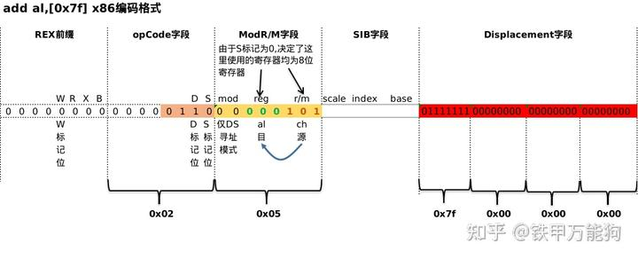


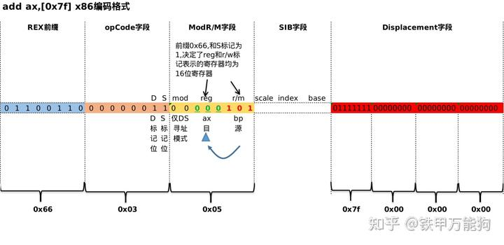

对于16位寄存器,会默认在Opcode字段前添加0x66前缀

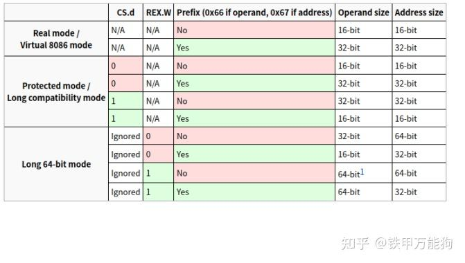

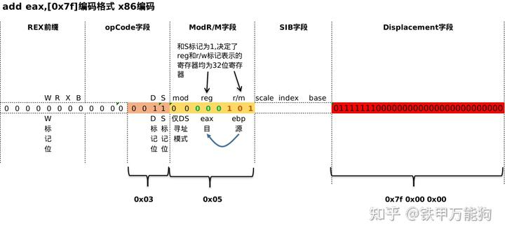

x86模式下的仅Displacement寻址编码与ModR/M的寻址模式设定"b00"相关联,存在如下规律:

1. OpCode字段D标记均设定为1,意味着ModR/M字段的r/m所示的源操作数,其类型为内存类型,reg标记位为目标操作数.
2. ModR/M字段的r/m标记为均设定为"b101"作为源操作数,意味着仅Displacement寻址模式在x86模式中隐含使用编号为"b101"的源寄存器？有反编译的大牛可以在本文下告知笔者.
3. 对于16位寄存器,会默认在Opcode字段前添加0x66前缀字节.


## x64模式下的Displacement寻址模式

下面所有示例均与ModR/M字段的mod标记位设定为"b00",先看看x64模式下的目标操作数依次是8位、16位、32位、64寄存器的编码示例如下:

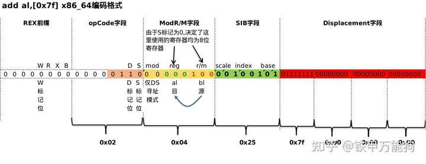

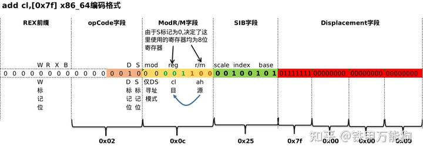


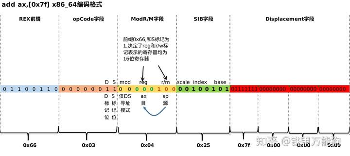

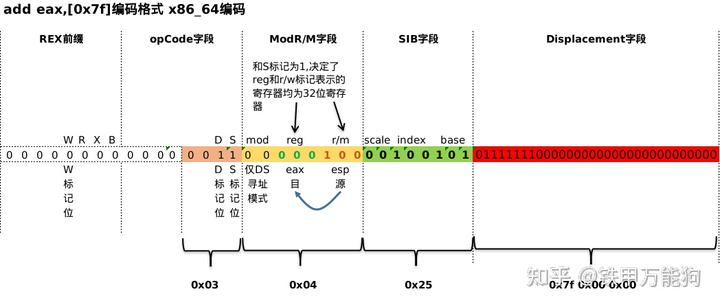


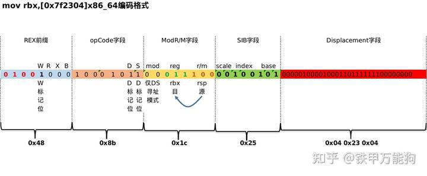

x64模式下的仅Displacement寻址编码与ModR/M的寻址模式设定"b00"相关联,存在如下规律:

1. OpCode字段D标记均设定为1,意味着ModR/M字段的r/m所示的源操作数,其类型为内存类型,reg标记位为目标操作数.
2. ModR/M字段的r/m标记为均设定为"b100"作为源操作数,意味着仅Displacement寻址模式在x64模式中隐含使用编号为"b100"的源寄存器？有反编译的大牛可以在本文下告知笔者.
3. 对于16位寄存器,会默认在Opcode字段前添加0x66前缀字节.
4. 在x64模式下,仅Displacement寻址模式的指令编码会隐式增加0x25的SIB字段编码,即二进制"b00100101"显然scale标记为"b00",index标记为"b100",base标记位"b101".


特殊例子

下面可以看一下条关于**"mov al,[0x11]",**这条指令在86模式下的编码是不遵循上面示例的一贯规律

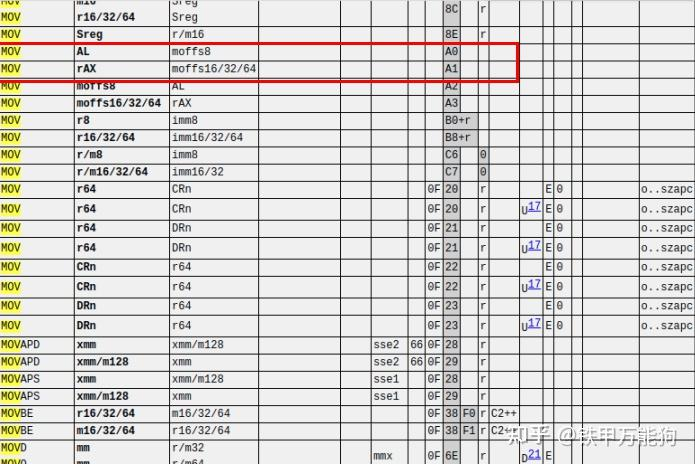

因为intel对于mov指令,对于目标操作数的类型是"al"做了特殊的规定,查看上面手册可知,对于符合操作数op1为"al",操作数op2为"moffs8",mov指令的操作码为"0xA0",显然这个操作码是占用一个字节的,因此它会使用opCode字段,在这个例子中操作数存在类似"moffs8、moffs16、moffs32、moffs64 ",mov 指令的某些变体使用的字节、字或双字类型的简单内存变量(Displacement).实际地址由相对于Segment Base的简单偏移量给出的.t这种情况并没有使用 ModR/M 字节. moffs 显示的数字表示它的大小,由指令中的地址大小属性决定.

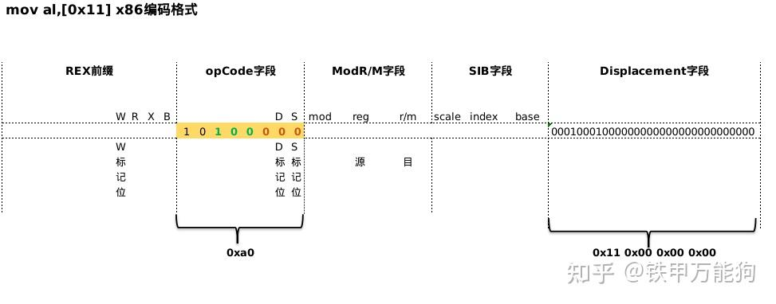

但同样的指令,在x64模式中,仍然遵循Displacement寻址模式的一般规律.

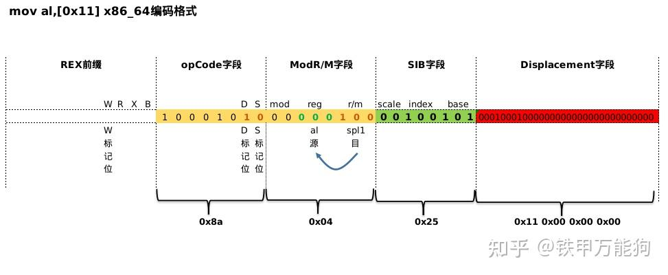


待续.....