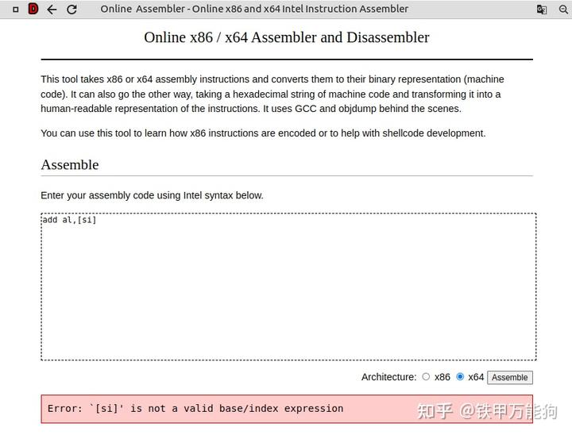
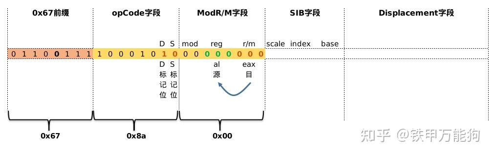
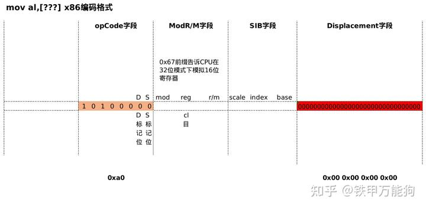
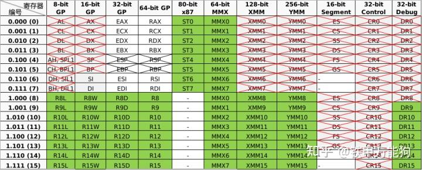
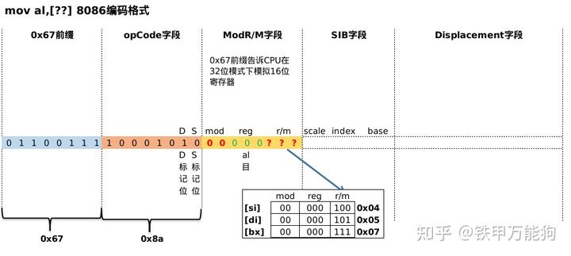
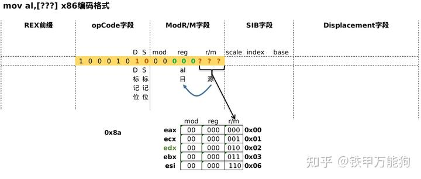
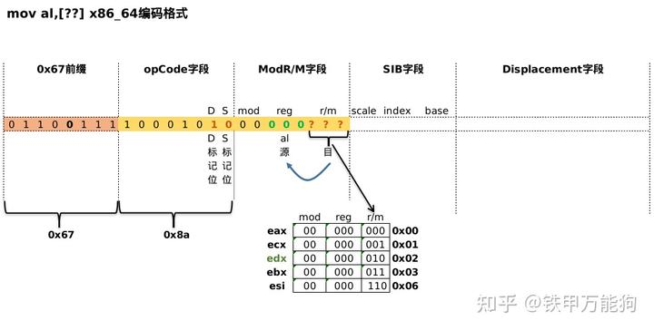
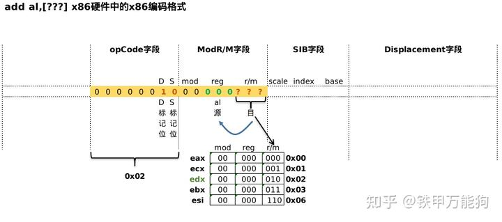
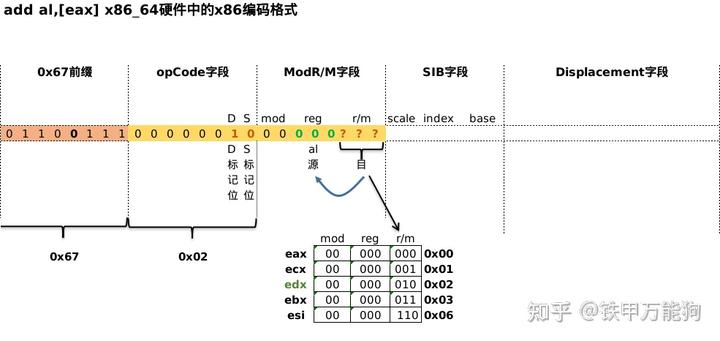
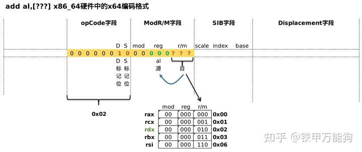

作者:铁甲万能狗
链接:https://zhuanlan.zhihu.com/p/467459126

## **回顾**

汇编中的寻址表达式的的一般形式"**Disp(Rb,Ri,K)",**我们用"**RAM**"表示**主内存**,用"**REG**"表示**寄存器,**那么刚才的抽象表达式可以用更贴近计编程语言的下标操作符"[]"风格来表示,**其数组的等价形式是**表示为:
$$
RAM[REG[R_b] + k * REG[R_i] + Disp]
$$
其中:

- **Disp**是**移位常量**("**Displacement**"),可以是1,2或4字节.
- **Rb**是**基址寄存器(Base Register)**,参见前篇.
- **Ri**是**索引寄存器(Index Register)**,参见前篇.
- **K是**一个2的倍数,可以是1,2,4或8等.

备注:基址寄存器和索引寄存器的使用条件


现在我们同时令 K=0K=0K=0 和 Disp=0Disp=0Disp=0 时,会得到一个特殊的表达式: $RAM[REG[R_b]]$

笔者有不同的理解,REG实质上是表示一个寄存器的数组,例如:x64下模式下 $\{rax,rcx、rdx、......r15\}$ 这16个寄存器,例如:x86模式下的 $\{eax、ecx、edx、....esi、edi\}$ 这8个寄存器,所以REG表达式本身可以用"[]"下标符获取某个特定的寄存器,即 $REG[Rb]$ 在得到一个具体的寄存器并获取寄存器中的内存地址,CPU再以内存地址为索引去访问RAM中该位置的的值,这正是 $RAM[REG[R_b]]$ 的语义所在**.**具体化的示例**"(rax)"或"[eax]"我们就说eax持有一个指向RAM中的某个位置的内存地址.**

现在笔者曾经思考一个问题,在当今x86_64平台中,可以使用低于32位的寄存器作为基址寄存器和索引寄存器参与内存寻址运算吗？

事实上,不能在64模式下使用8位或16位寄存器进行寻址计算,也不能在32位模式下使用8位寄存器.这在前篇的限定表已经作出详细的分类.



而intel出于对一些被淘汰的架构例如AI32的兼容考虑,它允许你在x86_64硬件中使用32位的寄存器.因此提供了0x67前缀字节.该前缀的作用是:

- 可以在x86硬件下,可以将32位的物理寄存器的低字节的16位模拟16位寄存器(这个只需了解).
- 可以在x86_64硬件中,将64位的物理寄存器的低字节的32位模拟32位寄存器.

**当你指令中使用的32位的寄存器参与寻址运算,那么该指令的编码会在opcode字段加入0x67前缀字节**.如下图例是"mov al,[eax]"所示



但使用位宽较窄寄存器会使得程序整个可寻址的地址空间变窄,任何寄存器都需要与地址具有相同的宽度,例如C中指针在32位中是4个字节,64位中是8个字节.一般的模式是默认地址大小与当前模式相同,即32位模式下32位的寄存器,64位模式下64位的寄存器.如果包含0x67前缀,则地址大小更改为通常大小的一半(即,在x86硬件中会变为 16位,在 64 位硬件中变为32位)

| REX.W | 0x66前缀(操作数) | 0x67前缀(address) | 操作数大小(footnote 2) | 地址大小 |
| ----- | ---------------- | ----------------- | ---------------------- | -------- |
| 0     | 否               | 否                | 32位                   | 64位     |
| 0     | 否               | 是                | 32位                   | 32位     |
| 0     | 是               | 否                | 16位                   | 64位     |
| 0     | 是               | 是                | 16位                   | 32位     |
| 1     | 忽略             | 否                | 64位                   | 64位     |
| 1     | 忽略             | 是                | 64位                   | 32位     |

下面是基于x86模式模式的指令编码示例

这是非常特殊的例子**"mov al,[???]**"当中"???"就是指代下表中涂上的绿色的部分的寄存器



下表标注绿色的寄存器作为**mov al,[???]**这条指令源操作数的基址寄存器,他们的指令编码均为"0xa0,0x00,0x00,0x00,0x00"



因为intel对于**mov指令,其目标操作数的类型是"al"做了特殊的规定,**查看手册可知,**对于符合操作数op1为"al",操作数op2为"moffs8",mov指令的操作码为"0xA0**",显然这个操作码是占用一个字节的,因此它会使用opCode字段,在上面例子标注绿色的寄存器的操作数类型"moffs8/16/32/64".**这种情况,mov中寻址表达式的寄存器并未参与寻址运算,而且也没有用到 ModR/M 字节,实际地址由相对于Segment  Base的简单偏移量给出的**, moffs 显示的数字表示它的大小,由指令中的地址大小属性决定.

在32模式下尝试使用16位寄存器,在编码中是无规律可循的,用现在x86模式、x64模式的编码的角度去理解16位寄存器在,16位寄存器的内存寻址的指令编码简直是奇葩.

例如如下指令在32位硬件中,用32位寄存器模式16位寄存器充当基址寄存器,你能找到一直的规律？

```text
mov al,[si] //编码 0x67,0x8a 0x04
mov al,[di] //编码 0x67,0x8a 0x05
mov al,[bx] //编码 0x67,0x8a 0x07
```



别误认为Mod/RM字段中r/m标记位就是源操作数寄存器的二进制编号,什么都不是！si的寄存器编号是"b110"而不是"b100",di的寄存器编译器的编号是"b111",而不是"b101".说到这里你总明白我什么说奇葩吧！！

## x86模式下的编码示例

下面是32位寄存器作为基址寄存器在x86模式中的编码示例.这里不难发现,因为这里该示例是32位模式匹配32位的寄存器作为内存寻址运算,这里不需要0x67前缀. **32位寄存器他们在ModR/M字段的r/m标记位和他们寄存器的二进制编码是相符的**,相比16位的编码示例好裂解得多

```assembly
mov al,[eax]  //对应的机器码编码:0x8a 0x00
mov al,[ecx]  //对应的机器码编码:0x8a 0x01
mov al,[edx]  //对应的机器码编码:0x8a 0x02
mov al,[ebx]  //对应的机器码编码:0x8a 0x03
mov al,[esi]  //对应的机器码编码:0x8a 0x06
```



## x64模式下的模拟x86编码示例

再来对比一下,64位模式下的编码格式,这里除了遵循上面32位的示例应有的规律之外,这里还特别强调0x67这个前缀字节.该示例是在64位模式下模拟32位的寄存器参与内存寻址运算的,因此他们指令编码的opcode字段前面添加了0x67前缀.

```assembly
mov al,[eax]  //对应的机器码编码:0x67 0x8a 0x00
mov al,[ecx]  //对应的机器码编码:0x67 0x8a 0x01
mov al,[edx]  //对应的机器码编码:0x67 0x8a 0x02
mov al,[ebx]  //对应的机器码编码:0x67 0x8a 0x03
mov al,[esi]  //对应的机器码编码:0x67 0x8a 0x06
```



下面这个示例留作读者自己去理解,我不想再多说什么,如果你有阅读我前面4篇的话,那么下面这个图例,你应该一眼就能看懂.







待需......