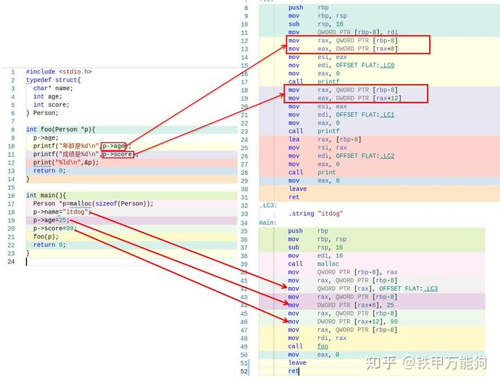
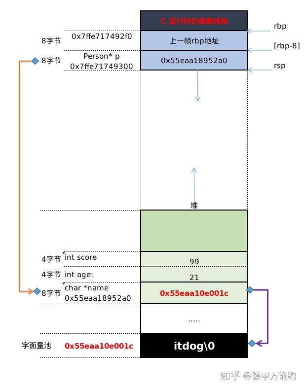
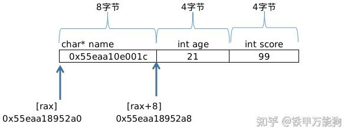
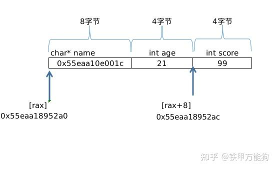
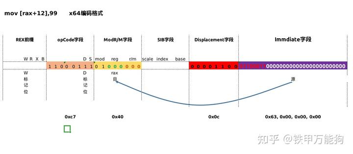

作者:铁甲万能狗
链接:https://zhuanlan.zhihu.com/p/468021794
来源:知乎
著作权归作者所有.商业转载请联系作者获得授权,非商业转载请注明出处.

## **回顾**

汇编中的寻址表达式的的一般形式"**Disp(Rb,Ri,K)",**我们用"**RAM**"表示**主内存**,用"**REG**"表示**寄存器,**那么刚才的抽象表达式可以用更贴近计编程语言的下标操作符"[]"风格来表示,**其数组的等价形式是**表示为:
$$
RAM[REG[R_b]] + k * REG[R_i] + Disp]
$$

其中:

- **Disp**是**移位常量**("**Displacement**"),可以是1,2或4字节.
- **Rb**是**基址寄存器(Base Register)**,参见前篇.
- **Ri**是**索引寄存器(Index Register)**,参见前篇.
- **K是**一个2的倍数,可以是1,2,4或8等.

备注:基址寄存器和索引寄存器的使用条件

现在我们同时令 $K=0$ 时,会得到一个特殊的表达式:
$$
RAM[REG[R_b] + Disp]
$$

我们说这种寻址模式叫 **基址寄存器+索引寄存器** 寻址模式,简称**Base+Disp寻址模式**

下面这个示例,足以对前面提到几种简单的寻址模式来一个总的回顾.可以查看如下C代码,在foo函数的参数列中有一个p它是一个结构体Person类型的指针,查看下图的反编译得到汇编代码.

首先C运行时系统在调用main函数时,会为main函数开辟栈空间,而汇编中的第40行的"sub rsp 16"这条指令就是干这事

- 第39行"call malloc"为Struct Person这个对象向堆申请内存空间,而malloc调用完返回的堆内存空间首个字节的内存地址会保留在rax寄存器中,在本示例中Person对象的**堆内存实体**的地址是0x55eaa18952a0.
- 第40行的"mov [rbp-8],rax"这条指令就从rax寄存器中持有Person对象的堆内存地址,拷贝到[rbp-8]这个寻址表达式结算的内存地址(在本示例中是0x7ffe71749300)所处的的空间,如下图所示.

现在,我们来分析一下[rbp-8]这个内存寻址表达式就属于**Base+Disp寻址模式**,[rbp]寄存器原本指向栈底0x7ffe717492f0,偏移量Disp=-8意味着当向低地址偏移8个字节(64位GCC编译器下的指针就是8个字节),得到0x7ffe71749300这个地址就是main栈中局部变量p所在的内置.

需要注意的是,即便CPU对[rbp-8]执行寻址运算后,始终没有改变rbp寄存器中内存地址,rbp寄存器的内存地址始终为0x7ffe717492f0.**换句话说,内存寻址运算未结束前,基址寄存器角色内的数据作为一个初始常量,并不允许篡改的.**

汇编第42行的mov  [rax], OFFSET FLAT:.LC3,其实就是C中第18行  **p->name="itdog"**所做的事,他让Person对象的char指针name绑定字面量池中的地址0x55eaa10e001c内存块中"itdog"字符串常量.因此Person对象的name属性实质上持有"itdog"常量的内存地址,而不是字符串副本.

汇编第43行的"**mov rax, [rbp-8]**"所做的操作就是将main栈中变量p中的值"0x55eaa18952a0"即Person的堆内存地址拷贝到rax寄存器中.

汇编第44行的"**mov [rax+8], 25**"所做的操作,基址寄存器rax的0x55eaa18952a0作为寻址计算的起始常量,然后向高位字节偏移8个字节,因此得到0x55eaa18952a8这个地址,即访问到当前Person对象的age属性,并且给该属性赋值.后面的第45行笔者,不再复述,自行去理解.

汇编第46行"mov [rax+12], 99"跟第44行的操作是一个套路的.如下图所示,访问当前Person对象的score属性并为该属性赋值99.

从上面的示例来说,我们可以加深Base+Index寻址模式下对应的表达式 $RAM[REG[R_b]+Disp]$ 的理解,首先:CPU会设当前Rb为基址寄存器 ,$RAM[REG[R_b]]$ 实质上保存的是Stuct其实边界的内存地址(即Struct中第一个属性的起始地址),然后以Struct起始边界地址偏移对应2的倍数的偏移量,就能得到目标的内存地址.

## Base+Index寻址指令的编码格式

下面是mov [rax+12],99这条指令的,在x64模式下的编码,其中Mod/RM字段中的mod标记位"b01"在指定ModR/M字节之后的字段是1个字节宽度的Displacement字段,换句话说,mod标记为"b01"的情况下并没有使用到SIB字段.

待续......