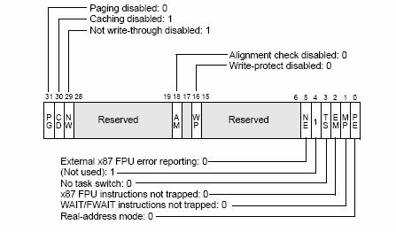
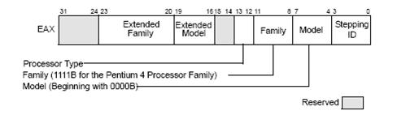

## 1.1  X86复位后的行为
关于x86复位后的行为,intel的手册上是这样说的:

>Following power-up or an assertion of the RESET# pin, each processor on the system
bus performs a hardware initialization of the processor (known as a hardware reset)
and an optional built-in self-test (BIST). A hardware reset sets each processor’s
registers to a known state and places the processor in real-address mode. It also
invalidates the internal caches, translation lookaside buffers (TLBs) and the branch
target buffer (BTB). At this point, the action taken depends on the processor family:
• Pentium 4 and Intel Xeon processors — All the processors on the system bus
(including a single processor in a uniprocessor system) execute the multiple
processor (MP) initialization protocol. The processor that is selected through this
protocol as the bootstrap processor (BSP) then immediately starts executing
software-initialization code in the current code segment beginning at the offset in
the EIP register. The application (non-BSP) processors (APs) go into a Wait For
Startup IPI (SIPI) state while the BSP is executing initialization code. See Section
7.5, "Multiple-Processor (MP) Initialization," for more details. Note that in a
uniprocessor system, the single Pentium 4 or Intel Xeon processor automatically
becomes the BSP.
• P6 family processors — The action taken is the same as for the Pentium 4 and
Intel Xeon processors (as described in the previous paragraph).

也就是说它做了几件事:
1、复位内部寄存器的值.
2、将芯片置为实模式.
3、使内部缓存、TLB和BTB失效.
4、执行MP初始化协议,选择启动一个CPU,其它总线上的CPU进入等待状态.
5、主CPU开始执行CS:EIP的代码.

## 1.2 Qemu对内部寄存器的模拟
Qemu使用了一个叫CPUX86State的结构体来表示CPU的所有状态:

```c
// cpu.h
typedef struct CPUX86State {
    /* standard registers */
    target_ulong regs[CPU_NB_REGS];
    target_ulong eip;
    target_ulong eflags; /* eflags register. During CPU emulation, CC
                        flags and DF are set to zero because they are
                        stored elsewhere */

    /* emulator internal eflags handling */
    target_ulong cc_src;
    target_ulong cc_dst;
    uint32_t cc_op;
    int32_t df; /* D flag : 1 if D = 0, -1 if D = 1 */
    uint32_t hflags; /* TB flags, see HF_xxx constants. These flags
                        are known at translation time. */
    uint32_t hflags2; /* various other flags, see HF2_xxx constants. */

    /* segments */
    SegmentCache segs[6]; /* selector values */
    SegmentCache ldt;
    SegmentCache tr;
    SegmentCache gdt; /* only base and limit are used */
    SegmentCache idt; /* only base and limit are used */

    target_ulong cr[5]; /* NOTE: cr1 is unused */
    uint64_t a20_mask;

    /* FPU state */
    unsigned int fpstt; /* top of stack index */
    unsigned int fpus;
    unsigned int fpuc;
    uint8_t fptags[8];   /* 0 = valid, 1 = empty */
    union {
#ifdef USE_X86LDOUBLE
        CPU86_LDouble d __attribute__((aligned(16)));
#else
        CPU86_LDouble d;
#endif
        MMXReg mmx;
    } fpregs[8];

    /* emulator internal variables */
    float_status fp_status;
    CPU86_LDouble ft0;

    float_status mmx_status; /* for 3DNow! float ops */
    float_status sse_status;
    uint32_t mxcsr;
    XMMReg xmm_regs[CPU_NB_REGS];
    XMMReg xmm_t0;
    MMXReg mmx_t0;
    target_ulong cc_tmp; /* temporary for rcr/rcl */

    /* sysenter registers */
    uint32_t sysenter_cs;
    target_ulong sysenter_esp;
    target_ulong sysenter_eip;
    uint64_t efer;
    uint64_t star;

    uint64_t vm_hsave;
    uint64_t vm_vmcb;
    uint64_t tsc_offset;
    uint64_t intercept;
    uint16_t intercept_cr_read;
    uint16_t intercept_cr_write;
    uint16_t intercept_dr_read;
    uint16_t intercept_dr_write;
    uint32_t intercept_exceptions;
    uint8_t v_tpr;

    uint64_t tsc;

    uint64_t pat;

    /* exception/interrupt handling */
    int error_code;
    int exception_is_int;
    target_ulong exception_next_eip;
    target_ulong dr[8]; /* debug registers */
    union {
        CPUBreakpoint *cpu_breakpoint[4];
        CPUWatchpoint *cpu_watchpoint[4];
    }; /* break/watchpoints for dr[0..3] */
    uint32_t smbase;
    int old_exception;  /* exception in flight */

    CPU_COMMON

    /* processor features (e.g. for CPUID insn) */
    uint32_t cpuid_level;
    uint32_t cpuid_vendor1;
    uint32_t cpuid_vendor2;
    uint32_t cpuid_vendor3;
    uint32_t cpuid_version;
    uint32_t cpuid_features;
    uint32_t cpuid_ext_features;
    uint32_t cpuid_xlevel;
    uint32_t cpuid_model[12];
    uint32_t cpuid_ext2_features;
    uint32_t cpuid_ext3_features;
    uint32_t cpuid_apic_id;

    /* MTRRs */
    uint64_t mtrr_fixed[11];
    uint64_t mtrr_deftype;
    struct {
        uint64_t base;
        uint64_t mask;
    } mtrr_var[8];

    /* For KVM */
    uint64_t interrupt_bitmap[256 / 64];

    /* in order to simplify APIC support, we leave this pointer to the
       user */
    struct APICState *apic_state;
} CPUX86State;
```
每一个寄存都可以在这个结构体中找到相应的成员.当然这个结构体中还包含了一些qemu内部使用的变量.
当虚拟的CPU复位后,qemu会调用一个叫 `cpu_reset` 的函数,在这个函数中将这个虚拟CPU的寄存器复位:

```c
/* NOTE: must be called outside the CPU execute loop */
void cpu_reset(CPUX86State *env)
{
    int i;

    if (qemu_loglevel_mask(CPU_LOG_RESET)) {
        qemu_log("CPU Reset (CPU %d)\n", env->cpu_index);
        log_cpu_state(env, X86_DUMP_FPU | X86_DUMP_CCOP);
    }
    memset(env, 0, offsetof(CPUX86State, breakpoints));
    tlb_flush(env, 1);
    env->old_exception = -1;
    /* init to reset state */

#ifdef CONFIG_SOFTMMU
    env->hflags |= HF_SOFTMMU_MASK; /* 启用softmmu */
#endif
    env->hflags2 |= HF2_GIF_MASK;
    cpu_x86_update_cr0(env, 0x60000010);
    env->a20_mask = ~0x0;
    env->smbase = 0x30000;
    env->idt.limit = 0xffff;
    env->gdt.limit = 0xffff;
    env->ldt.limit = 0xffff;
    env->ldt.flags = DESC_P_MASK | (2 << DESC_TYPE_SHIFT);
    env->tr.limit = 0xffff;
    env->tr.flags = DESC_P_MASK | (11 << DESC_TYPE_SHIFT);
    cpu_x86_load_seg_cache(env, R_CS, 0xf000, 0xffff0000, 0xffff,
                           DESC_P_MASK | DESC_S_MASK | DESC_CS_MASK |
                           DESC_R_MASK | DESC_A_MASK);
    cpu_x86_load_seg_cache(env, R_DS, 0, 0, 0xffff,
                           DESC_P_MASK | DESC_S_MASK | DESC_W_MASK |
                           DESC_A_MASK);
    cpu_x86_load_seg_cache(env, R_ES, 0, 0, 0xffff,
                           DESC_P_MASK | DESC_S_MASK | DESC_W_MASK |
                           DESC_A_MASK);
    cpu_x86_load_seg_cache(env, R_SS, 0, 0, 0xffff,
                           DESC_P_MASK | DESC_S_MASK | DESC_W_MASK |
                           DESC_A_MASK);
    cpu_x86_load_seg_cache(env, R_FS, 0, 0, 0xffff,
                           DESC_P_MASK | DESC_S_MASK | DESC_W_MASK |
                           DESC_A_MASK);
    cpu_x86_load_seg_cache(env, R_GS, 0, 0, 0xffff,
                           DESC_P_MASK | DESC_S_MASK | DESC_W_MASK |
                           DESC_A_MASK);

    env->eip = 0xfff0;
    env->regs[R_EDX] = env->cpuid_version;
    env->eflags = 0x2;

    /* FPU init */
    for(i = 0;i < 8; i++)
        env->fptags[i] = 1;
    env->fpuc = 0x37f;
    env->mxcsr = 0x1f80;
    memset(env->dr, 0, sizeof(env->dr));
    env->dr[6] = DR6_FIXED_1;
    env->dr[7] = DR7_FIXED_1;
    cpu_breakpoint_remove_all(env, BP_CPU);
    cpu_watchpoint_remove_all(env, BP_CPU);
}
```

## 1.3 实模式
X86工作于实模式或者保护模式是由CR0这个寄存器的最后一位来控制的,在初始化的时候,QEMU将其设置为0x6000 0010,对照这个寄存器中的各个位的意义:

最后一位的值为0,即表示CPU进入实地址模式.

## 1.4 CPU类型
X86复位后,在EDX寄存器中保存CPU类型的信息,这个寄存器各个位的意义如下:



在默认不指定要仿真的*CPU*类型时,Qemu将此寄存器的值初始化为0x0000 0633,其数据来源为:

```c
// helper.c 
{
        .name = "qemu32",
        .level = 2,
        .family = 6,
        .model = 3,
        .stepping = 3,
        .features = PPRO_FEATURES,
        .ext_features = CPUID_EXT_SSE3,
        .xlevel = 0,
        .model_id = "QEMU Virtual CPU version " QEMU_VERSION,
},
```

当然,QEMU还支持其它类型的CPU,如coreduo的类型定义为:

```c
    {
        .name = "coreduo",
        .level = 10,
        .family = 6,
        .model = 14,
        .stepping = 8,
        /* The original CPU also implements these features:
               CPUID_DTS, CPUID_ACPI, CPUID_SS, CPUID_HT,
               CPUID_TM, CPUID_PBE */
        .features = PPRO_FEATURES | CPUID_VME |
            CPUID_MTRR | CPUID_CLFLUSH | CPUID_MCA,
        /* The original CPU also implements these ext features:
               CPUID_EXT_VMX, CPUID_EXT_EST, CPUID_EXT_TM2, CPUID_EXT_XTPR,
               CPUID_EXT_PDCM */
        .ext_features = CPUID_EXT_SSE3 | CPUID_EXT_MONITOR,
        .ext2_features = CPUID_EXT2_NX,
        .xlevel = 0x80000008,
        .model_id = "Genuine Intel(R) CPU           T2600  @ 2.16GHz",
    },
```

## 1.5  启动CPU的选择

X86启动时会执行MP协议选择一个CPU启动,其余的进入等待,为此,QEMU做了相应处理:

```c
// pc.c -- pc1_init
    for(i = 0; i < smp_cpus; i++) {
        env = cpu_init(cpu_model);
        if (!env) {
            fprintf(stderr, "Unable to find x86 CPU definition\n");
            exit(1);
        }
        if (i != 0)
            env->halted = 1;
        if (smp_cpus > 1) {
            /* XXX: enable it in all cases */
            env->cpuid_features |= CPUID_APIC; /* 启用apic */
        }
        qemu_register_reset(main_cpu_reset, env);
        if (pci_enabled) { /* 一旦启用了pci */
            apic_init(env); /* 初始化apic */
        }
    }
```

当i不为0的时候,虚拟CPU的halted标记被置1,即不执行.

## 1.6 第一条指令的执行
在上述工作完成后,CPU将执行cs:ip指定的第一条指令,看看前面的复位代码可知此时CS值为

Selector = F000H

Base = FFFF0000H

Limit = FFFFH

AR = Present, R/W,

Accessed

而EIP的值则为0000FFF0H.

由于此时CPU工作在实模式,因而第一条指令地址CS:IP指向的位置为FFFF0H,也就是UMA临近结尾的位置.之所以选择这个位置是因为,这样就不会引起由于ROM的大小改变而造成的兼容性问题.既然FFFF0h到UMA结束的位置之后只有16个字节,所以这里只放置着一个Jump指令,以进一步跳转到真正的BIOS startup program的位置.(不同的BIOS厂商可以将其放在不同的位置,只需要通过Jump指定就可以了).

QEMU提供了一个bios.bin的文件,我们使用objdump将之反汇编出来:
```shell
objdump –D –b binary –m i386 bios.bin > bios.txt
```
由于bios.bin这个文件为128K且被写入UMA的最后128K的位置,因此FFFF0H位置的代码相当于bios.bin文件中的最后16个字节:
```shell
   1fff0: ea 5b e0 00 f0 30 35     ljmp   $0x3530,$0xf000e05b
```

果然是一条长跳转语句.
————————————————
版权声明:本文为CSDN博主「嵌云阁主」的原创文章,遵循CC 4.0 BY-SA版权协议,转载请附上原文出处链接及本声明.
原文链接:https://blog.csdn.net/lights_joy/article/details/4358555