## 引子

PCI（PCIE）设备在PC架构中有着举足轻重的地位，了解PCI总线与PCI设备在QEMU中的工作机制有助于我们了解CPU和设备之间的沟通机制，会对PC系统有更全面的认知，同时对virtio设备的理解也会更有帮助。

## 回顾PCI 设备与总线

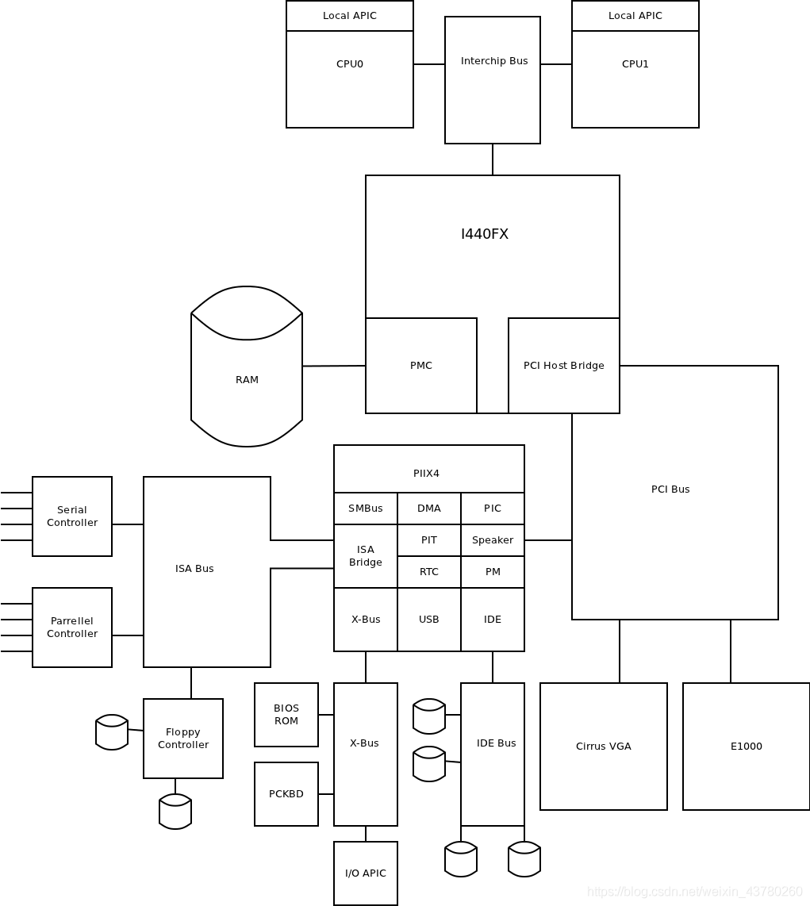

上图是比较经典的PC架构图，从上图中可以看到CPU之间通过interchip bus连接，然后和I440FX芯片连接，I440FX就是我们熟知的北桥芯片组，用来连接高速外设和南桥芯片组，高速外设包括内存、显卡和网卡等，南桥芯片组（PIIX4）用来连接各种低速或老旧的外设。当然，最新的PC架构已经没有这么严格的划分出南桥和北桥芯片了。


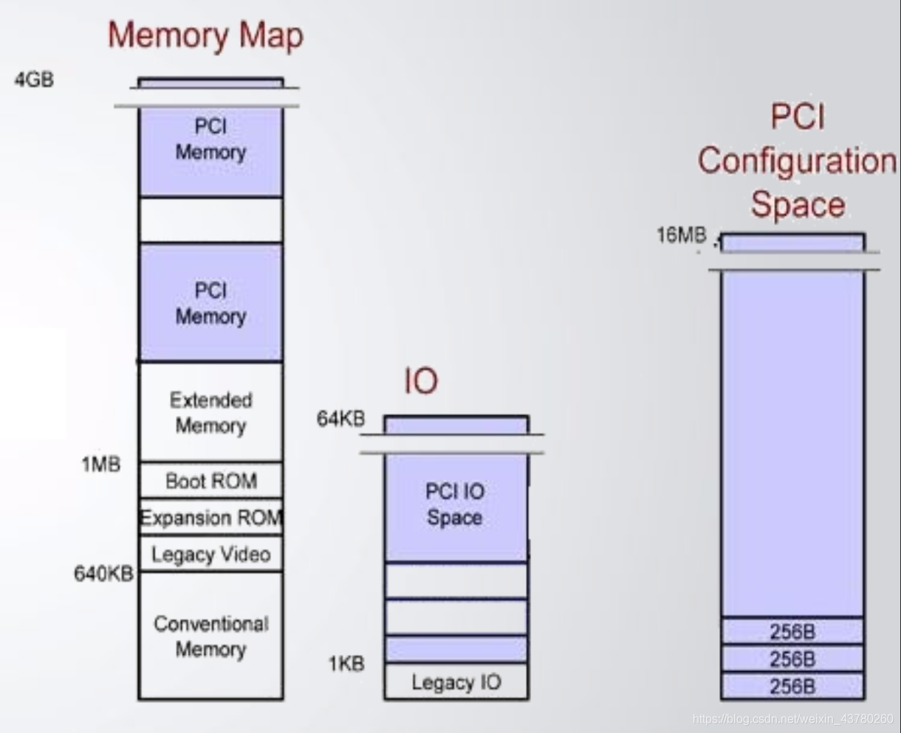

CPU可以直接通过load/store指令来访问PCI设备，PCI设备有如下三种不同内存：

- MMIO
- PCI IO space
- PCI configuration space

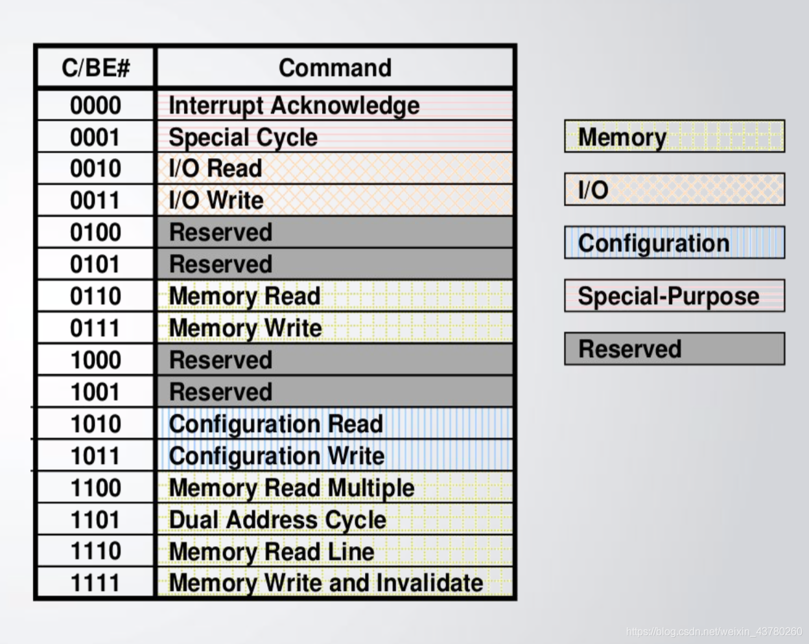

PCI configuration space

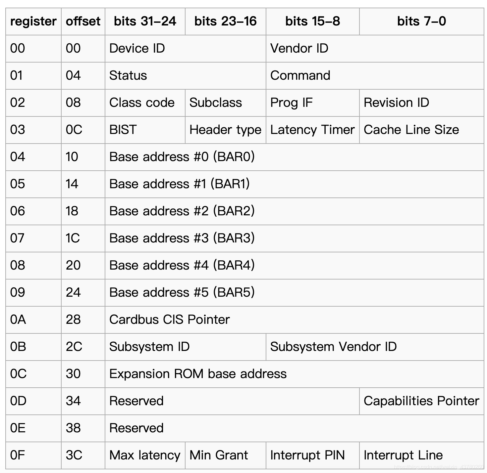

pci configuration space 是用来配置pci设备的，其中也包含了关于pci设备的特定信息。其中
BAR: Base address register可以用来确定设备需要使用的内存或I/O空间的大小，也可以
用来存放设备寄存器的地址。有两种类型的bar，其格式如下：
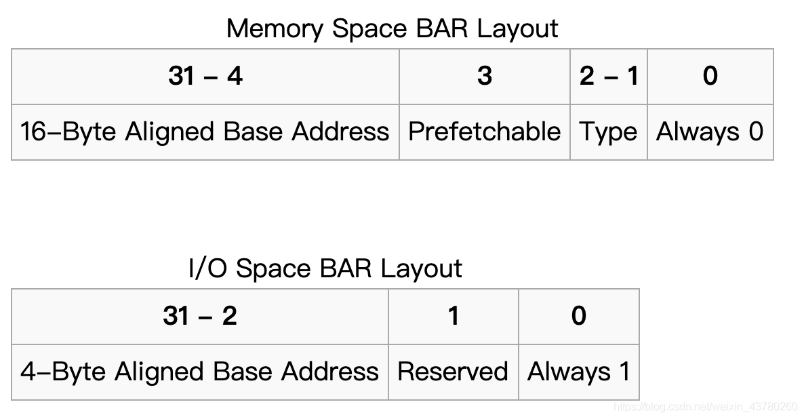

PCI总线上的流量分为两种：

- Command traffic
- Read/Write traffic

TBD

## QEMU中PCI总线的初始化流程

首先来看一下，qemu虚拟的pci设备有哪些：

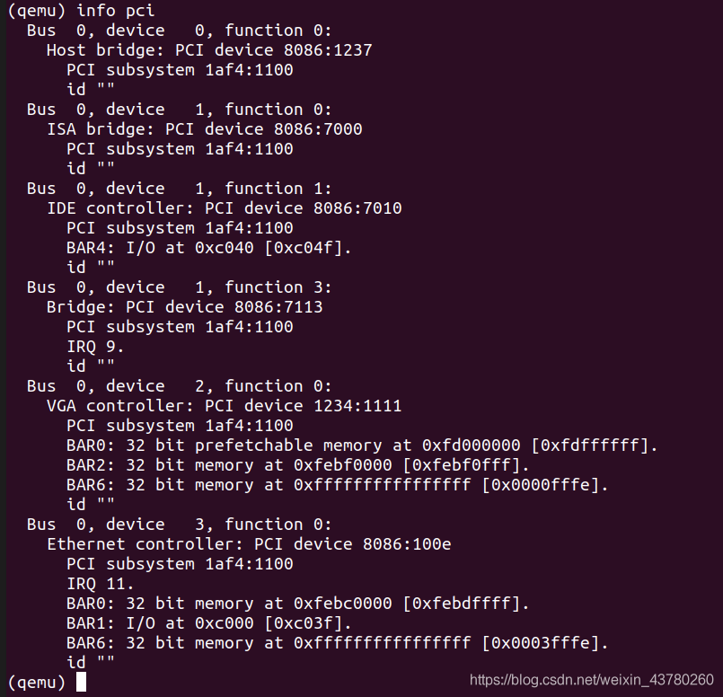

可以看出，PCI设备0:0.0是pci host bridge，PCI设备0:1.0是ISA bridge，PCI设备0:1.1是IDE控制器，PCI设备0:2.0是VGA设备，PCI设备0:3.0是网卡设备。结合下图，可以看出，pci.0总线是挂在main-system-bus下的，而main-system-bus是根总线，一切所有的设备最终都可以通过各种bus追溯到根总线。


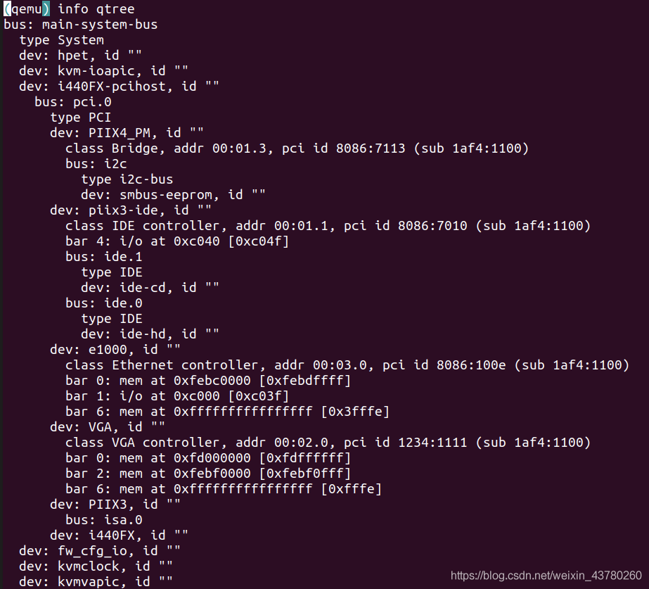

可以查看一下虚拟机中的pci设备信息如下：


00:02.0是VGA设备，由于PCI是小尾端，所以其bar0的值是0xfd000008，和我们从qemu中看到的0xfd000000只有第3位不同，而第三位置1表示该段内存是prefetchable的。

00:03.0是网卡设备，其bar1的值是0xc001，和qemu中的0xc000第0位不同，而第0位置1表示该bar为i/o。

在pc_init1中，新建了pci root bus，I440FX和PIIX3两个pci设备。
```c
pc_init1
	->i440fx_init
		->qdev_create
		->pci_root_bus_new             #init a root bus
			->qbus_create
			->pci_root_bus_init
		->pci_create_simple(I440FX)
			->pci_create_simple_multifunction
				->pci_create_multifunction
				->qdev_init_nofial
					->i440fx_pcihost_realize
						->sysbus_add_io(0xcf8, conf_mem...)
						->sysbus_add_io(0xcfc, data_mem...)
		->pci_create_simple_multifunction(PIIX3)
			->piix3_realize
				->qemu_register_reset(piix3_reset...)
		->pci_bus_irqs
		pci_bus_set_route_irq_fn

```

我们接着来分析pci网卡e1000的初始化流程。在pc_init1调用pc_nic_init来初始化一个网卡设备，默认会新建一个挂在pci总线上的e1000设备，随着qdev_init_nofail中设置realized为true，pci_e1000_realize会被调用，该函数会设置该设备的配置空间写回调函数为e1000_write_config，在配置空间中设置cache_line_size为0x10，interrupt pin为1， 同时调用pci_register_bar来注册对应的BAR。
```c
pc_init1
	->pc_nic_init
		->pci_nic_init_nofail
			->pci_create
			->qdev_init_nofail
				->pci_e1000_realize
					->pci_register_bar

```

pci_register_bar是一个重要的函数，分析如下：

```c
void pci_register_bar(PCIDevice *pci_dev, int region_num,
                      uint8_t type, MemoryRegion *memory)
{
    PCIIORegion *r;
    uint32_t addr; /* offset in pci config space */
    uint64_t wmask;
    pcibus_t size = memory_region_size(memory);

    r = &pci_dev->io_regions[region_num];
    r->addr = PCI_BAR_UNMAPPED;
    r->size = size;
    r->type = type;
    r->memory = memory;
    r->address_space = type & PCI_BASE_ADDRESS_SPACE_IO
                        ? pci_get_bus(pci_dev)->address_space_io
                        : pci_get_bus(pci_dev)->address_space_mem;
...
	//if size is 0x1000, then wmask will be 0xffff_ffff_ffff_f000, this
	//a mechanism used to determine bar size.
	wmask = ~(size - 1);
	//addr is bar address, bar0 will be 0x10, bar1 0x14...
    addr = pci_bar(pci_dev, region_num);
    //type 0 for memory, 1 for I/O
    pci_set_long(pci_dev->config + addr, type);

    if (!(r->type & PCI_BASE_ADDRESS_SPACE_IO) &&
        r->type & PCI_BASE_ADDRESS_MEM_TYPE_64) {
        pci_set_quad(pci_dev->wmask + addr, wmask);
        pci_set_quad(pci_dev->cmask + addr, ~0ULL);
    } else {
        pci_set_long(pci_dev->wmask + addr, wmask & 0xffffffff);
        pci_set_long(pci_dev->cmask + addr, 0xffffffff);
    }
}

#define PCI_BASE_ADDRESS_0 0x10

int pci_bar(PCIDevice *d, int reg)
{
    if (reg != PCI_ROM_SLOT)
        return PCI_BASE_ADDRESS_0 + reg * 4;
...
}

```

此时调用了pci_register_bar之后，假设这个bar是I/O space类型的，且大小为0x10，则该bar的值为0xFFFF_FFF1, 此时bar中还没有真正可用的地址。那地址是信息是什么是很被写进bar中的呢，以及bar所表示的内存区域是何时完成映射的？答案如下：

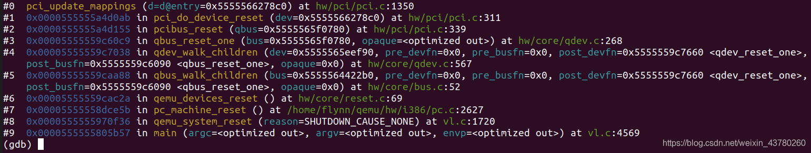

在qemu创建好所有的虚拟设备后，需要调用qemu_system_reset来复位系统，从main-system-bus开始递归遍历调用每个挂在总线上的设备注册的复位函数，其中pci设备会调用pci_do_device_reset，该函数清空PCI_COMMAND和PCI_STATUAS寄存器，清空cache_line和中断引脚配置，最后调用pci_update_mapping，从该函数的名字也可判断，此时是更新内存映射，如下：
```c
static void pci_do_device_reset(PCIDevice *dev)
{
...
    /* Clear all writable bits */
    pci_word_test_and_clear_mask(dev->config + PCI_COMMAND,
                                 pci_get_word(dev->wmask + PCI_COMMAND) |
                                 pci_get_word(dev->w1cmask + PCI_COMMAND));
    pci_word_test_and_clear_mask(dev->config + PCI_STATUS,
                                 pci_get_word(dev->wmask + PCI_STATUS) |
                                 pci_get_word(dev->w1cmask + PCI_STATUS));
    dev->config[PCI_CACHE_LINE_SIZE] = 0x0;
    dev->config[PCI_INTERRUPT_LINE] = 0x0;
...
    pci_update_mappings(dev);
...
}

```

pci_update_mapping函数会遍历设备的bar，如果发现bar中已经填写了不同于r->addr的地址，则说明新的地址已经更新，则首先使用memory_region_del_subregion删除原先注册的memory region，随后更新memory region的offset信息，即r->addr，调用memory_region_add_subregion_overlap将memory region重新注册。
```c
static void pci_update_mappings(PCIDevice *d)
{
...
    for(i = 0; i < PCI_NUM_REGIONS; i++) {
        r = &d->io_regions[i];

        /* this region isn't registered */
        if (!r->size)
            continue;

		//get the address info stored in specific bar
        new_addr = pci_bar_address(d, i, r->type, r->size);

        /* This bar isn't changed */
        if (new_addr == r->addr)
            continue;

        /* now do the real mapping */
        if (r->addr != PCI_BAR_UNMAPPED) {
            memory_region_del_subregion(r->address_space, r->memory);
        }
        r->addr = new_addr;
        if (r->addr != PCI_BAR_UNMAPPED) {
            memory_region_add_subregion_overlap(r->address_space,
                                                r->addr, r->memory, 1);
        }                                       
    }   
    
    pci_update_vga(d);
}                                                        
```

当然，此时bar中也有可能是还没有可用的地址信息的，我们在**if (r->addr != PCI_BAR_UNMAPPED)**这一行打断点，其调用堆栈如下：

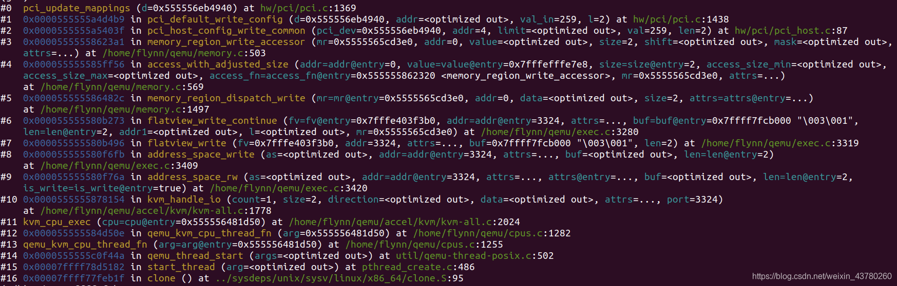

此时由于虚拟机有对3324的I/O口进行了写操作，所以发生了vm-exit，之后由kvm接管，kvm发现自己不能处理这个I/O操作后，控制权从kvm内核模块返回到qemu，qemu最终调用该端口注册的回调函数，即pci_host_config_write_common。那这个端口是干什么用的呢，3324端口即0xCFC，是CONFIG_DATA端口，它和0xCF8即CONFIG_ADDRESS端口配合使用，用来读写pci设备的configuration space。
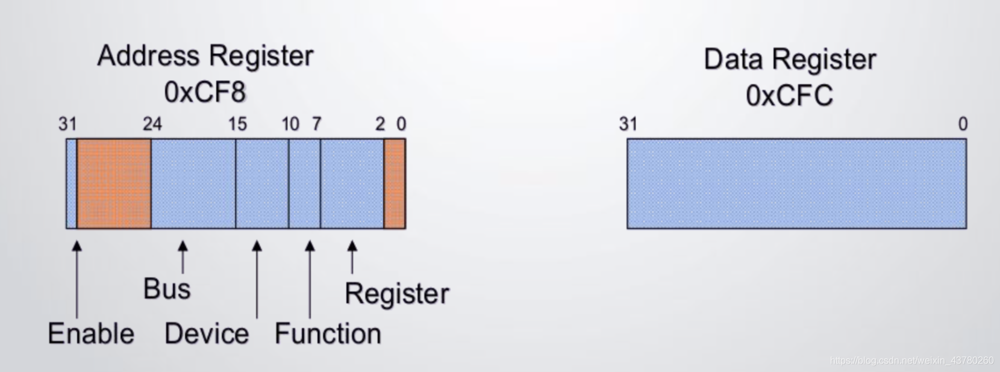

例如操作系统会用如下方式来读pci设备的配置空间：

```c
static void i440fx_pcihost_realize(DeviceState *dev, Error **errp)
{
..
    sysbus_add_io(sbd, 0xcf8, &s->conf_mem);
    sysbus_init_ioports(sbd, 0xcf8, 4);

    sysbus_add_io(sbd, 0xcfc, &s->data_mem);
    sysbus_init_ioports(sbd, 0xcfc, 4);
...
}

static void i440fx_pcihost_initfn(Object *obj)
{
...
    memory_region_init_io(&s->conf_mem, obj, &pci_host_conf_le_ops, s,
                          "pci-conf-idx", 4);
    memory_region_init_io(&s->data_mem, obj, &pci_host_data_le_ops, s,
                          "pci-conf-data", 4);
...
}

static void pci_host_config_write(void *opaque, hwaddr addr,
                                  uint64_t val, unsigned len)
{
    PCIHostState *s = opaque;
..
    s->config_reg = val;
}

static void pci_host_data_write(void *opaque, hwaddr addr,
                                uint64_t val, unsigned len)
{
    PCIHostState *s = opaque;
    if (s->config_reg & (1u << 31))
        pci_data_write(s->bus, s->config_reg | (addr & 3), val, len);
}

void pci_data_write(PCIBus *s, uint32_t addr, uint32_t val, int len)
{
    PCIDevice *pci_dev = pci_dev_find_by_addr(s, addr);
    uint32_t config_addr = addr & (PCI_CONFIG_SPACE_SIZE - 1);
    
    pci_host_config_write_common(pci_dev, config_addr, PCI_CONFIG_SPACE_SIZE,
                                 val, len);
}

void pci_host_config_write_common(PCIDevice *pci_dev, uint32_t addr,
                                  uint32_t limit, uint32_t val, uint32_t len)
{
..
    pci_dev->config_write(pci_dev, addr, val, MIN(len, limit - addr));
}

const MemoryRegionOps pci_host_conf_le_ops = {
    .read = pci_host_config_read,
    .write = pci_host_config_write,
    .endianness = DEVICE_LITTLE_ENDIAN,
};  
    
const MemoryRegionOps pci_host_data_le_ops = {
    .read = pci_host_data_read,
    .write = pci_host_data_write,
    .endianness = DEVICE_LITTLE_ENDIAN,
};
```


我们可以从这个memory region得到opaque地址，而这个opaque对应的是PCIHostState数据结构，从而可以得到config_reg值为0x80000904，这个按如下方式解析：

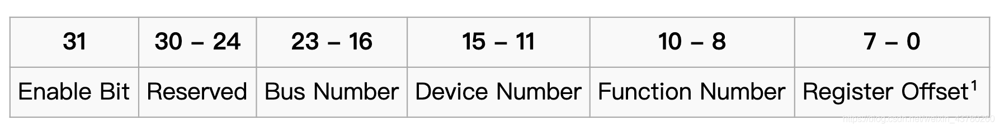

所以此次访问的是0:1:1设备的addr为4的寄存器，从qemu的monitor中我们也可以查到该设备是IDE controller，这也与通过gdb得到的pci设备名字一致。地址为4的寄存器是command/status寄存器，写入的值为259，即0x103，command register解析方式如下：
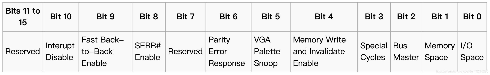

所以表示使能SERR驱动，响应memory space和I/O space访问。虚拟机驱动代码首先设置好所有pci设备的command register为0x103，接着开始通过这种方式更新各个设备中的BAR值。

## 小结
本文主要介绍了pci总线与设备在qemu中的实现方式，以及初始化流程，但是对于pci设备的中断机制和DMA还没有涉及，这部分也是值得探索的，有空再做记录。

## 参考引用
https://wiki.osdev.org/PCI#IRQ_Handling
https://github.com/GiantVM/doc/blob/master/pci.md
————————————————
版权声明：本文为CSDN博主「francisco_flynn」的原创文章，遵循CC 4.0 BY-SA版权协议，转载请附上原文出处链接及本声明。
原文链接：https://blog.csdn.net/weixin_43780260/article/details/104410063