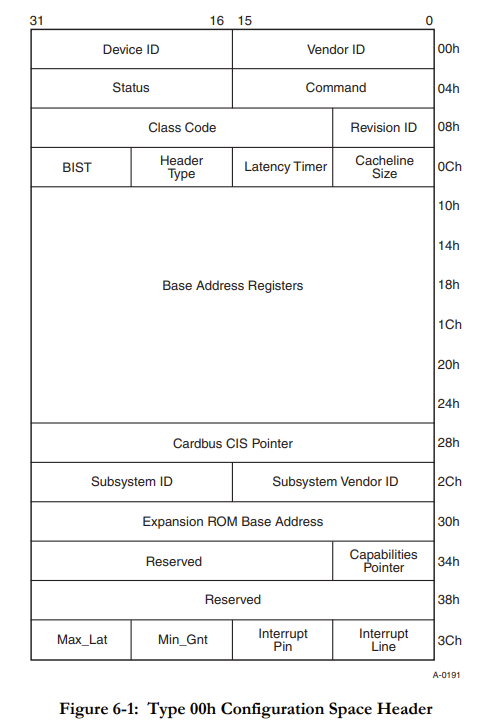
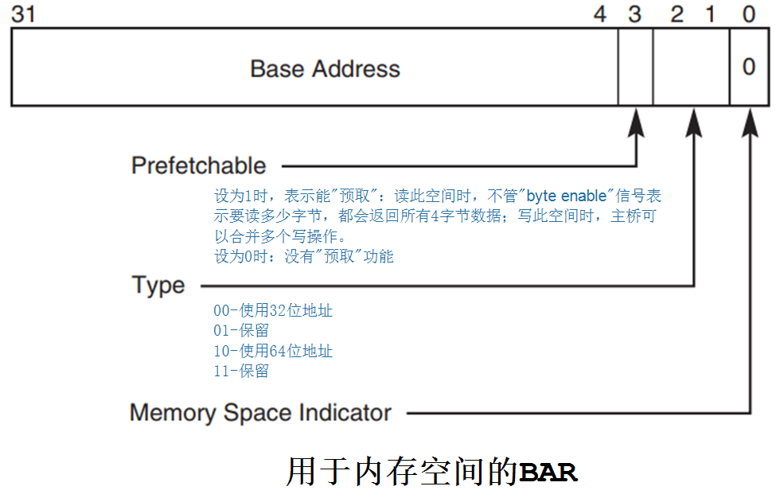
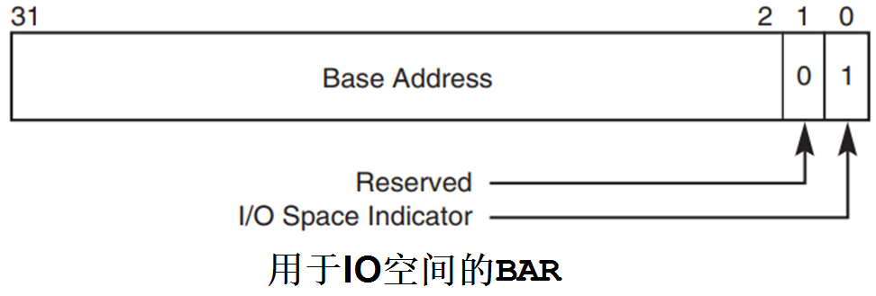

我们以cmd646为例.这里事先说一下,因为qemu的代码足够复杂,我这里可能并不会详细列出来我们所使用到的每个结构体的定义,一旦这么,文章的可读性就非常差了.读者可以自行对照着代码来阅读.

设备刚启动的时候,会调用pci_cmd646_ide_init函数来初始化设备.

```c
/* CMD646 PCI IDE controller */
void pci_cmd646_ide_init(PCIBus *bus, BlockDriverState **hd_table,
                         int secondary_ide_enabled)
{
    PCIIDEState *d;
    uint8_t *pci_conf;
    int i;
    qemu_irq *irq;
    /* 在pci总线上注册cmd646 ide控制器 */
    d = (PCIIDEState *)pci_register_device(bus, "CMD646 IDE",
                                           sizeof(PCIIDEState),
                                           -1,
                                           NULL, NULL);
    d->type = IDE_TYPE_CMD646;
    pci_conf = d->dev.config; /* pci设备的配置空间 */
    pci_config_set_vendor_id(pci_conf, PCI_VENDOR_ID_CMD);
    pci_config_set_device_id(pci_conf, PCI_DEVICE_ID_CMD_646);

    pci_conf[0x08] = 0x07; // IDE controller revision
    pci_conf[0x09] = 0x8f;

    pci_config_set_class(pci_conf, PCI_CLASS_STORAGE_IDE); /* 设备类型为ide存储设备 */
    pci_conf[0x0e] = 0x00; // header_type

    pci_conf[0x51] = 0x04; // enable IDE0
    if (secondary_ide_enabled) {
        /* XXX: if not enabled, really disable the seconday IDE controller */
        pci_conf[0x51] |= 0x08; /* enable IDE1 */
    }
    /* 一旦操作系统给pci设备分配了地址,那么它包含的一系列寄存器就需要重新映射
     * ide_map/bmdma_map做的就是这种事情
     */
    pci_register_io_region((PCIDevice *)d, 0, 0x8,
                           PCI_ADDRESS_SPACE_IO, ide_map);
    pci_register_io_region((PCIDevice *)d, 1, 0x4,
                           PCI_ADDRESS_SPACE_IO, ide_map);
    pci_register_io_region((PCIDevice *)d, 2, 0x8,
                           PCI_ADDRESS_SPACE_IO, ide_map);
    pci_register_io_region((PCIDevice *)d, 3, 0x4,
                           PCI_ADDRESS_SPACE_IO, ide_map);
    /* 最低位为1表示是io */
    pci_register_io_region((PCIDevice *)d, 4, 0x10,
                           PCI_ADDRESS_SPACE_IO, bmdma_map);

    pci_conf[0x3d] = 0x01; // interrupt on pin 1

    for(i = 0; i < 4; i++)
        d->ide_if[i].pci_dev = (PCIDevice *)d;
    /* 分配中断,中断处理函数为cmd646_set_irq,中断个数为2 */
    irq = qemu_allocate_irqs(cmd646_set_irq, d, 2);
    ide_init2(&d->ide_if[0], hd_table[0], hd_table[1], irq[0]);
    ide_init2(&d->ide_if[2], hd_table[2], hd_table[3], irq[1]);

    register_savevm("ide", 0, 2, pci_ide_save, pci_ide_load, d);
    qemu_register_reset(cmd646_reset, d);
    cmd646_reset(d);
}
```

每个pci设备,都有一个256字节的配置空间寄存器:



Device ID是设备id. VendorID是生产厂商的id.

Class Code表示设备类型.

Header Type为00h,表示这个pci设备是普通的pci设备,为01h,表示这个设备是pci桥,下面可以继续扩展pci设备.

这里比较重要的是Base Address Registers,也就是基址寄存器,一共有6个基址寄存器.基址寄存器中存储的,自然是基地址.我们一般将这些基址寄存器成为为BAR.

BAR用于:
* 声明需要什么类型的空间：内存、IO、32位地址、64位地址？
* 声明需要的空间有多大
* 保存主控分配给它的PCI空间基地址

地址空间可以分为两类：内存(Memory)、IO：
* 对于内存，写入什么值读出就是什么值，可以提前读取
* 对于IO，它反应的是硬件当前的状态，每个时刻读到的值不一定相同

BAR的格式如下：
* 用于内存空间(最低位为0)

* 用于IO空间(最低位为1)




BAR怎么表示它想申请多大的空间呢?以32位地址为例：
* 软件往BAR写入0xFFFFFFFF
* 软件读BAR
* 读出的数值假设为0xFFF0,000? 忽略最低的4位，就得到：0xFFF0,0000
  * 这表示BAR中可以写入的"Base Address"只有最高的12位
  * 也就表示了最低的20位是可以变化的范围，所以这个空间大小为2^20=1M Byte

如果BAR表示它使用32位的地址，那么BAR0~BAR5可以分别表示6个地址空间。
如果BAR表示它使用64位的地址，那么BAR0和BAR1、BAR2和BAR3、BAR4和BAR5分别表示3个地址空间：

* 低序号的BAR表示64位地址的低32位
* 高序号的地址表示64位地址的高32位。

我们知道,pci总线上的pci设备是可以热拔插的.因此pci设备的寄存器地址并不能直接写死在硬件之中,

软件可以先从基址寄存器中读取出pci设备需要申请的地址空间,软件为为pci设备分配了空间之后,会将地址空间的基地址写入BAR,软件之后才能通过基地址+偏移的方式访问到pci设备的相关寄存器.

## 基址映射

我们来简单看一下,pci设备是如何实现基址的映射的.

```c
// pci.c
/* -1 for devfn means auto assign */
/* 注册pci设备
 * @param name 设备名称
 * @param instance_size 实例大小
 * @param devfn 设备号,如果为-1.表示由函数分配
 */
PCIDevice *pci_register_device(PCIBus *bus, const char *name,
                               int instance_size, int devfn,
                               PCIConfigReadFunc *config_read,
                               PCIConfigWriteFunc *config_write)
{
    PCIDevice *pci_dev;
    if (pci_irq_index >= PCI_DEVICES_MAX)
        return NULL;

    if (devfn < 0) {
        for(devfn = bus->devfn_min ; devfn < 256; devfn += 8) {
            if (!bus->devices[devfn]) /* 挑选一个空闲的位置 */
                goto found;
        }
        return NULL;
    found: ;
    }
    pci_dev = qemu_mallocz(instance_size);
    pci_dev->bus = bus; /* 记录下设备所在的总线 */
    pci_dev->devfn = devfn; /* 记录下设备编号 */
    pstrcpy(pci_dev->name, sizeof(pci_dev->name), name);
    memset(pci_dev->irq_state, 0, sizeof(pci_dev->irq_state));
    pci_set_default_subsystem_id(pci_dev);

    if (!config_read)
        config_read = pci_default_read_config;
    if (!config_write)
        config_write = pci_default_write_config;
    /* 注意这里的pci_default_read_config/pci_default_write_config
     * 这两个回调函数很重要
     */
    pci_dev->config_read = config_read; 
    pci_dev->config_write = config_write;
    pci_dev->irq_index = pci_irq_index++; /* 记录下中断索引值 */
    bus->devices[devfn] = pci_dev;
    pci_dev->irq = qemu_allocate_irqs(pci_set_irq, pci_dev, 4);
    return pci_dev;
}
```

注意上面的pci设备注册函数中,有一个config_write回调,对于cmd646,这个write回调实际为pci_default_write_config:

```c
void pci_default_write_config(PCIDevice *d,
                              uint32_t address, uint32_t val, int len)
{
    int can_write, i;
    uint32_t end, addr;

    if (len == 4 && ((address >= 0x10 && address < 0x10 + 4 * 6) ||
                     (address >= 0x30 && address < 0x34))) { /* 地址切好位于基址寄存器区域 */
        PCIIORegion *r;
        int reg;

        if ( address >= 0x30 ) {
            reg = PCI_ROM_SLOT;
        } else {
            reg = (address - 0x10) >> 2;
        }
        r = &d->io_regions[reg]; /* 选择pci设备的一个基址寄存器 */
        if (r->size == 0)
            goto default_config;
        /* compute the stored value */
        if (reg == PCI_ROM_SLOT) {
            /* keep ROM enable bit */
            val &= (~(r->size - 1)) | 1;
        } else {
            val &= ~(r->size - 1);
            val |= r->type;
        }
        /* 更新基址寄存器的值,注意,最低的1个bit不变(最低的1bit用于表示它到底是内存还是io) */
        *(uint32_t *)(d->config + address) = cpu_to_le32(val);
        pci_update_mappings(d);
        return;
    }
    // ...
}
```

当操作系统操作pci设备的配置空间的时候,就会调用此函数.

如果操作系统写入的地址恰好位于基址寄存器区域的时候,就会触发映射函数pci_update_mappings.

在这个函数之中,如果发现基址寄存器的内容发生变更,就会触发pci设备的region的map_func回调.

```c
/* 更新pic设备的内存映射
 * 一旦操作系统给pci设备分配了基址,那么它下面的寄存器地址就要重新设置,方便操作系统访问
 */
static void pci_update_mappings(PCIDevice *d)
{
    PCIIORegion *r;
    int cmd, i;
    uint32_t last_addr, new_addr, config_ofs;

    cmd = le16_to_cpu(*(uint16_t *)(d->config + PCI_COMMAND));
    for(i = 0; i < PCI_NUM_REGIONS; i++) {
        r = &d->io_regions[i];
        if (i == PCI_ROM_SLOT) {
            config_ofs = 0x30;
        } else {
            config_ofs = 0x10 + i * 4; /* 基址寄存器的相对偏移 */
        }
        if (r->size != 0) {
            if (r->type & PCI_ADDRESS_SPACE_IO) { /* io地址空间 */
                if (cmd & PCI_COMMAND_IO) {
                    new_addr = le32_to_cpu(*(uint32_t *)(d->config +
                                                         config_ofs));
                    new_addr = new_addr & ~(r->size - 1);
                    last_addr = new_addr + r->size - 1;
                    /* NOTE: we have only 64K ioports on PC */
                    if (last_addr <= new_addr || new_addr == 0 ||
                        last_addr >= 0x10000) {
                        new_addr = -1;
                    }
                } else {
                    new_addr = -1;
                }
            } else {
                if (cmd & PCI_COMMAND_MEMORY) { /* 内存地址空间 */
                    new_addr = le32_to_cpu(*(uint32_t *)(d->config +
                                                         config_ofs));
                    /* the ROM slot has a specific enable bit */
                    if (i == PCI_ROM_SLOT && !(new_addr & 1))
                        goto no_mem_map;
                    new_addr = new_addr & ~(r->size - 1);
                    last_addr = new_addr + r->size - 1;
                    /* NOTE: we do not support wrapping */
                    /* XXX: as we cannot support really dynamic
                       mappings, we handle specific values as invalid
                       mappings. */
                    if (last_addr <= new_addr || new_addr == 0 ||
                        last_addr == -1) {
                        new_addr = -1;
                    }
                } else {
                no_mem_map:
                    new_addr = -1;
                }
            }
            /* now do the real mapping */
            if (new_addr != r->addr) { /* 地址发生了变更 */
                if (r->addr != -1) {
                    if (r->type & PCI_ADDRESS_SPACE_IO) {
                        int class;
                        /* NOTE: specific hack for IDE in PC case:
                           only one byte must be mapped. */
                        class = d->config[0x0a] | (d->config[0x0b] << 8);
                        /* 首先取消原来的映射 */
                        if (class == 0x0101 && r->size == 4) {
                            isa_unassign_ioport(r->addr + 2, 1);
                        } else {
                            isa_unassign_ioport(r->addr, r->size);
                        }
                    } else {
                        cpu_register_physical_memory(pci_to_cpu_addr(r->addr),
                                                     r->size,
                                                     IO_MEM_UNASSIGNED);
                        qemu_unregister_coalesced_mmio(r->addr, r->size);
                    }
                }
                r->addr = new_addr;
                /* 然后再映射 */
                if (r->addr != -1) {
                    r->map_func(d, i, r->addr, r->size, r->type);
                }
            }
        }
    }
}
```

对于cmd646而言,使用了6个基址寄存器中的5个:

```c
//...
    pci_register_io_region((PCIDevice *)d, 0, 0x8,
                           PCI_ADDRESS_SPACE_IO, ide_map);
    pci_register_io_region((PCIDevice *)d, 1, 0x4,
                           PCI_ADDRESS_SPACE_IO, ide_map);
    pci_register_io_region((PCIDevice *)d, 2, 0x8,
                           PCI_ADDRESS_SPACE_IO, ide_map);
    pci_register_io_region((PCIDevice *)d, 3, 0x4,
                           PCI_ADDRESS_SPACE_IO, ide_map);
    /* 最低位为1表示是io */
    pci_register_io_region((PCIDevice *)d, 4, 0x10,
                           PCI_ADDRESS_SPACE_IO, bmdma_map);
//...
```


## IDE

作为IDE设备,我们自然很关心,qemu到底是如何来实现ide设备的读写操作的,我们就一一起来看一下.

相关寄存器一共分为两类,一类是io寄存器,主要用于发出命令.

一类是数据寄存器,用于写入数据.

```c
static void ide_map(PCIDevice *pci_dev, int region_num,
                    uint32_t addr, uint32_t size, int type)
{
    PCIIDEState *d = (PCIIDEState *)pci_dev;
    IDEState *ide_state;

    if (region_num <= 3) {
        ide_state = &d->ide_if[(region_num >> 1) * 2];
        if (region_num & 1) {
            register_ioport_read(addr + 2, 1, 1, ide_status_read, ide_state);
            register_ioport_write(addr + 2, 1, 1, ide_cmd_write, ide_state);
        } else {
            /* io */
            register_ioport_write(addr, 8, 1, ide_ioport_write, ide_state);
            register_ioport_read(addr, 8, 1, ide_ioport_read, ide_state);

            /* data ports */
            register_ioport_write(addr, 2, 2, ide_data_writew, ide_state);
            register_ioport_read(addr, 2, 2, ide_data_readw, ide_state);
            register_ioport_write(addr, 4, 4, ide_data_writel, ide_state);
            register_ioport_read(addr, 4, 4, ide_data_readl, ide_state);
        }
    }
}
```

如果软件想操作ide设备,写入相关地址,就会触发ide_ioport_write回调,为了节约篇幅,我这里只列举出其中一些比较重要的操作:

```c
static void ide_ioport_write(void *opaque, uint32_t addr, uint32_t val)
{
    IDEState *ide_if = opaque;
    IDEState *s;
    int unit, n;
    int lba48 = 0;
    addr &= 7;

    /* ignore writes to command block while busy with previous command */
    if (addr != 7 && (ide_if->cur_drive->status & (BUSY_STAT|DRQ_STAT)))
        return;

    switch(addr) {
    case 0:
        break;
		// ...
    default:
    case 7:
        /* command */
#if defined(DEBUG_IDE)
        printf("ide: CMD=%02x\n", val);
#endif
        s = ide_if->cur_drive;
        /* ignore commands to non existant slave */
        if (s != ide_if && !s->bs)
            break;

        /* Only DEVICE RESET is allowed while BSY or/and DRQ are set */
        if ((s->status & (BUSY_STAT|DRQ_STAT)) && val != WIN_DEVICE_RESET)
            break;

        switch(val) {
  		// ...
        case WIN_READ_EXT:
            lba48 = 1;
        case WIN_READ: /* 读扇区 */
        case WIN_READ_ONCE:
            if (!s->bs)
                goto abort_cmd;
            ide_cmd_lba48_transform(s, lba48);
            s->req_nb_sectors = 1;
            ide_sector_read(s);
            break;
        case WIN_WRITE_EXT:
            lba48 = 1;
        case WIN_WRITE: /* 写扇区 */
        case WIN_WRITE_ONCE:
        case CFA_WRITE_SECT_WO_ERASE:
        case WIN_WRITE_VERIFY:
            ide_cmd_lba48_transform(s, lba48);
            s->error = 0;
            s->status = SEEK_STAT | READY_STAT;
            s->req_nb_sectors = 1;
            ide_transfer_start(s, s->io_buffer, 512, ide_sector_write);
            s->media_changed = 1;
            break;
		// ...
        case WIN_READDMA_EXT:
            lba48 = 1;
        case WIN_READDMA: /* 通过dma的方式来读 */
        case WIN_READDMA_ONCE:
            if (!s->bs)
                goto abort_cmd;
            ide_cmd_lba48_transform(s, lba48);
            ide_sector_read_dma(s);
            break;
        case WIN_WRITEDMA_EXT:
            lba48 = 1;
        case WIN_WRITEDMA: /* 通过dma的方式来写 */
        case WIN_WRITEDMA_ONCE:
            if (!s->bs)
                goto abort_cmd;
            ide_cmd_lba48_transform(s, lba48);
            ide_sector_write_dma(s);
            s->media_changed = 1;
            break;
		// ...
        default:
        abort_cmd:
            ide_abort_command(s);
            ide_set_irq(s);
            break;
        }
    }
}
```

### 普通读

普通读是一个同步操作,也就是说,读完了之后,才会返回.

```c
        case WIN_READ_EXT:
            lba48 = 1;
        case WIN_READ: /* 读扇区 */
        case WIN_READ_ONCE:
            if (!s->bs)
                goto abort_cmd;
            ide_cmd_lba48_transform(s, lba48);
            s->req_nb_sectors = 1;
            ide_sector_read(s);
            break;
```

会调用ide_sector_read来读取1个扇区的数据:

```c
// ide.c
/* prepare data transfer and tell what to do after */
static void ide_transfer_start(IDEState *s, uint8_t *buf, int size,
                               EndTransferFunc *end_transfer_func)
{
    s->end_transfer_func = end_transfer_func;
    s->data_ptr = buf;
    s->data_end = buf + size;
    if (!(s->status & ERR_STAT)) /* 如果没有错误发生 */
        s->status |= DRQ_STAT; /* 触发中断 */
}

/* 读取扇区的数据 */
static void ide_sector_read(IDEState *s)
{
    int64_t sector_num;
    int ret, n;

    s->status = READY_STAT | SEEK_STAT;
    s->error = 0; /* not needed by IDE spec, but needed by Windows */
    sector_num = ide_get_sector(s); /* 从寄存器中读取出来,要读取的扇区的编号 */
    n = s->nsector;
    if (n == 0) {
        /* no more sector to read from disk */
        ide_transfer_stop(s);
    } else {
#if defined(DEBUG_IDE)
        printf("read sector=%" PRId64 "\n", sector_num);
#endif
        if (n > s->req_nb_sectors)
            n = s->req_nb_sectors;
        /* 这里是同步读 */
        ret = bdrv_read(s->bs, sector_num, s->io_buffer, n); /* 将数据读取io_buffer之中 */
        if (ret != 0) {
            ide_rw_error(s);
            return;
        }
        ide_transfer_start(s, s->io_buffer, 512 * n, ide_sector_read);
        ide_set_irq(s);  /* 触发中断 */
        ide_set_sector(s, sector_num + n);  /* 重新设置寄存器,记录下下一次要读取的扇区号 */
        s->nsector -= n;
    }
}
```

### 普通写

```c
        case WIN_WRITE_EXT:
            lba48 = 1;
        case WIN_WRITE: /* 写扇区 */
        case WIN_WRITE_ONCE:
        case CFA_WRITE_SECT_WO_ERASE:
        case WIN_WRITE_VERIFY:
            ide_cmd_lba48_transform(s, lba48);
            s->error = 0;
            s->status = SEEK_STAT | READY_STAT;
            s->req_nb_sectors = 1;
            ide_transfer_start(s, s->io_buffer, 512, ide_sector_write);
            s->media_changed = 1;
            break;
```

值得注意的是,这个时候还没有进行写操作(只是发送了写命令),当实际写数据的时候:

```c
static void ide_data_writew(void *opaque, uint32_t addr, uint32_t val)
{
    IDEState *s = ((IDEState *)opaque)->cur_drive;
    uint8_t *p;

    /* PIO data access allowed only when DRQ bit is set */
    if (!(s->status & DRQ_STAT))
        return;

    p = s->data_ptr;
    *(uint16_t *)p = le16_to_cpu(val);
    p += 2;
    s->data_ptr = p;
    if (p >= s->data_end)
        s->end_transfer_func(s);
}
```

就会调用上面注册的ide_secotr_write来实际写入数据:

```c
static void ide_sector_write(IDEState *s)
{
    int64_t sector_num;
    int ret, n, n1;

    s->status = READY_STAT | SEEK_STAT;
    sector_num = ide_get_sector(s);
#if defined(DEBUG_IDE)
    printf("write sector=%" PRId64 "\n", sector_num);
#endif
    n = s->nsector;
    if (n > s->req_nb_sectors)
        n = s->req_nb_sectors;
    ret = bdrv_write(s->bs, sector_num, s->io_buffer, n); /* 同步写 */

    if (ret != 0) {
        if (ide_handle_write_error(s, -ret, BM_STATUS_PIO_RETRY))
            return;
    }

    s->nsector -= n;
    if (s->nsector == 0) {
        /* no more sectors to write */
        ide_transfer_stop(s);
    } else {
        n1 = s->nsector;
        if (n1 > s->req_nb_sectors)
            n1 = s->req_nb_sectors;
        ide_transfer_start(s, s->io_buffer, 512 * n1, ide_sector_write);
    }
    ide_set_sector(s, sector_num + n);

#ifdef TARGET_I386
    if (win2k_install_hack && ((++s->irq_count % 16) == 0)) {
        /* It seems there is a bug in the Windows 2000 installer HDD
           IDE driver which fills the disk with empty logs when the
           IDE write IRQ comes too early. This hack tries to correct
           that at the expense of slower write performances. Use this
           option _only_ to install Windows 2000. You must disable it
           for normal use. */
        qemu_mod_timer(s->sector_write_timer, 
                       qemu_get_clock(vm_clock) + (ticks_per_sec / 1000));
    } else 
#endif
    {
        ide_set_irq(s); /* 写完之后触发中断 */
    }
}
```

### dma读

```c
        case WIN_READDMA_EXT:
            lba48 = 1;
        case WIN_READDMA: /* 通过dma的方式来读 */
        case WIN_READDMA_ONCE:
            if (!s->bs)
                goto abort_cmd;
            ide_cmd_lba48_transform(s, lba48);
            ide_sector_read_dma(s);
            break;
```

这里很直接,调用ide_sector_read_dma来读取,dma读,表示操作是异步的,也就是软件发起了dma读操作会立刻返回,当dma读取完成,设备会通过中断的方式通知软件操作完成.

```c
// ide.c
static void ide_dma_start(IDEState *s, BlockDriverCompletionFunc *dma_cb)
{
    BMDMAState *bm = s->bmdma;
    if(!bm)
        return;
    bm->ide_if = s;
    bm->dma_cb = dma_cb;
    bm->cur_prd_last = 0;
    bm->cur_prd_addr = 0;
    bm->cur_prd_len = 0;
    bm->sector_num = ide_get_sector(s); /* 要读取的扇区号 */
    bm->nsector = s->nsector;
    if (bm->status & BM_STATUS_DMAING) {
        bm->dma_cb(bm, 0);
    }
}

/* 通过dma的方式来读取数据 */
static void ide_sector_read_dma(IDEState *s)
{
    s->status = READY_STAT | SEEK_STAT | DRQ_STAT | BUSY_STAT;
    s->io_buffer_index = 0;
    s->io_buffer_size = 0;
    s->is_read = 1;
    ide_dma_start(s, ide_read_dma_cb);
}
```

ide_read_dma_cb是回调函数,会一直读取,直到读取完了所需要的数据,才会触发中断,返回.

```c
/* dma读 */
static void ide_read_dma_cb(void *opaque, int ret)
{
    BMDMAState *bm = opaque;
    IDEState *s = bm->ide_if;
    int n;
    int64_t sector_num;

    if (ret < 0) {
        dma_buf_commit(s, 1);
        ide_dma_error(s);
        return;
    }

    n = s->io_buffer_size >> 9;
    sector_num = ide_get_sector(s); /* 要操作的扇区号 */
    if (n > 0) {
        dma_buf_commit(s, 1);
        sector_num += n;
        ide_set_sector(s, sector_num);
        s->nsector -= n;
    }

    /* end of transfer ? */
    if (s->nsector == 0) { /* dma读完成 */
        s->status = READY_STAT | SEEK_STAT;
        ide_set_irq(s); /* 触发中断 */
    eot:
        bm->status &= ~BM_STATUS_DMAING;
        bm->status |= BM_STATUS_INT;
        bm->dma_cb = NULL;
        bm->ide_if = NULL;
        bm->aiocb = NULL;
        return;
    }

    /* launch next transfer */
    n = s->nsector;
    s->io_buffer_index = 0;
    s->io_buffer_size = n * 512;
    if (dma_buf_prepare(bm, 1) == 0)
        goto eot;
#ifdef DEBUG_AIO
    printf("aio_read: sector_num=%" PRId64 " n=%d\n", sector_num, n);
#endif
    /* 如果没有读完,就发起下一轮读 */
    bm->aiocb = dma_bdrv_read(s->bs, &s->sg, sector_num, ide_read_dma_cb, bm);
    ide_dma_submit_check(s, ide_read_dma_cb, bm);
}
```

这里的核心函数是dma_bdrv_read:

```c
// dma-helper.c

/* 异步io */
static BlockDriverAIOCB *dma_bdrv_io(
    BlockDriverState *bs, QEMUSGList *sg, uint64_t sector_num,
    BlockDriverCompletionFunc *cb, void *opaque,
    int is_write)
{
    /* 获取一个DMAAIOCB结构体 */
    DMAAIOCB *dbs =  qemu_aio_get_pool(&dma_aio_pool, bs, cb, opaque);

    dbs->acb = NULL;
    dbs->bs = bs;
    dbs->sg = sg;
    dbs->sector_num = sector_num;
    dbs->sg_cur_index = 0;
    dbs->sg_cur_byte = 0;
    dbs->is_write = is_write;
    dbs->bh = NULL;
    qemu_iovec_init(&dbs->iov, sg->nsg);
    /* 按照道理来说,不会在这里执行读写操作 */
    dma_bdrv_cb(dbs, 0);
    if (!dbs->acb) {
        qemu_aio_release(dbs);
        return NULL;
    }
    return &dbs->common;
}

BlockDriverAIOCB *dma_bdrv_read(BlockDriverState *bs,
                                QEMUSGList *sg, uint64_t sector,
                                void (*cb)(void *opaque, int ret), void *opaque)
{
    return dma_bdrv_io(bs, sg, sector, cb, opaque, 0);
}
```

接下来是dma_bdrv_cb:

```c
// dma-helper.c
void dma_bdrv_cb(void *opaque, int ret)
{
    DMAAIOCB *dbs = (DMAAIOCB *)opaque;
    target_phys_addr_t cur_addr, cur_len;
    void *mem;

    dbs->acb = NULL;
    dbs->sector_num += dbs->iov.size / 512; /* 要读取的扇区个数? */
    dma_bdrv_unmap(dbs);
    qemu_iovec_reset(&dbs->iov);

    if (dbs->sg_cur_index == dbs->sg->nsg || ret < 0) { /* dma操作完成 */
        dbs->common.cb(dbs->common.opaque, ret);
        qemu_iovec_destroy(&dbs->iov);
        qemu_aio_release(dbs);
        return;
    }

    while (dbs->sg_cur_index < dbs->sg->nsg) {
        cur_addr = dbs->sg->sg[dbs->sg_cur_index].base + dbs->sg_cur_byte;
        cur_len = dbs->sg->sg[dbs->sg_cur_index].len - dbs->sg_cur_byte;
        /* 内存映射? */
        mem = cpu_physical_memory_map(cur_addr, &cur_len, !dbs->is_write);
        if (!mem)
            break;
        qemu_iovec_add(&dbs->iov, mem, cur_len);
        dbs->sg_cur_byte += cur_len;
        if (dbs->sg_cur_byte == dbs->sg->sg[dbs->sg_cur_index].len) {
            dbs->sg_cur_byte = 0;
            ++dbs->sg_cur_index; /* 转向下一个内存块 */
        }
    }

    if (dbs->iov.size == 0) {
        cpu_register_map_client(dbs, continue_after_map_failure);
        return;
    }
	/* 如果dma操作没有完成,继续发起下一轮dma操作 */
    if (dbs->is_write) { /* 异步写,操作完成之后,调用dma_bdrv_cb */
        dbs->acb = bdrv_aio_writev(dbs->bs, dbs->sector_num, &dbs->iov,
                                   dbs->iov.size / 512, dma_bdrv_cb, dbs);
    } else { /* 异步读 */
        dbs->acb = bdrv_aio_readv(dbs->bs, dbs->sector_num, &dbs->iov,
                                  dbs->iov.size / 512, dma_bdrv_cb, dbs);
    }
    if (!dbs->acb) {
        dma_bdrv_unmap(dbs);
        qemu_iovec_destroy(&dbs->iov);
        return;
    }
}
```

核心操作函数为bdrv_aio_readv:

```c
// block.c

static BlockDriverAIOCB *bdrv_aio_rw_vector(BlockDriverState *bs,
        int64_t sector_num, /* 扇区号 */
                                            QEMUIOVector *iov,
                                            int nb_sectors, /* 扇区个数 */
                                            BlockDriverCompletionFunc *cb,
                                            void *opaque,
                                            int is_write)

{
    VectorTranslationAIOCB *s = qemu_aio_get_pool(&vectored_aio_pool, bs,
                                                  cb, opaque);

    s->iov = iov;
    s->bounce = qemu_memalign(512, nb_sectors * 512);
    s->is_write = is_write;
    if (is_write) { /* 异步写,操作完成之后,调用bdrv_aio_rw_vector_cb */
        qemu_iovec_to_buffer(s->iov, s->bounce);
        s->aiocb = bdrv_aio_write(bs, sector_num, s->bounce, nb_sectors,
                                  bdrv_aio_rw_vector_cb, s);
    } else {
        s->aiocb = bdrv_aio_read(bs, sector_num, s->bounce, nb_sectors,
                                 bdrv_aio_rw_vector_cb, s);
    }
    if (!s->aiocb) {
        qemu_vfree(s->bounce);
        qemu_aio_release(s);
        return NULL;
    }
    return &s->common;
}

/* 异步读
 * @param iov io数组
 */
BlockDriverAIOCB *bdrv_aio_readv(BlockDriverState *bs, int64_t sector_num,
                                 QEMUIOVector *iov, int nb_sectors,
                                 BlockDriverCompletionFunc *cb, void *opaque)
{
    if (bdrv_check_request(bs, sector_num, nb_sectors))
        return NULL;

    return bdrv_aio_rw_vector(bs, sector_num, iov, nb_sectors,
                              cb, opaque, 0);
}
```

核心函数为bdrv_aio_read:

```c
// block.c
/* 块设备的异步读取 */
BlockDriverAIOCB *bdrv_aio_read(BlockDriverState *bs, int64_t sector_num,
                                uint8_t *buf, int nb_sectors,
                                BlockDriverCompletionFunc *cb, void *opaque)
{
    BlockDriver *drv = bs->drv;
    BlockDriverAIOCB *ret;

    if (!drv)
        return NULL;
    if (bdrv_check_request(bs, sector_num, nb_sectors))
        return NULL;

    ret = drv->bdrv_aio_read(bs, sector_num, buf, nb_sectors, cb, opaque);

    if (ret) {
        /* Update stats even though technically transfer has not happened. */
        bs->rd_bytes += (unsigned) nb_sectors * SECTOR_SIZE;
        bs->rd_ops ++;
    }

    return ret;
}
```

到这里,就要调用bdrv_aio_read回调了,我知道这是一个特别复杂的流程,如果要详细讲述,又是非常大的篇幅.

为了简单起见,我们假设,我们假设qemu模拟的块设备是raw格式的:

```c
struct BlockDriver {
    const char *format_name;
    int instance_size;
    int (*bdrv_probe)(const uint8_t *buf, int buf_size, const char *filename);
    int (*bdrv_open)(BlockDriverState *bs, const char *filename, int flags);
    int (*bdrv_read)(BlockDriverState *bs, int64_t sector_num,
                     uint8_t *buf, int nb_sectors);
    int (*bdrv_write)(BlockDriverState *bs, int64_t sector_num,
                      const uint8_t *buf, int nb_sectors);
    void (*bdrv_close)(BlockDriverState *bs);
    int (*bdrv_create)(const char *filename, int64_t total_sectors,
                       const char *backing_file, int flags);
    void (*bdrv_flush)(BlockDriverState *bs);
    int (*bdrv_is_allocated)(BlockDriverState *bs, int64_t sector_num,
                             int nb_sectors, int *pnum);
    int (*bdrv_set_key)(BlockDriverState *bs, const char *key);
    int (*bdrv_make_empty)(BlockDriverState *bs);
    /* aio */
    BlockDriverAIOCB *(*bdrv_aio_read)(BlockDriverState *bs,
        int64_t sector_num, uint8_t *buf, int nb_sectors,
        BlockDriverCompletionFunc *cb, void *opaque);
    BlockDriverAIOCB *(*bdrv_aio_write)(BlockDriverState *bs,
        int64_t sector_num, const uint8_t *buf, int nb_sectors,
        BlockDriverCompletionFunc *cb, void *opaque);
    void (*bdrv_aio_cancel)(BlockDriverAIOCB *acb);
    int aiocb_size;

    const char *protocol_name;
    int (*bdrv_pread)(BlockDriverState *bs, int64_t offset,
                      uint8_t *buf, int count);
    int (*bdrv_pwrite)(BlockDriverState *bs, int64_t offset,
                       const uint8_t *buf, int count);
    int (*bdrv_truncate)(BlockDriverState *bs, int64_t offset);
    int64_t (*bdrv_getlength)(BlockDriverState *bs);
    int (*bdrv_write_compressed)(BlockDriverState *bs, int64_t sector_num,
                                 const uint8_t *buf, int nb_sectors);
	// ...
};
```
raw格式的驱动定义如下:

```c
BlockDriver bdrv_raw = {
    "raw",
    sizeof(BDRVRawState),
    NULL, /* no probe for protocols */
    raw_open,
    NULL,
    NULL,
    raw_close,
    raw_create,
    raw_flush,

#ifdef CONFIG_AIO
    .bdrv_aio_read = raw_aio_read,
    .bdrv_aio_write = raw_aio_write,
    .bdrv_aio_cancel = raw_aio_cancel,
    .aiocb_size = sizeof(RawAIOCB),
#endif

    .bdrv_pread = raw_pread,
    .bdrv_pwrite = raw_pwrite,
    .bdrv_truncate = raw_truncate,
    .bdrv_getlength = raw_getlength,
};
```

它对应的回调函数为raw_aio_read:

```c
// block-raw-posix.c
/* 异步读
 * @param sector_num 扇区号
 * @param buf 缓冲区首地址
 * @param nb_sectors 要读的扇区个数
 * @param cb 读完成之后要执行的回调函数
 * @param opaque 要传递给cb的参数
 */
static BlockDriverAIOCB *raw_aio_read(BlockDriverState *bs,
        int64_t sector_num, uint8_t *buf, int nb_sectors,
        BlockDriverCompletionFunc *cb, void *opaque)
{
    RawAIOCB *acb;

    /*
     * If O_DIRECT is used and the buffer is not aligned fall back
     * to synchronous IO.
     */
    BDRVRawState *s = bs->opaque;

    if (unlikely(s->aligned_buf != NULL && ((uintptr_t) buf % 512))) {
        QEMUBH *bh;
        acb = qemu_aio_get(bs, cb, opaque);
        acb->ret = raw_pread(bs, 512 * sector_num, buf, 512 * nb_sectors);
        bh = qemu_bh_new(raw_aio_em_cb, acb); /* 构建一个bh */
        qemu_bh_schedule(bh);
        return &acb->common;
    }

    acb = raw_aio_setup(bs, sector_num, buf, nb_sectors, cb, opaque);
    if (!acb)
        return NULL;
    if (qemu_paio_read(&acb->aiocb) < 0) {
        raw_aio_remove(acb);
        return NULL;
    }
    return &acb->common;
}
```

一般而言,会总qemu_paio_read:

```c
// posix-aio-compat.c

static int qemu_paio_submit(struct qemu_paiocb *aiocb, int is_write)
{
    aiocb->is_write = is_write;
    aiocb->ret = -EINPROGRESS;
    aiocb->active = 0;
    mutex_lock(&lock);
    if (idle_threads == 0 && cur_threads < max_threads)
        spawn_thread(); /* 拉起线程 */
    TAILQ_INSERT_TAIL(&request_list, aiocb, node); /* 将任务提交给工作线程 */
    mutex_unlock(&lock);
    cond_signal(&cond); /* 提醒工作线程 */

    return 0;
}

int qemu_paio_read(struct qemu_paiocb *aiocb)
{
    return qemu_paio_submit(aiocb, 0);
}
```

这个东西类似于一个生产者消费者队列,生产者将动作丢到队列里面,qemu有一个线程池,专门抓取任务,并执行:

```c
// posix-aio-compat.c
static void *aio_thread(void *unused)
{
    pid_t pid;
    sigset_t set;

    pid = getpid();

    /* block all signals */
    if (sigfillset(&set)) die("sigfillset");
    if (sigprocmask(SIG_BLOCK, &set, NULL)) die("sigprocmask");

    while (1) {
        struct qemu_paiocb *aiocb;
        size_t offset;
        int ret = 0;
        qemu_timeval tv;
        struct timespec ts;

        qemu_gettimeofday(&tv);
        ts.tv_sec = tv.tv_sec + 10;
        ts.tv_nsec = 0;

        mutex_lock(&lock);

        while (TAILQ_EMPTY(&request_list) &&
               !(ret == ETIMEDOUT)) {
            ret = cond_timedwait(&cond, &lock, &ts);
        }

        if (TAILQ_EMPTY(&request_list))
            break;
        /* 获得一个任务 */
        aiocb = TAILQ_FIRST(&request_list);
        TAILQ_REMOVE(&request_list, aiocb, node);

        offset = 0;
        aiocb->active = 1;

        idle_threads--;
        mutex_unlock(&lock);

        while (offset < aiocb->aio_nbytes) {
            ssize_t len;

            if (aiocb->is_write)
                /* 这个是raw_pwrite吗? */
                len = pwrite(aiocb->aio_fildes,
                             (const char *)aiocb->aio_buf + offset,
                             aiocb->aio_nbytes - offset,
                             aiocb->aio_offset + offset);
            else
                len = pread(aiocb->aio_fildes,
                            (char *)aiocb->aio_buf + offset,
                            aiocb->aio_nbytes - offset,
                            aiocb->aio_offset + offset);

            if (len == -1 && errno == EINTR)
                continue;
            else if (len == -1) {
                offset = -errno;
                break;
            } else if (len == 0)
                break;

            offset += len;
        }

        mutex_lock(&lock);
        aiocb->ret = offset;
        idle_threads++;
        mutex_unlock(&lock);
        
        if (kill(pid, aiocb->ev_signo)) die("kill failed"); /* 发送消息 */
    }

    idle_threads--;
    cur_threads--;
    mutex_unlock(&lock);
    return NULL;
}

static void spawn_thread(void)
{
    cur_threads++;
    idle_threads++;
    thread_create(&thread_id, &attr, aio_thread, NULL); /* 处理函数为aio_thread */
}
```

注意上面的pread/pwrite,执行的是真正的读写操作.

还有一点值得注意,当工作完成,它会给自己发送一个消息.

在aio模块初始化的时候,会调用posix_aio_init函数,它会注册一个管道,用于处理别的线程发送过来的消息.

```c
// block-raw-posix.c
static void aio_signal_handler(int signum)
{
    if (posix_aio_state) {
        char byte = 0;
        write(posix_aio_state->wfd, &byte, sizeof(byte)); /* 通过管道发送消息 */
    }

    qemu_service_io();
}

/* 初始化aio模块 */
static int posix_aio_init(void)
{
    struct sigaction act;
    PosixAioState *s;
    int fds[2];
    struct qemu_paioinit ai;
  
    if (posix_aio_state)
        return 0;

    s = qemu_malloc(sizeof(PosixAioState));

    sigfillset(&act.sa_mask);
    act.sa_flags = 0; /* do not restart syscalls to interrupt select() */
    act.sa_handler = aio_signal_handler; /* 注册信号处理函数 */
    sigaction(SIGUSR2, &act, NULL);

    s->first_aio = NULL;
    if (pipe(fds) == -1) {
        fprintf(stderr, "failed to create pipe\n");
        return -errno;
    }

    s->rfd = fds[0];
    s->wfd = fds[1];

    fcntl(s->rfd, F_SETFL, O_NONBLOCK);
    fcntl(s->wfd, F_SETFL, O_NONBLOCK);

    qemu_aio_set_fd_handler(s->rfd, posix_aio_read, NULL, posix_aio_flush, s);

    memset(&ai, 0, sizeof(ai));
    ai.aio_threads = 64;
    ai.aio_num = 64;
    qemu_paio_init(&ai);

    posix_aio_state = s;

    return 0;
}
```

如果qemu接收到了信号,那么会往管道中写入数据,posix_aio_read会处理这个数据:

```c
// block-raw-posix.c
static void posix_aio_read(void *opaque)
{
    PosixAioState *s = opaque;
    RawAIOCB *acb, **pacb;
    int ret;
    ssize_t len;

    /* read all bytes from signal pipe */
    for (;;) {
        char bytes[16];

        len = read(s->rfd, bytes, sizeof(bytes));
        if (len == -1 && errno == EINTR)
            continue; /* try again */
        if (len == sizeof(bytes))
            continue; /* more to read */
        break;
    }

    for(;;) {
        pacb = &s->first_aio;
        for(;;) {
            acb = *pacb;
            if (!acb)
                goto the_end;
            ret = qemu_paio_error(&acb->aiocb);
            if (ret == ECANCELED) {
                /* remove the request */
                *pacb = acb->next;
                qemu_aio_release(acb);
            } else if (ret != EINPROGRESS) {
                /* end of aio */
                if (ret == 0) {
                    ret = qemu_paio_return(&acb->aiocb);
                    if (ret == acb->aiocb.aio_nbytes)
                        ret = 0;
                    else
                        ret = -EINVAL;
                } else {
                    ret = -ret;
                }
                /* remove the request */
                *pacb = acb->next;
                /* call the callback */
                /* 调用回调函数 */
                acb->common.cb(acb->common.opaque, ret);
                qemu_aio_release(acb);
                break;
            } else {
                pacb = &acb->next;
            }
        }
    }
 the_end: ;
}
```

也就是,一旦接收到了消息,就触发回调.

我们假定读完成,那么会调用回调dma_bdrv_cb:

```c
void dma_bdrv_cb(void *opaque, int ret)
{
	// ..
    if (dbs->sg_cur_index == dbs->sg->nsg || ret < 0) { /* dma操作完成 */
        dbs->common.cb(dbs->common.opaque, ret);
        qemu_iovec_destroy(&dbs->iov);
        qemu_aio_release(dbs);
        return;
    }
	// ..
}
```

dma_bdrv_cb也会调用上一层的回调函数ide_read_dma_cb,在这个函数里面,会触发中断.

```c
// ide.c
/* dma读 */
static void ide_read_dma_cb(void *opaque, int ret)
{
	// ...
    /* end of transfer ? */
    if (s->nsector == 0) { /* dma读完成 */
        s->status = READY_STAT | SEEK_STAT;
        ide_set_irq(s); /* 触发中断 */
    eot:
        bm->status &= ~BM_STATUS_DMAING;
        bm->status |= BM_STATUS_INT;
        bm->dma_cb = NULL;
        bm->ide_if = NULL;
        bm->aiocb = NULL;
        return;
    }
	// ...
}
```

### dma写

dma写的方式,和dma读差别基本不大.

```c
        case WIN_WRITEDMA_EXT:
            lba48 = 1;
        case WIN_WRITEDMA: /* 通过dma的方式来写 */
        case WIN_WRITEDMA_ONCE:
            if (!s->bs)
                goto abort_cmd;
            ide_cmd_lba48_transform(s, lba48);
            ide_sector_write_dma(s);
            s->media_changed = 1;
            break;
```

核心函数是ide_sector_write_dma:

```c
// ide.c
/* 开始dma写操作 */
static void ide_sector_write_dma(IDEState *s)
{
    s->status = READY_STAT | SEEK_STAT | DRQ_STAT | BUSY_STAT;
    s->io_buffer_index = 0;
    s->io_buffer_size = 0;
    s->is_read = 0;
    ide_dma_start(s, ide_write_dma_cb);
}
```

和普通写类似,当软件真正写数据的时候,会触发ide_write_dma_cb函数:

```c
static void ide_data_writew(void *opaque, uint32_t addr, uint32_t val)
{
    IDEState *s = ((IDEState *)opaque)->cur_drive;
    uint8_t *p;

    /* PIO data access allowed only when DRQ bit is set */
    if (!(s->status & DRQ_STAT))
        return;

    p = s->data_ptr;
    *(uint16_t *)p = le16_to_cpu(val);
    p += 2;
    s->data_ptr = p;
    if (p >= s->data_end)
        s->end_transfer_func(s);
}
```

我们来看一下ide_write_dma_cb函数:

```c
/* dma写操作 */
static void ide_write_dma_cb(void *opaque, int ret)
{
    BMDMAState *bm = opaque;
    IDEState *s = bm->ide_if;
    int n;
    int64_t sector_num;

    if (ret < 0) {
        if (ide_handle_write_error(s, -ret,  BM_STATUS_DMA_RETRY))
            return;
    }

    n = s->io_buffer_size >> 9;
    sector_num = ide_get_sector(s);
    if (n > 0) {
        dma_buf_commit(s, 0);
        sector_num += n;
        ide_set_sector(s, sector_num);
        s->nsector -= n;
    }

    /* end of transfer ? */
    if (s->nsector == 0) { /* 传输完成 */
        s->status = READY_STAT | SEEK_STAT;
        ide_set_irq(s); /* 触发中断 */
    eot:
        bm->status &= ~BM_STATUS_DMAING;
        bm->status |= BM_STATUS_INT;
        bm->dma_cb = NULL;
        bm->ide_if = NULL;
        bm->aiocb = NULL;
        return;
    }

    n = s->nsector;
    s->io_buffer_size = n * 512;
    /* launch next transfer */
    if (dma_buf_prepare(bm, 0) == 0)
        goto eot;
#ifdef DEBUG_AIO /* 异步写 */
    printf("aio_write: sector_num=%" PRId64 " n=%d\n", sector_num, n);
#endif
    bm->aiocb = dma_bdrv_write(s->bs, &s->sg, sector_num, ide_write_dma_cb, bm);
    ide_dma_submit_check(s, ide_write_dma_cb, bm);
}
```

接下来的流程大致是:

```c
// dma_bdrv_write -> dma_bdrv_io ->dma_dbrv_cb -> bdrv_aio_writev -> bdrv_aio_rw_vector -> bdrv_aio_write
BlockDriverAIOCB *dma_bdrv_write(BlockDriverState *bs,
                                 QEMUSGList *sg, uint64_t sector,
                                 void (*cb)(void *opaque, int ret), void *opaque)
{
    return dma_bdrv_io(bs, sg, sector, cb, opaque, 1);
}
```

和读基本类似,这里就不再赘述.

回过头来,看一看整个流程,我们可以发现,读确实是异步的.qemu的模拟是成功的.

## 中断触发

在pci情景分析一文中,已经讲述.我这里贴在下面:


如果ide触发中断,会调用pci_sec_irq:

```c
// irq.h
/* 触发中断
 * @param irq
 */
static inline void qemu_irq_raise(qemu_irq irq)
{
    qemu_set_irq(irq, 1);
}
// ide.c
static inline void ide_set_irq(IDEState *s)
{
    BMDMAState *bm = s->bmdma;
    if (!(s->cmd & IDE_CMD_DISABLE_IRQ)) {
        if (bm) {
            bm->status |= BM_STATUS_INT;
        }
        qemu_irq_raise(s->irq);
    }
}
```

此时,qemu_set_irq实际会调用cmd646_set_irq回调来触发中断():

```c
// irq.c
void qemu_set_irq(qemu_irq irq, int level)
{
    if (!irq)
        return;
    irq->handler(irq->opaque, irq->n, level);
}
```

代码如下:

```c
// ide.c

/* 当MRDMODE变化的时候,调用此函数 */
static void cmd646_update_irq(PCIIDEState *d)
{
    int pci_level;
    pci_level = ((d->dev.config[MRDMODE] & MRDMODE_INTR_CH0) &&
                 !(d->dev.config[MRDMODE] & MRDMODE_BLK_CH0)) ||
        ((d->dev.config[MRDMODE] & MRDMODE_INTR_CH1) &&
         !(d->dev.config[MRDMODE] & MRDMODE_BLK_CH1));
    qemu_set_irq(d->dev.irq[0], pci_level);
}

/* the PCI irq level is the logical OR of the two channels */
static void cmd646_set_irq(void *opaque, int channel, int level)
{
    PCIIDEState *d = opaque;
    int irq_mask;

    irq_mask = MRDMODE_INTR_CH0 << channel;
    if (level)
        d->dev.config[MRDMODE] |= irq_mask;
    else
        d->dev.config[MRDMODE] &= ~irq_mask;
    cmd646_update_irq(d);
}
```

会调用qemu_set_irq来触发中断,它会调用中断的handler,我们前面知道,这个handler其实是pci_set_irq(注意pci_register_device函数):

```c
// irq.c

/* 0 <= irq_num <= 3. level must be 0 or 1 */
void pci_set_irq(PCIDevice *pci_dev, int irq_num, int level)
{
    PCIBus *bus = pci_dev->bus;
    bus->set_irq(pci_dev, bus->irq_opaque, irq_num, level);
}

void qemu_set_irq(qemu_irq irq, int level)
{
    if (!irq)
        return;
    irq->handler(irq->opaque, irq->n, level);
}
```

而bus->set_irq,实际上就是pii3_set_irq:

```c
// piix_pci.c
static uint32_t pci_irq_levels[4][PCI_IRQ_WORDS];

/* return the global irq number corresponding to a given device irq
   pin. We could also use the bus number to have a more precise
   mapping. */
/* 根据给定设备的irq pin,返回全局中断号
 * pci只有4个全局中断号,所有的设备中断号(irq_num)都要映射到这4个全局中断号上去
 */
static inline int pci_slot_get_pirq(PCIDevice *pci_dev, int irq_num)
{
    int slot_addend;
    slot_addend = (pci_dev->devfn >> 3) - 1;
    return (irq_num + slot_addend) & 3; /* 实际取值只有0~2 */
}
/* 获取pci irq level
 * 由于一个全局中断号对应多台设备,对于某个全局中断号irq_num而言,只要它对应的设备有一个的level
 * 是1,那么irq_num对应的pci irq level就是1
 */
static inline int get_pci_irq_level(int irq_num)
{
    int pic_level;
#if (PCI_IRQ_WORDS == 2)
    pic_level = ((pci_irq_levels[irq_num][0] | 
                  pci_irq_levels[irq_num][1]) != 0);
#else
    {
        int i;
        pic_level = 0;
        for(i = 0; i < PCI_IRQ_WORDS; i++) {
            if (pci_irq_levels[irq_num][i]) {
                pic_level = 1; /* 有一个设备触发了,那就返回1 */
                break;
            }
        }
    }
#endif
    return pic_level;
}

/* 触发中断
 * @param level 取值只有0或者1
 * @param irq_num 设备中断号
 */
static void piix3_set_irq(PCIDevice *pci_dev, void *pic, int irq_num, int level)
{
    int irq_index, shift, pic_irq, pic_level;
    uint32_t *p;
    /* 一个中断号可以对应多个pci设备 */
    irq_num = pci_slot_get_pirq(pci_dev, irq_num); /* 根据设备中断号得到映射之后的全局中断号 */
    irq_index = pci_dev->irq_index; /* 获取设备的中断索引号 */
    /* 一个uint32_t恰好是32bit,对应32台设备 */
    p = &pci_irq_levels[irq_num][irq_index >> 5];
    shift = (irq_index & 0x1f); /* 取低5bit */
    /* 每台设备对应1个bit
     * *p & ~(1 << shift) 将设备对应的bit清零
     * level << shift 为设备对应的新bit
     */
    *p = (*p & ~(1 << shift)) | (level << shift);

    /* now we change the pic irq level according to the piix irq mappings */
    /* 根据piix irq映射表实现pic irq level的映射 */
    pic_irq = piix3_dev->config[0x60 + irq_num];
    if (pic_irq < 16) {
        /* the pic level is the logical OR of all the PCI irqs mapped
           to it */
        pic_level = 0;
        if (pic_irq == piix3_dev->config[0x60])
            pic_level |= get_pci_irq_level(0);
        if (pic_irq == piix3_dev->config[0x61])
            pic_level |= get_pci_irq_level(1);
        if (pic_irq == piix3_dev->config[0x62])
            pic_level |= get_pci_irq_level(2);
        if (pic_irq == piix3_dev->config[0x63])
            pic_level |= get_pci_irq_level(3);
        pic_set_irq(pic_irq, pic_level);
    }
}
```

最终调用 `pic_set_irq` 来设置cpu中断.

```c
// pci.c
/* 0 <= irq_num <= 3. level must be 0 or 1 */
static void pci_set_irq(void *opaque, int irq_num, int level)
{
    PCIDevice *pci_dev = (PCIDevice *)opaque;
    PCIBus *bus;
    int change;

    change = level - pci_dev->irq_state[irq_num];
    if (!change)
        return;

    pci_dev->irq_state[irq_num] = level;
    for (;;) {
        bus = pci_dev->bus;
        irq_num = bus->map_irq(pci_dev, irq_num);
        if (bus->set_irq)
            break;
        pci_dev = bus->parent_dev;
    }
    bus->irq_count[irq_num] += change;
    bus->set_irq(bus->irq_opaque, irq_num, bus->irq_count[irq_num] != 0);
}
```

接下来就是中断控制器的故事了,这里就不再赘述了,感兴趣的同学可以翻一翻我后面有关于中断模拟的相关文章.
