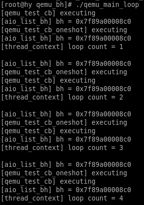

## 简述
qemu事件循环可以提供4种服务：监听文件描述符，监听线程间事件，定时器，下半部（bottom half，以下简称bh）。本文主要介绍qemu事件循环中下半部的原理，在前一篇文章代码基础上作修改，实现下半部的功能。
下半部向qemu内部其它模块提供一个异步延迟调的功能，下半部在一个事件循环中实现，当下半部函数（cb）注册到一个事件循环中，这个事件循环在下一次poll的时候，就会调用这个函数，实现异步延迟调用的功能。

## 数据结构

```c
struct QEMUBH {
    AioContext *ctx;	// 下半部所在的context
    QEMUBHFunc *cb;		// 下半部要执行的函数
    void *opaque;		// 函数参数
    QEMUBH *next;		// 下一个要执行的下半部
    bool scheduled;		// 使能bh，是否被调度，true:下一次dispatch会触发cb； false:下一次dispatch不会触发cb
    bool idle; 
    bool deleted;		// 标记是否将bh删除
};
```

+ BH数据结构的最后三个属性用于控制事件循环线程对BH的操作行为。
  为什么要有这三个属性？因为bh的注册和执行是异步地，因此需要有一种方法提供给注册者用来通知执行者，注册者期望bh被怎样执行。
+ scheduled用来通知执行者，期望在下一次dispatch时bh被调度到；idle用于通知执行者bh不用作progress计数；deleted通知执行者bh被调度一次之后就删除。

## BH API
### 挂载 BH

bh在一个事件循环中实现，因此申请bh需要指出基于哪个context，同时要指定下半部中需要执行什么函数以及函数参数
一个context上可以有多个bh挂载，bh通过context的firsh_bh和下半部本身数据结构里面的next被维护成一个单向链表，从下面的函数实现中可以看出，先挂载到context的bh将后执行，后注册先调度

```c
QEMUBH *aio_bh_new(AioContext *ctx, QEMUBHFunc *cb, void *opaque)
{   
    QEMUBH *bh;
    bh = g_new(QEMUBH, 1);	// 为下半部数据结构分配内存
    *bh = (QEMUBH){			// 初始化下半部
        .ctx = ctx,
        .cb = cb,
        .opaque = opaque,
    };
    
    /* QEMUBH和AioHandler都会操作ctx数据结构，list_lock锁用于保证在bh注册期间没有监听文件描述符的回调被注册
       aio_set_fd_handler在添加fd的hanler时会申请这把list_lock锁 */
    qemu_lockcnt_lock(&ctx->list_lock);
    bh->next = ctx->first_bh;	// 保存ctx中第一个bh
    /* Make sure that the members are ready before putting bh into list */
    smp_wmb();
    /* 将自己添加到ctx中的first_bh，但事件循环中是从first_bh依次开始取bh，然后执行，因此后注册的bh要先被执行 */
    ctx->first_bh = bh;
    qemu_lockcnt_unlock(&ctx->list_lock);
    return bh;
}
```

+ qemu主线程有默认的事件循环`qemu_aio_context`，bh挂载到主线程的事件循环有接口`qemu_bh_new`可以直接调用

```c
/* Functions to operate on the main QEMU AioContext.  */
QEMUBH *qemu_bh_new(QEMUBHFunc *cb, void *opaque)
{   
    return aio_bh_new(qemu_aio_context, cb, opaque);
}
```

+ bh还有一种用法是只执行一次，然后就删除bh，这个通过`aio_bh_schedule_oneshot`接口可以实现
  而普通bh执行方式是调用`qemu_bh_schedule`，虽然也只调度一次但不会被删除，下一次调度不需要重新注册

```c
void aio_bh_schedule_oneshot(AioContext *ctx, QEMUBHFunc *cb, void *opaque)
{
    QEMUBH *bh;
    bh = g_new(QEMUBH, 1);
    *bh = (QEMUBH){
        .ctx = ctx,
        .cb = cb,
        .opaque = opaque,
    };
    qemu_lockcnt_lock(&ctx->list_lock);
    bh->next = ctx->first_bh;
    bh->scheduled = 1;			// 使能bh，让其在下一次调度中被执行
    bh->deleted = 1;			// 控制事件循环在执行bh的cb之后将其数据结构删除掉，这条语句保证bh的cb只执行一次
    /* Make sure that the members are ready before putting bh into list */
    smp_wmb();
    ctx->first_bh = bh;
    qemu_lockcnt_unlock(&ctx->list_lock);
    aio_notify(ctx);
}
```

### 通知

+ bh挂载到context之后不会被立即执行，只有当事件循环的执行线程poll到fd准备好之后，才会触发回调执行bh，如果context的fd一直没有准备好那poll就一直不返回，岂不是挂在上面的bh就一直得不到执行。为避免这种情况发生，qemu实现了bh调度接口，用于通知事件循环调度bh
+ bh调度接口通过eventfd api实现，evenfd可以用于线程间通信。qemu在aio_context_new创建AioContext的时候会通过event_notifier_init初始化EventNotifier，将EventNotifier中的rfd设置aio_set_event_notifier为事件循环要监听的fd。当一个线程把自己的bh挂载到context上后，向EventNotifier中的wfd写入内容，另一端监听rfd的事件循环就会poll到其上有事件，然后触发bh的调度
+ 创建AioContext接口aio_context_new

```c
/* Returns true if aio_notify() was called (e.g. a BH was scheduled) */
static bool event_notifier_poll(void *opaque)
{
    EventNotifier *e = opaque;
    AioContext *ctx = container_of(e, AioContext, notifier);

    return atomic_read(&ctx->notified);
}

AioContext *
aio_context_new()
{
    int ret;
    AioContext *ctx;

    ctx = (AioContext *) g_source_new(&aio_source_funcs, sizeof(AioContext));	// 注册事件循环个阶段回调
	
    ret = event_notifier_init(&ctx->notifier, false);	// 使用eventfd初始化EventNotifier
    if (ret < 0) {
        g_print("%s Failed to initialize event notifier\n", __FUNCTION__);
        goto fail;
    }
    qemu_lockcnt_init(&ctx->list_lock);

    /* 设置ctx监听EventNotifier的rfd，并使用定制的event_notifier_poll替代事件循环中的poll */
    aio_set_event_notifier(ctx, &ctx->notifier,	
                           (EventNotifierHandler *)
                           event_notifier_dummy_cb,
                           event_notifier_poll);
    return ctx;
fail:
    g_source_destroy(&ctx->source);
    return NULL;
}
```

+ 使能BH，通过`qemu_bh_schedule`通知事件循环执行一次bh的调度

```c
void aio_notify(AioContext *ctx)
{   
    /* Write e.g. bh->scheduled before reading ctx->notify_me.  Pairs
     * with atomic_or in aio_ctx_prepare or atomic_add in aio_poll.
     */
    smp_mb();
    if (ctx->notify_me) {
    	/* 写EventNotifier中的wfd，通知事件循环所在的线程 */
        event_notifier_set(&ctx->notifier)；
        /* 设置notified为true，当事件循环调用event_notifier_poll时会返回true，表明poll到事件，触发bh */
        atomic_mb_set(&ctx->notified, true);	
    }
}

void qemu_bh_schedule(QEMUBH *bh)
{       
    AioContext *ctx;     
    
    ctx = bh->ctx;
    bh->idle = 0;
    /* The memory barrier implicit in atomic_xchg makes sure that:
     * 1. idle & any writes needed by the callback are done before the
     *    locations are read in the aio_bh_poll.
     * 2. ctx is loaded before scheduled is set and the callback has a chance
     *    to execute.           
     */
     /* atomic_xchg的意思是设置scheduled为1并取出其原来的值，这个操作是原子的
	  * 只有当scheduled原来的值是0，才通知事件循环的线程有fd准备好了
	  * qemu_bh_schedule和aio_bh_poll中的atomic_xchg是一对
	  * atomic_xchg保证scheduled=0这条指令在aio_notify之前被执行
	  * 假设这里没有memory barrier，那么指令可能被重排，aio_notify可能会先于scheduled=1执行
	  * 当aio_notify执行时scheduled还时0，事件循环调度cb前查看scheduled==0就不会调度这个cb了
	  * 这样会使cb得不到调度从而错过一次执行的机会
	  */
    if (atomic_xchg(&bh->scheduled, 1) == 0) {
        aio_notify(ctx);
    }
} 
```

### 执行 BH

- 事件循环在poll到fd准备好之后，会调度qemu定制的回调函数`aio_ctx_dispatch`，其主要功能是执行fd对应的回调函数，但在此之前会先检查context上是否挂载有bh，如果有先执行bh

```c
/* 注册到AioContext的回调函数，当fd准备好之后，事件循环机制会调度这个回调 */
static void
aio_dispatch(AioContext *ctx)
{
    qemu_lockcnt_inc(&ctx->list_lock);
    aio_bh_poll(ctx);
    aio_dispatch_handlers(ctx);
    qemu_lockcnt_dec(&ctx->list_lock);
}

static gboolean
aio_ctx_dispatch(GSource     *source,
                 GSourceFunc  callback,
                 gpointer     user_data)
{
#ifdef DEBUG
    g_print("%s\n", __FUNCTION__);
#endif
    AioContext *ctx = (AioContext *) source;

    aio_dispatch(ctx);
    return TRUE;
}
```

+ bh的执行，挂入事件循环的bh，在一次循环中检查scheduled，如果被设置成1，表示需要被调度执行

```c
/* Multiple occurrences of aio_bh_poll cannot be called concurrently.
 * The count in ctx->list_lock is incremented before the call, and is
 * not affected by the call.
 */
int aio_bh_poll(AioContext *ctx)
{
    QEMUBH *bh, **bhp, *next;
    int ret;
    bool deleted = false;

    ret = 0;
    for (bh = atomic_rcu_read(&ctx->first_bh); bh; bh = next) {
        next = atomic_rcu_read(&bh->next);
        /* The atomic_xchg is paired with the one in qemu_bh_schedule.  The
         * implicit memory barrier ensures that the callback（执行事件循环的线程） sees all writes
         * done by the scheduling thread（调用者线程）.  It also ensures that the scheduling
         * thread sees the zero before bh->cb has run, and thus will call
         * aio_notify again if necessary.
         */
		/* qemu_bh_schedule和aio_bh_poll中的atomic_xchg是一对
		 * atomic_xchg保证了编译器不优化代码，使得aio_bh_call的执行必然在scheduled设置成0之后
		 * 假设这里不使用memory barrier那么编译可能对这段代码进行指令重排，aio_bh_call在scheduled=0之前执行
		 * qemu_bh_schedule中看到的scheduled仍然是1，因此不会发起aio_notify通知
		 * qemu_bh_schedule会误以为自己注册的bh将要被执行，但其实它不会被执行了。
		 * 因为属于它的这次调度在它读取scheduled之前已经被执行了。bh会因此错过一次正确的调度机会。
		 */
        if (atomic_xchg(&bh->scheduled, 0)) {		// 如果scheduled被设置成1，表示注册者期望这个bh被调度
            /* Idle BHs don't count as progress */
            if (!bh->idle) {
                ret = 1;
            }
            bh->idle = 0;
            aio_bh_call(bh);	// 执行cb
        }
        if (bh->deleted) {		// 如果有bh期望在执行后被删除，将deleteed置1
            deleted = true;
        }
    }

    /* remove deleted bhs */
    if (!deleted) {				// 如果deleted为0，表示所有之前调度的bh中每有期望被删除的，直接返回
        return ret;
    }
	/* 被调度的bh中有期望自己被删除的，进行删除操作 */
    if (qemu_lockcnt_dec_if_lock(&ctx->list_lock)) {
        bhp = &ctx->first_bh;
        while (*bhp) {
            bh = *bhp;
            if (bh->deleted && !bh->scheduled) {	// 如果有期望被删除的bh
                *bhp = bh->next;					// 从链表中删除，并释放其内存
                g_free(bh);
            } else {
                bhp = &bh->next;					// 取链表中的下一个
            }
        }
        qemu_lockcnt_inc_and_unlock(&ctx->list_lock);
    }
    return ret;
}
```

### 卸载BH

- 卸载bh是通过设置bh属性完成的，设置`scheduled`为0能够使bh在下一次dispatch时不被调度执行，设置`deleted`为1能够使bh在下一次dispatch时被删掉并释放bh的空间

```c
/* This func is async.The bottom half will do the delete action at the finial
 * end. 
 */ 
void qemu_bh_delete(QEMUBH *bh)
{       
    bh->scheduled = 0;
    bh->deleted = 1;
}
```

### 禁用BH

- 当期望bh不被事件循环调度，但又不想删除这个bh时可以使用`qemu_bh_cancel`接口

```c
/* This func is async.
 */          
void qemu_bh_cancel(QEMUBH *bh)
{           
    atomic_mb_set(&bh->scheduled, 0);
} 
```


## demo

### 代码分析

- 主线程中执行主事件循环，子线程中注册两个BH，一个是普通BH，一个是一次性BH，分别关联不同的cb

```c
void
aio_list_bh(AioContext *ctx) {
    QEMUBH *bh = NULL;
    QEMUBH *next = NULL;
	/* 列出ctx下面挂载的所有bh */
    for (bh = atomic_rcu_read(&ctx->first_bh); bh; bh = next) {
        next = atomic_rcu_read(&bh->next);
        g_print("[%s] bh = %p \n", __FUNCTION__, bh);
    }   
} 

static void qemu_test_cb(void *opaque)
{
    printf("[%s] executing \n", __FUNCTION__);
}

static void qemu_test_cb_oneshot(void *opaque)
{
    printf("[%s] executing \n", __FUNCTION__);
}

void *thread_context()
{
    int i = 0;
    QEMUBH *qemu_test_bh;
    qemu_test_bh = qemu_bh_new(qemu_test_cb, NULL);	// 注册一个普通的bh，其关联的cb为qemu_test_cb
    AioContext *main_ctx = qemu_get_aio_context();	// 获取主事件循环中的context

    while (i++ < 4){
        qemu_bh_schedule(qemu_test_bh);	// 通知主事件循环中的context调度bh

        aio_list_bh(main_ctx);			// 列出main_ctx中的所有bh
		/* 注册一个一次性的bh，关联的cb为qemu_test_cb_oneshot */
        aio_bh_schedule_oneshot(main_ctx,
                                qemu_test_cb_oneshot,
                                NULL);

        sleep(2);

        aio_list_bh(main_ctx);			// 再次列出main_ctx中的所有bh

        printf("[%s] loop count = %d \n\n", __FUNCTION__, i);
    }//end while
}

int main(int argc, char* argv[])
{
    int fd;
    GError *error = NULL;
    pthread_t tid;

    qemu_init_main_loop();	// 主事件循环初始化
	/* 创建子线程 */
    if(pthread_create(&tid, NULL,
                      thread_context,	
                      NULL) < 0) {
        perror("pthread_create");
        return -errno;
    }
	/* 运行事件循环，可以看到main context没有注册任何fd
	 * 因此如果子线程中没有通知，main context不会调度任何cb
	 */
    main_loop();
    return 0;
}
```

### 运行结果分析

+ 第1次while循环，qemu_test_cb先执行，然后列出main_ctx中的所有bh，只有一个bh = 0x7f89a00008c0
  然后qemu_test_cb_oneshot被执行，再列出main_ctx中的所有bh，还是只有一个bh = 0x7f89a00008c0，所以关联qemu_test_cb_oneshot的bh再被执行之后就被事件循环删除了，因此bh看不到，但bh关联的cb又被执行了
+ 第2次执行while循环，子线程中的aio_list_bh函数先被执行了，虽然，qemu_bh_schedule(qemu_test_bh)是在它之前调用的，但是，这个api只是通知主线程，真正执行cb是在主线程中做的，这里也说明了，bh是异步延迟调用的。
  第2次执行还有1个现象，后注册的qemu_test_cb_oneshot先于qemu_test_cb被执行，从这里也可以验证之前的结论：后注册的cb要先被执行。后注册先调度。



