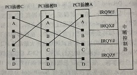
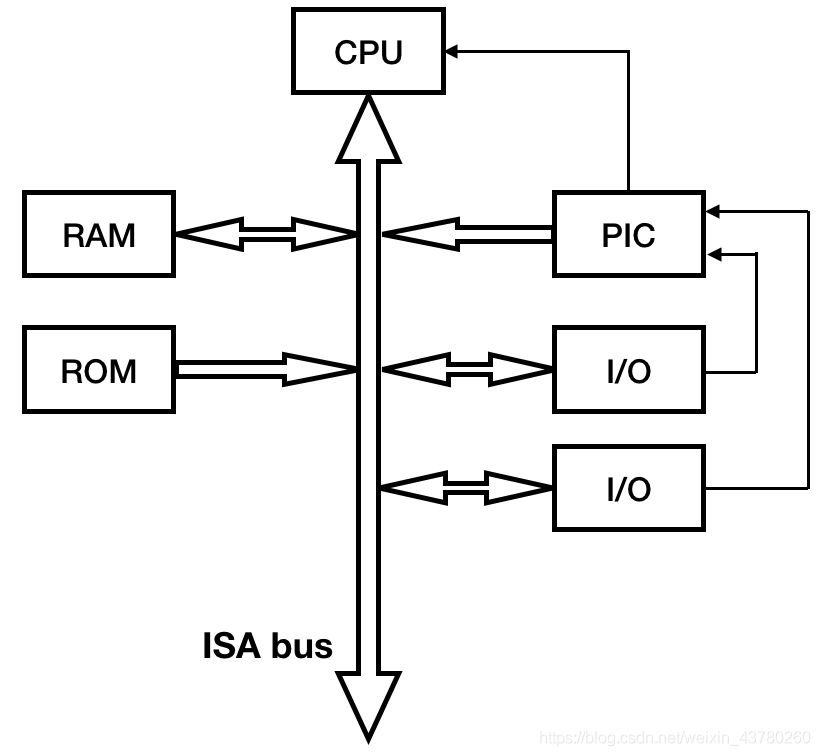
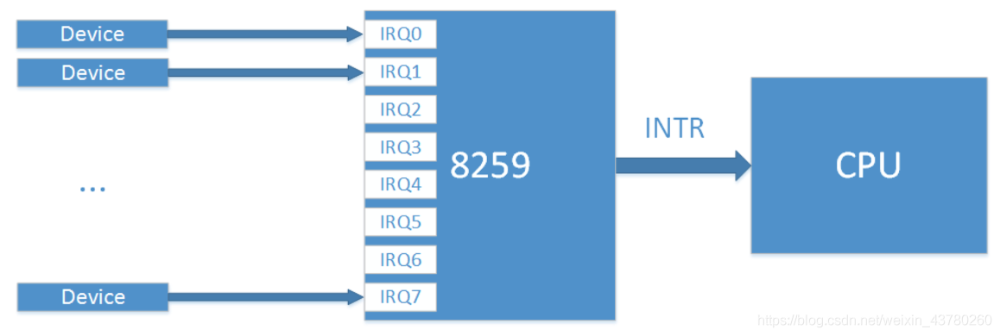
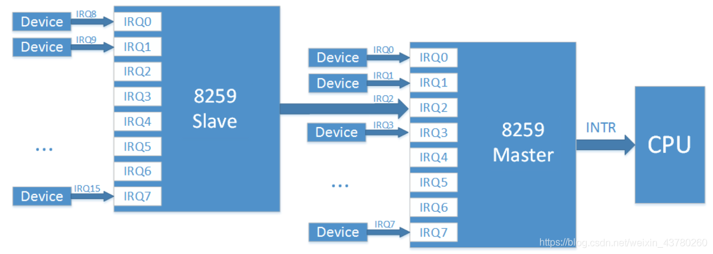
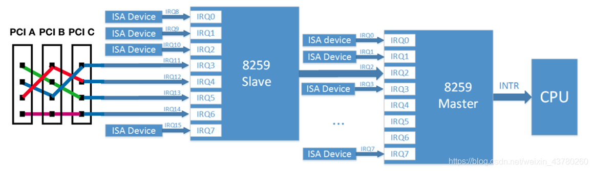
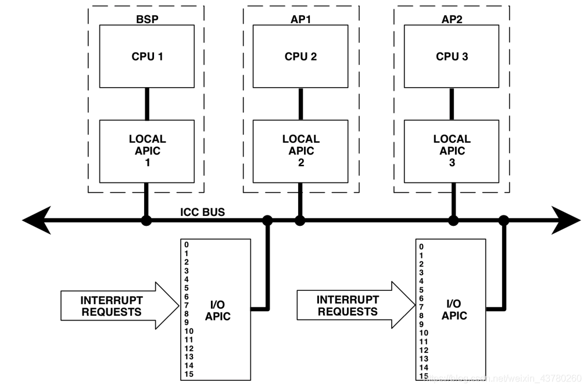
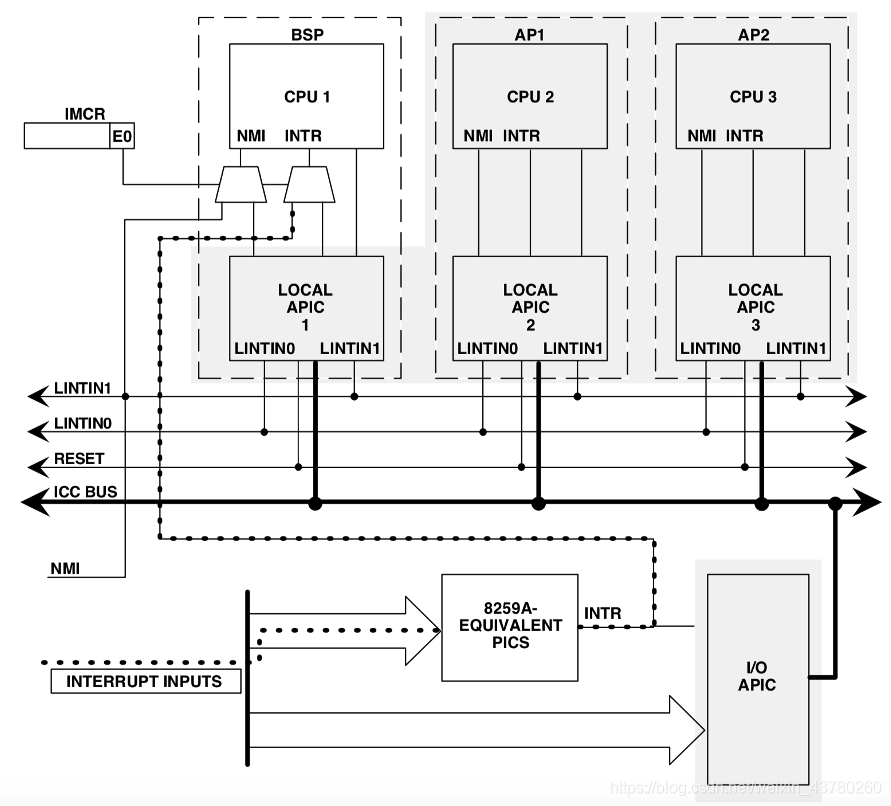
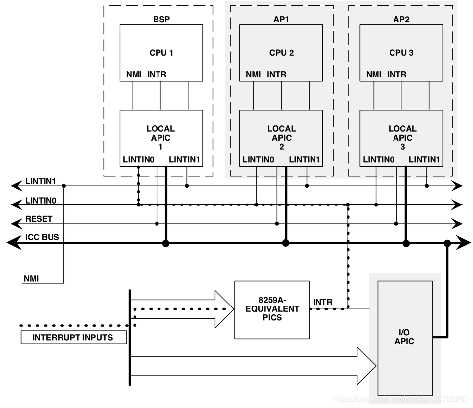
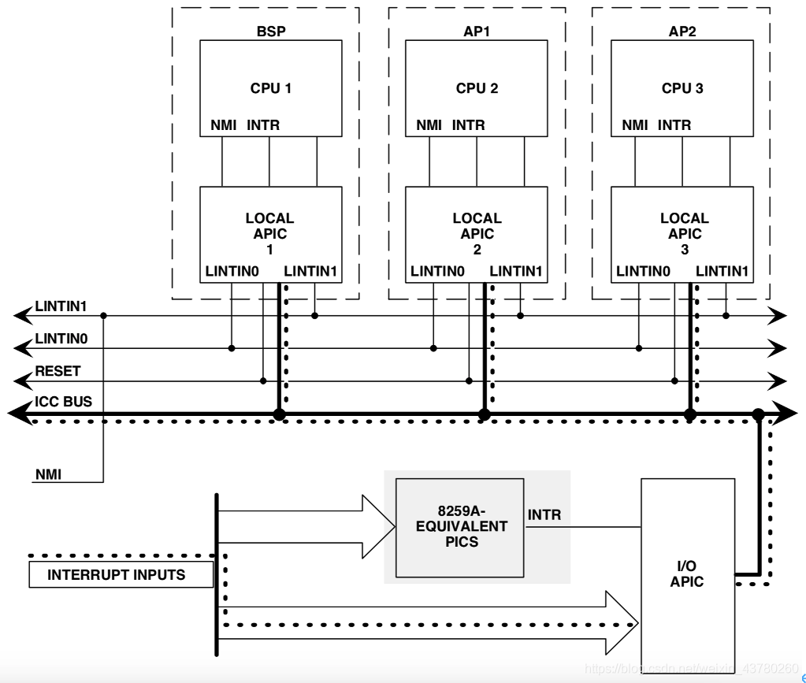

## 0. 目录
本文分两个章节来介绍，共四节：
真实PCI设备的中断
X86架构下的中断控制器框架
QEMU对X86中断控制器的模拟
QEMU对虚拟PCI设备的中断处理

## 1. 真实PCI设备的中断
PCI总线使用INTA#、INTB#、INTC#、INTD#信号向处理器发出中断请求。这些中断请求信号为低电平有效，并与处理器的中断控制器连接。假设一个处理器系统中，共有3个PCI插槽，这些PCI插槽中的中断引脚和中断控制器的IRQ_PINx引脚可以按照如下图连接。

为什么要用这样奇怪的方式连接呢？这是因为一般对于PCI设备来说，INTA#引脚的使用率最高，很少使用INTB#和INTC#，所以以这种方式连接，就能将各个PCI设备的中断信号相对均衡的发送给中断控制器。那PCI设备到底需要使用哪些中断引脚呢？答案是在设备的配置空间中，偏移为0x40处为Interrupt Pin的寄存器，如果值为1，则表示使用INTA#引脚，2为使用INTB#，3为INTC#，4为INTD#。

在PCI总线V2.2规范中提出了一种新的中断机制，即MSI中断机制。MSI中断机制采用存储器写总线事务向处理器系统提交中断请求，其实现机制是向HOST处理器特定的一个存储器地址写指定的数据。这个存储器地址一般是中断控制器规定的某段存储器地址范围，而且数据也是事先安排好的数据，通常含有中断向量号。HOST主桥会将MSI这个特殊的处理器写总线事务翻译为中断请求，提交给处理器。目前PCIe和PCI-X设备必须支持MSI中断机制，但是PCI设备并不一定支持MSI中断机制。

## 2. X86架构下的中断控制器框架
### 单核架构
在没有中断控制器以前，CPU需要定时轮询各个设备的状态寄存器来判断是否有需要处理来自设备的任务。中断控制器的引入是为了让CPU更高效运行，CPU可以在接收到终端控制器的请求时再去处理来自外部设备的中断事件。

提到PIC芯片，就不得不说8259中断控制器，8259有8个中断输入引脚(IRQ0-7)和一个输出信号，当连接在8个中断输入引脚中的任意设备产生中断后，8259芯片会判断该中断是否比当前CPU正在处理的中断优先级高，如果是则拉低INTR通知CPU，CPU则会通过ISA总线访问8259的寄存器来查找是哪一个IRQ发生了中断，进而做中断响应。

但是8个中断引脚有时还是不够用，所以8259芯片还支持级连模式，slave芯片的INTR和master芯片的IRQ2引脚相连。

那IRQ的连接方式基本上是固定的，如下：
Master PIC
IRQ 0 – system timer (cannot be changed)
IRQ 1 – keyboard controller (cannot be changed)
IRQ 2 – cascaded signals from IRQs 8–15 (any devices configured to use IRQ 2 will actually be using IRQ 9)
IRQ 3 – serial port controller for serial port 2 (shared with serial port 4, if present)
IRQ 4 – serial port controller for serial port 1 (shared with serial port 3, if present)
IRQ 5 – parallel port 2 and 3 or sound card
IRQ 6 – floppy disk controller
IRQ 7 – parallel port 1. It is used for printers or for any parallel port if a printer is not present. It can also be potentially be shared with a secondary sound card with careful management of the port.
Slave PIC
IRQ 8 – real-time clock (RTC)
IRQ 9 – Advanced Configuration and Power Interface (ACPI) system control interrupt on Intel chipsets.[2] Other chipset manufacturers might use another interrupt for this purpose, or make it available for the use of peripherals (any devices configured to use IRQ 2 will actually be using IRQ 9)
IRQ 10 – The Interrupt is left open for the use of peripherals (open interrupt/available, SCSI or NIC)
IRQ 11 – The Interrupt is left open for the use of peripherals (open interrupt/available, SCSI or NIC)
IRQ 12 – mouse on PS/2 connector
IRQ 13 – CPU co-processor or integrated floating point unit or inter-processor interrupt (use depends on OS)
IRQ 14 – primary ATA channel (ATA interface usually serves hard disk drives and CD drives)
IRQ 15 – secondary ATA channel
随着PCI总线的发明，新的问题也来了，PCI设备具备更多的中断引脚，而且PCI设备是可插拔的，同时系统中可以有多个PCI设备，那PCI设备的中断信号是如何连接到中断控制器呢？

答案如上图所示。

8259芯片有如下三个重要的寄存器。
IRR(Interrupt Request Register):共8位，对应IRQ0-IRQ7，某一位置1代表该中断还未提交给CPU。
ISR(In Service Register):共8位，某位置1代表该中断已经提交给CPU，但是CPU还未处理完。
IMR(Interrupt Mask Register):共8位，某位置1代表该中断被屏蔽。

8259芯片处理一次中断的过程如下：
2.1 当一个或多个中断引脚被拉高时，IRR对应的位置1.
2.2 如果此中断没有被屏蔽，8259向CPU发送INT信号。
2.3 当CPU接收到中断信号后，通过INTA引脚发送低电平脉冲信号通知8259芯片。
2.4 当8259芯片第一次收到来自CPU的INTA信号后，将最高优先级中断对应的位在ISR中置1，同时清零位于IRR中对应的位。
2.5 这时，CPU会第二次发送INTA信号给8259芯片，8259芯片收到信号后，将第四步计算得到的中断号通过数据总线发送给CPU。
2.6 如果8259芯片工作在AEOI模式，则ISR中对应的位自动清零。否则，该位一直保持位1，直到CPU处理完中断服务程序后，通过EOI命令来清零该位。

### 多核架构

随着多核架构的出现，原先的中断控制器只能将中断信号发送到一个CPU上，如果想让多个CPU可以同时处理外部的中断就需要一种新的中断架构，于是APIC(Advanced programmable interrupt controller)开始登场。

如上图所示，其中BSP代表Bootstrap processor，AP代表Application processor，从名字可以看出，在系统上电初始化过程中，只有BSP参与其中，等到合适的时机，操作系统会调用start_secondary函数来初始化剩下的AP。无论如何，我们可以看到每个CPU都和一个LOCAL APIC芯片相连，同时所有的中断都和I/O APIC相连，每个I/O APIC可以连接16个中断信号，I/O APIC和LOCAL APIC通过ICC(interrupt controller communication) BUS相连。后来Local APIC芯片被集成进CPU中。
使用APIC有如下三种中断模式：
+ PIC mode
跳过所有Local APIC和I/O APIC芯片，直接用原始的PIC模式将所有中断发送到BSP。在IMCR寄存器写入01h来将8259的INTR信号和CPU连接。下图中灰色部分模块未使用。

+ Virtual wire mode：
如下图所示，虽然使用了Local APIC，但是该芯片相当于一根虚拟的线路，只是将输入的LINTIN0信号连接到CPU的INTR引脚，并不会做什么实际工作。

+ Symetric I/O mode：
多数多核系统都工作在该模式下，在这种模式下，外部中断直接或间接（通过8259芯片）和I/O APIC相连，I/O APIC再通过ICC bus和Local APIC相连。

### 引用

PCI Express体系结构导读
https://sudonull.com/post/8076-Interrupts-from-external-devices-in-the-x86-system-Part-1-The-evolution-of-interrupt-controllers
https://sudonull.com/post/7711-Interrupts-from-external-devices-in-the-x86-system-Part-2-Linux-kernel-boot-options
————————————————
版权声明：本文为CSDN博主「francisco_flynn」的原创文章，遵循CC 4.0 BY-SA版权协议，转载请附上原文出处链接及本声明。
原文链接：https://blog.csdn.net/weixin_43780260/article/details/110792519
