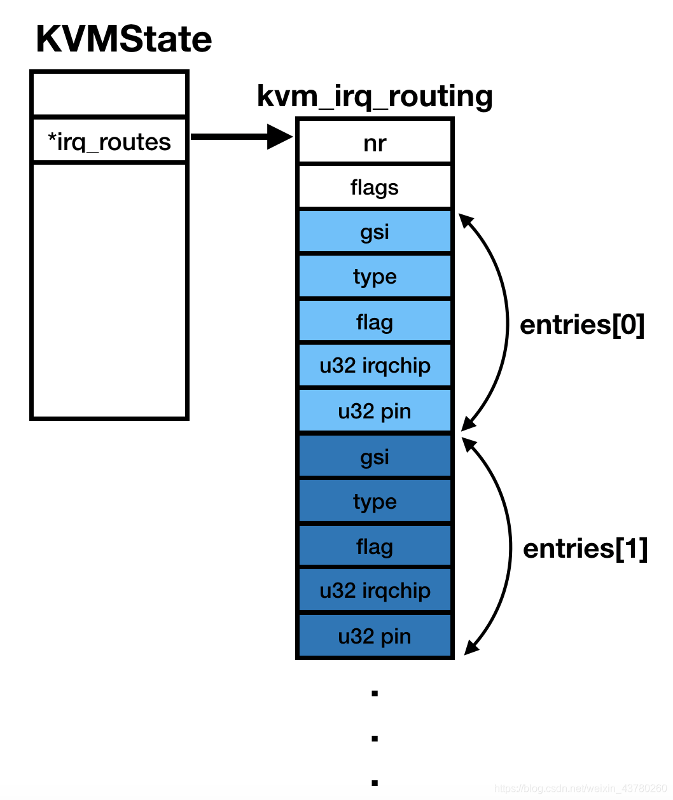
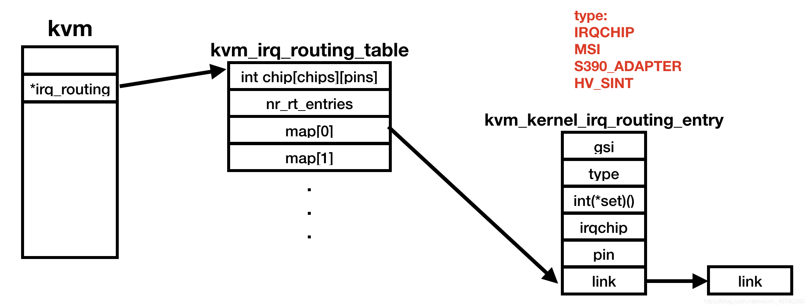
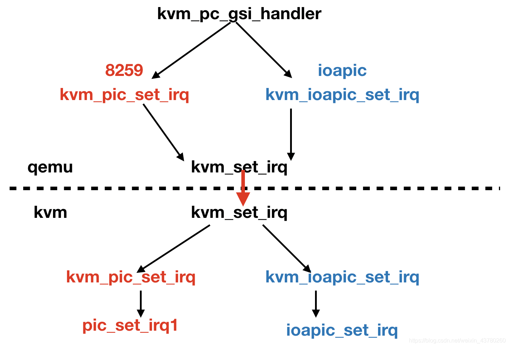
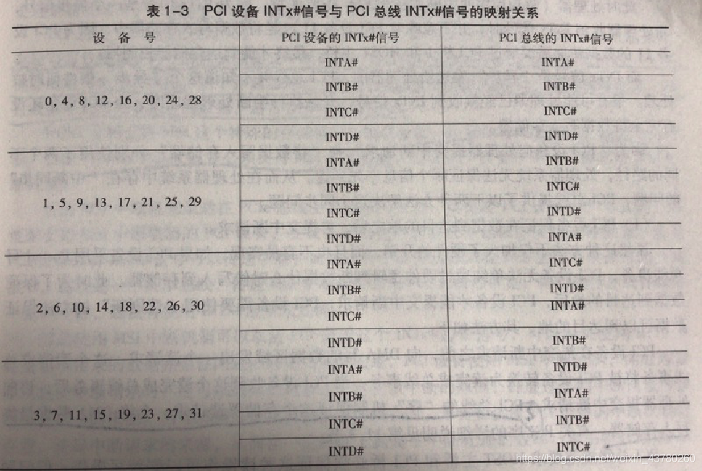

## 3. QEMU对X86中断控制器的模拟

我们从pc_init1中来分析QEMU虚拟中断控制器的过程。QEMU不仅可以在用户层模拟中断控制器，也可以在kernel中通过kvm来虚拟中断控制器，为方便起见，我们只分析在kvm中[虚拟化](https://so.csdn.net/so/search?q=虚拟化&spm=1001.2101.3001.7020)pic和apic芯片的流程。


### 中断路由表的创建

```c
hw/i386/pc_piix.c

struct GSIState
{
	qemu_irq i8259_irq[16];
	qemu_irq ioapic_irq[24]
}
static void pc_init1(...)
{
	struct GSIState * gsi_state;
	...
	gsi_state = g_malloc0(sizeof(*gsi_state));
	if (kvm_ioapic_in_kernel()) {
        kvm_pc_setup_irq_routing(pcmc->pci_enabled);
        pcms->gsi = qemu_allocate_irqs(kvm_pc_gsi_handler, gsi_state,
                                       GSI_NUM_PINS);
    } else {
        pcms->gsi = qemu_allocate_irqs(gsi_handler, gsi_state, GSI_NUM_PINS);
    }
	...

```

GSI代表（Global System Interrup）是ACPI引入的概念，它为每个中断定义了唯一的中断号。pcms->gsi保存了qemu创建的24个irq，对应的回调函数是kvm_pc_gsi_handler。

我们可以看到qemu使用比较简单的kvm_irq_routing结构体来管理中断控制器之间的连接联系。kvm_pc_setup_irq_routing函数则用来创建中断控制器各引脚之间的连接关系。kvm_irqchip_add_irq_route函数的第二参数代表irq号，也就是gsi；第二个参数是只控制器类型，可以是8259master、8259slave或ioapic；第三个参数就是这个中断控制器上的引脚。




我们看到这个函数创建了两个PIC芯片，一个是master，另一个是slave，并且master芯片的pin2没有创建路由关系。
同时创建了IOAPIC的路由信息。

```c
void kvm_pc_setup_irq_routing(bool pci_enabled)
{
    KVMState *s = kvm_state;
    int i;

    if (kvm_check_extension(s, KVM_CAP_IRQ_ROUTING)) {
        for (i = 0; i < 8; ++i) {
            if (i == 2) {
                continue;
            }   
            kvm_irqchip_add_irq_route(s, i, KVM_IRQCHIP_PIC_MASTER, i); 
        }   
        for (i = 8; i < 16; ++i) {
            kvm_irqchip_add_irq_route(s, i, KVM_IRQCHIP_PIC_SLAVE, i - 8); 
        }   
        if (pci_enabled) {
            for (i = 0; i < 24; ++i) {
                if (i == 0) {
                    kvm_irqchip_add_irq_route(s, i, KVM_IRQCHIP_IOAPIC, 2); 
                } else if (i != 2) {
                    kvm_irqchip_add_irq_route(s, i, KVM_IRQCHIP_IOAPIC, i); 
                }   
            }   
        }   
        kvm_irqchip_commit_routes(s);
    }   
}
```

最后qemu调用kvm_irqchip_commit_routes函数将新建立的中断路由表信息发送给kvm，kvm会创建稍微复杂一些的表来重新管理gsi、irqchip和pin之间的映射关系，kvm会用一个数组管理所有的irq_routing_entry，并将数组的首地址存在routing_table.nr_rt_entries中；map[n]是一个链表，表示gsi为n的中断对应的中断控制器的拓扑结构（中断是如果通过不同终端控制器到达cpu的），链表的节点就是nr_rt_entries数组中的表项。




每个kvm_kernel_irq_routing_entry结构体中包含了gsi，gsi所属中断的类型，set函数指针，irqchip编号及pin脚号。irqchip编号如下：

+ PIC_MASTER = 0
+ PIC_SLAVE = 1
+ IOAPIC = 2
  其中set函数指针代表当该中断引脚电平发生变化时，对应的中断控制器需要做的操作。对于PIC类型的中断来说，该函数是kvm_set_pic_irq，对于IOAPIC类型的中断来说，该函数是kvm_ioapic_set_irq。

```c
static int kvm_set_pic_irq(struct kvm_kernel_irq_routing_entry *e,
               struct kvm *kvm, int irq_source_id, int level,
               bool line_status)
{
    struct kvm_pic *pic = kvm->arch.vpic;
    return kvm_pic_set_irq(pic, e->irqchip.pin, irq_source_id, level);
}

static int kvm_set_ioapic_irq(struct kvm_kernel_irq_routing_entry *e,
                  struct kvm *kvm, int irq_source_id, int level,
                  bool line_status)
{
    struct kvm_ioapic *ioapic = kvm->arch.vioapic;
    return kvm_ioapic_set_irq(ioapic, e->irqchip.pin, irq_source_id, level,
                line_status);
}

```

### GSI的回调函数

```c
struct GSIState
{
	qemu_irq i8259_irq[16];
	qemu_irq ioapic_irq[24]
}

void kvm_pc_gsi_handler(void *opaque, int n, int level)
{
    GSIState *s = opaque;

    if (n < ISA_NUM_IRQS) {
        /* Kernel will forward to both PIC and IOAPIC */
        qemu_set_irq(s->i8259_irq[n], level);
    } else {
        qemu_set_irq(s->ioapic_irq[n], level);
    }   
}
```

qemu为每个gsi创建了一个kvm_pc_gsi_handler回调函数，该回调函数传入的参数是gsi_state，这个结构体中包含了真正的pic和ioapic的irq。它的作用是当对某个gsi调用qemu_set_irq时，该回调函数会被执行，它的调用路径如下：



kvm_pc_gsi_handler会根据gsi号来判断该gsi属于哪种中断控制器，如果gsi小于16则调用kvm_pic_set_irq，否则调用kvm_ioapic_set_irq，kvm中的kvm_set_irq会根据传入的gsi在中断路由表中查找该gsi的set回调函数并依次调用，pic_set_irq1和ioapic_set_irq会更新模拟的中断控制器中相关的寄存器值。我们来分析一下kvm_pic_set_irq是如何注入中断的。

```c
kvm_pic_set_irq
	->pic_set_irq1
	->pic_unlock
		->kvm_for_each_vcpu
			->if kvm_apic_accept_intr(vcpu)
				->kvm_make_request(KVM_REQ_EVENT, vcpu)
				->kvm_vcpu_kick(vcpu)
				->return
```

在pic_set_irq1中会更新PIC对应的IRR寄存器，接着在pic_unlock函数中，KVM会遍历所有vcpu，并使用kvm_apic_accept_intr来判断lapic芯片是否接受来自PIC的中断，判断方法是首先检查系统中是否有apic芯片，如果没有apic，则表明中断需要发送到lapic，该函数返回1，接着判断系统lapic中的lvt0寄存器没有设置mask位，同时apic的delivery mode是APIC_MODE_EXTINT，这表明处理器需要响应来自PIC的中断，该函数返回1，否则返回0. 当返回值是1时，会接着执行kvm_make_request(KVM_REQ_EVENT, vcpu)，这代表向该vcpu发送了一个request event，并调用kvm_vcpu_kick来让该vcpu及时处理这个request event，当有一个vcpu处理了这个中断，则这个函数就可以返回了。

我们来分析一下ioapic_set_irq是如何将中断注入到vcpu中的。

```c
ioapic_set_irq
	->ioapic_service
		->kvm_irq_delievery_to_apic
			->kvm_apic_set_irq
				->__apic_accept_irq
					->kvm_lapic_set_irr
					->kvm_make_request
					->kvm_vcpu_kick
```

首先在ioapic_set_irq中，会设置ioapic的IRR寄存器，然后调用ioapic_service填充发送到lapic的结构体，接着调用kvm_irq_delievery_to_apic向lapic提交中断请求。

如上分析，不管是经过PIC中断控制器还是IOAPIC，基本的套路就是设置该中断控制器的IRR等相关寄存器，然后向合适的vgpu发送request event，然后kick该vgpu，调用了kvm_vcpu_kick之后，虚拟机会尽快的从guest mode退出到host mode。

那kvm是在何时将中断注入到vcpu中呢，结果如下：
```c
vcpu_enter_guest
	->if(kvm_check_request(KVM_REQ_EVENT)
		->inject_pending_event
			->kvm_x86_ops->set_irq
			-->vmx_inject_irq
				->vmcs_write32(VM_ENTRY_INTR_INFO_FIELD, intr)
```

在重新进入guest mode之前，kvm会判断是否有request event，如果有则调用inject_pending_event，在该函数中会判断是否有可注入的中断，以及中断是否被mask，最后调用vmx_inject_irq来设置vmcs中的VM_ENTRY_INTR_INFO_FIELD，这样当cpu调用VM entry时就会向guest mode的cpu产生一个中断。
### PIC和ISA总线中断的模拟

```c
hw/i386/pc_piix.c

static void pc_init1(...)
{
	struct GSIState * gsi_state;
	...
	gsi_state = g_malloc0(sizeof(*gsi_state));
	if (kvm_ioapic_in_kernel()) {
        kvm_pc_setup_irq_routing(pcmc->pci_enabled);
        pcms->gsi = qemu_allocate_irqs(kvm_pc_gsi_handler, gsi_state,
                                       GSI_NUM_PINS);
    } else {
        pcms->gsi = qemu_allocate_irqs(gsi_handler, gsi_state, GSI_NUM_PINS);
    }
	if (pcmc->pci_enabled) {
        pci_bus = i440fx_init(..., &isa_bus, pcms->gsi, ...);
        pcms->bus = pci_bus;
	}
	
	isa_bus_irqs(isa_bus, pcms->gsi);
	...
    i8259 = kvm_i8259_init(isa_bus);
	...
    for (i = 0; i < ISA_NUM_IRQS; i++) {
        gsi_state->i8259_irq[i] = i8259[i];
    }
    g_free(i8259);
    if (pcmc->pci_enabled) {
        ioapic_init_gsi(gsi_state, "i440fx");
    }
```

在pc_init1中调用i440fx_init创建北桥芯片,i440芯片详细的初始化流程可见[[回顾PCI 设备与总线\]](https://blog.csdn.net/weixin_43780260/article/details/104410063)，我们只关心和中断相关的设置，如下

```c
PCIBus *i440fx_init(..., &isa_bus, pcms->gsi, ...)
{
...
    PCIDevice *pci_dev = pci_create_simple_multifunction(b, -1, true, TYPE_PIIX3_DEVICE);
    piix3 = PIIX3_PCI_DEVICE(pci_dev);
    pci_bus_irqs(b, piix3_set_irq, pci_slot_get_pirq, piix3, PIIX_NUM_PIRQS);
    pci_bus_set_route_irq_fn(b, piix3_route_intx_pin_to_irq);

    piix3->pic = pic;
    *isa_bus = ISA_BUS(qdev_get_child_bus(DEVICE(piix3), "isa.0"));
...
}
```

其中变量b是PCI root bus，在根总线上创建了一个PIIX3设备，并且调用pci_bus_irq设置根总线的set_irq回调函数为piix3_set_irq，该函数用来处理PCI root bus上的irq请求，它会根据piix3设备PCI配置空间的0x60(PIRQRC), 0x61, 0x62, 0x63四个寄存器出查出INTA/B/C/D 4个中断引脚对应的中断号，最终调用qemu_set_irq。map_irq回调函数为pci_slot_get_pirq，该函数用来将PCI设备的中断号根据设备ID映射到PCI总线上。映射关系如下表：



经过这样的设置，pci总线上的中断信号就由南桥芯片PIIX3来处理。而PIIX3中的中断信号其实就是pcms->gsi。最后创建了一个挂接在南桥芯片PIIX3上的isa总线。

接着调用isa_bus_irqs(isa_bus, pcms->gsi)将isa总线上的中断信号和pcms->gsi连接。
在上面的分析中，pci总线和isa总线的中断信号都和pcms->gsi连接，但是这个pcms->gsi并不是真正的中断控制器，它仅仅是一个抽象的包含了PIC和IOAPIC的中断控制器，其真实的中断控制器由kvm_i8259_init和ioapic_init_gsi创建，并在其中创建真正的qemu_irq，最后填充在gsi_state中，这样gsi的中断回调函数就会根据该中断所属的中断控制器（中断号小于16的属于PIC）来调用真正的中断控制器的irq回调函数。

```c
qemu_irq *kvm_i8259_init(ISABus *bus)                                                                                                                       
{
    i8259_init_chip(TYPE_KVM_I8259, bus, true);
    i8259_init_chip(TYPE_KVM_I8259, bus, false);

    return qemu_allocate_irqs(kvm_pic_set_irq, NULL, ISA_NUM_IRQS);
}

void ioapic_init_gsi(GSIState *gsi_state, const char *parent_name)
{
    DeviceState *dev;
    SysBusDevice *d;
    unsigned int i;

    dev = qdev_create(NULL, TYPE_KVM_IOAPIC);
  ...
    qdev_init_nofail(dev);
    d = SYS_BUS_DEVICE(dev);
    sysbus_mmio_map(d, 0, IO_APIC_DEFAULT_ADDRESS);

    for (i = 0; i < IOAPIC_NUM_PINS; i++) {
        gsi_state->ioapic_irq[i] = qdev_get_gpio_in(dev, i);
    }
}
```

## 4. QEMU对虚拟PCI设备的中断处理

在介绍了PCI设备的中断机制，分析了x86架构下的中断控制器和中断控制器的模拟逻辑后，我们终于可以来分析虚拟PCI设备的中断处理过程。
以serial-pci设备为例，该设备的初始化如下：

```c
static void serial_pci_realize(PCIDevice *dev, Error **errp)
{
	//...
    pci->dev.config[PCI_CLASS_PROG] = pci->prog_if;
    pci->dev.config[PCI_INTERRUPT_PIN] = 0x01;
    s->irq = pci_allocate_irq(&pci->dev);                                                                                                                   
	//...
}
```

设置pci设备配置空间中的PCI_INTERRUPT_PIN为0x01代表该设备使用INTA#中断引脚，同时使用pci_allocate_irq，为该设备分配了一个中断引脚，该引脚的作用是当该模拟设备需要向VCPU发送中断时，就可以调用qemu_irq_raise(s->irq)来向该引脚连接的中断控制器发送一个高电平信号。那这个irq又和PCI_INTERRUPT_PIN有什么关系呢？
```c
static inline int pci_intx(PCIDevice *pci_dev)
{   
    return pci_get_byte(pci_dev->config + PCI_INTERRUPT_PIN) - 1;
}

qemu_irq pci_allocate_irq(PCIDevice *pci_dev)                                                                                                               
{        
    int intx = pci_intx(pci_dev);         
    return qemu_allocate_irq(pci_irq_handler, pci_dev, intx);
}
```

在pci_allocate_irq中，根据pci设备配置空间中的PCI_INTERRUPT_PIN，来初始化这个qemu_irq的中断号，INTA#对应0. 当需要通过该中断引脚向中断控制器发送中断信号信号时，pci_irq_handler就会被调用，在此函数中更新该PCI设备的对应状态寄存器后，判断如果该设备的中断没有被disable，则调用pci_change_irq_level，这个函数会根据PCI的设备号和中断号进行如图4所示的中断映射，在得到最终的中断号后，调用bus->set_irq，也就是piix3_set_irq，piix3_set_irq会设置对应的PIIX3设备的寄存器，然后查找出该PCI中断引脚（INTA/INTB/INTC/INTD）对应的GSI号，接着调用kvm_pc_gsi_handler，而kvm_pc_gsi_handler会由上文分析的那样来注入中断。
```c
static void pci_irq_handler(void *opaque, int irq_num, int level)                                                                                           
{
    change = level - pci_irq_state(pci_dev, irq_num);
    if (!change)
        return;

    pci_set_irq_state(pci_dev, irq_num, level);
    pci_update_irq_status(pci_dev);
    if (pci_irq_disabled(pci_dev))
        return;
    pci_change_irq_level(pci_dev, irq_num, change);
}

static void pci_change_irq_level(PCIDevice *pci_dev, int irq_num, int change)
{
    PCIBus *bus;
    for (;;) {
        bus = pci_get_bus(pci_dev);
        irq_num = bus->map_irq(pci_dev, irq_num);
        if (bus->set_irq)
            break;
        pci_dev = bus->parent_dev;
    }
    bus->irq_count[irq_num] += change;
    bus->set_irq(bus->irq_opaque, irq_num, bus->irq_count[irq_num] != 0);
}
```

本文详细分析了qemu对中断控制器在kvm中的模拟机制，以及PCI设备的中断工作流程。

## 引用

https://wiki.osdev.org/APIC
