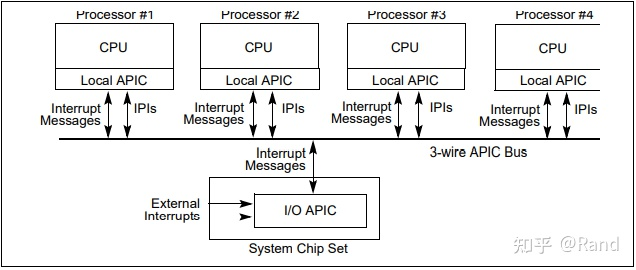
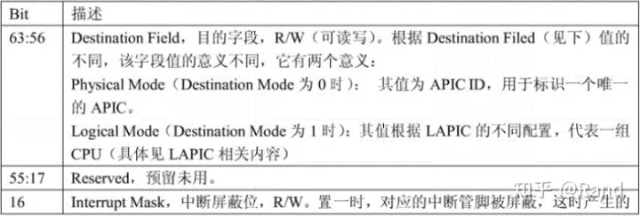
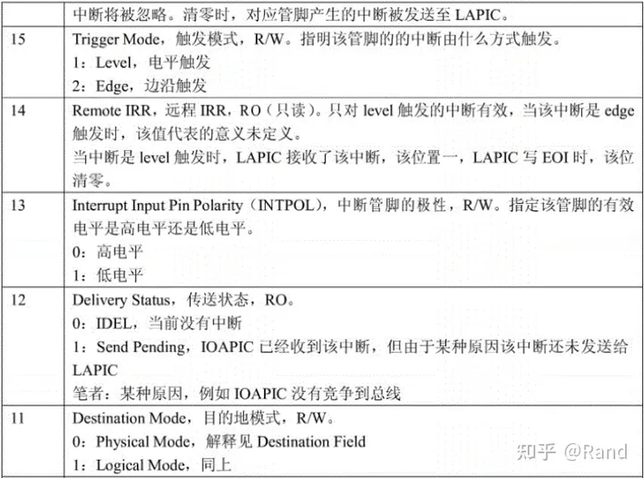
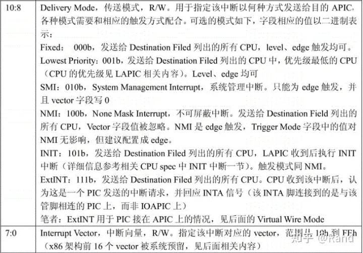
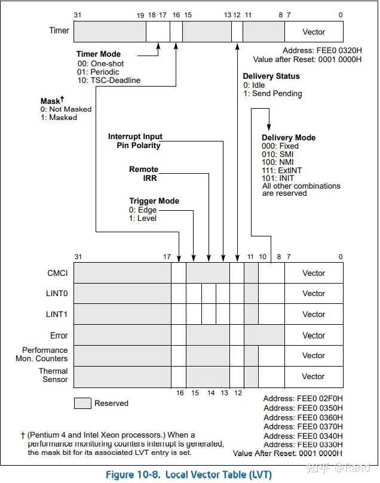
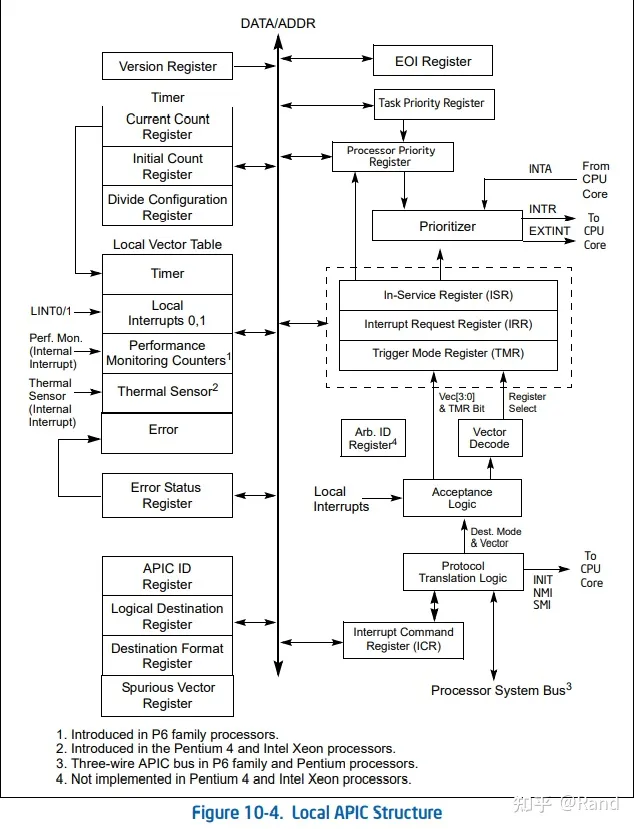
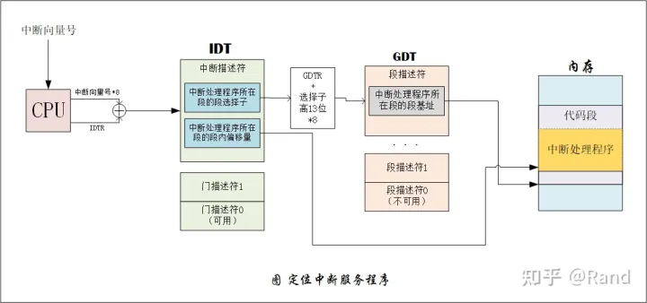

作者：Rand
链接：https://zhuanlan.zhihu.com/p/393195942
来源：知乎
著作权归作者所有。商业转载请联系作者获得授权，非商业转载请注明出处。

中断是硬件和软件交互的一种机制，可以说整个操作系统，整个架构都是由中断来驱动的。**一个中断的起末会经历设备，中断控制器，CPU 三个阶段：设备产生中断信号，中断控制器翻译信号，CPU 来实际处理信号**。

中断控制器前面的文章曾讲过一些 PIC，PIC 只用于单处理器，对于如今的多核多处理器时代，PIC 无能为力，所以出现了更高级的中断控制器 APIC，**APIC 分成两部分 LAPIC 和 IOAPIC，前者 LAPIC 位于 CPU 内部，每个 CPU 都有一个 LAPIC，后者 IOAPIC 与外设相连**。外设发出的中断信号经过 IOAPIC 处理之后发送某个或多个 LAPIC，再由 LAPIC 决定是否交由 CPU 进行实际的中断处理。p6 家族处理器的 APIC 总体的示意图如下：

可以看出每个 CPU 上有一个 LAPIC，IOAPIC 是一系统芯片组，各个中断消息通过总线发送接收。关于 APIC 的内容很多也很复杂，详细描述的可以参考 intel 手册，本文不探讨其中的细节，只在上层较为抽象的层面讲述，理清 APIC 模式下中断的过程。

## **IOAPIC**

**IOAPIC 主要负责接收外部的硬件中断，将硬件产生的中断信号翻译成具有一定格式的消息，然后通过总线将消息发送给一个或者多个 LAPIC**。IOAPIC 主要组成如下：

- 24 个中断管脚，一个 IOAPIC 支持 24 个中断
- 一张 24 项的中断重定向表(PRT,Programmable Redirection Table)，每个表项都是一个 64 位的寄存器
- 一些可编程寄存器，例如窗口寄存器，版本寄存器等等
- 通过 APIC 总线发送和接收 APIC 信息的一个信息单元

### **重定向表项 RTE(Redirection Table Entry)**

了解 IOAPIC 的工作，最重要的就是了解重定向表项/寄存器，每个管脚都对应着一个 64 位的重定向表项，来具体看看这 64 位代表的具体信息：

这个表项/寄存器包含了该中断的所有属性信息，以什么方式触发中断，传送的方式状态，管脚极性等等，这张图来自 interrupt in linux ，对各个字段的说明应该很清楚了就不再赘述，说几点：

- destination field 和 destination mode 字段决定了该中断发送给哪个或哪些 LAPIC
   
- **vector，中断控制器很重要的一项工作就是将中断信号翻译成中断向量，这个中断向量就是 IDT 的索引，IDT 里面的中断描述符就存放着中断处理程序的地址**。**在 PIC 中，起始vector=起始vector+IRQvector = 起始vector+IRQvector = 起始vector+IRQ，而在 APIC 模式下，IRQ 对应的 vecotr 由操作系统对 IOAPIC 初始化的时候设置分配**。
- **IOAPIC 的管脚没有优先级之分**，不像 PIC 的 IRQ0 的优先级比 IRQ1 的优先级要高，而 IOAPIC 对中断优先级的区分在于管脚对应的重定向表项的 vector 字段。
   

由上，**对 IOAPIC 的工作总结：当 IOAPIC 的管脚接收到外设发来的中断信号后，根据相应的重定向表项格式化出一条中断消息，然后发送给 destination field 字段列出的 LAPIC**。

## **LAPIC**

LAPIC 要比 IOAPIC 复杂的多，其主要功能是接收中断消息然后交由 CPU 处理，再者就是自身也能作为中断源产生中断发送给自身或其他 CPU。所以其实 LAPIC 能够收到三个来源的中断：

- 本地中断：时钟，温度监测等
- 外部中断：IOAPIC 发来的
- IPI：处理器间中断，其他 LAPIC 发来的

inel 手册里面做了更精细复杂的分类，私以为了解这三大类就行了。了解 LAPIC 从它的一些重要寄存器入手，通过这些寄存器的作用来了解 LAPIC 如何工作的：

### **主要寄存器**

### **IRR(Interrupt Request Register)**

中断请求寄存器，256 位，每位代表着一个中断。**当某个中断消息发来时，如果该中断没有被屏蔽，则将 IRR 对应的 bit 置 1，表示收到了该中断请求但 CPU 还未处理**。

### **ISR(In Service Register)**

服务中寄存器，256 位，每位代表着一个中断。**当 IRR 中某个中断请求发送个 CPU 时，ISR 对应的 bit 上便置 1，表示 CPU 正在处理该中断**。

### **EOI(End of Interrupt)**

中断结束寄存器，32 位，**写 EOI 表示中断处理完成**。写 EOI 寄存器会导致 LAPIC 清理 ISR 的对应 bit，对于 level 触发的中断，还会向所有的 IOAPIC 发送 EOI 消息，通告中断处理已经完成。

### **ID**

**用来唯一标识一个 LAPIC，LAPIC 与 CPU 一一对应，所以也用 LAPIC ID 来标识 CPU**。

### **TPR(Task Priority Register)**

任务优先级寄存器，确定当前 CPU 能够处理什么优先级别的中断，**CPU 只处理比 TPR 中级别更高的中断。比它低的中断暂时屏蔽掉，也就是在 IRR 中继续等待**。

另外 优先级别优先级别=vector/16优先级别=vector/16优先级别=vector/16，vector 为每个中断对应的中断向量号。                                    加读锁计算的库马拉松的看法速度是   Helloween

### **PPR(Processor Priority Register)**

处理器优先级寄存器，表示当前正处理的中断的优先级，以此来决定处于 IRR 中的中断是否发送给 CPU。**处于 IRR 中的中断只有优先级高于处理器优先级才会被发送给处理器**。PPR 的值为 ISR 中正服务的最高优先级中断和 TPR 两者之间选取优先级较大的，所以 TPR 就是靠间接控制 PPR 来实现暂时屏蔽比 TPR 优先级小的中断的。

### **SVR(Spurious Interrupt Vector Register)**

可以通过设置这个寄存器来使 APIC 工作，原话 To enable the APIC。

### **ICR(Interrupt Command Register)**

中断指令寄存器，当一个 CPU 想把中断发送给另一个 CPU 时，就在 ICR 中填写相应的中断向量和目标 LAPIC 标识，然后通过总线向目标 LAPIC 发送消息。ICR 寄存器的字段和 IOAPIC 重定向表项较为相似，都有 destination field, delivery mode, destination mode, level 等等。

下面为有关本地中断的一些寄存器

### **本地中断**

LAPIC 本身还能作为中断源产生中断，LVT(Local Vector Table) 就是自身作为中断源的一个配置表，总共 7 项(不同架构下可能不同)，每项 32 位，同 IOAPIC，每一项也是一个寄存器，如下所示：

其中时钟中断，中断源为 APIC 的时钟。

温度探测中断，中断源为 探测 CPU 温度的小探头，用来监测处理器温度，查了查 intel 手册，有两个 Monitor，作用分别如下，英文翻译不准，直接放原文了：

TM1 controls the processor’s temperature by  modulating the duty cycle of the processor clock.

TM2 controls the core  temperature of the processor by reducing the operating frequency and voltage of the processor and offers a higher  performance level for a given level of power reduction than TM1.

其他几个中断有兴趣的可以查阅 intel 64 and IA-32 那个开发手册，卷3 10.5。

### **LAPIC总结**

对上面 LAPIC 的寄存有一定了解后，对 LAPIC 的工作应该也有一定了解了，对于从 IOAPIC 发来的中断消息，首先判断自己是否接收这个消息，这要根据重定向表项中的 destination field，destination mode 来判断：

**destination mode 为 0 时表示物理模式，destination field 字段表示一个 APIC ID，LAPIC 根据 ID 寄存器比对判断是否由自己来接收**。

destination mode 为 1 时表示逻辑模式，LAPIC 需要另外两个寄存器 LDR 和 DFR 来辅助判断，具体判断方式很复杂，逻辑模式分为 flat 和 cluster，cluster 又分为 flat cluster 和 hierachical cluster，了解就好，感兴趣的参考 interrupt in linux 1.2.3，有着很详细的讲解，这里不赘述。

判断不该自己接收就忽略，否则 IRR，ISR，TPR，PPR，EOI 等寄存器配合使用来决定发送中断到 CPU 进行处理，此外如果中断类型为 NMI 等特殊中断是直接发送给 CPU 进行处理，不需要上述步骤。

要实现处理器间中断，一个处理器想把中断发送给另一个处理器时，就在 ICR 中填写相应的中断向量和目标 LAPIC 标识，然后通过总线向目标 LAPIC 发送消息。而 LAPIC 有着自己的时钟，用来计数产生时钟中断，还有温度探测，来控制 CPU 的温度。

最后来看一张 intel 手册中给出的 LAPIC 结构图，对其各个部分直接的协同工作有个认识，如下所示：

### **APIC 中断过程**

有了上述的了解，来看中断在 APIC 阶段的过程：

1. IOAPIC 根据 PRT 表将中断信号翻译成中断消息，然后发送给 destination field 字段列出的 LAPIC
2. LAPIC 根据消息中的 destination mode，destination field，自身的寄存器 ID，LDR，DFR 来判断自己是否接收该中断消息，不是则忽略
3. 如果该中断是 SMI/NMI/INIT/ExtINT/SIPI，直接送 CPU 执行，因为这些中断都是负责特殊的系统管理任务。否则的话将 IRR 相应的位置 1。
4. 如果该中断的优先级高于当前 CPU 正在执行的中断，而且当前 CPU 没有屏蔽中断的话，则中断当前正处理的中断，先处理该高优先级中断，否则等待
5. 准备处理下一个中断时，从 IRR 中挑选优先级最大的中断，相应位置 0，ISR 相应位置 1，然后送 CPU 执行。
6. 中断处理完成后写 EOI 表示中断处理已经完成，写 EOI 导致 ISR 相应位置 0，对于 level 触发的中断，还会向所有的 I/O APIC 发送 EOI 消息，通知中断处理已经完成。

### **访问 APIC**

**IOAPIC 有两个寄存器映射到内存**：IOREGSEL，地址为 FEC0 xy00h；IOWIN，地址为 FEC0 xy10h。IOREGSEL 用来指定要读写的寄存器，然后从 IOWIN 中读写。

LAPIC 的寄存器有很多，比如 IRR，ISR 等等，也是采用**内存映射**到地址 0xFEE00xxx。

因此访问和配置 APIC 直接可以对相应的内存进行读写即可。**而所谓内存映射，就是把这些寄存器看作内存的一部分，读写内存，就是读写寄存器，可以用访问内存的指令比如 mov 来访问寄存器**。**还有一种是 IO端口映射，这种映射方式是将外设的寄存器(也叫端口)看成一个独立的地址空间，访问这片空间不能用访问内存的指令，而需要专门的 in/out 指令来访问**。

不论是内存映射还是端口映射，所能映射的范围其实很小，比如 x86 的 IO 空间只有 64KB，但实际上外设的寄存器有很多，不可能全部映射，所以基本上由很多外设硬件都采取这种方式来访问所有的寄存器：通过一个寄存器来选择该硬件的其他寄存器，然后通过另一个寄存器来实际读写选择的寄存器。就像将硬件封装出一个窗口，干什么事情向这个窗口交代，实际的事情则由硬件内部自行处理。

而有关 APIC 配置初始化方面就是利用上述所说的访问方式对 IOAPIC 和 LAPIC 进行配置，设置相关的一些寄存器值。光是设置好这两项还没完，因为 APIC 适用多核的处理器，对于处理器也要进行相应的配置才能与多核处理器协同工作。

这两方面的配置都有相应文档参考，前者是 intel 的开发手册，后面为 MP spec，有兴趣的可以看看。关于这方面的系统源码 linux 的确是比较复杂，可以先参考参考 xv6，xv6 也是一个关于多核的操作系统，里面有对 APIC，MP 的配置初始化操作，可以先看看这个捋清思路，这里就不叙述了。

## **CPU 阶段**

中断的 CPU 阶段，也可以说是软件操作系统工作的部分，大致分为两个部分，定为中断处理程序和运行中断处理程序两个部分。前文有说过，这里再简要地再说一下：

1. 根据 vector 去 IDT 中索引相应地中断描述符
2. 判断特权级是否发生变化，如果中断发生在用户态需要切换到内核态
3. 若发生特权级变化，需要保存用户态地 SS，ESP 到内核栈，否则不需要保存，然后再保存 eflags，cs，ip 到内核栈中，如果有错误码，还要将错误码压进栈中
4. 根据中断描述符中的段选择子再去 GDT 中索引相应的段描述符得到段基址，与中断描述符里的段偏移量结合起来找到中断处理的入口
5. CPU 执行中断处理程序
6. 执行完后 iret 返回，就是出栈和恢复上下文的一些列过程。

这是以前发过的定为中断服务程序的一张图：

关于 CPU 阶段的配置，最为主要的就是配置好 IDT 表，IDT 可以看作是一个个按照中断向量号大小排好序的中断描述符组成的一张表，所以配置初始化 IDT，主要就是设置好一个个中断描述符。而中断描述符由相应的中断处理程序所在的段选择子，段偏移量和相关属性组成，设置中断描述符就是将这些信息按照中断描述符的格式组合起来。配置好 IDT 表之后还要将 IDT 的地址界限加载到 IDTR 寄存器里面，这样中断的时候 CPU 才知道要去哪儿寻找 IDT。

## **总结**

如果不讨论 APIC 和操作系统部分的细节，使用中断控制器 APIC 的中断过程应该还是很清楚的，从外设的中断信号到 IOAPIC 封装成有格式的中断消息，发送给相应 LAPIC，LAPIC 再由一系列决策机制发给 CPU 来处理。至于 CPU 的处理又大致分为两个过程，定位和运行中断处理程序。

但是要论其中的细节的话，整个 APIC 的机制实在是太复杂了，这方面的中文资料很少，有个大牛写了篇 interrupt in linux，对中断机制感兴趣的话强烈推荐看一下。我看了几遍，深有体会，大致理清了中断的过程，APIC 如何工作，但其中的某些地方还是很模糊，还是得去看 intel 的开发手册去了解原委。原名叫 Intel® 64 and IA-32 Architectures Software Developer’s Manual，卷3 第十章详细的讲述了 APIC，很多很详细，英文的，我这个英语渣，啃起来起来实在费力。这几天下来 APIC 的知识没学到好多，英语能力倒是感觉又变强了。而且在一些领域，英文的资料的却也是要详细些准确些。

另外本身也不是从事这方面工作研究的，钻研过深也无多大意义，了解到这个程度自认为可以了，有用到时比如需要系统编程，比如操作系统最初对中断 APIC 的初始化配置，到时能翻手册查阅就行。

但又回到那个点上，各个详细资料大多都是英文的，所以本文总结下来：一定要学好英语！！！

本文就到这里了，有什么错误还请批评指正，也欢迎大家来同我交流讨论共同进步。