## 8237概况

+ Intel 8237是一种功能很强的可编程DMA控制器, 广泛应用于微型计算机系统中.
+ 采用5MHz时钟时,其传输速率可达1.6M字节/秒.
+ 一片8237内部有四个独立的DMA通道,每个通道一次DMA传送的最大长度可达64K字节.
+ 每个通道的DMA请求都可以分别允许和禁止;不同通道的DMA请求有不同的优先级,优先级可以是固定的,也可以是循环的(可编程设定).
+ 四个通道可以分时地为四个外部设备实现DMA传送,也可以同时使用其中的通道0和通道1实现存储器到存储器的直接传送,还可以用多片8237进行级联,从而构成更多的DMA通道.

## 8237的结构

+ DMA控制器8237的结构框图及在系统中的有关逻辑如图13.1所示.
+ 图中只画了一个通道的具体情况,其他通道与此相同.

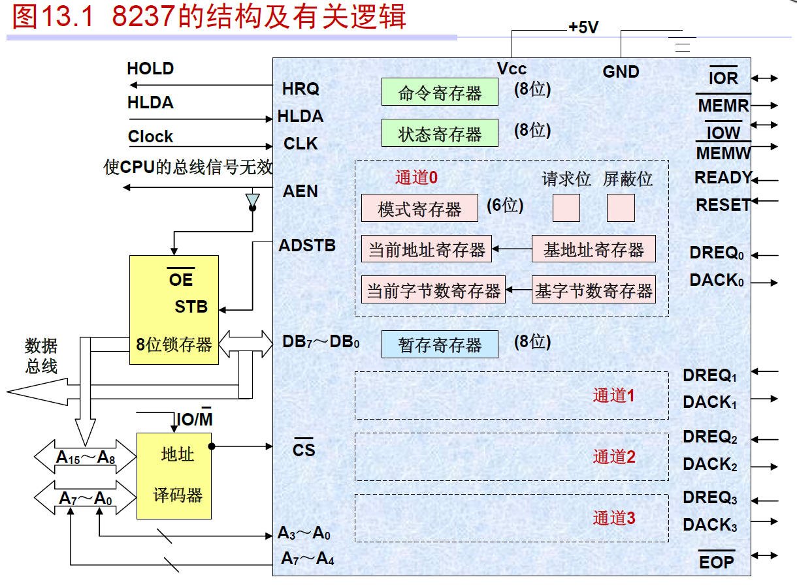

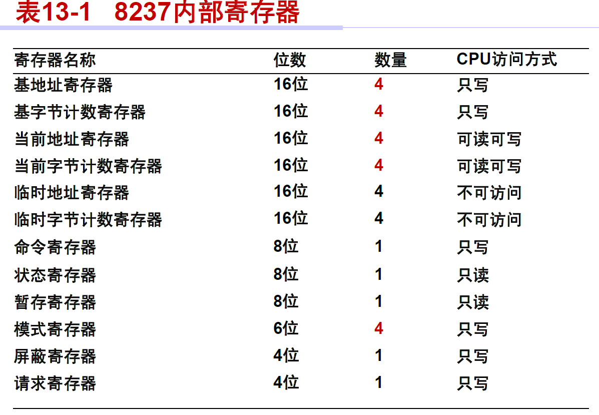

## 8237的引脚

8237芯片采用40个引脚双列直插封装,其引脚配置(pin configuration)如下图所示.

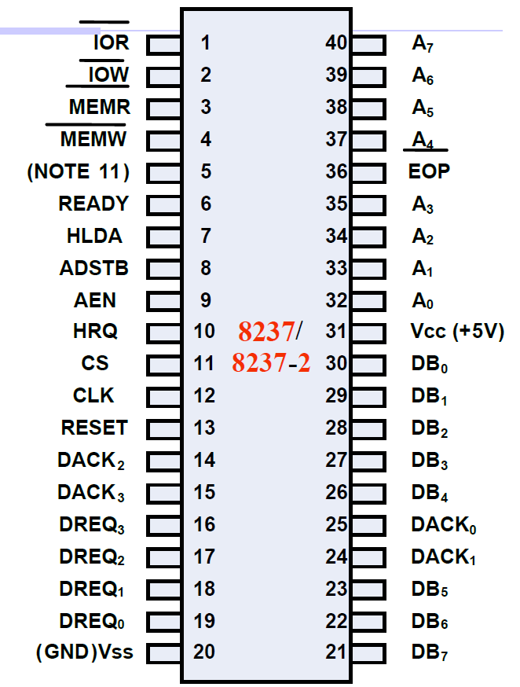

## 8237的工作模式

+ 8237具有四种工作方式:
  (1) 单字节传送方式(single transfer mode)
  (2) 块传送方式(block transfer mode)
  (3)请求传送方式(demand transfer mode)
  (4) 级联方式(cascade mode)

+ 在级联方式下,将多个8237级联起来,以扩展DMA通道数.后一级的HRQ和HLDA信号连到前一级的DREQ和DACK上,如图13.3所示.

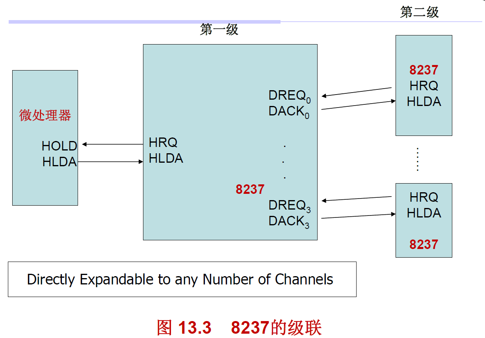

+ 另外,在前三种工作方式下,DMA传送有三种类型,它们是:读传送,写传送和校验传送.
+ DMA读传送是指把数据由存储器传送至I/O接口(可简记为M→I/O),操作时先由MEMR有效从存储器读出数据放在数据总线上,然后再由IOW有效把数据写入I/O接口;
+ DMA写传送是指把数据由I/O接口传送至存储器,操作时先由IOR有效从I/O接口读出数据放在数据总线上,然后再由MEMW有效把数据写入存储器.
+ 校验传送也被称为假传送(pseudo transfers).在校验传送时,8237虽然也像读传送或写传送一样地产生地址以及响应EOP信号等,但存储器和I/O接口的读,写控制信号均处于无效状态,所以实际上并不进行真正的数据传送.
+ 这种传送类型一般是用于对DMAC器件测试时使用.

## 8237的寄存器

(1) 当前地址寄存器
(2) 当前字节计数寄存器
(3) 基地址和基字节计数寄存器
基寄存器的内容不能被CPU读出,而当前寄存器的内容可以被CPU读出.
(4) 模式寄存器
模式字的格式如图13.4所示.

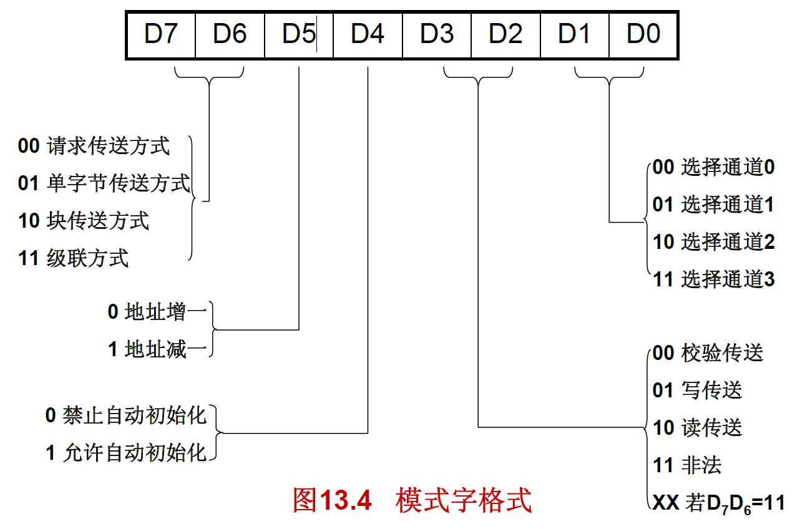

(5) 命令寄存器
+ 命令寄存器是四个通道公用的一个8位寄存器,用以控制整个8237的操作.
+ 一片8237只有一个命令寄存器,其内容对四个通道都有效.
+ 编程时,由CPU对它写入命令字,命令字的格式如图13.5所示.

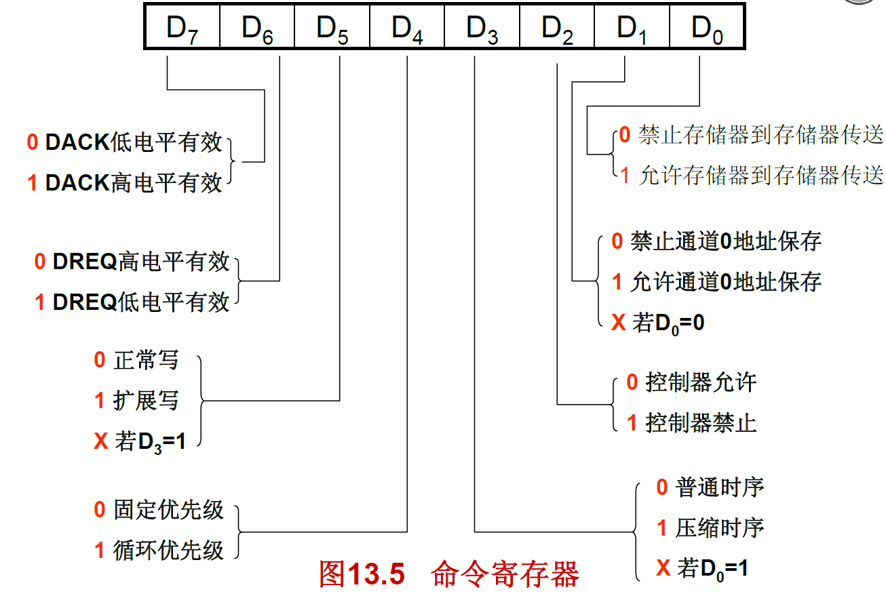

1) D0位用来规定是否工作在存储器到存储器的传送方式.
+ 当8237工作在这种传送方式时,要使用通道0和通道1两个DMA通:
 通道0的地址寄存器编程为源区地址;
  通道1的地址寄存器编程为目的区地址;
  通道1的字节计数寄存器编程为传送的字节数.

+ 由于此传送过程没有外部设备参与,因此不需一个外部引入的DREQ信号来启动.
+ 传送是由设置通道0的软件DMA请求来启动的.
+ 每传送一个字节要用8个时钟周期,其中前4个时钟周期以通道0的当前地址寄存器内容为源地址读出数据送入暂存寄存器,后4个时钟周期以通道1的当前地址寄存器内容为目的地址把暂存寄存器中的数据写入目的区.
+ 每传送一个字节,源地址和目的地址都要修改(增1或减1),字节数减1.直至通道1的字节计数结束,产生EOP有效信号,才停止DMA传送.

2) D1位用来设定在存储器到存储器传送的整个过程中,通道0中的源地址是否保持不变.
+ 若D1＝1,则通道0中的源地址保持不变,DMA传送的结果是将源区的同一个数据字节写入到整个目的区中;若D1＝0,则表示通道0中的源地址可以修改.
+ 若D0＝0,则不允许存储器到存储器的传送,此时D1位无意义.

3) D2位是用于允许(Enable)或禁止(Disable)8237工作的控制位.

4) D3,D5位是与时序有关的控制位,详见后面的时序说明.

5) D4位用来设定通道优先权结构.
+ 当D4＝0时,为固定优先权,通道0的优先权最高,其他通道的优先权随通道号的增大而递减,通道3的优先权最低;
+ 当D4=1时,为循环优先权,即在每次DMA服务之后,各个通道的优先权都发生变化,刚刚服务过的通道其优先权变为最低,它后面通道的优先权变为最高.如表13-2所示.

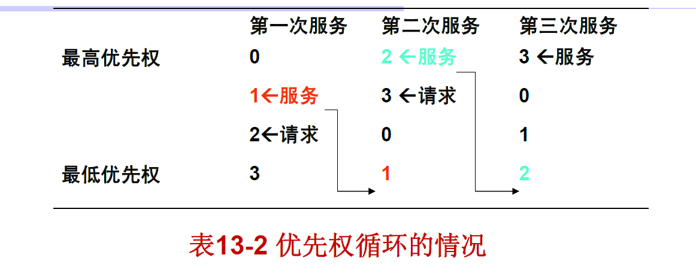

+ 需注意的是,DMA的优先权排序只是用来决定同时请求DMA服务的通道的响应次序,而任何一个通道一旦进入DMA服务,其他通道都不能打断它的服务,这一点和中断服务的情况是不同的.

6) D6,D7位用于设定DREQ和DACK的有效电平极性.

(6) 请求寄存器
+ 8237的每个通道除了可以响应硬件的DMA请求信号(DREQ)外,当其工作在块传送方式时也可以响应由软件发出的DMA请求.
+ 软件的DMA请求是通过使相应通道的"请求位"(request　bit)置位来实现的,它等效于外部产生一个有效的DREQ信号.
+ 8237每一个通道有一位"请求位",四个通道的请求位构成一个4位的请求寄存器.
+ 对请求寄存器的命令字(请求命令字)格式如图13.6所示.

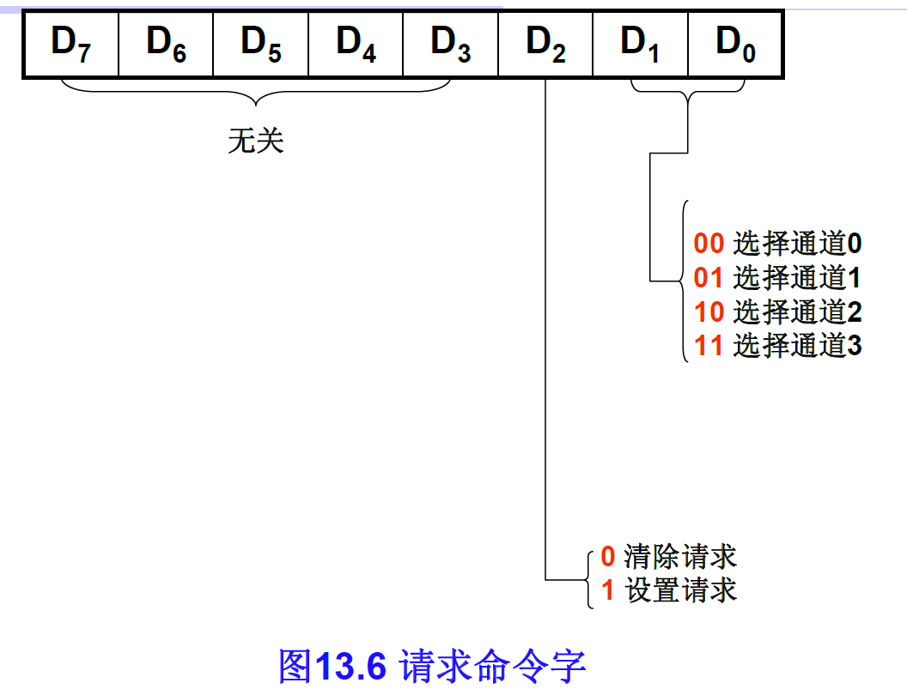

+ 一个通道的DMA传输结束后,其请求位被清除.复位操作将使整个请求寄存器清除.
+ 只有在块传送方式时,才允许使用软件请求,若用于存储器到存储器的传送,则必须用对通道0的软件请求来启动传送过程.

(7) 屏蔽寄存器
+ 8237每个通道有一位"屏蔽位"(mask bit ),当其通道的"屏蔽位"置1时,则外部对应的DREQ信号被屏蔽,不予响应,从而禁止了该通道的DMA操作.
+ 四个通道的"屏蔽位"构成一个4位的屏蔽寄存器.
+ 有两种屏蔽寄存器的命令字格式:
+ 一种是单独对某一个通道的屏蔽位进行置位或复位,如图13.7(a)所示;
+ 另一种是可以同时设定四个通道的屏蔽位,也称综合屏蔽命令字,如图13.7(b)所示.

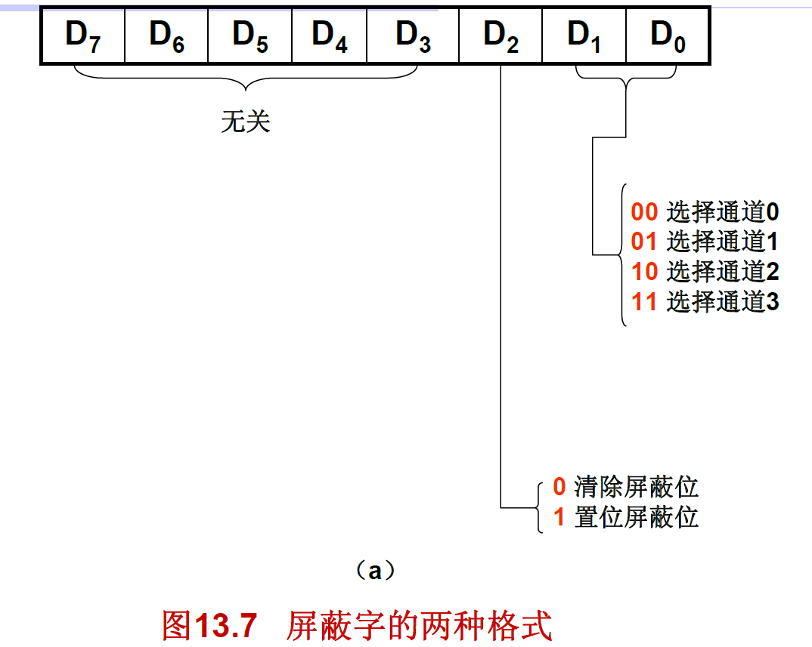

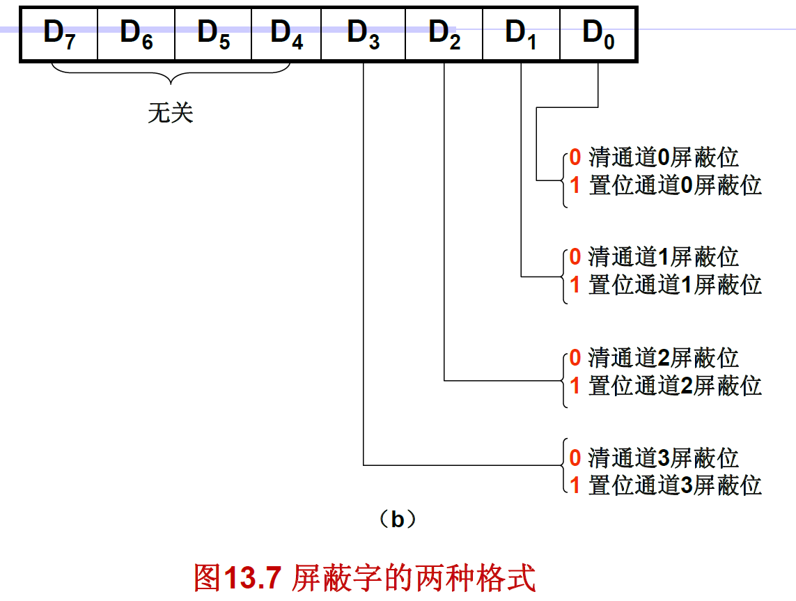

(8) 状态寄存器
+ 8237有一个可由CPU读取的状态寄存器,如图13.8所示.
+ CPU通过读取状态寄存器的内容可以了解DMA进行的情况.

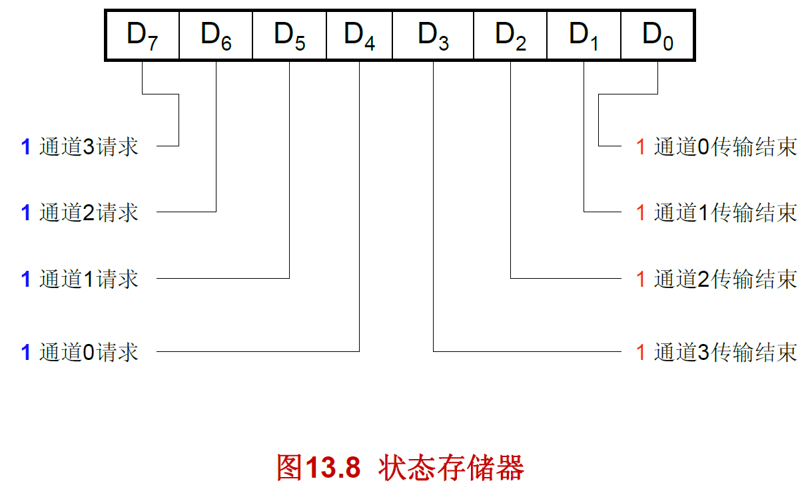

## 特殊软件命令
+ CPU向8237输出的软件命令可分为两种不同类型,一类是不仅与写入的端口地址有关(不同的软件命令必须写入到不同的端口之中),也与写入软件命令时数据总线上的位模式(bit pattern)有关,即写入指定端口的软件命令应有特定的数据格式.
+ 如前面介绍的模式字,命令字,屏蔽字等就属这种类型.

+ 8237还有另一类软件命令(特殊的软件命令),它们只与写入的端口地址有关,而与写入软件命令时数据总线上的位模式无关( They do not depend on any specific bit pattern on the data bus),即这些命令是8237直接对地址(A3～A0)和CS,IOW信号的译码产生的,并不使用数据总线.
  •也就是说,在输出特殊软件命令时,只要往指定端口实施写入操作即可,而无须通过数据总线输出特定格式的控制字.

8237有两种特殊软件命令:
(1) 清除高/低触位器(Clear First/Last Flip　Flop)命令
+ 8237内部有一个高/低触发器,用以控制读/写16位寄存器的低字节和高字节.若该触发器为"0",则读/写低字节;为"1",则读/写高字节.
+ 每次复位后,此触发器被清零.每当对16位寄存器进行一次读/写操作,则此触发器改变一次状态.
+ 用户可以用此软件命令使高/低触发器强制清零,以保证对16位寄存器的读/写是从低字节开始.

(2) 主清除命令(Master Clear)
+ 该软件命令与硬件的Reset信号作用相同,即它使命令,模式,状态,请求,暂存器以及内部的高/低触发器清零,而使屏蔽寄存器置为全"1".
+ 执行主清除命令后,使8237进入空闲周期,以便对其编程.

## 8237的页面寄存器
+ 由于8237只能输出16位地址,所以在其控制下进行的DMA传送的最大寻址空间为216.
+ 对于更大的DMA传送地址空间,则必须设法提供除此16位地址以外的高位地址.
+ 例如在IBM　PC/XT微机系统中,内存地址为20位(A19～A0),所以高4位地址(A19～A16)不能由8237提供.

+ 为此,系统中专门为每个DMA通道增设了一个4位I/O端口,在数据块传送之前可单独对其编程,用以提供高4位地址.
+ 这4位I/O端口也称DMA页面寄存器.
+ IBM PC/XT的页面寄存器是由一个寄存器堆(74LS670)构成,内含4个4位寄存器,可用来存放4个DMA通道的高4位地址A19～A16.
+ 它与8237送出的16位地址一起形成20位地址A19～A0, 用这20位地址信息即可寻址全部1MB存储单元.
+ IBM PC/XT中分配的页面寄存器的端口地址为:
+ 通道1——83H;通道2——81H;通道3——82H.
+ 由于在该系统中8237的通道0是用于对动态RAM刷新操作,而动态RAM刷新时不需要使用页面寄存器,因而也就不需要分配通道0的页面寄存器端口地址.