文章来自[内存寻址原理 – 绿盟科技技术博客 (nsfocus.net)](http://blog.nsfocus.net/memory-addressing-mode/)

**内存寻址原理**

在做网络安全事件分析的时候，都会遇到内存寻址的知识。如果这个坎儿迈不过去，你就会迷失在代码中，更无从分析了。今天绿盟科技的安全技术专家就讲讲这个内存寻址的原理，文章分为上下两篇《内存寻址原理》及《内存寻址方式》。

随着信息化发展和数据处理能力需求的提高，对计算机硬件产品的性能和容量也提出了新的挑战，要求计算机处理能力也要能随实际情况需求的变动而提升、改变。

当下，一台普通的电脑硬盘容量也要200多G，内存也有4G；如此大容量的硬盘和内存，在处理大量数据或是大型游戏面前还是显得力不从心，需要通过扩容来满足需求，比如将内存由4G提升到8G或是16G不等。扩容后对个人体验确实提升不少。对于内存容量的提升需要有相应的硬件基础支撑，需要有能消化掉这么多内存的寻址地址。比如说如果一8位单片机如果要装载16G的内存，那就是暴殄天物。

**哪里有需求哪里就有市场** ；计算机从8位的51单片机，20位8086寻址，发展到32位 win2003，64位win10，都是由于信息化需求的膨胀推动着计算机一代又一代的改革创新。

对于内存的扩容，很多人都不是很清楚应用程序如何使用的物理内存地址。远了不说，单说现在常用计算机中的32位、64系统；系统是怎么样将虚拟地址转化成线性地址，线性地址又是怎样转换成物理地址的，其中又用到了哪些寄存器或是数据结构，相信很多人对此也是一知半解；也像我一样，想结合实例从地址转换的本质来掌握其精髓之处。接下来就一起学习从逻辑地址到物理地址的整个转换过程。

## 1．实模式与保护模式简介

CPU常见三种工作模式：实模式与保护模式，虚拟8086模式。

**实模式** ：CPU复位（reset）或加电（power on）的时候以实模式启动，处理器以实模式工作。在实模式下，内存寻址方式和8086相同，由16位段寄存器的内容乘以16（10H）当做段基地址，加上16位偏移地址形成20位的物理地址，最大寻址空间1MB。在实模式下，所有的段都是可以读、写和可执行的。实模式下没有分段或是分页机制，逻辑地址和物理地址相等。

由此得知：

1. 在实模式下最大寻址空间时1M，1M以上的内存空间在实模式下不会被使用。
2. 在实模式所有的内存数据都可以被访问。不存在用户态、内核态之分。
3. 在BIOS加载、MBR、ntdlr启动阶段都处在实模式下。

**保护模式** ：对于保护模式大家并不陌生；是目前操作系统的运行模式，利用内存管理机制来实现线性地址到物理地址的转换，具有完善的任务保护机制。

保护模式常识：

1. 现在应用程序运行的模式均处于保护模式。
2. 横向保护，又叫任务间保护，多任务操作系统中，一个任务不能破坏另一个任务的代码，这是通过内存分页以及不同任务的内存页映射到不同物理内存上来实现的。
3. 纵向保护，又叫任务内保护，系统代码与应用程序代码虽处于同一地址空间，但系统代码具有高优先级，应用程序代码处于低优先级，规定只能高优先级代码访问低优先级代码，这样杜绝用户代码破坏系统代码。

**虚拟8086 模式：** 简称V86模式是运行在保护模式中的实模式，为了在32位保护模式下执行纯16位程序。可以把8086程序当做保护模式的一项任务来执行。虚拟8086允许在不退出保护模式的情况下执行8086程序。

虚拟8086常识：

1. 寻址的地址空间是1M字节.
2. 可以在虚拟8086模式下运行16位DOS程序。
3. 在V86模式下，代码段总是可写的；这与实模式相同，同理，数据段也是可执行的。
4. 32系统编写V86模式的程序：

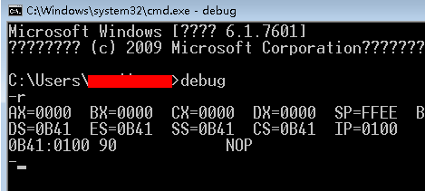

## 2. 保护模式寻址基础知识

接下来就以32位系统为例，介绍保护模式下，内存中一些地址转换相关的寄存机和数据结构。

## 2.1 内存地址概念

**逻辑地址** ：在进行C语言编程中，能读取变量地址值(&操作)，实际上这个值就是逻辑地址，也可以是通过malloc或是new调用返回的地址。该地址是相对于当前进程数据段的地址，不和绝对物理地址相干。只有在Intel实模式下，逻辑地址才和物理地址相等（因为实模式没有分段或分页机制,CPU不进行自动地址转换）。应用程序员仅需和逻辑地址打交道，而分段和分页机制对一般程序员来说是完全透明的，仅由系统编程人员涉及。应用程序员虽然自己能直接操作内存，那也只能在操作系统给你分配的内存段操作。一个逻辑地址，是由一个段标识符加上一个指定段内相对地址的偏移量，表示为 [段标识符：段内偏移量]。

**线性地址** ：是逻辑地址到物理地址变换之间的中间层。程序代码会产生逻辑地址，或说是段中的偏移地址，加上相应段的基地址就生成了一个线性地址。如果启用了分页机制，那么线性地址能再经变换以产生一个物理地址。若没有启用分页机制，那么线性地址直接就是物理地址。Intel 80386的线性地址空间容量为4G（2的32次方即32根地址总线寻址）。

**物理地址（Physical Address）** 是指出目前CPU外部地址总线上的寻址物理内存的地址信号，是地址变换的最终结果地址。如果启用了分页机制，那么线性地址会使用页目录和页表中的项变换成物理地址。如果没有启用分页机制，那么线性地址就直接成为物理地址了，比如在实模式下。

## 2.2 虚拟地址，线性地址，物理地址关系

对于保护模式下地址之间的转换，对程序员来说是透明的。那么物理内存通过内存管理机制是如何将虚拟地址转换为物理地址的呢？当程序中的指令访问某一个逻辑地址时，CPU首先会根据段寄存器的内容将虚拟地址转化为线性地址。如果CPU发现包含该线性地址的内存页不在物理内存中就会产生缺页异常，该异常的处理程序通过是操作系统的内存管理器例程。内存管理器得到异常报告后会根据异常的状态信息。特别是CR2寄存器中包含的线性地址，将需要的内存页加载到物理内存中。然后异常处理程序返回使处理器重新执行导致页错误异常的指令，这时所需要的内存页已经在物理内存中，所以便不会再导致页错误异常。

## 2.3 段式机制及实例分析

前面说到在线性地址转换为物理地址之前，要先由逻辑地址转换为线性地址。系统采用段式管理机制来实现逻辑地址到线性地址的转换。保护模式下，通过”段选择符+段内偏移”寻址最终的线性地址。

CPU的段机制提供一种手段可以将系统的内存空间划分为一个个较小的受保护的区域，每个区域为一个段。相对32位系统，也就是把4G的逻辑地址空间换分成不同的段。每个段都有自己的起始地址（基地址），边界和访问权限等属性。实现段机制的一个重要数据结构就是段描述符。

下面是个程序实例中显示除了各个段的值：

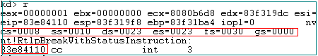

图中给出了代码段CS,堆栈段SS，数据段DS等段寄存器的值；从得到的值可知，SS=DS=ES是相等的，至于为什么有些段的值相等，后面会说到。 **以实例中给出的地址0x83e84110 为例，哪里是段描述符，哪里是段内偏移, 又是如何将该逻辑地址转换为线性地址的呢？相信很多人都迫不及待的想知道整个转换过程，接下来就要看看逻辑地址到线性地址详细转换过程。**

上面说到段式管理模式下有段选择符+段内偏移寻址定位线性地址，其实际转换过程如下图所示

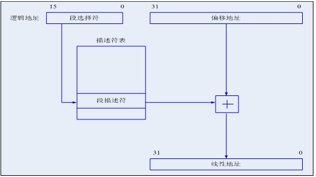

从图中可知，逻辑地址到线性地址的转换，先是通过段选择符从描述符表中找到段描述符，把段描述符和偏移地址相加得到线性地址。也就是说要想得到段描述符需要三个条件：

1. 得到段选择符。
2. 得到段描述符表
3. 从段描述符表中找到段描述符的索引定位段描述符。

**前面我们提到了段描述符 + 偏移地址，并没有提段选择符和段描述符表。所以我们要弄清楚这几个观念段选择符，段描述符表，段描述符，以及如何才能得到这几个描述符？**

### 2.3.1 段描述符基础知识

从上图可知，通过段选择符要通过段描述符表找到段描述符，那么段描述符表是什么，又是怎么得到段描述符表呢？

在保护模式下，每个内存段就是一个段描述符。其结构如下图所示：

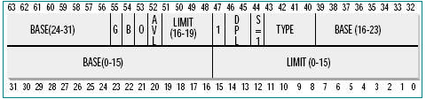

图中看出，一个段描述符是一个8字节长的数据结构，用来描述一个段的位置、大小、访问控制和状态等信息。段描述符最基本内容是段基址和边界。段基址以4字节表示（图中可看出3,4,5,8字节）。4字节刚好表示4G线性地址的任意地址（0x00000000-0xffffffff）。段边界20位表示（1,2字节及7字节的低四位）。

### 2.3.2 段描述符表实例解析

在现在多任务系统中，通常会同时存在多个任务，每个任务会有多个段，每个段需要一个段描述符，段描述符在上面一小节已经介绍，因此系统中会有很多段描述符。为了便于管理，需要将描述符保存于段描述符表中，也就是上图画出的段描述符表。IA-32处理器有3中描述符表：GDT,LDT和IDT。

GDT是全局描述符表。一个系统通常只有一个GDT表。GDT表也即是上图中的段描述符表，供系统中所以程序和任务使用。至于LDT和IDT今天不是重点。

那么如何找到GDT表的存放位置呢？系统中提供了GDTR寄存器用了表示GDT表的位置和边界，也就是系统是通过GDTR寄存器找到GDT表的；在32位模式下，其长度是48位，高32位是基地址，低16位是边界；在IA-32e模式下，长度是80位，高64位基地址，低16位边界。

位于GDT表中的第一个表项（0号）的描述符保留不用，成为空描述符。如何查看系统的GDT表位置呢？通过查看GDTR寄存器，如下图所示

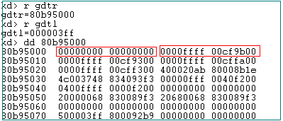

从上图看出GDT表位置地址是0x8095000,gdtl值看出GDT边界1023，总长度1024字节。前面知道每一项段描述符占8字节。所以总共128个表项。图中第一表项是空描述符。

### 2.3.3 段选择符结构

前面我们介绍了段描述符表和段描述符的格式结构。那么如何通过段选择符找到段描述符呢，段选择符又是什么呢？

段选择符又叫段选择子，是用来在段描述符表中定位需要的段描述符。段选择子格式如下：

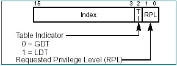

段选择子占有16位两个字节，其中高13位是段描述在段描述表中的索引。低3位是一些其他的属性，这里不多介绍。使用13位地址，意味着最多可以索引8k=8192个描述符。但是我们知道了上节GDT最多128个表项。

在保护模式下所有的段寄存器（CS,DS,ES,FS,GS）中存放的都是段选择子。

### 2.3.4 逻辑地址到线性地址转换实例解析

已经了解了逻辑地址到虚拟地址到线性地址的转换流程，那就看看在前面图中逻辑地址0x83e84110对应的线性地址是多少？

首先，地址0x83e84110对应的是代码段的一个逻辑地址，地址偏移已经知道，也就是段内偏移知道，通过寄存器EIP得到是0x83e34110。段选择符是CS寄存器CS=0008，其高13位对应的GDT表的索引是1，也就是第二项段描述符（第一项是空描述符）。GDT表的第二项为标红的8个字节

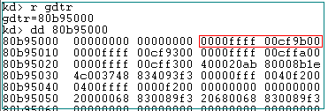

通过段描述的3,4，5，8个字节得到段基址。

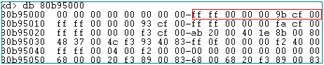

如上图所示第二项段描述符的3,4,5,8字节对应的值为0x00000000。由此我们得到了段机制和段内偏移。最后的线性地址为段基址+段内偏移=0x0+0x83e34110=0x83e34110。

**由此我们知道在32系统中逻辑地址就是线性地址。**

其实通过观察其他的段选择子会发现，所有段选择子对应的基地址都是0x0，这是因为在32系统保护模式下，使用了平坦内存模型，所用的基地址和边界值都一样。既然基地址都是0,那么也就是线性地址就等于段内偏移=逻辑地址。

总之：

1. 段描述符8字节
2. GDTR是48位
3. 段选择子2个字节。

## 2.4 页式机制及实例分析

前面介绍了由逻辑地址到线性地址的转换过程，那么接下来就要说说地址是如何将线性地址转为物理地址。需要先了解一些相关的数据结构。

前面说到如果CPU发现包含该线性地址的内存页不在物理内存中就会产生缺页异常，该异常的处理程序通过是操作系统的内存管理器例程。内存管理器得到异常报告后会根据异常的状态信息。特别是CR2寄存器中包含的线性地址，将需要的内存页加载到物理内存中。然后异常处理处理返回使处理器重新执行导致页错误异常的指令，这时所需要的内存页已经在物理内存中，所以便不会再导致也错误异常。

32位系统中通过页式管理机制实现线性地址到物理地址的转换，如下图：

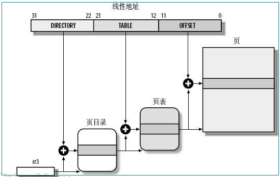

### 2.4.1 PDE结构及如何查找内存页目录

从上图中我们知道通过寄存器CR3可以找到页目录表。那么CR3又是什么呢？在32系统中CR3存放的页目录的起始地址。CR3寄存器又称为页目录基址寄存器。32位系统中不同应用程序中4G线性地址对物理地址的映射不同，每个应用程序中CR3寄存器也不同。也就是说每个应用程序中页目录基址也是不同的。

从上图知道页目录表用来存放页目录表项（PDE），页目录占一个4kb内存页，每个PDE长度为4字节，所以页目录最多包含1KB。没启用PAE时，有两种PDE，这里我们只讨论使用常见的指向4KB页表的PDE。

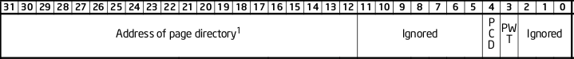

页目录表项的高20位表示该PDE所指向的起始物理地址的高20位，该起始地址的低12位为0，也就是通过PDE高20位找到页表。由于页表低12位0，所以页表一定是4KB边界对齐。 **也就是通过页目录表中的页目录表项来定位使用哪个页表（每一个应用程序有很多页表）。**

以启动的calc程序为例，CR3寄存器是DirBase中的值，如下图

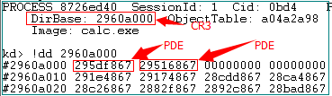

Calc.exe程序对应的CR3寄存器值为0x2960a000,下面是对应PDT结构

### 2.4.2页表结构解析

页表是用来存放页表表项（PTE）。每一个页表占4KB的内存页，每个PTE占4个字节。所以每个页表最多1024个PTE。其中高20位代表要使用的最终页面的起始物理地址的高20位。所以4KB的内存页也都是4KB边界对齐。

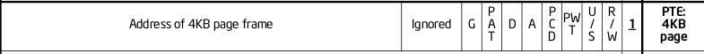