在[内存寻址原理](http://blog.nsfocus.net/memory-addressing-mode/)文章中，我们介绍了内存寻址的基础知识，这次**内存寻址方式**来看看IA-32位系统下的寻址方式。

## 3. IA-32位系统寻址方式

到目前为止已经介绍了线性地址到物理地址的转换基本图及应用的数据结构。上图只是给出了线性地址到物理地址转换的一个大致流程；针对不同的系统，其实地址转换过程还是有很多差别，接下来就针对不同的系统，结合实例来介绍地址转换的具体方式。

### 3.1 IA-32位系统寻址方式图解

32系统是目前国内使用量最多的系统。针对32位系统4K页面，下面是从《Intel 64 and IA-32 Architectures Software Develper’s Manual》手册中截图：

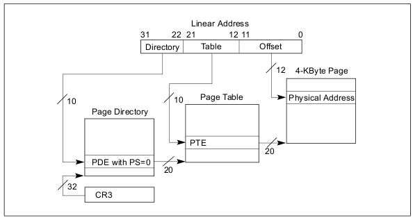

和之前的图解很相似，之前的图解也是使用32位系统的实例来讲解。

**线性地址地址分配如下：** 

1. 10位（位22-31）的页目录表索引，用来索引本地址在页目录表中的对应表项。
2. 10位（位12-21）的页表索引，用来索引本地址在页表中的对应表项。 
3. 12位（位0-11）的页内偏移，这与以前是相同的。

**分析地址转换过程:**从上图可知线性地址被分成了3份。

1. 先由CR3寄存器得到页目录表指针。
2. 取线性地址的高10位为页目录的索引找到对应的表项PDE。
3. 根据PDE（取PDE的高20位，低12位0）定位页表。
4. 取线性地址的中间10位，作为页表的索引取出页表的表项PTE。
5. 根据PTE（取PDE的高20位，低12位0）定位内存页。
6. 取线性地址的最后12位于内存页基地址相加得到物理地址。

### 3.2 IA-32 位系统线性地址与物理地址转化实例详解

根据上一节的图解，下面来分析一个线性地址到物理地址转换的实例，验证的思路是：先通过线性地址查看该地址处的值，然后将线性线性地址转换为物理地址，再查看该处的值是否与之前的值相同。

以一个addr_v2p程序为例，随便找一个线性地址0x3015d5,如下图：

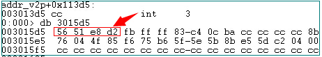

红箭头是地址所对应的数值为0xd2e85156,那接下来看看线性地址所对应物理是不是这个值。

1.根据CR3找到页目录表：

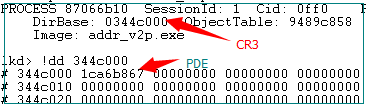

从图中看出页目录表中只有一个页目录表项PDE，这是因为我们这个程序很小，只是为验证地址转换的过程，所以占有一个页目录表项就可以。

2.取线性地址的高10位为页目录的索引找到对应的表项PDE。

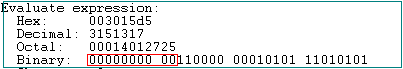

图中红框可知，其前10位都是0，也就是说该线性地址对应的是第一个页目录表项（上面也说了，这里也只有一个页目录表项）。

3.根据PDE（取PDE的高20位，低12位0）定位页表。

PDE=页目录表基址+页表索引=0x344c000+0x0=0x344c000；

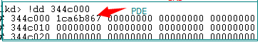

对应的页表基址是0x1ca6b000(页表占高20位)。

4.取线性地址的中间10位，作为页表的索引取出页表的表项PTE。

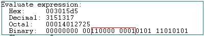

中间这10位刚好是0x301作为索引，也就是第302项。

5.根据PTE（取PDE的高20位，低12位0）定位内存页。

此时定位页表项=页表基址+页表索引=0x1ca6b000+0x301*4(每一项占4字节)=0x1ca6bc04。

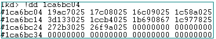

该表项对应是0x19ac7025，PTE表项0x19ac7025对应的内存页基址是0x19ac7000.

6.取线性地址的最后12位于内存页基地址相加得到物理地址。

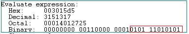

最后12位的页内偏移是0x5d5,对应的页面是0x19ac7000；对应的物理地址是0x19ac75d5.该物理地址中的值如下图：

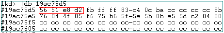

**从查看物理地址的值可知，线性地址中的值与对应物理地址的值相同。说明由线性地址到物理地址的转换是完全正确。**

## 4.IA-32 PAE模式寻址方式

目前用户使用最多的还是win7操作系统，在32位win7操作系统中最多可以使用的物理内存为4G，为了能够使4G以上的物理内存需要开启PAE模式（在其他文章中已经详细介绍过PAE概念及使用，这里不再累赘）。

### 4.1 IA-32 PAE寻址方式图解

在开启PAE模式后，根据《Intel 64 and IA-32 Architectures Software Develper’s Manual》描述，物理地址可以是52位，40位，36位不等；就以win7中PAE模式下物理地址寻址为36位为例，最大寻址空间64G；线性地址到物理地址的转换由二级映射变成三级映射，多了一个页目录表指针；根据《Intel 64 and IA-32 Architectures Software Develper’s Manual》中描述：

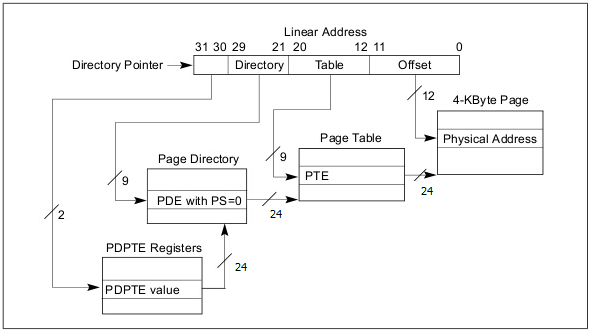

上图是32位系统PAE模式下，线性地址到物理地址的转换图。从图中可知线性地址被分成4部分。在IA-32非PAE模式下，CR3是页目录指针，指向的是页目录表。在PAE模式下，多了一级的页目录指针表，CR3是页目录指针表指针，指向页目录指针表(PDPT)。

页目录指针表包含4个8字节的表项(PDPTE)。

**线性地址地址分配如下：**

1. 2位（位30和位31）的页目录指针表索引，用来索引本地址在页目录指针表中的对应表项。
2. 9位（位21-29）的页目录表索引，用来索引本地址在页目录表中的对应表项。
3. 9位（位12-20）的页表索引，用来索引本地址在页表中的对应表项。
4. 12位（位0-11）的页内偏移，这与以前是相同的。

**分析地址转换过程:**

1. 先由CR3寄存器得到页目录指针表指针。
2. 取线性地址的高30-31位为页目录指针表的索引找到对应的表项PDPTE。
3. 根据PDPTE（取PDPTE的12-35位）定位页目录表。
4. 取线性地址的21-29位为页目录表的索引找到对应的表项PDE。
5. 根据PDE（取PDE的高20位，低12位0）定位页表。
6. 取线性地址的中间12-20位，作为页表的索引取出页表的表项PTE。
7. 根据PTE（取PDE的高20位，低12位0）定位内存页。
8. 取线性地址的最后12位于内存页基地址相加得到物理地址。

### 4.2 IA-32 PAE模式线性地址与物理地址转化实例详解

根据上一节的图解，下面来分析一个在PAE模式下，PAE模式，物理寻址由原来的4G扩大到了64G；线性地址到物理地址转换的实例，验证的思路是：先通过线性地址查看该地址出的值，然后将线性线性地址转换为物理地址，再查看该处的值是否与之前的值相同。

以一个addr_v2p程序为例，PAE模式线性地址依然是32位，比如线性地址0xde13a0,如下图：

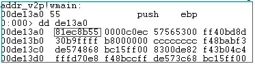

红箭头是地址所对应的数值为0x81ec8b55,那接下来看看该线性地址所对应物理地址是不是这个值。

1.根据CR3找到页目录指针表：

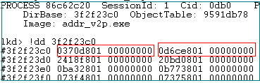

从图中看出每个页目录指针表共有4个表项，每个表项是8字节（64位），因此，可以知道上面的前两行内容是进程的页目录指针表。

2.取线性地址的高30-31位为页目录指针表的索引找到对应的表项PDPTE。

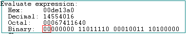

图中红框可知，其前2位都是0，也就是说该线性地址对应的是第一个页目录指针表项。

3.根据PDPTE（取PDPTE的12-35位）定位页目录表。

PDPTE=页目录指针表基址+页目录表索引=0x3f2f23c0+0x0=0x3f2f23c0,对应的页目录指针表项是0x00000000’0370d801,对应的页目录基址是0x370d000(页目录占其中的12-35位)。

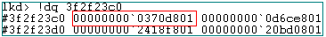

4.取线性地址的21-29位为页目录表的索引找到对应的表项PDE。

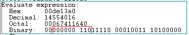

中间这9位刚好是6作为索引。为页目录表的第7项。

5.根据PDE（取PDE的高20位，低12位0）定位页表。

此时定位页目录表项=页目录表基址+页表索引=0x00000000’0370d000+6*8(每一项占4字节)= 0x00000000’0370d030。

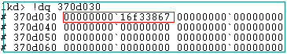

该表项对应是0x00000000`16f33867.那么页目录表项基址为0x16f33000(页表占12-35位)。

6.取线性地址的中间12-20位，作为页表的索引取出页表的表项PTE。

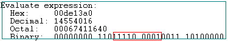

中间这9位刚好是0x1e1作为索引，此时定位页表项=页表基址+页表索引=0x00000000`16f33000+0x1e1*8(每一项占4字节)= 0x16f33f08。

7.根据PTE（12-35位）定位内存页。

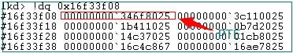

该表项PTE对应是0x346f8025。该页面的基址是0x346f8000(页帧占12-35位)

8.取线性地址的最后12位于内存页基地址相加得到物理地址。

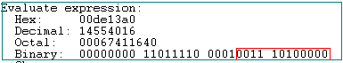

最后12位的页内偏移是0x3a0,对应的页面是0x346f8000；对应的物理地址是0x346f83a0.该物理地址中的值如下图：

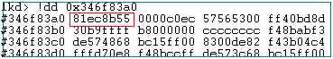

**从查看物理地址的值可知，线性地址中的值与对应物理地址的值相同。说明由线性地址到物理地址的转换是完全正确。**

## 5. IA-32E寻址方式

### 5.1 IA-32E寻址方式图解

在X86-64架构中中根据《Intel 64 and IA-32 Architectures Software Develper’s Manual》描述，需要强调的是，x86_64线性地址并不是64位，物理地址也不是64位，Intel当前CPU最高物理地址是52位，但是实际支持的物理内存总线宽带是40位。其物理地址也可以是52位，40位，36位不等。 **为什么**** 40 **\**位物理内存总线带宽可以寻址**** 52 **\**位物理内存呢，这是因为物理内存总线带宽并不包括对内页地址偏移的寻址，页内地址偏移占有**** 12 **\**位，所以**** 40+12 **\**刚好是**** 52 ****位物理地址。** 就以常见的win7 64位下物理地址寻址为36位为例，最大寻址空间64G；线性地址到物理地址的转换由四级映射构成，比三级映射由多了一个页面映射四级表（PML4T（page map level4 tables））；根据《Intel 64 and IA-32 Architectures Software Develper\’s Manual》中描述：

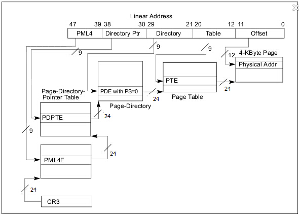

上图是在64位系统中，线性地址到物理地址的转换图。从图中可知线性地址被分成5部分。在PAE模式下， CR3是页目录指针表指针，指向页目录指针表(PDPT)，在64位模式下，CR3寄存器是占有64位，作为PML4T(Page-Map Level 4_)映射表指针。但是在win7 64位系统中，只是使用了其中的24位来寻址PML4T。

PML4T是64位系统增加的一个结构，通过PML4T找到对应的PDPTE.

**线性地址地址分配如下：**

1. 9位（位39-47）的PML4T索引，用来索引本地址在PML4T中的对应表项。
2. 9位（位30-38）的页目录指针表索引，用来索引本地址在页目录指针表中的对应表项。
3. 9位（位21-29）的页目录表索引，用来索引本地址在页目录表中的对应表项。
4. 9位（位12-20）的页表索引，用来索引本地址在页表中的对应表项。
5. 12位（位0-11）的页内偏移.

**分析地址转换过程 :**

1. 先由CR3寄存器（12-35位）计算出PML4T指针。
2. 取线性地址的高39-47位为PML4T的索引找到对应的表项PML4TE。
3. 根据PML4T（取PDPTE的12-35位）定位页目录指针表。
4. 取线性地址的高30-38位为页目录指针表的索引找到对应的表项PDPTE。
5. 根据PDPTE（取PDPTE的12-35位）定位页目录表。
6. 取线性地址的21-29位为页目录表的索引找到对应的表项PDE。
7. 根据PDE（取PDE的高20位，低12位0）定位页表。
8. 取线性地址的中间12-20位，作为页表的索引取出页表的表项PTE。
9. 根据PTE（取PDE的高20位，低12位0）定位内存页。
10. 取线性地址的最后12位于内存页基地址相加得到物理地址。

### 5.2 IA-32E系统线性地址与物理地址转化实例详解

根据上一节的图解，下面来分析一个在64位模式线性地址到物理地址转换的实例，验证的思路是：先通过线性地址查看该地址出的值，然后将线性线性地址转换为物理地址，再查看该处的值是否与之前的值相同。

以一个FuncParaX64程序为例，64位模式线性地址表示形式为64位，比如线性地址rsp= 0000000000affe88,如下图：

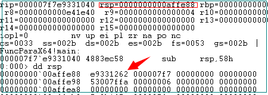

在rsp地址0x00000000\’00affe88中保存的前4个字节的值为0xe9331262,接下来看看该线性地址所对应物理地址是不是这个值。

1.先由CR3寄存器（12-35位）计算出PML4T映射表指针：

CR3寄存器为0x5d8ff000,其第12-35位还是0x5d8ff000,表示的PML4T的地址，如下图

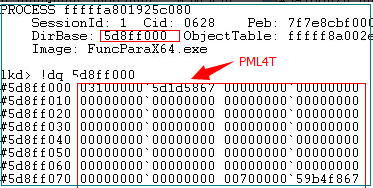

PML4T表的第一项是0x03000000`5a3b8867.

2.取线性地址的高39-47位为PML4T的索引找到对应的表项PML4TE。

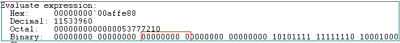

图中可知64位线性地址的39-47位的值为0，也就是在PML4T的第1个表项指向了PDPT表。由上图可知表项的偏移应该为0x5d8ff000+0*8(PML4T的每个表项占8个字节)=0x5d8ff000，该表项的内容为0x03100000`5d1d5867：

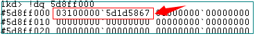

3.根据PML4TE（取PML4TE的12-35位）定位页目录指针表。

该PML4TE表项对应的页目录指针表基地址（取PML4TE的12-35位）为：

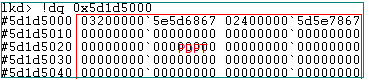

4.取线性地址的高30-38位为页目录指针表的索引找到对应的表项PDPTE。

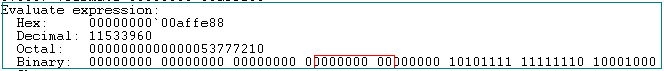

图中红框可知，其30-38位都是0，也就是说该线性地址对应的是第一个页目录指针表项。

5.根据PDPTE（取PDPTE的12-35位）定位页目录表。

PDPTE=页目录指针表基址+页目录表索引=0x5d1d5000+0x0*8=0x4d1d5000,对应的页目录指针表项是0x03200000\’5e5d6867。

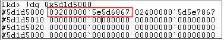

那么页目录表基址是0x5e5d6000(页目录表占页目录指针表项中的12-35位)。

6.取线性地址的21-29位为页目录表的索引找到对应的表项PDE。

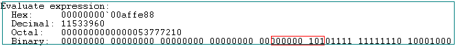

中间这9位刚好是5作为索引。

7.根据PDE中的页目录表项（取PDPTE的12-35位）定位页表。

此时定位页目录表项=页目录表基址+页表索引=0x5e5d6000+5*8(每一项占4字节)= 0x5e5d6028, 页目录表项值为0x01700000\’24c5d867。

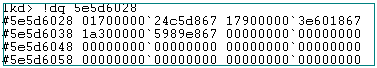

那么页表基址是0x24c5d000(页表占页目录表项中的12-35位)。

8.取线性地址的中间12-20位，作为页表的索引取出页表的表项PTE。

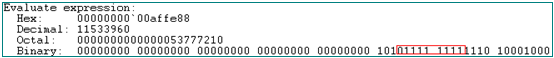

中间这9位刚好是0xff作为索引，此时定位页表项地址=页表基址+页表索引=0x24c5d000+0xff*8(每一项8字节)= 0x24c5d7f8。

9.根据PTE中的内存页基地址（12-35位）定位内存页。

页表项地址=0x24c5d7f8, 页目录表项值为0x827000000\’35f69847。

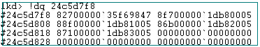

那么内存页基址是0x35f69000(内存页占页表项中的12-35位)。

10.取线性地址的最后12位于内存页基地址相加得到物理地址。

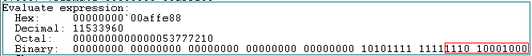

最后12位的页内偏移是0xe80,对应的页面是0x35f69000；对应的物理地址是0x35f69e88.该物理地址中的值如下图：

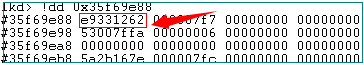**从查看物理地址的值可知，线性地址中的值与对应物理地址的值相同。说明由线性地址到物理地址的转换是完全正确。**

## 6. 总结

最后总结一下IA-32，IA-32 PAE，IA-32E三种模式下采用的结构：

1. IA-32：线性地址，CR3寄存器，页目录表（PDT）,页目录项（PDE）,页表（PT），页表项（PTE）。
2. IA-32 PAE: 线性地址，CR3寄存器，页目录指针表（PDPT）,页目录指针表项（PDPTE）页目录表（PDT）,页目录项（PDE）,页表（PT），页表项（PTE）。
3. IA-32E: 线性地址，CR3寄存器，页4级映射表（PML4T），页4级映射表项（PML4TE）页目录指针表（PDPT）,页目录指针表项（PDPTE）页目录表（PDT）,页目录项（PDE）,页表（PT），页表项（PTE）。