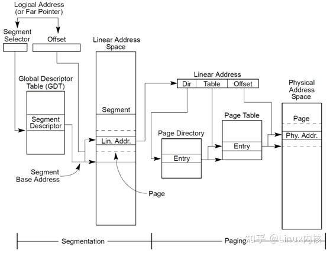
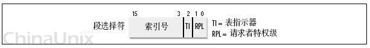
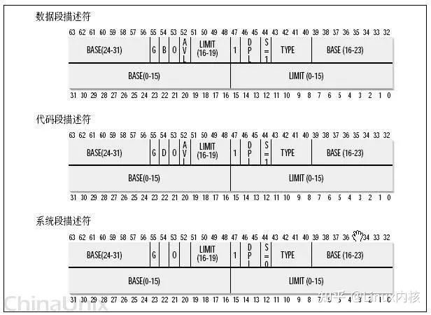

文章部分参考了https://www.zhihu.com/question/29918252/answer/2776127849

在qemu的代码中,有一些定义,可能并不是很好理解,我这里尝试做一个解释:


逻辑地址 --- logical address;

虚拟地址 --- virtual address;

线性地址 --- linear address;

物理地址 --- physical address;

这四个地址是体系相关的，我以x86 cpu为例进行解释。

## 一、名词解释

先放张图吧


1.左上角的Logical Address，就是我们所说的逻辑地址。

逻辑地址，是由一个段选择符加上一个指定段内相对地址的偏移量(**Offset**)组成的，表示为 [段选择符：[段内偏移量](https://www.zhihu.com/search?q=段内偏移量&search_source=Entity&hybrid_search_source=Entity&hybrid_search_extra={"sourceType"%3A"answer"%2C"sourceId"%3A2776127849})]，例如：[CS：EIP]

2.虚拟地址，其实就是如上逻辑地址的**段内偏移Offset**。所以：

逻辑地址可以表示为 [段标识符：**虚拟地址**]

驱动代码或者应用程序中所用的地址就是**虚拟地址**，比如以下程序中指针p的输出：

```c
#include <stdio.h>
#include <stdlib.h>
void main(void)
{
	int *p;
	p = (int*)malloc(sizeof(int));
	printf("addres is %p\n", p);
	free(p);
	return;
}
```

3.Linear Address, 也就是我们所说的线性地址

线性地址是平坦的统一地址空间。

[intel x86](https://www.zhihu.com/search?q=intel x86&search_source=Entity&hybrid_search_source=Entity&hybrid_search_extra={"sourceType"%3A"answer"%2C"sourceId"%3A2776127849}) 中，线性地址是由逻辑地址经过段页式转换得到的。

4.最右边的Physical Address, 也就是我们所说的物理地址。

物理地址就是物理内存的地址。但是注意在做页表转换的时候，这里存的可不是真正的物理地址，而是物理内存块的编号。

内核把物理内存按照4K大小编号，考虑k到物理内存的起始地址是固定的，所以从内存编号的序号就可以算出该编号对应的物理内存块的起始地址了。例如：

物理内存起始地址为0x50000000, 那么编号为0的物理块的起始地址为：0x50000000

编号为1的物理块的起始地址为 0x50001000

以此类推。。。

所以，根据物理内存块的编号，就可以转换得到该物理内存块的起始地址，也叫做物理内存的[基地址](https://www.zhihu.com/search?q=基地址&search_source=Entity&hybrid_search_source=Entity&hybrid_search_extra={"sourceType"%3A"answer"%2C"sourceId"%3A2776127849})。了解这一点非常重要，因为后续做[页表映射](https://www.zhihu.com/search?q=页表映射&search_source=Entity&hybrid_search_source=Entity&hybrid_search_extra={"sourceType"%3A"answer"%2C"sourceId"%3A2776127849})的时候会用到。


## 二、x86的段页式内存管理机制

还是上面的那张图，除了表达了这三个地址之外，我们还可以看出从逻辑地址转换成最终的物理地址，要经历两个过程：

1.逻辑地址转换为线性地址

在 Intel 平台下，逻辑地址(logical address)是 selector:offset 这种形式，selector 可以是代码段或者数据段，offset 是段内偏移。如果用 selector 去 GDT( [全局描述符表](https://www.zhihu.com/search?q=全局描述符表&search_source=Entity&hybrid_search_source=Entity&hybrid_search_extra={"sourceType"%3A"answer"%2C"sourceId"%3A2776127849}) ) 里拿到 segment base address(段基址) 然后加上 offset(段内偏移)，这就得到了 linear address。我们把这个过程称作**段式内存管理**。

总结来看：逻辑地址转换为线性地址的详细过程是这样的：

（1）先从段选择符（selector）中得到段描述符；

（2）从段描述符中得到[段基地址](https://www.zhihu.com/search?q=段基地址&search_source=Entity&hybrid_search_source=Entity&hybrid_search_extra={"sourceType"%3A"answer"%2C"sourceId"%3A2776127849})；

（3）线性地址=上一步得到的段基地址+段内偏移（也就是上文说的虚拟地址）

我们来看看端选择符(selector)的组成：





13位的索引号对应到[段描述符表](https://www.zhihu.com/search?q=段描述符表&search_source=Entity&hybrid_search_source=Entity&hybrid_search_extra={"sourceType"%3A"answer"%2C"sourceId"%3A2776127849})中的位置，而T1字段表示使用的是哪个段描述符表。

Intel设计的本意是，一些全局的段描述符，就放在“[全局段描述符表](https://www.zhihu.com/search?q=全局段描述符表&search_source=Entity&hybrid_search_source=Entity&hybrid_search_extra={"sourceType"%3A"answer"%2C"sourceId"%3A2776127849})(GDT)”中，一些局部的，例如每个进程自己的，就放在所谓的“局部段描述符表(LDT)”中。所以，通过T1字段就可以选择是使用
GDT，还是使用LDT了。GDT或者LDT里的内容就是一个一个的段描述符，段描述符的组成如下：





这些东东很复杂，不过，我这里只关心一样，就是Base字段，它描述了一个段的的基地址。

得到了这个基地址，然后再加上段内偏移offset，就得到了最终的线性地址。

2.线性地址转换为物理地址

如果再把线性地址切成三段，用前两段分别作为索引去PGD、Page Table里查表，会先得到一个页目录表项、然后会得到一个页表项(Page Table Entry)，那里面的值就是一个物理内存块的起始地址（其实就是是物理内存编号），把它加上 linear address 切分之后第三段的内容(又叫页内偏移)就得到了最终的 physical address。我们把这个过程称作**页式内存管理**。

所以，x86采用的是**段页式内存管理**的方式。
