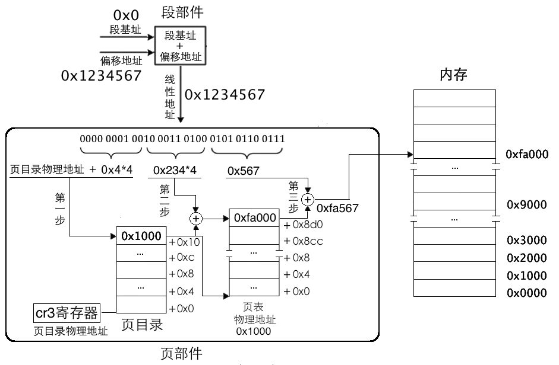
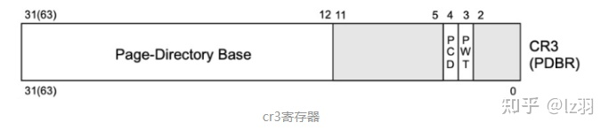
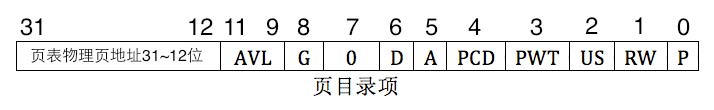
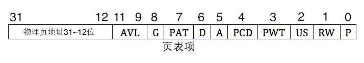

在qemu中,可以指定内存的大小.

除此之外,它还有一个全局变量phys_ram_base,用于记录虚拟的x86的物理内存的基址.

```c
uint8_t *phys_ram_base; /* 虚拟的x86的物理内存的基址 */
```

在vl启动的时候,会分配一块内存空间,作为所模拟的x86的内存条.

```c
 /* main */
	phys_ram_fd = open(phys_ram_file, O_CREAT | O_TRUNC | O_RDWR, 0600); /* 创建一个临时文件作为x86的ram */
    if (phys_ram_fd < 0) {
        fprintf(stderr, "Could not open temporary memory file '%s'\n", 
                phys_ram_file);
        exit(1);
    }    
    total_ram_size = phys_ram_size + vga_ram_size;
    ftruncate(phys_ram_fd, total_ram_size);
    unlink(phys_ram_file);
    /* qemu分配一块内存空间,作为模拟x86的内存条 */
    phys_ram_base = mmap(get_mmap_addr(total_ram_size), 
                         total_ram_size, 
                         PROT_WRITE | PROT_READ, MAP_SHARED | MAP_FIXED, 
                         phys_ram_fd, 0);
```

linux操作系统之中,实际使用的是线性地址,每当我们跑的虚拟内核想要访问某个线性地址的时候,会进行一个映射.

今天这篇文章,想探讨一下qemu的softmmu的实现.

## softmmu的实现

CPUTLBEntry定义了一个cpu中的一个tlb表项.

```c
// cpu-defs.h
#define CPU_TLB_SIZE 256

typedef struct CPUTLBEntry {
    uint32_t address; /* 线性地址 */
    uint32_t addend; /* 物理地址 */
} CPUTLBEntry;
```

我们模拟的x86 cpu提供了对softmmu的一些支持,通过前面的一些文章,我们已经知道,CPUX86State这个结构体的实例,代表了我们所模拟的x86 cpu.

```c
// cpu-i386.h
#define HF_SOFTMMU_MASK      (1 << HF_SOFTMMU_SHIFT)

typedef struct CPUX86State {
    // ...
    uint32_t hflags; /* hidden flags, see HF_xxx constants */
    /* soft mmu support */
    /* 0 = kernel, 1 = user */
    CPUTLBEntry tlb_read[2][CPU_TLB_SIZE];
    CPUTLBEntry tlb_write[2][CPU_TLB_SIZE];
    // ...
} CPUX86State;
```

CPUX86State结构体中,为了处理方便,TLB表区分了内核和用户,区分了读与写,所以一共定义了4张TLB表.

如果qemu要启用softmmu,那么在模拟x86 cpu,初始化的时候,会启用标记:

```c
CPUX86State *cpu_x86_init(void)
{
    CPUX86State *env;
	// ...
    env = malloc(sizeof(CPUX86State));
    if (!env)
        return NULL;
    memset(env, 0, sizeof(CPUX86State));
	// ...
    tlb_flush(env);
#ifdef CONFIG_SOFTMMU
    env->hflags |= HF_SOFTMMU_MASK;
#endif
    // ...
}
```

在模拟器初始化的时候,注册了一些信号的回调函数,比如说SIGSEGV,SIGBUS.

```c
int main(int argc, char **argv)
{ 
    // ...
	/* setup cpu signal handlers for MMU / self modifying code handling */
    sigfillset(&act.sa_mask);
    act.sa_flags = SA_SIGINFO;
    act.sa_sigaction = host_segv_handler;
    sigaction(SIGSEGV, &act, NULL);
    sigaction(SIGBUS, &act, NULL);
    // ...
}
```

它们的处理函数为 `host_segv_handler`,一旦发生缺页中断,就会调用这一类函数.

```c
// vl.c
/* cpu signal handler */
static void host_segv_handler(int host_signum, siginfo_t *info, 
                              void *puc)
{
    if (cpu_signal_handler(host_signum, info, puc))
        return;
    term_exit();
    abort();
}

static void host_signal_handler(int host_signum, siginfo_t *info, 
                                void *puc)
{
    int sig;
    target_siginfo_t tinfo;

    /* the CPU emulator uses some host signals to detect exceptions,
       we we forward to it some signals */
    if (host_signum == SIGSEGV || host_signum == SIGBUS) {
        if (cpu_signal_handler(host_signum, info, puc))
            return;
    }

    /* get target signal number */
    sig = host_to_target_signal(host_signum);
    if (sig < 1 || sig > TARGET_NSIG)
        return;
    host_to_target_siginfo_noswap(&tinfo, info);
    if (queue_signal(sig, &tinfo) == 1) {
        /* interrupt the virtual CPU as soon as possible */
        cpu_interrupt(global_env, CPU_INTERRUPT_EXIT);
    }
}
```

接下来调用 `cpu_signal_handler` 来处理缺页中断.

```c
int cpu_signal_handler(int host_signum, struct siginfo *info, void *puc)
{
    struct ucontext *uc = puc;
    unsigned long pc;
    pc = uc->uc_mcontext.gregs[REG_EIP]; /* 下一条指令的地址 */
    return handle_cpu_signal(pc, (unsigned long)info->si_addr, 
                             uc->uc_mcontext.gregs[REG_TRAPNO] == 0xe ? 
                             (uc->uc_mcontext.gregs[REG_ERR] >> 1) & 1 : 0,
                             &uc->uc_sigmask);
}
```

记录了下一条指令的地址之后,调用 `handle_cpu_signal` 来继续处理:

```c
/* 'pc' is the host PC at which the exception was raised. 'address' is
   the effective address of the memory exception. 'is_write' is 1 if a
   write caused the exception and otherwise 0'. 'old_set' is the
   signal set which should be restored */
static inline int handle_cpu_signal(unsigned long pc, unsigned long address,
                                    int is_write, sigset_t *old_set)
{
    TranslationBlock *tb;
    int ret;

    if (cpu_single_env)
        env = cpu_single_env; /* XXX: find a correct solution for multithread */

    if (is_write && page_unprotect(address)) {
        return 1;
    }
    /* see if it is an MMU fault */
    ret = cpu_x86_handle_mmu_fault(env, address, is_write);
    if (ret < 0)
        return 0; /* not an MMU fault */
    if (ret == 0)
        return 1; /* the MMU fault was handled without causing real CPU fault */
    // ...
    /* never comes here */
    return 1;
}
```

`cpu_x86_handle_mmu_fault` 用于处理缺页中断.这个函数,是整个softmmu的核心,非常重要,我会拆开来进行讲述.

在开始之前,我首先给出一个简单的实例,下面是在二级页表的情况下,如何来实现线性地址到物理地址的转换,更直白一点,那就是softmmu是如何实现0x1234567这个线性地址到对应的物理地址的转换的.



上图中页目录项,页表项中的地址值都是为演示而虚构的,我们对照着图示细说下转换过程。

平坦模型下段基址为0,指令mov ax,[0x1234567],经过段部件处理，输出的线性地址为0x1234567,由于是在分页机制下,此地址被认为是虚拟地址,需要被页部件转换.

页部件首先要把地址拆分成高10位,中间10位,低12位三部分.其实低12位最容易得出,十六进制的每1位代表4位二进制，所以低12位直接就是0x567.

高10位和中间10位,不容易一眼看出来,所以还是将它们换算成二进制看比较容易.

0x1234567的二进制形式是：0000 0001 0010 0011 0100 0101 0110 0111.

高10位是0000 0001 00,十六进制为0x4.

中间10位是10 0011 0100,十六进制为0x234.

低12位是0101 0110 0111,十六进制为0x567.

第一步:为了得到页表物理地址,页部件用虚拟地址高10位乘以4的积与页目录表物理地址相加,所得的和便是页目录项地址,读取该页目录项,获取页表物理地址.这里是0x4\*4=0x10,页表物理地址存储在cr3寄存器中,由于是过程演示,无需给出具体数值,我们只需要用0x10作为页表中的偏移地址便能够找到对应的页目录项.如图页目录表和页表中,对于内存地址我们给出的都是偏移量,所以地址前都有个加号"+".这里我们找到了最上面的页目录项,其值为0x1000.这意味着要找的页表位于物理地址0x1000.

第二步: 为了得到具体的物理页,需要找到页表中对应的页表项.页部件用虚拟地址中间10 位的值乘以4的积与第一步中得到的页表地址相加,所得的和便是页表项物理地址。这里是0x234*4=0x8d0，页表项物理地址是0x8d0+0x1000=0x18d0.在该页表项中的值是0xfa000,这意味着分配的物理页地址是0xfa000.

第三步:为了得到最终的物理地址,用虚拟地址低12位作为页内偏移地址与第二步中得到的物理页地址相加,所得的和便是最终的物理地址.这里是0xfa000+0x567=0xfa567.

经过这三步后,页部件将虚拟地址0x1234567 转换成物理地址0xfa567.

有了上面例子的铺垫,下面的函数代码理解起来就简单多了.

```c
/* 处理mmu映射缺失的异常
 * @param addr 线性地址
 * @param is_write 是否是写入,1代表写入
 */
int cpu_x86_handle_mmu_fault(CPUX86State *env, uint32_t addr, int is_write)
{
    uint8_t *pde_ptr, *pte_ptr;
    uint32_t pde, pte, virt_addr;
    int cpl, error_code, is_dirty, is_user, prot, page_size, ret;
    unsigned long pd;
    
    cpl = env->hflags & HF_CPL_MASK;
    is_user = (cpl == 3);

    if (env->user_mode_only) {
        /* user mode only emulation */
        error_code = 0;
        goto do_fault;
    }

    if (!(env->cr[0] & CR0_PG_MASK)) { /* 没有开启分页,那么物理地址其实就是线性地址 */
        pte = addr;
        virt_addr = addr & ~0xfff; /* 取高8位 */
        prot = PROT_READ | PROT_WRITE;
        page_size = 4096;
        goto do_mapping; /* 实现映射 */
    }
	/* 关于内存寻址的相关知识,可以查看内存寻址原理这一节 */
    /* page directory entry 
     * 页目录项
     * cr[3] & ~0xfff 也就是取cr[3]的高20位,为页目录的基地址(物理地址)
     * ((addr >> 20) & ~3) 为页目录地址偏移,后面的 & ~3为保证4字节对齐
     * addr >> 22是页目录的索引,每个页目录项4字节,所以偏移为 ((addr >> 22) << 2) = ((addr >> 20) & ~3)
     * 两者相加,可以获得addr对应的页目录项的物理地址
     */
    pde_ptr = phys_ram_base + ((env->cr[3] & ~0xfff) + ((addr >> 20) & ~3));
    pde = ldl(pde_ptr); /* 取出页目录表项 */
    if (!(pde & PG_PRESENT_MASK)) {
        error_code = 0;
        goto do_fault;
    }
```

cr3寄存器和MMU密切相关,它保存了当前进程所使用的虚拟地址空间的页目录地址.



cr3的高20位用于保存页目录的物理地址(基地址),0-11位记录标记位,页目录地址必须是4KB的整数倍.

页目录的基地址+页目录项的偏移,可以获得线性地址(addr)对应的页目录项(PDE)的地址.

取出的PDE格式如下:



P,Present,意为存在位.若为1表示该页存在于物理内存中,若为0表示该表不在物理内存中.操作系统的页式虚拟内存管理便是通过P位和相应的pagefault异常来实现的.

RW,Read/Write,意为读写位.若为1表示可读可写,若为0表示可读不可写.

US,User/Supervisor,意为普通用户/超级用户位.若为1 时,表示处于User 级,任意级别(0,1,2,3)特权的程序都可以访问该页.若为0,表示处Supervisor级,特权级别为3的程序不允许访问该页,该页只允许特权级别为0,1,2的程序可以访问.

PWT,Page-level Write-Through,意为页级通写位,也称页级写透位.若为1表示此项采用通写方式,表示该页不仅是普通内存,还是高速缓存.此项和高速缓存有关,"通写"是高速缓存的一种工作方式,本位用来间接决定是否用此方式改善该页的访问效率.这里咱们直接置为0就可以啦.

PCD,Page-level Cache Disable,意为页级高速缓存禁止位.若为1表示该页启用高速缓存,为0表示禁止将该页缓存.这里咱们将其置为0.

A,Accessed,意为访问位.若为1表示该页被CPU访问过啦,所以该位是由CPU设置的.还记得段描述符中的A位和P位吗？这两位在一起可以实现段式虚拟内存管理.和它们一样,这里页目录项和页表项中的A位也可以用来记录某一内存页的使用频率(操作系统定期将该位清0,统计一段时间内变成1 的次数),从而当内存不足时,可以将使用频率较低的页面换出到外存(如硬盘),同时将页目录项或页表项的P位置0,下次访问该页引起pagefault异常时,中断处理程序将硬盘上的页再次换入,同时将P位置1.

D,Dirty,意为脏页位.当CPU对一个页面执行写操作时,就会设置对应页表项的D 位为1.此项仅针对页表项有效,并不会修改页目录项中的D 位.

PAT,Page Attribute Table,意为页属性表位,能够在页面一级的粒度上设置内存属性.比较复杂,将此位置0 即可.

G,Global,意为全局位.由于内存地址转换也是颇费周折,先得拆分虚拟地址,然后又要查页目录,又要查页表的,所以为了提高获取物理地址的速度,将虚拟地址与物理地址转换结果存储在TLB(Translation Lookaside Buffer)中.

此G位用来指定该页是否为全局页,为1 表示是全局页,为0 表示不是全局页.若为全局页,该页将在高速缓存TLB中一直保存,给出虚拟地址直接就出物理地址啦,无需那三步骤转换.由于TLB容量比较小(一般速度较快的存储设备容量都比较小),所以这里面就存放使用频率较高的页面.顺便说一句,清空TLB有两种方式,一是用invlpg指令针对单独虚拟地址条目清理,或者是重新加载cr3 寄存器,这将直接清空TLB.

AVL,意为Available位,表示可用,谁可以用？当然是软件,操作系统可用该位,CPU不理会该位的值.

```c
    if (is_user) {
        if (!(pde & PG_USER_MASK))
            goto do_fault_protect;
        if (is_write && !(pde & PG_RW_MASK))
            goto do_fault_protect;
    } else {
        if ((env->cr[0] & CR0_WP_MASK) && (pde & PG_USER_MASK) &&
            is_write && !(pde & PG_RW_MASK)) 
            goto do_fault_protect;
    }
    
    /* 如果设置了PSE位,那么我们使用4MB的页 */
    if ((pde & PG_PSE_MASK) && (env->cr[4] & CR4_PSE_MASK)) {
		// ... 忽略PSE
    } else { /* 暂时先忽略PSE */
        if (!(pde & PG_ACCESSED_MASK)) {
            pde |= PG_ACCESSED_MASK;
            stl(pde_ptr, pde);
        }

        /* 页表
         * (pde & ~0xfff) 用于取高20bit,为页表基址
         *  (addr >> 10) & 0xffc 页表项在页表内的偏移
         * 两者相加,为addr对应的页表项的物理地址(需要加上偏移)
         */
        pte_ptr = phys_ram_base + ((pde & ~0xfff) + ((addr >> 10) & 0xffc));
        pte = ldl(pte_ptr); /* 取出页表项,页表项4字节 */
        if (!(pte & PG_PRESENT_MASK)) {
            error_code = 0;
            goto do_fault;
        }
        if (is_user) {
            if (!(pte & PG_USER_MASK))
                goto do_fault_protect;
            if (is_write && !(pte & PG_RW_MASK))
                goto do_fault_protect;
        } else {
            if ((env->cr[0] & CR0_WP_MASK) && (pte & PG_USER_MASK) &&
                is_write && !(pte & PG_RW_MASK)) 
                goto do_fault_protect;
        }
        is_dirty = is_write && !(pte & PG_DIRTY_MASK);
        if (!(pte & PG_ACCESSED_MASK) || is_dirty) {
            pte |= PG_ACCESSED_MASK;
            if (is_dirty)
                pte |= PG_DIRTY_MASK;
            stl(pte_ptr, pte);
        }
        /* page大小为4096,也就是4k */
        page_size = 4096;
        /* 取addr的高20位,其他位全部为0, 这里的virt_addr实际指的是addr所在page的首地址 */
        virt_addr = addr & ~0xfff;
    }
```

我们暂时不考虑4M大小的页.

PTE的格式如下:



PTE的各个bit的含义和PDE基本一致,这里就不再赘述.

注意上面计算出来的virt_addr,它实际是线性地址addr对应物理地址所在page首部的线性地址.

```c
    /* the page can be put in the TLB */
    prot = PROT_READ;
    if (is_user) {
        if (pte & PG_RW_MASK)
            prot |= PROT_WRITE;
    } else {
        if (!(env->cr[0] & CR0_WP_MASK) || !(pte & PG_USER_MASK) ||
            (pte & PG_RW_MASK))
            prot |= PROT_WRITE;
    }
    
 do_mapping: /* 做映射 */
    /* softmmu不开其实影响不大,只是模拟的cpu执行效率会有所下降而已. */
    if (env->hflags & HF_SOFTMMU_MASK) { /* softmmu启用,在大多数时候,softmmu都是不会启用的 */
        unsigned long paddr, vaddr, address, addend, page_offset;
        int index;
        /* addr & ~0xfff 用于取线性地址的高20bit, 按照道理来说,页内偏移应该是12位
         * 页内偏移不是(addr & 0xfff) & (page_size - 1)吗?
         * 没有错,addr对应的页内偏移确实是(addr & 0xfff) & (page_size - 1).
         * 如果没有开启分页,那么vaddr等于paddr
         * page_size为4096的情况下,page_offset为0,这里说明一下,这里的映射是以page为单位的,线性地址addr
         * 并不总是和page的大小对齐,对于这样的addr,这里的tlb实际记录的是addr所在page首地址(线性地址)和
         * 物理page的物理首地址映射.
         * 如果page_size为4M, 那么page_offset不为0.
         */
        page_offset = (addr & ~0xfff) & (page_size - 1); /* 页内偏移 */
        paddr = (pte & ~0xfff) + page_offset; /* 计算物理page页的首地址(物理地址) */
        vaddr = virt_addr + page_offset; /* 计算addr所在page的首地址(线性地址) */
        /* 2^20 ==> 256,tlb必然会不断更新 */
        index = (addr >> 12) & (CPU_TLB_SIZE - 1); /* 计算addr对应的tlb在tlb中的索引 */
        pd = physpage_find(paddr);

        if (pd & 0xfff) {
            /* IO memory case */
            address = vaddr | pd;
            addend = paddr;
        } else {
            /* standard memory */
            address = vaddr; /* addr所在page的首地址(线性地址) */
            addend = (unsigned long)phys_ram_base + pd; /* addr所在page映射到的物理page的首地址(物理地址) */
        }
        addend -= vaddr; /* 注意这里减去了vaddr,至于意图,可以参考tlb的使用方法 */
        env->tlb_read[is_user][index].address = address; /* tlb记录下线性地址->物理地址的映射关系 */
        env->tlb_read[is_user][index].addend = addend;
        if (prot & PROT_WRITE) {
            env->tlb_write[is_user][index].address = address;
            env->tlb_write[is_user][index].addend = addend;
        }
    }
```

如果模拟的cpu启用了softmmu,由前几步,我们已经得到了virt_addr,下一步就要正式计算出物理地址,实现虚拟地址addr到物理地址paddr的映射了.

```page_offset = (addr & ~0xfff) & (page_size - 1)```可以计算出页内偏移.

paddr是线性地址addr所在物理page首部的物理地址.

vaddr是线性地址addr所在物理page首部的线性地址.

用过一个tlb表项记录下了映射,也就是下一次访问这个线性地址的时候,就不会再触发缺页中断了.

然后比较重要的就是这个映射的实现了.

这里有一个很重要的变量,那就是index,我们来看一下index的计算公式:

```c
        /* 2^20 ==> 256,tlb必然会不断更新 */
        index = (addr >> 12) & (CPU_TLB_SIZE - 1);
```

线性地址的高20bit映射到256个槽位之中,这从另外一个侧面说明了,tlb必定是会不断更新的.

tlb表项实际记录的是addr所在page首地址(线性地址)和物理page的物理首地址映射.这里需要注意对addend的一个特殊操作:

```c
        addend -= vaddr; /* 注意这里减去了vaddr,至于意图,可以参考tlb的使用方法 */
```

 env->tlb_read\[is_user][index].addend以及env->tlb_write\[is_user][index].addend记录的其实是实际的物理地址减去了一个vaddr这样的一个值.

这里算是一个小技巧吧.你可能比较好奇,为什么要这么做?很简单,给定一个线性地址addr,获得对应的物理地址,只需要一次加法即可.

```c
addend = phyaddr - vaddr; // phyaddr代表实际的物理地址, vaddr是addr所在page的首地址(线性地址)
caddr + addrend = addr + phyaddr - vaddr = phyaddr + offset; // offset是addr在页内的偏移
```

如果直接记录phyaddr,那么计算会更加复杂.

```c
    ret = 0;
    /* 模拟内存的映射 */
    /* pte为页表项, pd为addr所在的page对应的物理page相对于物理内存起始位置的偏移 */
    pd = physpage_find(pte & ~0xfff);
    if ((pd & 0xfff) != 0) {
        /* IO access: no mapping is done as it will be handled by the
           soft MMU */
        if (!(env->hflags & HF_SOFTMMU_MASK))
            ret = 2;
    } else {
        void *map_addr;
        /* virt_addr为本进程内的地址, pte & ~0xfff */
        map_addr = mmap((void *)virt_addr, page_size, prot, 
                        MAP_SHARED | MAP_FIXED, phys_ram_fd, pd);
        if (map_addr == MAP_FAILED) {
            fprintf(stderr, 
                    "mmap failed when mapped physical address 0x%08x to virtual address 0x%08x\n",
                    pte & ~0xfff, virt_addr);
            exit(1);
        }      
        /* 一旦映射建立成功,那么就设置页描述符的PAGE_VALID和其他相关属性 */
        page_set_flags(virt_addr, virt_addr + page_size, 
                       PAGE_VALID | PAGE_EXEC | prot);
    }
    return ret;
 do_fault_protect:
    error_code = PG_ERROR_P_MASK;
 do_fault:
    env->cr[2] = addr;
    env->error_code = (is_write << PG_ERROR_W_BIT) | error_code;
    if (is_user)
        env->error_code |= PG_ERROR_U_MASK;
    return 1;
}
```

## softmmu的使用

我知道大家可能会比较好奇,qemu中到底是如何使用到softmmu的,因此在这一节,我简单介绍一下.

softmmu暂时还做不到对生成的中间代码完全透明,这个其实也很好理解,毕竟不使用mmu和使用mmu是两套完全不一样的代码.

为了使用softmmu,qemu定义了一套全新的目标码指令.这套指令的实现使用了比较高超的模板技巧.并不是很好懂,我这里详细介绍一下.

由前面的章节可以知道,qemu在生成目标代码的时候,会调用`dyngen_code`,我这里简单截取其中的一些片段:

```c
// op-i386.h
int dyngen_code(uint8_t *gen_code_buf,
                uint16_t *label_offsets, uint16_t *jmp_offsets,
                const uint16_t *opc_buf, const uint32_t *opparam_buf)
{
    uint8_t *gen_code_ptr;
    const uint16_t *opc_ptr;
    const uint32_t *opparam_ptr;

    gen_code_ptr = gen_code_buf;
    opc_ptr = opc_buf;
    opparam_ptr = opparam_buf;
    for(;;) {
        switch(*opc_ptr++) {
        case INDEX_op_lduw_user_T0_A0: { /* 中间码 */
            extern void op_lduw_user_T0_A0();
            extern char __ldw_mmu;
            memcpy(gen_code_ptr, (void *)((char *)&op_lduw_user_T0_A0+0), 52);
            *(uint32_t *)(gen_code_ptr + 29) = (long)(&__ldw_mmu) - (long)(gen_code_ptr + 29) + -4;
            gen_code_ptr += 52;
            break;
       	case INDEX_op_stb_user_T0_A0: {
            extern void op_stb_user_T0_A0();
        	extern char __stb_mmu;
            memcpy(gen_code_ptr, (void *)((char *)&op_stb_user_T0_A0+0), 57);
            *(uint32_t *)(gen_code_ptr + 37) = (long)(&__stb_mmu) - (long)(gen_code_ptr + 37) + -4;
            gen_code_ptr += 57;
            break;
		case INDEX_op_ldub_kernel_T0_A0: {
                extern void op_ldub_kernel_T0_A0();
                extern char __ldb_mmu;
                memcpy(gen_code_ptr, (void *)((char *)&op_ldub_kernel_T0_A0+0), 52);
                *(uint32_t *)(gen_code_ptr + 29) = (long)(&__ldb_mmu) - (long)(gen_code_ptr + 29) + -4;
                gen_code_ptr += 52;
			}
			break;
        case INDEX_op_stb_kernel_T0_A0: {
           		extern void op_stb_kernel_T0_A0();
        		extern char __stb_mmu;
                memcpy(gen_code_ptr, (void *)((char *)&op_stb_kernel_T0_A0+0), 57);
                *(uint32_t *)(gen_code_ptr + 37) = (long)(&__stb_mmu) - (long)(gen_code_ptr + 37) + -4;
                gen_code_ptr += 57;
             }
             break;
        // ...
		}
     }
	 //...      
}   
```

上面的函数引用了一些函数`op_ldub_kernel_T0_A0`, `op_stb_kernel_T0_A0`,它们的实现大量引用了宏,非常精妙,代码如下:

```c
// ops_mem.h
/* 读值操作 */
void OPPROTO glue(glue(op_ldub, MEMSUFFIX), _T0_A0)(void)
{
    T0 = glue(ldub, MEMSUFFIX)((uint8_t *)A0);
}
/* 赋值操作 */
void OPPROTO glue(glue(op_stb, MEMSUFFIX), _T0_A0)(void)
{
    glue(stb, MEMSUFFIX)((uint8_t *)A0, T0);
}

// op-i386.h
#define MEMSUFFIX
#include "ops_mem.h"

#define MEMSUFFIX _user
#include "ops_mem.h"

#define MEMSUFFIX _kernel
#include "ops_mem.h"
```

`ldub_kernel`, `stb_kernel`的函数由下面的宏代码生成: 

```c
// cpu-i386.h
#define TARGET_PAGE_BITS 12 /* 页大小为4096 */

// cpu-all.h
#define TARGET_PAGE_SIZE (1 << TARGET_PAGE_BITS) /* 4096 */
#define TARGET_PAGE_MASK ~(TARGET_PAGE_SIZE - 1) /* 0xfffff000 取高20bit */
#define TARGET_PAGE_ALIGN(addr) (((addr) + TARGET_PAGE_SIZE - 1) & TARGET_PAGE_MASK)

// softmmu_header.h
/* softmmu_header.h是一个模版文件,以i386为例, exec-i386.h文件中,利用宏生成对应的代码.
 * 我摘取了一小部分:
#define MEMUSER 0
#define DATA_SIZE 1
#include "softmmu_header.h"
#undef MEMUSER

#define MEMUSER 1
#define DATA_SIZE 1
#include "softmmu_header.h"
#undef MEMUSER
 * 通过提供不同的DATA_SIZE,从而生成不同的函数,有CPP中模版的风味.
 * 上面的例子中,会生成函数:
 * static inline int ldub_kernel(void *ptr);
 * static inline int ldsb_kernel(void *ptr);
 * static inline void stb_kernel(void *ptr, uint8_t v);
 * static inline int ldub_user(void *ptr);
 * static inline int ldsb_user(void *ptr); 等
 * 这是比较高超的技巧.
 * 当然softmmu_header.h里面又嵌套了softmmu_template.h,有必要的话,可以学习一下这里的技巧.
 */
#if DATA_SIZE == 8
#define SUFFIX q
#define DATA_TYPE uint64_t
#elif DATA_SIZE == 4
#define SUFFIX l
#define DATA_TYPE uint32_t
#elif DATA_SIZE == 2
#define SUFFIX w
#define DATA_TYPE uint16_t
#define DATA_STYPE int16_t
#elif DATA_SIZE == 1
#define SUFFIX b
#define DATA_TYPE uint8_t
#define DATA_STYPE int8_t
#else
#error unsupported data size
#endif

#if MEMUSER == 0
#define MEMSUFFIX _kernel
#else
#define MEMSUFFIX _user
#endif

#if DATA_SIZE == 8
#define RES_TYPE uint64_t
#else
#define RES_TYPE int
#endif

#if MEMUSER == 0
DATA_TYPE REGPARM(1) glue(glue(__ld, SUFFIX), _mmu)(unsigned long addr);
void REGPARM(2) glue(glue(__st, SUFFIX), _mmu)(unsigned long addr, DATA_TYPE v);
#endif
/* 加载值
 * @param ptr 线性地址
 */
static inline int glue(glue(ldu, SUFFIX), MEMSUFFIX)(void *ptr)
{
    int index;
    RES_TYPE res;
    unsigned long addr, physaddr;
    addr = (unsigned long)ptr;
    index = (addr >> TARGET_PAGE_BITS) & (CPU_TLB_SIZE - 1); /* 计算线性地址addr在tlb表中的索引 */
    if (__builtin_expect(env->tlb_read[MEMUSER][index].address != 
                         (addr & (TARGET_PAGE_MASK | (DATA_SIZE - 1))), 0)) {
        res = glue(glue(__ld, SUFFIX), _mmu)(addr);
    } else {
        physaddr = addr + env->tlb_read[MEMUSER][index].addend;
        res = glue(glue(ldu, SUFFIX), _raw)((uint8_t *)physaddr);
    }
    return res;
}

#if DATA_SIZE <= 2
static inline int glue(glue(lds, SUFFIX), MEMSUFFIX)(void *ptr)
{
    int res, index;
    unsigned long addr, physaddr;
    addr = (unsigned long)ptr;
    index = (addr >> TARGET_PAGE_BITS) & (CPU_TLB_SIZE - 1); /* 计算线性地址addr在tlb表中的索引 */
    if (__builtin_expect(env->tlb_read[MEMUSER][index].address != 
                         (addr & (TARGET_PAGE_MASK | (DATA_SIZE - 1))), 0)) {
        /* tlb中记录的地址和要访问的地址不匹配 */
        res = (DATA_STYPE)glue(glue(__ld, SUFFIX), _mmu)(addr);
    } else {
        physaddr = addr + env->tlb_read[MEMUSER][index].addend; /* 计算得到物理地址 */
        res = glue(glue(lds, SUFFIX), _raw)((uint8_t *)physaddr); /* 从物理地址处加载数据 */
    }
    return res;
}
#endif
/* 存储值 */
static inline void glue(glue(st, SUFFIX), MEMSUFFIX)(void *ptr, RES_TYPE v)
{
    int index;
    unsigned long addr, physaddr;
    addr = (unsigned long)ptr;
    index = (addr >> TARGET_PAGE_BITS) & (CPU_TLB_SIZE - 1);
    if (__builtin_expect(env->tlb_write[MEMUSER][index].address != 
                         (addr & (TARGET_PAGE_MASK | (DATA_SIZE - 1))), 0)) {
        glue(glue(__st, SUFFIX), _mmu)(addr, v);
    } else {
        physaddr = addr + env->tlb_write[MEMUSER][index].addend;
        glue(glue(st, SUFFIX), _raw)((uint8_t *)physaddr, v); /* 存储数据 */
    }
}
```

上面的函数,如果发现tlb没有命中,也会调用`__ldw_mmu`, `__stb_mmu`这类的函数来更新tlb表项.同时dyngen_code生成的目标码也会引用`__ldw_mmu`, `__stb_mmu`之类的函数.

我们来看一下这类函数的实现,同样也是复杂的宏:

```c
// cpu-i386.h
#define TARGET_PAGE_BITS 12 /* 页大小为4096 */

// cpu-all.h
#define TARGET_PAGE_SIZE (1 << TARGET_PAGE_BITS) /* 4096 */
#define TARGET_PAGE_MASK ~(TARGET_PAGE_SIZE - 1) /* 0xfffff000 取高20bit */
#define TARGET_PAGE_ALIGN(addr) (((addr) + TARGET_PAGE_SIZE - 1) & TARGET_PAGE_MASK)

// softmmu_template.h
/* handle all cases except unaligned access which span two pages
 * @param DATA_SIZE 宏参数,表示要访问的数据的大小,单位为字节
 * @param SUFFIX 宏参数,根据要访问的数据的大小,取值可以是q(8字节),l(4字节),w(2字节),b(1字节)
 * @param DATA_TYPE 宏参数,根据要访问的数据的大小,取值可以是uin64_t(8字节),uint32_t(4字节),uint16_t(2字节),uin8_t(1字节)
 * 根据要访问的数据大小(DATA_SIZE),可以生成如下的函数:
 *  uint64_t __ldq_mmu(unsigned long addr);
 *  uint32_t __ldl_mmu(unsigned long addr);
 *  uint16_t __ldw_mmu(unsigned long addr);
 *  uint8_t  __ldb_mmu(unsigned long addr);
 */
DATA_TYPE REGPARM(1) glue(glue(__ld, SUFFIX), _mmu)(unsigned long addr)
{
    DATA_TYPE res;
    int is_user, index;
    unsigned long physaddr, tlb_addr;
    void *retaddr;
    
    /* test if there is match for unaligned or IO access */
    is_user = ((env->hflags & HF_CPL_MASK) == 3);
    /* 计算addr对应的tlb在tlb表中的索引 */
    index = (addr >> TARGET_PAGE_BITS) & (CPU_TLB_SIZE - 1);
 redo:
    tlb_addr = env->tlb_read[is_user][index].address;
    /* tlb有效,并且addr的高20bit和tlb_addr的高20bit匹配 */
    if ((addr & TARGET_PAGE_MASK) == (tlb_addr & (TARGET_PAGE_MASK | TLB_INVALID_MASK))) {
        /* 计算获得物理地址 */
        physaddr = addr + env->tlb_read[is_user][index].addend;
        if (tlb_addr & ~TARGET_PAGE_MASK) {
            /* IO access */
            if ((addr & (DATA_SIZE - 1)) != 0)
                goto do_unaligned_access;
            res = glue(io_read, SUFFIX)(physaddr, tlb_addr);
        } else if (((addr & 0xfff) + DATA_SIZE - 1) >= TARGET_PAGE_SIZE) {
            /* 要访问的数据横跨了两个page */
        do_unaligned_access:
            retaddr = __builtin_return_address(0);
            res = glue(slow_ld, SUFFIX)(addr, retaddr);
        } else {
            /* unaligned access in the same page */
            res = glue(glue(ldu, SUFFIX), _raw)((uint8_t *)physaddr);
        }
    } else {
        /* the page is not in the TLB : fill it */
        retaddr = __builtin_return_address(0);
        tlb_fill(addr, 0, retaddr);
        goto redo;
    }
    return res;
}

/* handle all unaligned cases
 * 处理所有的不对齐的情况
 * @param addr 线性地址
 */
static DATA_TYPE glue(slow_ld, SUFFIX)(unsigned long addr, void *retaddr)
{
    DATA_TYPE res, res1, res2;
    int is_user, index, shift;
    unsigned long physaddr, tlb_addr, addr1, addr2;

    is_user = ((env->hflags & HF_CPL_MASK) == 3);
    index = (addr >> TARGET_PAGE_BITS) & (CPU_TLB_SIZE - 1);
 redo:
    tlb_addr = env->tlb_read[is_user][index].address; /* 获得tlb中记录的线性地址 */
    if ((addr & TARGET_PAGE_MASK) == (tlb_addr & (TARGET_PAGE_MASK | TLB_INVALID_MASK))) {
        physaddr = addr + env->tlb_read[is_user][index].addend;
        if (tlb_addr & ~TARGET_PAGE_MASK) {
            /* IO access */
            if ((addr & (DATA_SIZE - 1)) != 0)
                goto do_unaligned_access;
            res = glue(io_read, SUFFIX)(physaddr, tlb_addr);
        } else if (((addr & 0xfff) + DATA_SIZE - 1) >= TARGET_PAGE_SIZE) {
        /* 访问addr横跨了两个page,那就读两次,然后将结果合并起来 */
        do_unaligned_access:
            /* slow unaligned access (it spans two pages) */
            addr1 = addr & ~(DATA_SIZE - 1);
            addr2 = addr1 + DATA_SIZE;
            res1 = glue(slow_ld, SUFFIX)(addr1, retaddr); /* 加载第1个数据 */
            res2 = glue(slow_ld, SUFFIX)(addr2, retaddr); /* 加载第2个数据 */
            shift = (addr & (DATA_SIZE - 1)) * 8;
#ifdef TARGET_WORDS_BIGENDIAN
            res = (res1 << shift) | (res2 >> ((DATA_SIZE * 8) - shift));
#else
            res = (res1 >> shift) | (res2 << ((DATA_SIZE * 8) - shift));
#endif
        } else {
            /* unaligned/aligned access in the same page */
            res = glue(glue(ldu, SUFFIX), _raw)((uint8_t *)physaddr);
        }
    } else {
        /* the page is not in the TLB : fill it */
        /* 使用tlb可以加快线性地址->物理地址的转换速度,仅此而已 */
        tlb_fill(addr, 0, retaddr);
        goto redo;
    }
    return res;
}

/* 数据写入
 * @param addr 要写入的线性地址
 * @param val 要写入的值
 * @param DATA_SIZE 宏参数,表示要访问的数据的大小,单位为字节
 * @param SUFFIX 宏参数,根据要访问的数据的大小,取值可以是q(8字节),l(4字节),w(2字节),b(1字节)
 * @param DATA_TYPE 宏参数,根据要访问的数据的大小,取值可以是uin64_t(8字节),uint32_t(4字节),uint16_t(2字节),uin8_t(1字节)
 * 根据DATA_SIZE,可以生成下面的4个函数:
 *  void __stq_mmu(unsigned long addr, uint64_t val);
 *  void __stl_mmu(unsigned long addr, uint32_t val);
 *  void __stw_mmu(unsigned long addr, uint16_t val);
 *  void __stb_mmu(unsigned long addr, uint8_t val);
 */
void REGPARM(2) glue(glue(__st, SUFFIX), _mmu)(unsigned long addr, DATA_TYPE val)
{
    unsigned long physaddr, tlb_addr;
    void *retaddr;
    int is_user, index;
    
    is_user = ((env->hflags & HF_CPL_MASK) == 3);
    index = (addr >> TARGET_PAGE_BITS) & (CPU_TLB_SIZE - 1);
 redo:
    tlb_addr = env->tlb_write[is_user][index].address;
    if ((addr & TARGET_PAGE_MASK) == (tlb_addr & (TARGET_PAGE_MASK | TLB_INVALID_MASK))) {
        /* 为什么这里physaddr的计算这么奇怪,可以参考cpu_x86_handle_mmu_fault函数
         * env->tlb_read[is_user][index].addend实际等于physaddr - addr
         */
        physaddr = addr + env->tlb_read[is_user][index].addend;
        if (tlb_addr & ~TARGET_PAGE_MASK) {
            /* IO access */
            if ((addr & (DATA_SIZE - 1)) != 0)
                goto do_unaligned_access;
            glue(io_write, SUFFIX)(physaddr, val, tlb_addr);
        } else if (((addr & 0xfff) + DATA_SIZE - 1) >= TARGET_PAGE_SIZE) {
        do_unaligned_access:
            /* 要写入的数据横跨了两个page */
            retaddr = __builtin_return_address(0);
            glue(slow_st, SUFFIX)(addr, val, retaddr);
        } else {
            /* aligned/unaligned access in the same page */
            glue(glue(st, SUFFIX), _raw)((uint8_t *)physaddr, val);
        }
    } else {
        /* the page is not in the TLB : fill it */
        retaddr = __builtin_return_address(0);
        tlb_fill(addr, 1, retaddr);
        goto redo;
    }
}

/* handles all unaligned cases */
static void glue(slow_st, SUFFIX)(unsigned long addr, DATA_TYPE val,
                                  void *retaddr)
{
    unsigned long physaddr, tlb_addr;
    int is_user, index, i;

    is_user = ((env->hflags & HF_CPL_MASK) == 3);
    index = (addr >> TARGET_PAGE_BITS) & (CPU_TLB_SIZE - 1);
 redo:
    tlb_addr = env->tlb_write[is_user][index].address;
    if ((addr & TARGET_PAGE_MASK) == (tlb_addr & (TARGET_PAGE_MASK | TLB_INVALID_MASK))) {
        physaddr = addr + env->tlb_read[is_user][index].addend;
        if (tlb_addr & ~TARGET_PAGE_MASK) {
            /* IO access */
            if ((addr & (DATA_SIZE - 1)) != 0)
                goto do_unaligned_access;
            glue(io_write, SUFFIX)(physaddr, val, tlb_addr);
        } else if (((addr & 0xfff) + DATA_SIZE - 1) >= TARGET_PAGE_SIZE) {
        do_unaligned_access:
            for(i = 0;i < DATA_SIZE; i++) {
#ifdef TARGET_WORDS_BIGENDIAN
                slow_stb(addr + i, val >> (((DATA_SIZE - 1) * 8) - (i * 8)), retaddr);
#else
                slow_stb(addr + i, val >> (i * 8), retaddr);
#endif
            }
        } else {
            /* aligned/unaligned access in the same page */
            glue(glue(st, SUFFIX), _raw)((uint8_t *)physaddr, val);
        }
    } else {
        /* the page is not in the TLB : fill it */
        tlb_fill(addr, 1, retaddr);
        goto redo;
    }
}
```

上面的代码我已经带上了详细的注释,就不再赘述了,代码中唯一值得一提的是,`tlb_fill` 函数.

`tlb_fill` 用于填充tlb表项,实际上,它直接调用 `cpu_x86_handle_mmu_fault` 函数来处理缺页中断.

```c
// helper-i386.c
void tlb_fill(unsigned long addr, int is_write, void *retaddr)
{
    TranslationBlock *tb;
    int ret;
    unsigned long pc;
    ret = cpu_x86_handle_mmu_fault(env, addr, is_write);
    if (ret) {
        /* now we have a real cpu fault */
        pc = (unsigned long)retaddr;
        tb = tb_find_pc(pc);
        if (tb) {
            /* the PC is inside the translated code. It means that we have
               a virtual CPU fault */
            cpu_restore_state(tb, env, pc);
        }
        raise_exception_err(EXCP0E_PAGE, env->error_code);
    }
}
```
