文章来自[docs.huihoo.com/gnu_linux/own_os/interrupt-8259_5.htm](https://docs.huihoo.com/gnu_linux/own_os/interrupt-8259_5.htm)

# Interrupt & Exception

从某种意义上来说，Interrupt是OS的唯一入口，是一个OS运行的驱动力，如果没有Interrupt，OS则是静态的；OS的各种功能，都是通过Interrupt来激活的。而Exception则是使OS具备容错能力，保证OS稳定性的一个重要因素。所以Interrupt和Exception的处理是我们在设计和开发一个OS的首要和重要部分。

在典型的情况下，Interrupt是为了响应一个来自于硬件的信号，而随机发生的。Interrupts被用来处理处理器外部的事件，比如敲击键盘事件。软件也可以通过执行INT n指令产生一个Interrupt。

当处理器执行一个指令的时候，如果发现一个错误条件，比如被0除，则产生一个Exception。

当一个Interrupt被接收，或者一个Exception被检测到的时候，CPU会暂时中止当前程序的运行，并把执行权移交给用来处理当前Interrrupt或Exception的程序模块，这个程序模块被称作Interrupt Service Routine(ISR)。当ISR被执行结束之后，CPU会恢复之前程序或任务的执行。这一切都被透明的执行。

本章的主要内容定位于Interrupt和Exception的产生机制，处理方法。

## 2.1 Sources & Classification

### 2.1.1 Overview

如果你是一个程序员，那么你工作的主要任务就是写代码，但除了写代码之外，你也可能去做一些别的事情，比如开会。假如有一天你正在聚精会神的写代码，你的老板过来通知你马上去参加一个事先没有任何通知的会议，那么你不得不放下手中的代码去开会——尽管开会也是你工作的一部分，但你当前正在进行的编码工作却被开会打断了，并且由于这是老板的要求，你不得不去做。等你开完会后，你重新回到你的座位，继续写你的代码。

这件事情还可以有一些变化——事先你的老板通知你，今天将有一个非常重要的会议，但具体时间未定。你为了不错过这次开会，你可以采取两种方法来处理：一是你不再写代码，而是不断的询问老板的秘书是否当前时间要开会，直到开始开会为止；另外一种方法是你可以告诉老板的秘书，当开始开会的时候通知你一声，而你在接到开会通知之前仍然去集中精力写你的代码。很明显，第二种方法更加科学——你不必在一件无法确定发生时间的事情没有发生之前进行盲目的等待，而是更加有效的利用你的时间来写你的代码，等事情真正发生之后，通过别人的通知来知道。

这就是中断的基本原理。在这个例子里，你是一个事务处理者，在没有别的事件发生的前提下，你的工作就是写代码，当有其它事件发生的时候，你通过某种通知机制（比如别人的提醒），来中断你写代码的任务，转而去处理这件事情，等别的事情处理结束后，你继续写你的代码。

中断是可以嵌套的。我们仍然以程序员为例，加入你正在写代码，突然你的邮件程序通知你有邮件到达，而且这份邮件是需要你尽快回复的，于是你停止写代码，开始回复这封邮件，但这个时候，老板通知你马上参加一个非常重要的会议，于是你又不得不停止回复邮件，去参加会议，等会议结束后，你马上回来接着回复邮件，等邮件回复完成后，你继续写你的代码。

中断也可以有优先级。在上一个例子中，当你的代码工作被一封重要邮件到达通知中断后，你开始回复这封邮件，但这个时候，又来了另外一封相对不太重要的邮件，于是你暂时不理会这个新到的邮件，继续回复之前的邮件，等回复完成后，你再来处理这封新到的，完成后，继续写你的代码。

某些中断是可以被屏蔽的。假如你是一个老板，某天你必须集中精力处理某件事情，于是你告诉你的秘书，你不想受任何打扰。那么当有人给你打电话的时候，你的秘书会帮你拒绝，而不是转接给你，类似其它的事情，你的秘书也统统帮你屏蔽掉了——而这些事情在平常你没有声明屏蔽的情况下，是可以通知给你，交给你来处理的。

但并非所有的中断都是可以屏蔽的。在上一个例子中，即使你告诉你的秘书，你不想受任何打扰，但是当一些非常紧急的事情发生的时候，比如，你所工作的办公大楼发生了火灾，那么你必然会收到火警通知，从而打断你手中的工作。

对于可屏蔽的中断，你可以有选择的屏蔽。比如，你可以告诉你的秘书，不想接某人的电话，当你的秘书接到此人的电话时，会帮你处理掉，而不通知给你。对于其它的事情，则正常通知给你。

另外，屏蔽中断的方法除了通过你的秘书之外，你也可以自身完全评比，比如把自己关在一个屋子里，门口挂着“请勿打扰”，然后拔掉所有的电话线和网线，让自己屏蔽掉你的秘书可以帮你屏蔽掉的所有中断。只不过，这种方法你无法有选择的屏蔽中断，比如，你只是不想接某人的电话，其它电话你仍然想正常的接，那么你拔掉电话线则让你拒绝了所有电话(或许可以使用带有来电显示的电话，但这只是个例子)，而如果通过你的秘书，她则可以帮你进行识别和选择。

除了这些外部因素来中断你当前手中的事务之外，你在处理这些事务过程中遇到的问题也可以中断当前事务的处理。

你再回到程序员的角色来——你正在写代码，但这个时候你碰到了一个难题，让你的代码无法写下去，于是你不得不暂时停止写代码去请教别人，或者去查资料，等问题解决了之后，你重新回来继续写代码。

还有一种情况，当你一边写，一边测试你写的代码的时候，你发现了一个BUG，那么你也不得不停止继续写，而是去解决这个BUG，等BUG解决之后，再继续写下去。

所幸，这个两个例子中，问题毕竟还可能解决，从而让写代码这件事务得以继续处理。但有你无法保证你永远幸运——当你为某一个项目写代码的事务被一个难题中断时候，你停止写代码，转去解决这个难题，但不幸的是，你发现你之前所写的代码的立足点都是错误的，那么继续写下去只能是南辕北辙，你所能做的只能放弃这个事务，重新开启一个新的事务——重新设计，重新编码。

因为事务是被你在处理这些事务时遇到的意外问题打断，所以以上三种情况我们称之为异常。

事务除了被事务中遇到的问题打断之外，还可能被事务处理自身所需要的其它事务中断。比如，我们把“写”代码作为一个事物，那么在“写”的过程中，我们需要测试一下我们已经完成代码的正确性，于是我们暂时停止“写”，转而去“测试”一下，等“测试”OK后，再继续写下去。

最后，中断你手中事务的原因就来自于你自身，比如你困了，饿了，生病了等等，都会让你停止手中的工作，去休息，去就餐，去治疗，等这一切OK之后，你或许可以继续你的工作。这是你自身异常所造成的事务中断。

从上面的例子中，我们可以得知，对你手中事务的中断来自于：

1、你自身的非事务原因，比如生病；

2、你自身在处理事务过程中遇到的问题（三种异常）；

3、外界因素；

4、你手中事务的自身需要（比如例子中的代码测试）。

其中来自于1，2，4的中断你是无法屏蔽的，而来自于3的中断一部分是可以屏蔽的，一部分是不可屏蔽的。对于可屏蔽部分，你可以通过别人（比如，在这个例子中是你的秘书）来有选择的进行屏蔽（当然也可以选择全部评比），或者靠自己完全屏蔽。

如果将你比做CPU，将你处理的事务比作CPU当前正在执行的软件，将外界因素比做其它硬件，将你的秘书比作PIC(可编程中断控制器)，那么中断将分类为：

1、CPU内部硬件异常；

2、软件异常；

3、外部硬件中断；

4、软件中断。

其中3进一步被细分为可屏蔽中断和不可屏蔽中断。1，2，4则是完全不可屏蔽的。

在Intel 386系统上，PIC就是8259A，可屏蔽中断可以通过8259A进行有选择的控制，也可以由CPU自身完全屏蔽（通过cli指令）。软件通过INT n指令主动进行中断，CPU在执行软件时有可能被软件指令执行异常所中断，也可能被CPU自身的内部硬件异常所中断。如下图所示：

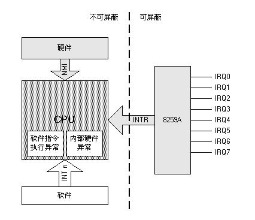

Interrupt的来源从总体上分为硬件（外部）中断和软件中断。其中硬件中断分为不可屏蔽中断NMI(Non-Maskable Interrupt)和可屏蔽硬件中断INTR。Exception的来源于CPU内部，比如软件指令执行异常（比如被0除），或者CPU芯片硬件异常。

NMI、软件中断和异常以及硬件异常都是不可屏蔽的，状态寄存器IF位的设置对它们没有影响。只有INTR是可以屏蔽的，是否屏蔽取决于状态寄存器IF的设置。


Excetpions被更进一步细分为faults，traps，和aborts。

### 2.1.2 Source of Interrupts

#### 2.1.2.1 Hardware Interrupts

Hardware Interrupts又称为External Interrupts，分为NMI和INTR。

NMI产生于硬件本身的突发性事件，比如断电。NMI正如其名，是不可屏蔽的，也就是说不受EFLAGS-IF标志位的影响。NMI使用中断向量号2。


INTR是通过可编程中断控制器PIC(Programmable Interrupt Controller)发送给CPU的，在PIC外部，挂接的都是外部硬件设备，比如时钟，磁盘，键盘，RS232等。INTR是可以屏蔽的，我们可以通过对PIC编程来屏蔽某个或某些设备发出的IRQ。也可以通过CLI指令清除EFLAGS-IF标志位来屏蔽所有来自于PIC的中断。在IBM PC及其兼容机上，所使用的PIC一般是一个或两个Intel 8259A芯片。

#### 2.1.2.2 Software Interrupt

Software Interrupt是软件通过执行INT n指令产生的，其中n是中断向量号。比如软件执行INT 36，则会迫使CPU执行向量号为36的ISR。

从0到255范围内的所有中断向量号都可以作为INT n指令的参数。

### 2.1.3 Source of Exception

#### 2.1.3.1 Hardware Exception

Hardware Exception又称作Machine-Check Exception。P6系列的芯片实现了一套机器检测架构，来提供检测和报告芯片内部操作或总线传输等操作引起的硬件错误的机制，这些错误包括：

- 系统总线错误 (system bus errors)；
- 错误检测与纠正功能引起的错误 (ECC errors)；
- 奇偶错误 (parity errors)；
- 缓存错误 (cache errors)；
- TLB 错误 (TLB errors)

等等。

当一个引起Machine-Check Exception的错误被检测到以后，CPU会触发一个Machine-Check Exception（向量18），并返回一个Error Code。

#### 2.1.3.2 Software Exception

Software Exception的来源有两个：

- CPU检测到的程序错误异常；
- 软件自身产生的异常。

当CPU在执行一个程序（OS或Application）的时候，如果检测到一个程序错误，则会产生一个异常。Intel为每一个CPU可以检测到的异常都定义了一个向量号。

另外，软件可以通过执行指令INTO，INT 3，BOUND来产生一个异常。比如，`INT 3`指令可以引起一个断点异常。

软件可以通过`INT n`指令来模拟产生一个异常。如果`INT n`指令中的n是一个被Intel定义的异常向量，CPU可以产生一个对应那个向量的中断，这个中断将会调用相应的ISR。因为这实际上是一个中断，所以CPU不PUSH一个错误码到堆栈中去，虽然真正由硬件产生的针对那个向量的异常会那么做。对于这些产生错误码的异常来说，相应的ISR会从栈中POP一个错误码。但如果它们被软件通过使用INT n指令来模拟产生的话，由于错误码没有被产生并被压栈，所以放置在栈顶的EIP（用来替代未被生成的错误码）会被POP出来，并被丢弃掉。

------


### 2.1.4 Exception Classifications 

按照如下原则，

1. 被报告的方式；
2. 在不破坏程序的连续性的前提下，引起当前异常的指令是否能够被Restart；

Exceptions可以被进一步细分为Faults，Traps，和Aborts。

#### 2.1.4.1 Faults

一个Fault一般来说是可以被纠正的。一旦一个Fault被纠正，那个引起此Fault的程序可以继续执行，而不破坏程序的连续性。

当一个Fault被报告时，CPU会将机器状态恢复到引起此Fault的指令被执行之前的状态，此Fault的ISR的返回地址（被保存的CS和EIP寄存器的内容）被设置为指向引起此Fault的那条指令，而不是指向这条指令之后的那条指令。

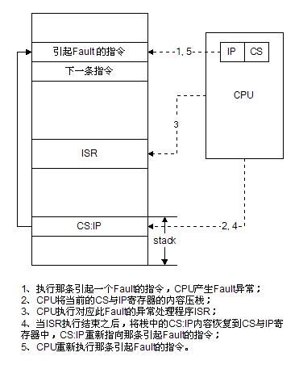


#### 2.1.4.2 Traps

当一个引起Trap的指令被执行之后，一个Trap异常会随即发生。在相应的ISR被执行之后，这个引起此Trap异常的程序可以继续执行，自身的连续性不会被破坏。

针对一个Trap的ISR的返回地址被设置为指向那条引起此Trap的指令之后的那条指令。

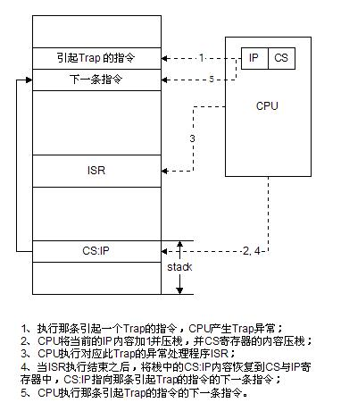

#### 2.1.4.3 Aborts

一个Abort并不总是报告那条引起异常的指令的精确位置，也不允许那个引起Abort异常的程序继续执行。

Aborts被用来报告严重错误，比如硬件错误，以及系统表中（比如TLB）的数据不一致或者非法等错误。

当一个Abort发生时，引起此Abort的程序应该被终止运行。如果此程序是一个OS，则OS应该Halt；如果此程序是一个运行于OS之上的Application，则OS应该对此程序进行中止处理。

## 2.2 Vectors & IDT

### 2.2.1 Overview

为了区分不同的Interrupts和Exceptions，处理器要求必须为每一个Interrupt和Exception指定一个唯一的ID。在Intel x86体系下，这个ID被规定为[0, 255]范围内的数字，这个数字ID就被称作Interrupt/Exception Vector。


每一个Interrupt/Exception都可能会存在一个Service Routine（为了保证简洁性，我们统称ISR），这些ISR可以被无规则的放置在内存中，但它们的入口地址，却会被按照固定的格式，按照对应的Vector Number，整齐的存放在一张放置于内存中的一张表中，这张表在Real Mode下，被叫做IVT（Interrupt Vector Table），在Protected Mode下，被叫做IDT（Interrupt Descriptor Table），它们的格式并不相同，另外，IVT被放置在固定的位置[0H, 3FFH]，而IVT却可以放在一个任意的位置，但这个位置的地址必须汇报给一个叫做IDTR的寄存器。


IDT/IVT都是一种数组结构。按照这种结构，当一个Interrupt/Exception发生时，CPU只需要以此Interrupt/Exception的Vector Number为索引，到IDT/IVT中查到相应的ISR入口地址并执行它就可以了。


下图表现的是在Real Mode下的IVT布局，IVT中的每一项占用4 bytes，用来保存指向当前Interrupt/Exception的ISR的入口地址的指针。格式为16-it segment:16-bit offset。整个IVT共有256个这样的实体，占用256*4 bytes = 1024 bytes。被放置于内存固定位置[0H，3FFH]。


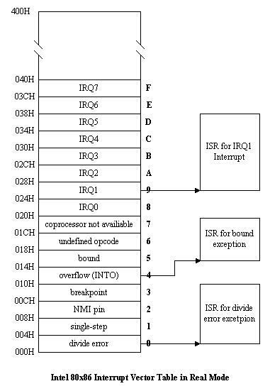

### 2.2.2 Vectors in Protected Mode

在Protected Mode下，最多会存在256个Interrupt/Exception Vectors。

范围[0，31]内的32个向量被Exception和NMI使用，但当前并非所有这32个向量都已经被使用，有几个当前没有被使用的，你也不要擅自使用它们，它们被保留，以备将来可能增加新的Exception。

范围[32，255]内的向量被保留给用户定义的Interrupts。Intel没有定义，也没有保留这些Interrupts。用户可以将它们用作外部I/O设备中断（8259A IRQ），或者System Call （Software Interrupts）等。 

下表中定义了i386芯片Protected Mode下的Interrupt/Exception 向量表。

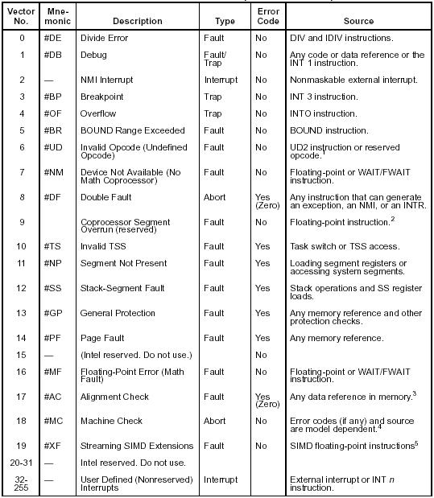

### 2.2.3 IDT

在Protected Mode下，你需要建立一张IDT(Interrupt Descriptor Table)以响应Interrupts/Exceptions。

IDT是一个由Gate Descriptors组成的Array。每一个Gate Descriptor由8个字节组成。每一个Gate Descriptor对应一个Interrupt/Exceptions Vector。由于最多可能存在256个Vectors，所以你完全没有必要创建包含多于256个Gate Descriptor的IDT（当然你那么做不会引起错误，但却造成了浪费）。但你可以创建少于256个Gate Descriptor的IDT，如果你根本不需要用到那么多的话。但一旦你创建了一个IDT，但IDT中的某些Gate Descriptor你没有用到的话，你必须将其present flag清除，否则会造成异常或错误。

IDT可以放在RAM的任何位置，但你必须将它的起始位置的线形地址（base,32-bit），以及它的大小（limit, 16-bit）放到寄存器IDTR中。这样，CPU才能够通过IDTR知道IDT究竟放在哪儿。

当我们设置IDT的位置时，我们最好能将其起始位置按照8对齐，这样可以让CPU对IDT的存取性能最高。

IDTR寄存器长度为48 bits，包括32-bit base address和16-bit limit。

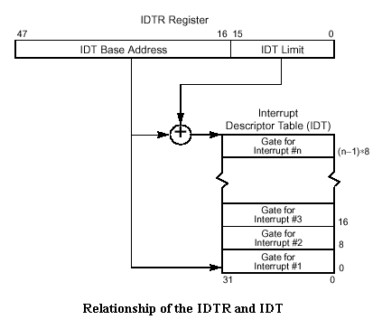

使用LIDT和SIDT指令可以操作IDTR寄存器。LIDT(Load IDTR Register)可以将IDTR寄存器的Base address和Limit装入IDTR寄存器，这个指令只能在CPL(Current Privilege Level )为0，也就是说当前Privilege Level必须为特权等级的情况下被执行。SIDT(Store IDTR Register)可以将IDTR寄存器的内容读出并存储到某个RAM位置，这个指令可以在任何Privilege Level下被执行。

如果一个程序引用的Vector Number超过了IDTR中设置的IDT Limit，一个General-protection Exception会被触发。

我们可以用下列C++代码来实现这两个指令：

```c
typedef unsigned long addr_t;
typedef unsigned long slimit_t;

inline void lidt(addr_t __base, slimit_t __limit)
{
    unsigned long __tmp[2];
    __tmp[0] = __limit << 16;
    __tmp[1] = (unsigned int)__base;
    __asm__ ("lidt (%0)": :"p" (((char *) __tmp)+2));
}

inline void sidt(addr_t& __base, slimit_t& __limit)
{
    unsigned long __tmp[2];
    __asm__ ("sidt (%0)": :"p" (((char *) __tmp)+2));
    memcpy((void*)&__base, (void*)&__tmp[1], 4);
    memcpy((void*)&__limit, (void*)(((char*) __tmp)+2), 2);
}
```

------
### 2.2.4 IDT Descriptors

在IDT中，可以包含如下3种类型的Descriptor：

- Task-gate descriptor
- Interrupt-gate descriptor
- Trap-gate descriptor

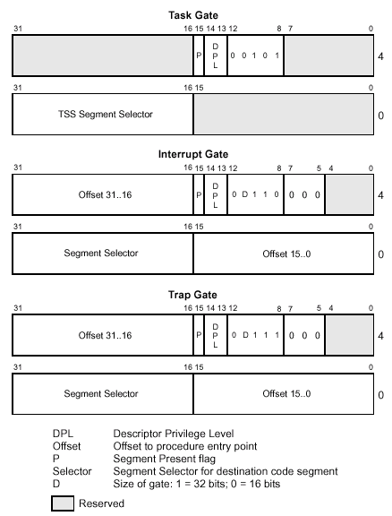

Interrupts/Exceptions应该使用Interrupt Gate和Trap Gate，它们之间的唯一区别就是：当调用Interrupt Gate时，Interrupt会被CPU自动禁止；而调用Trap Gate时，CPU则不会去禁止或打开中断，而是保留它原来的样子。

Task Gate一种通过硬件实现任务切换，将ISR作为一个Task的方法，我们在处理Interrupts/Excetpions的时候，通常不会用到这种方法。

由于Gate Descriptor是由2个32-bit字长的部分组成，我们可以定义：

```c
struct descriptor_s {
    unsigned long low_dw;
    unsigned long high_dw;
};
```

由于IDT最多会有256个实体，所以我们可以定义：

```c
const int  MAX_INTR_DESC_ENTITY = 256;
descriptor_s idt[MAX_INTR_DESC_ENTITY];
```

设置Interrupt Gate Descriptor和Trap Gate Descriptor，我们可以通过下面的C++代码实现：

```c
typedef unsigned long addr_t;
typedef unsigned short selector_t;

inline void set_gate(descriptor_s& __gate_addr,  \
                              unsigned int __type, \
                              unsigned int __dpl, \
                              addr_t __addr, \
                              selector_t __sel)
{
	__gate_addr.low_dw = (__sel << 16) | (__addr&0xffff);
	__gate_addr.high_dw = (__addr&0xffff0000) | 0x8000 | (__dpl << 13) | (__type << 8 );
}
```

如果想更加高效，可以使用汇编：

 ```c
 inline void set_gate(descriptor_s& __gate_addr, \
                               unsigned int __type, \
                               unsigned int __dpl, \
                               addr_t __addr, \
                               selector_t __sel)
 {
          __asm__ __volatile__ ("movw %%dx,%%ax\n\t" 
          "movw %2,%%dx\n\t" 
          "movl %%eax,%0\n\t" 
          "movl %%edx,%1" 
          :"=m" (*((long *) (__gate_addr))), 
           "=m" (*(1+(long *) (__gate_addr))) 
          :"i" ((short) (0x8000+(__dpl<<13)+(__type<<8))), 
           "d" ((char *) (__addr)),"a" (__sel << 16) 
          :"ax","dx");
 }
 ```

下面的C++代码实现了设置Interrupt Gate和Trap Gate的3个Function。函数set_intr_gate/set_trap_gate只能被在CPL=0时调用，对于一个OS来说，只能被内核所引起的中断调用。对于只使用特权等级为0和3的OS来说，set_system_gate既可以被OS Kernel调用，又可以被Application调用。

```c
const unsigned int INTR_GATE_TYPE = 0x0e;
const unsigned int TRAP_GATE_TYPE = 0x0f;

inline void set_intr_gate(unsigned int __n, addr_t __addr, selector_t __sel)
{
    set_gate(idt[__n], INTR_GATE_TYPE, 0, __addr, __sel);
}

inline void set_trap_gate(unsigned int __n, addr_t __addr, selector_t __sel)
{
    set_gate(idt[__n], TRAP_GATE_TYPE, 0, __addr, __sel);
}

inline void set_system_gate(unsigned int __n, addr_t __addr, selector_t __sel)
{
   set_gate(idt[__n], TRAP_GATE_TYPE, 3, __addr, __sel);
}
```

## 2.3 Priority & Control

### 2.3.1 Overview

Interrupts/Exceptions有很多种，当一个Interrupt/Exception发生时，系统会自动调用它的ISR，在ISR被执行期间，可能会发生新的Interrupts/Exceptions，这样，ISR的执行就会被新的Interrupts/Exceptions打断，而新的ISR会被执行，当新的ISR被执行结束之后，再继续执行旧的ISR。这就是Interrupts/Exceptions的嵌套问题。

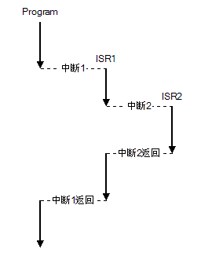

这种嵌套可以有很多层，甚至可以无穷嵌套下去——如果中断发生的频率超过ISR执行速度的话——但这种情况一般不会发生，因为ISR一般都写的非常短小。但如果发生多层嵌套，有时候会存在问题。比如，当OS正在运行的时候，CPU检测到一个内部总线错误，引发了一个Machine-Check Exception，这个时候，CPU应该马上来处理这个Exception。但当CPU正在执行这个Exception的ISR的时候，又接到多个键盘Interrupt。这个时候硬件（内部总线）已经发生了错误，CPU应该优先解决这个错误，如果这时候CPU转而去处理键盘Interrupt的话，可能会引发灾难性的后果。


针对这种情况，一个方法还起来好像能够解决这个问题，那就是，当一个Interrupt/Exception的ISR正在被执行的时候，不响应任何其它Interrupts/Exceptions，也就是说Interrupts/Exceptions应该被一个一个按照FIFO（First In, First Out）的原则处理。


但不幸的是，这样仍然存在问题。我们将上一个例子反过来：当CPU正在处理一个Keyboard Interrupt的时候，CPU突然检测到一个内部总线错误，引发一个Machine-Check Exception，这个时候CPU应该马上去处理这个Exception，而不是继续处理Keyboard Interrupt。


从上面两个例子可以看出，那个Machine-Check Exception总是应该比Keyboard Interrupt优先处理。所以我们需要为不同的Interrupts/Exceptions定义不同的Priority。

### 2.3.2 Priority

当多个Interrupts/Exceptions同时或在很短的时间内相继发生的时候，Intel 80x86芯片可以以一种可以预知的顺序来先后处理它们。能够预知的原因就是每个Interrupt/Exception都有自己的Priority。对于这批Interrrupts/Exceptions，CPU优先执行高优先级的，对于相同优先级的，CPU以FIFO的顺序执行它们。

对于所有可能的Interrupts/Exceptions，Intel为它们定义了各自的Priority。这些Priority分类按照Interrupts/Exceptions的来源进行。下表总结了这些分类：

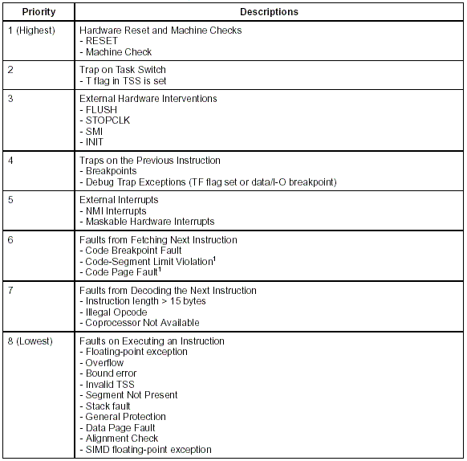


当一个Interrupt/Exception正在被处理时，如果又发生了其它Interrupts/Exceptions，CPU会去查看它们中间是否存在着比当前正在处理的Interrupt/Exception 优先级更高的，如果存在，则保留当前中断处理的Context，然后从这些Interrupts/Exceptions中挑选一个优先级最高的，并开始处理它。然后，剩下的那些未被处理的Exceptions将被丢弃，未被处理的Interrupts则继续处于Pending状态，等待被处理。那些被丢弃的Exceptions，都是由软件引起的（由硬件引起的Exceptions具有最高的Priority，永远不可能被丢弃），所以，等所有的Interrupts/Exceptions被处理结束时候，执行点会重新回到那些引起这些Exceptions的点，那时候，Exceptions会被重新生成并被处理。


下图表现了CPU的指令循环（Instruction Cycle）：

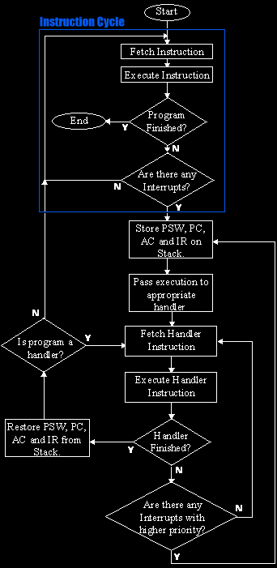


------

### 2.3.3 Control - Disable & Enable Interrupts

依赖于状态寄存器EFLAGS的IF和RF位的设置，CPU可以禁止一些Interrupts的发生。


#### 2.3.3.1 Masking Maskable Hardware Interrupts

EFLAGS寄存器的IF位的设置可以决定是否屏蔽那些来自于INTR pin的中断。

如果IF位被清除，CPU会禁止外部中断传递给INTR pin；如果IF位被设置，CPU则允许外部中断传递给INTR pin。INTR pin外接PIC-8259A。IF位的设置不影响NMI，也不影响处理器产生的Exceptions。当CPU被Reset之后，IF位被清除。


通过STI(Set Interrupt-Enable Flag)和CLI(Clear Interrupt Flag)指令可以设置和清除IF位。但在执行这些指令时，必须保证当前CPL小于或等于IOPL；如果CPL > IOPL，则会产生一个General Protection Exception。

我们可以使用C的Macro实现这两个操作：

```c
#define sti() __asm__ __volatile__ ("sti": : :"memory")
#define cli() __asm__ __volatile__ ("cli": : :"memory")
```

也可以使用C++的inline函数：

```c
inline void sti(void)
{
    __asm__ __volatile__ ("sti": : :"memory");
}

inline void cli(void)
{
    __asm__ __volatile__ ("cli": : :"memory")
}
```

IF位还受下列情况的影响：

- PUSHF指令将所有的flags存入Stack中，在Stack中flags可以被检测和修改。然后POPF指令会将这些修改过的flags放入EFLAGS寄存器。
- 任务切换，以及POPF和IRET指令会引起内存中的值装入EFLAGS寄存器，因此，它们可以被用来修改IF位的设置。
- 当一个Interrupt通过一个Interrupt Gate处理时，为了屏蔽掉所有的Maskable Hardware Interrupts，IF flag会被自动清除。但如果一个中断通过一个Trap Gate处理时，IF flag不受影响。

#### 2.3.3.2 Masking Instruction Breakpoints

EFLAGS寄存器的RF位被用来控制CPU对Instruction Breakpoints Condition的响应。如果被设置，则禁止Instruction Breakpoints产生Debug Exceptions；如果被清除，则Instruction Breakpoints将会产生Debug Exceptions。

#### 2.3.3.3 Masking Exceptions & Interrupts when Switching Tasks

为了切换到一个不同的Stack Segment，通常会使用下面一对指令：

```assembly
movw %ax, %ss
movl   $stack_top, %esp
```

如果在这个segment selector被装入SS寄存器之后，在ESP寄存器被装入之前，一个Interrupt/Exception恰好发生了，由于一个Stack是由SS和ESP两个寄存器决定的，那么在这个刚刚发生的Interrupt/Exception的ISR执行期间，这个Stack可能处于一种不合法的状态。

为了避免这种情况，CPU在执行了一个MOV to SS指令，或一个POP to SS指令之后，会禁止：

- 所有的Interrupts(包括著名的NMI)；
- debug exceptions；
- single-step trap exceptions

知道下一条指令被执行完毕之后（不管下一条指令是什么）为止。在这个期间，其它的Exceptions仍然可以被生成。 

如果使用LSS指令来修改SS寄存器，这个问题就不存在。并且这种方法也是被Intel建议用来修改SS寄存器的方法。

## 2.4 Handling & Error Code

### 2.4.1 Overview

当一个Interrupt/Exception发生时，CPU将以这个Interrupt/Exception的Vector Number为索引，到IDT中查找相应的Gate Descriptor。IDT中的Gate Descriptor有3种：Interrupt Gate Descriptor，Trap Gate Descriptor，Task Gate Descriptor。根据被设置的Gate Descriptor的不同，对ISR的调用方法和处理过程也不同。

当某些Exceptions发生时，会返回Error Code，以通知相应的ISR是那个Segment引起了这个Exception。

### 2.4.2 ISR Handling

一个ISR(Interrupt Service Routine)是一块专门用来处理某个Interrupt/Exception的程序。

如一个Interrupt/Exception引用的是一个Interrupt Gate或Trap Gate，则当这个Interrupt/Exception发生时，不发生任务切换，其ISR仍然引用当前任务的Context。Interrupt/Trap Gate Descriptor中的Segment Selector引用的是一个放在GDT或当前LDT中的可执行代码段。Offset域引用的是其ISR的入口地址。


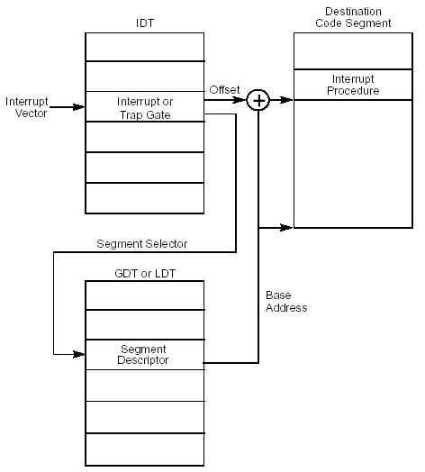

当CPU调用一个ISR时，会将EFLAGS，CS，EIP寄存器压栈，其中CS，EIP寄存器的内容事实上是ISR的返回地址。如果一个Exception发生时，存在一个Error Code，那么这个Error Code会在EIP之后被压栈。

如果ISR和被打断的任务具有相同的特权等级，则CPU不改变Stack，让ISR继续使用当前的Stack。

如果ISR的特权等级从数字上小于被打断任务的特权等级，也就是说如果ISR的权限大于被打断任务的权限，则会发生Stack Switch。为了能够在ISR结束之后，能够恢复使用原来的Stack，CPU会将SS和ESP寄存器的内容也压栈，并且这些内容都被压在新的Stack中，而不是Stack Switch之前的那个Stack。

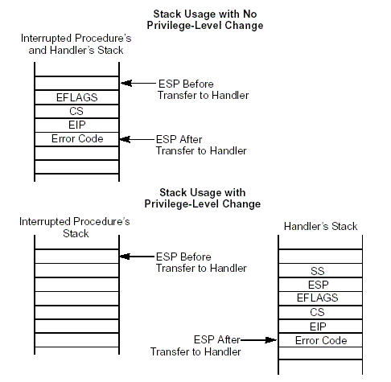

问题是，CPU在Interrupt/Exception发生的时刻，发现特权等级不一致的时候，如何知道该使用那个栈？答案是通过当前任务的TSS。在TSS中存放着针对0，1，2三个特权等级的SS和ESP内容，当特权等级切换到某个特权等级的时候，CPU会从当前任务的TSS中找到相应特权等级的SS和ESP用来进行Stack Switch。

当ISR执行结束之后，需要继续执行之前被终止的任务，为了能够正确的做到这一点，ISR的返回必须使用IRET指令。IRET指令会自动从Stack中恢复EFLAGS寄存器的值，并根据Stack中的CS，EIP内容挑转到被中断的位置。如果之前在Interrupt/Exception发生的时候，进行了Stack Switch，此时IRET会根据栈中的SS，ESP的内容将Stack切换回去。

当通过一个Interrupt Gate或Trap Gate来处理一个Interrupt/Exception时，CPU会在将EFLAGS压栈之后，清除EFLAGS寄存器的TF flag。清除TF flag，是为了避免Instruction tracing影响中断的响应。随后的IRET指令会从栈中的EFLAGS中恢复TF flag的值。

在Interrupt Gate和Trap Gate之间的唯一区别是，当通过一个Interrupt Gate来处理一个Interrupt/Exception时，CPU会在将EFLAGS压栈之后，清除EFLAGS寄存器的IF flag。清除IF flag，是为了避免在当前ISR执行时受到其它Interrupts的影响。随后的IRET指令会从栈中的EFLAGS中恢复IF flag的值。而通过Trap Gate来处理Interrupt/Exception则不会影响IF flag的设置。

需要注意的是，在恢复EFLAGS的时候，只有CPL=0的时候，IOPL域才能够被恢复；只有CPL在数值上小于或等于IOPL时，IF位才能够被恢复。

下面是用C++实现的IRET指令：

```c
inline void iret(void)
{
        __asm__ __volatile__ ("iret": : :"memory");
}
```

**Task Gate**

如果调用Task Gate，会引起Context切换。如果Interrupts/Exceptions使用这种方式的话，会有如下几个优点：

- 被中断的程序的Context会被完全被保存；
- 允许ISR使用新的CPL为0的stack；这样如果Interrupt/Exception是由于内核stack越界引起的话，可以通过TSS指定的新的CPL=0的stack来解决这个故障，而不是让系统崩溃；
- ISR可以被放在一个独立的地址空间中，这种情况下，你需要通过设定一个独立的LDT。

但也必须注意它的缺点：由于在任务切换时，当时的机器状态需要全部被保存，所以它的性能要比Interrupt Gate和Trap Gate低。从而导致中断延迟越来越多。

将ISR作为一个Task，然后通过Task Gate实现从被中断任务向ISR Task的切换，与普通的任务切换没有什么两样。我们注意到，在Task Gate Descriptor中，一个主要的元素就是TSS Segment Selector，这个Selector指向一个存放在GDT中的TSS Descriptor。它所指向的TSS是供ISR Task使用的。这个TSS中的Previous Task Link域指向那个被中断任务的TSS。如果Exception返回一个error code的话，那么error code会被保存在ISR Task的stack中。

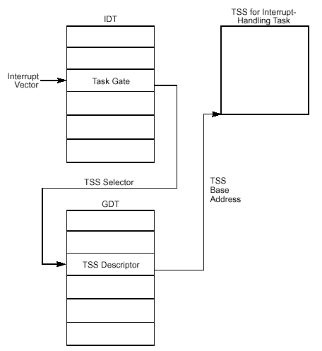

------

### 2.4.3 Task Restart 

为了能够保证一个被中断的Task能够在ISR运行结束后继续运行，除了Aborts之外的其他Exceptions，会保证在引起异常的精确指令位置来触发这个Exception。而所有的Interrupts则保证在一个指令结束后才会被触发。也就是说Interrupts/Exceptions都不会破坏指令的原子性。


由于Fault类的Exception是一种可恢复异常，其ISR就是为了处理造成异常的条件，等处理结束后，CPU会返回重新执行那条引起异常的指令。一个最常用的例子是Page-fault Exception——当系统引用一个Page时，如果这个Page不在RAM中，会引起Page-fault Exception，而其ISR所作的就是将这个Page以某种算法调入RAM，这时候，引起Exception的条件已经解除了，当ISR结束之后，重新去执行那条引用此Page的指令，就不会再引起任何异常。所以，对于Fault类Exception，当发生时，在Stack中保存的CS和EIP的内容应该是那条引起Exception的那条指令的位置。


而Trap类Exceptions用于在进行下一步操作之前的条件检查，比如INTO指令用于在执行下一条指令之前检查EFLAGS的OF flag，如果OF flag被设置，则引起一个Overflow Exception；再比如BOUND指令用于在进行数组操作之前检查一个对某个数组的索引是否越界，一旦越界，则会引起一个Bound Range Exceed Exception；而这些Exceptions的ISR被用作消除这些引起异常的条件，然后指令从下一条继续执行。另外，Trap类Exception也被用作调试目的，如INT 1和INT 3，一旦执行这两个指令，则会引起一个Debug Exception或Breakpoint Exception；这时候ISR的目的被用作暂时阻塞当前任务的运行，等阻塞解除后，任务可以从下一条指令继续进行。这里所说的"下一条"，指的不是指令物理顺序，而是指令执行顺序的。比如一个JMP指令执行时发生Trap Exception异常，那么等ISR执行结束后，继续执行的是JMP指令要跳转去的位置的那条指令。

Abort类的Exception不支持可靠的Task Restart。Abort ISR被设计为用来收集关于Abort Exception发生时的诊断信息，然后尽可能优雅的当掉Application和系统。

Interrupts严格的支持被中断程序的Restart。被保存在Stack中的CS, EIP内容指向Interrupt发生时执行结束的那条指令之后的那条指令。如果当时被执行的指令有循环前缀（比如REP），则CPU会等到当前这次循环结束，相关寄存器被设置为下一次循环的内容之后，才会引发Interrupt。


### 2.4.4 Error Code

如果一个Exception Condition与一个段相关的时候，那么当这个Exception发生的时候，CPU会将一个Error Code压入ISR所使用的Stack中。

Error Code的格式如下图所示：

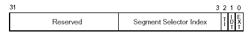


- **EXT** - External event (bit 0). 如果EXT被设置，则表示一个External event引起了这个Exception。比如一个硬件中断。
- **IDT** - Descriptor location (bit 1). 如果IDT被设置，表示这个Error Code中的Segment Select Index引用的是一个IDT中的Gate Descriptor。否则，则表示引用的是一个GDT或当前LDT中的一个Descriptor。
- **TI** - GDT/LDT (bit 2). 如果IDT bit被清除时，才使用这个bit来进一步区分Segment Select Index引用的是GDT还是本地LDT中的Descriptor。被设置则表示本地LDT，否则表示GDT。


当一个带有Error Code的Exception发生时，一个Error Code会被压入栈顶，但必须注意的是，IRET指令并不Pop，所以ISR程序在执行IRET之前必须明确的删除它。

当一个Exception是通过INT n指令产生的时候，即使对于那些产生Error Code的异常来说，CPU也不会将Error Code压栈。

## 2.5 PIC - 8259A

### 2.5.1 Overview

在本章的第一节我们已经提到，中断的来源除了来自于硬件自身的NMI中断和来自于软件的`INT n`指令造成的软件中断之外，还有来自于外部硬件设备的中断，这些中断是可屏蔽的。这些中断也都通过PIC(Programmable Interrupt Controller)进行控制，并传递给CPU。在IBM PC极其兼容机上所使用的PIC是Intel 8259A芯片。8259A芯片的功能非常强大，但在IBM PC上，我们只用到比较简单的功能。我们本节也只讨论其在PC上的使用。

一个8259A芯片的可以接最多8个中断源，但由于可以将2个或多个8259A芯片级连（cascade），并且最多可以级连到9个，所以最多可以接64个中断源。早期，IBM PC/XT只有1个8259A，. 但设计师们马上意识到这是不够的，于是到了IBM PC/AT，8259A被增加到2个以适应更多外部设备的需要，其中一个被称作Master，另外一个被称作Slave，Slave以级连的方式连接在Master上。如今绝大多数的PC都拥有两个8259A，这样 最多可以接收15个中断源。

通过8259A可以对单个中断源进行屏蔽。 


### 2.5.2 Principle

在一个8259A芯片有如下几个内部寄存器：

- Interrupt Mask Register (IMR)
- Interrupt Request Register (IRR)
- In Sevice Register (ISR)

IMR被用作过滤被屏蔽的中断；

IRR被用作暂时放置未被进一步处理的Interrupt；

当一个Interrupt正在被CPU处理时，此中断被放置在ISR中。

除了这几个寄存器之外，8259A还有一个单元叫做Priority Resolver，当多个中断同时发生时，Priority Resolver根据它们的优先级，将高优先级者优先传递给CPU。

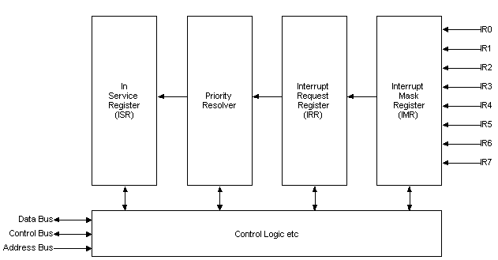


当一个中断请求从IR0到IR7中的某根线到达IMR时，IMR首先判断此IR是否被屏蔽，如果被屏蔽，则此中断请求被丢弃；否则，则将其放入IRR中。

在此中断请求不能进行下一步处理之前，它一直被放在IRR中。一旦发现处理中断的时机已到，Priority Resolver将从所有被放置于IRR中的中断中挑选出一个优先级最高的中断，将其传递给CPU去处理。IR号越低的中断优先级别越高，比如IR0的优先级别是最高的。

8259A通过发送一个INTR(Interrupt Request)信号给CPU，通知CPU有一个中断到达。CPU收到这个信号后，会暂停执行下一条指令，然后发送一个INTA(Interrupt Acknowledge)信号给8259A。8259A收到这个信号之后，马上将ISR中对应此中断请求的Bit设置，同时IRR中相应的bit会被reset。比如，如果当前的中断请求是IR3的话，那么ISR中的bit-3就会被设置，IRR中IR3对应的bit就会被reset。这表示此中断请求正在被CPU处理，而不是正在等待CPU处理。

随后，CPU会再次发送一个INTA信号给8259A，要求它告诉CPU此中断请求的中断向量是什么，这是一个从0到255的一个数。8259A根据被设置的起始向量号（起始向量号通过中断控制字ICW2被初始化）加上中断请求号计算出中断向量号，并将其放置在Data Bus上。比如被初始化的起始向量号为8，当前的中断请求为IR3，则计算出的中断向量为8+3=11。

CPU从Data Bus上得到这个中断向量之后，就去IDT中找到相应的中断服务程序ISR，并调用它。如果8259A的End of Interrupt (EOI)通知被设定位人工模式，那么当ISR处理完该处理的事情之后，应该发送一个EOI给8259A。

8259A得到EOI通知之后，ISR寄存器中对应于此中断请求的Bit会被Reset。

如果8259A的End of Interrupt (EOI)通知被设定位自动模式，那么在第2个INTA信号收到后，8259A ISR寄存器中对应于此中断请求的Bit就会被Reset。

在此期间，如果又有新的中断请求到达，并被放置于IRR中，如果这些新的中断请求中有比在ISR寄存中放置的所有中断优先级别还高的话，那么这些高优先级别的中断请求将会被马上按照上述过程进行处理；否则，这些中断将会被放在IRR中，直到ISR中高优先级别的中断被处理结束，也就是说知道ISR寄存器中高优先级别的bit被Reset为止。

------

### 2.5.3 IRQ2/IRQ9 Redirection

为什么要将IRQ2重定向到IRQ9上？这仍然是由于兼容性问题造成的。


早期的IBM PC/XT只有一个8259A，这样就只能处理8种IRQ。但很快就发现这根本不能满足需求。所以到了IBM PC/AT，又以级连的方式增加了一个8259A，这样就可以多处理7种IRQ。原来的8259A被称作Master PIC，新增的被称作Slave PIC。但由于CPU只有1根中断线，Slave PIC不得不级连在Master PIC上，占用了IRQ2，那么在IBM PC/XT上使用IRQ2的设备将无法再使用它；但新的系统又必须和原有系统保持兼容，怎么办？

由于新增加的Slave PIC在原有系统中不存在，所以，设计者从Slave PIC的IRQ中挑出IRQ9，要求软件设计者将原来的IRQ2重定向到IRQ9上，也就是说IRQ9的中断服务程序需要去掉用IRQ2的中断服务程序。这样，将原来接在IRQ2上的设备现在接在IRQ9上，在软件上只需要增加IRQ9的中断服务程序，由它调用IRQ2的中断服务程序，就可以和原有系统保持兼容。而在当时，增加的IRQ9中断服务程序是由PC开发商开发的BIOS提供的，所以就从根本上保证了兼容。

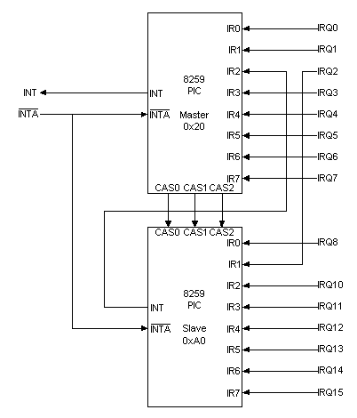

------

### 2.5.4 Programming the 8259As

每一个8259A芯片都有两个I/O ports，程序员可以通过它们对8259A进行编程。

Master 8259A的端口地址是0x20，0x21；

Slave 8259A的端口地址是0xA0，0xA1。

程序员可以向8259A写两种命令字：

1. ***Initialization Command Word (ICW)；***这种命令字被用作对8259A芯片的初始化。
2. ***Operation Command Word (OCW)：***这种命令被用来向8259A发布命令，以对其进行控制。OCW可以在8259A被初始化之后的任何时候被使用。

下表的内容是Master 8259A的I/O端口地址，以及通过它们所能操作的寄存器。

| **Address** | **Read/Write** | **Function**                         |
| ----------- | -------------- | ------------------------------------ |
| 0x20        | Write          | Initialization Command Word 1 (ICW1) |
|             | Write          | Operation Command Word 2 (OCW2)      |
|             | Write          | Operation Command Word 3 (OCW3)      |
|             | Read           | Interrupt Request Register (IRR)     |
|             | Read           | In-Service Register (ISR)            |
| 0x21        | Write          | Initialization Command Word 2 (ICW2) |
|             | Write          | Initialization Command Word 3 (ICW3) |
|             | Write          | Initialization Command Word 4 (ICW4) |
|             | Read/Write     | Interrupt Mask Register (IMR)        |

Addresses/Registers for Master 8259A

下表的内容是Slave 8259A的I/O端口地址，以及通过它们所能操作的寄存器。

| **Address** | **Read/Write** | **Function**                         |
| ----------- | -------------- | ------------------------------------ |
| 0xA0        | Write          | Initialization Command Word 1 (ICW1) |
|             | Write          | Operation Command Word 2 (OCW2)      |
|             | Write          | Operation Command Word 3 (OCW3)      |
|             | Read           | Interrupt Request Register (IRR)     |
|             | Read           | In-Service Register (ISR)            |
| 0xA1        | Write          | Initialization Command Word 2 (ICW2) |
|             | Write          | Initialization Command Word 3 (ICW3) |
|             | Write          | Initialization Command Word 4 (ICW4) |
|             | Read/Write     | Interrupt Mask Register (IMR)        |

​                                   Addresses/Registers for Slave 8259A

由于8259A芯片不仅能够用于IBM PC/X86，也可以被用作MCS-80/85，对于这两者，在操作模式上有一些不一样，对于某些寄存器的设置也有所不同。我们后面仅仅讨论X86模式相关的内容。

### 2.5.5 Initialization

当主机Power-on或Reset之后，必须对两个8259A都进行初始化。事实上，BIOS已经这么做了。但不幸的是，BIOS对其进行的初始化的结果并非我们所需要。比如，我们要开发Protected Mode下OS，我们要设置自己的IDT，那么我们就不能使用BIOS设置的IVT，而在对8259A初始化操作中，我们需要告诉8259A，其相关中断请求的起始向量号，而我们对IDT的中断向量布局和BIOS设置的IVT的中断向量布局可以是不一样的。这样，我们也需要对两个8259A进行初始化。

任何时候，只要向某一个8259A的第一个端口(0x20 for Master, and 0xA0 for Slave)写入的命令的bit-4(从0算起)为1，那么这个8259A就认为这是一个ICW1；而一旦一个8259A收到一个ICW1，它就认为一个初始化序列开始了。你可以通过对照上边的表和后面的表，第一端口可写的有ICW1，OCW2和OCW3。而ICW1的bit-4要求必须是1，但OCW2和OCW3的bit-4要求必须是0。

8259A的初始化流程协议如下图所示，程序员对其进行初始化时必须遵守此协议：

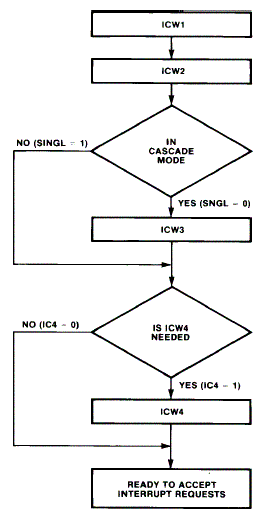

**ICW1**

| **Bit(s)** | **Function**                                   |                            |
| ---------- | ---------------------------------------------- | -------------------------- |
| 7:5        | Interrupt Vector Addresses for MCS-80/85 Mode. |                            |
| 4          | Must be set to 1 for ICW1                      |                            |
| 3          | 1                                              | Level Triggered Interrupts |
| 3          | 0                                              | Edge Triggered Interrupts  |
| 2          | 1                                              | Call Address Interval of 4 |
| 2          | 0                                              | Call Address Interval of 8 |
| 1 (SINGL)  | 1                                              | Single PIC                 |
| 1 (SINGL)  | 0                                              | Cascaded PICs              |
| 0 (IC4)    | 1                                              | Will be Sending ICW4       |
| 0 (IC4)    | 0                                              | Don't need ICW4            |

​                   Initialization Command Word 1 (ICW1)

对于X86，bit-0必须被设置为1；由于当今的IBM PC上都有两个级连的8259A，所以bit-1应该被设置为0；由于bit-2是为MCS-80/85服务的，我们将其设置为0；bit-3也设置为0；bit-4被要求必须设置为1；bit5:7是为MCS-80/85服务的，对于X86，应将全部将其设为0。

所以，在X86系统上，ICW1应该被设置为二进制00010001 = 0x11。

**ICW2**

| **Bit** | **80x86 Mode** |
| ------- | -------------- |
| 7       | I7             |
| 6       | I6             |
| 5       | I5             |
| 4       | I4             |
| 3       | I3             |
| 2       | 0              |
| 1       | 0              |
| 0       | 0              |

​                              Initialization Command Word 2 (ICW2)

ICW2被用作指定本8259A中的中断请求的起始中断向量，bit0:3必须被设为0；所以，其起始中断向量必须是8的倍数。比如，我们的OS的设计讲来自于Master 8259A的8个中断请求放在IDT的第32 (从0开始计)个位置到第39个位置，则我们应该将ICW2设为0x20。

这样，当将来此8259A上接收到一个IRQ时，其低3位会被自动填充为IRQ号。比如，其收到一个IRQ6，将6自动填充到后3位，则生成的向量号为0x26。8259A会在收到CPU发来的第二个INTA信号之后，将生成的向量号放到Data Bus上。

**ICW3**

Master 8259A和Slave 8259A有不同的ICW3格式。

| **Bit** | **Function**                |
| ------- | --------------------------- |
| 7       | IR7 is connected to a Slave |
| 6       | IR6 is connected to a Slave |
| 5       | IR5 is connected to a Slave |
| 4       | IR4 is connected to a Slave |
| 3       | IR3 is connected to a Slave |
| 2       | IR2 is connected to a Slave |
| 1       | IR1 is connected to a Slave |
| 0       | IR0 is connected to a Slave |

​                               Initialization Command Word 3 for Master 8259A (ICW3)

Slave 8259A被接在Master 8259A的那个IRQ上，则相应的位就被设置为1，其余的位都被设置为0。在IBM PC上，Slave 8259A被接在Master 8259A的IRQ2上，则此ICW3的值应该被设置为二进制00000100 = 0x04。

| **Bit(s)** | **Function**       |         |
| :--------- | ------------------ | ------- |
| 7          | Reserved. Set to 0 |         |
| 6          | Reserved. Set to 0 |         |
| 5          | Reserved. Set to 0 |         |
| 4          | Reserved. Set to 0 |         |
| 3          | Reserved. Set to 0 |         |
| 2:0        | *Slave ID*         |         |
|            | 000                | Slave 0 |
|            | 001                | Slave 1 |
|            | 010                | Slave 2 |
|            | 011                | Slave 3 |
|            | 100                | Slave 4 |
|            | 101                | Slave 5 |
|            | 110                | Slave 6 |
|            | 111                | Slave 7 |

​                                   Initialization Command Word 3 for Slaves (ICW3)

Slave 8259A的ICW3的bit3:7被保留，必须被设为0；而bit0:2被设置为此Slave 8259A被接在Master 8259A的哪个IRQ上。比如，在IBM PC上，Slave 8259A被接在Master 8259A的IRQ2上，则此ICW3应被设为0x02。

**ICW4**

| **Bit(s)** | **Function**       |                               |
| ---------- | ------------------ | ----------------------------- |
| 7          | Reserved. Set to 0 |                               |
| 6          | Reserved. Set to 0 |                               |
| 5          | Reserved. Set to 0 |                               |
| 4          | 1                  | Special Fully Nested Mode     |
|            | 0                  | Not Special Fully Nested Mode |
| 3:2        | 0x                 | Non - Buffered Mode           |
|            | 10                 | Buffered Mode - Slave         |
|            | 11                 | Buffered Mode - Master        |
| 1          | 1                  | Auto EOI                      |
|            | 0                  | Normal EOI                    |
| 0          | 1                  | 8086/8080 Mode                |
|            | 0                  | MCS-80/85                     |

​                                 Initialization Command Word 4 (ICW4)


在80x86模式下，我们不需要使用8259A的特殊功能，因此我们将bit1:4都设为0，这意味使用默认的Full Nested Mode，不使用Buffer，以及手动EOI模式；我们只需要将bit-0设为1，这也正是我们ICW0处提到的我们为什么必须要ICW4的原因。所以ICW4的值应该被设为0x01。

所以我们可以用下列代码初始化2个8259A芯片：

```c
inline void init_8259a(void)
{
     /* icw1 */
     outb( 0x11, 0x20 ); /* master port A */
     outb( 0x11, 0xA0 ); /* slave port A */
 
     /* icw2 */
     outb( 0x20, 0x21 ); /* master offset of 0x20 in the IDT */
     outb( 0x28, 0xA1 ); /* slave offset of 0x28 in the IDT */
 
     /* icw3 */
     outb( 0x04, 0x21 ); /* slaves attached to IR line 2 */
     outb( 0x02, 0xA1 ); /* this slave in IR line 2 of master */
 
     /* icw4 */
     outb( 0x01, 0x21 ); /* set as master */
     outb( 0x01, 0xA1 ); /*set as slave */
}
```

### 2.5.6 Operation

一旦按照初始化协议初始化完成之后，程序员就可以在任何时候，以任何顺序向8259A发送操作控制字OCW了。

**OCW1** 

| **Bit** | **PIC 2**  | **PIC 1** |
| ------- | ---------- | --------- |
| 7       | Mask IRQ15 | Mask IRQ7 |
| 6       | Mask IRQ14 | Mask IRQ6 |
| 5       | Mask IRQ13 | Mask IRQ5 |
| 4       | Mask IRQ12 | Mask IRQ4 |
| 3       | Mask IRQ11 | Mask IRQ3 |
| 2       | Mask IRQ10 | Mask IRQ2 |
| 1       | Mask IRQ9  | Mask IRQ1 |
| 0       | Mask IRQ8  | Mask IRQ0 |

​                                Operation Control Word 1 (OCW1)

OCW1是用来做中断请求屏蔽用的操作控制字。如果你想屏蔽那个IRQ，只需要对照上表将相应的Bit置为1，然后发送给相应的8259A就可以了。比如我想屏蔽IRQ10，我只需要将0x0A写到端口0xA1。对应代码如下：

```c
outb(0x0A, 0xA1);
```

**OCW2**

| **Bit(s)** | **Function**     |                                       |
| ---------- | ---------------- | ------------------------------------- |
| 7:5        | 000              | Rotate in Auto EOI Mode (Clear)       |
|            | 001              | Non Specific EOI                      |
|            | 010              | Reserved                              |
|            | 011              | Specific EOI                          |
|            | 100              | Rotate in Auto EOI Mode (Set)         |
|            | 101              | Rotate on Non-Specific EOI            |
|            | 110              | Set Priority Command (Use Bits 2:0)   |
|            | 111              | Rotate on Specific EOI (Use Bits 2:0) |
| 4          | Must be set to 0 |                                       |
| 3          | Must be set to 0 |                                       |
| 2:0        | 000              | Act on IRQ 0 or 8                     |
|            | 001              | Act on IRQ 1 or 9                     |
|            | 010              | Act on IRQ 2 or 10                    |
|            | 011              | Act on IRQ 3 or 11                    |
|            | 100              | Act on IRQ 4 or 12                    |
|            | 101              | Act on IRQ 5 or 13                    |
|            | 110              | Act on IRQ 6 or 14                    |
|            | 111              | Act on IRQ 7 or 15                    |

​                       Operation Control Word 2 (OCW2)


通过将bit3:4设置为0，以说明这是一个OCW2。如果bit-6被设为1，则bit0:2有效，其操作则是面向某个IRQ的；否则将bit0:2设为0，其操作是面向整个8259A的所有IRQ的。我们一般只会用到No Specific EOI——因为我们在初始化8259A时，制定的EOI Mode为手动模式，所以当每次对应某个8259A芯片的IRQ的中断服务程序ISR执行结束后，都需要向8259A发送一个EOI，其对应的OCW2的值为0x20。需要注意的是，由于IBM PC有2个级连的8259A，所以我们每次必须分别给两个都发一个。

比如下面示例代码用来向两个8259A芯片发送EOI，它需要在针对来自于两个8259A芯片的中断的服务程序ISR末尾处被调用：

```c
inline void send_eoi(void)
{
     /* Send EOI to both master and slave */
    outb( 0x20, 0x20 ); /* master PIC */
    outb( 0x20, 0xA0 ); /* slave PIC */
}
```

**OCW3**

| **Bit(s)** | **Function**     |                                              |
| ---------- | ---------------- | -------------------------------------------- |
| 7          | Must be set to 0 |                                              |
| 6:5        | 00               | Reserved                                     |
|            | 01               | Reserved                                     |
|            | 10               | Reset Special Mask                           |
|            | 11               | Set Special Mask                             |
| 4          | Must be set to 0 |                                              |
| 3          | Must be set to 1 |                                              |
| 2          | 1                | Poll Command                                 |
|            | 0                | No Poll Command                              |
| 1:0        | 00               | Reserved                                     |
|            | 01               | Reserved                                     |
|            | 10               | Next Read Returns Interrupt Request Register |
|            | 11               | Next Read Returns In-Service Register        |

​                              Operation Control Word 3 (OCW3)

通过将Bit-3设为1，Bit-4设为0，以让8259A知道这是一个OCW3。OCW3中对我们最有意义的位是bit0:1，我们可以通过将bit-1设为1来通知8259A，下一个读端口的动作将要读取IRR或ISR寄存器的内容。

比如下面示例C++代码用来读取Master 8259A的IRR寄存器内容到__irr变量中：

```c
void read_irr(unsigned char& __irr)
{
    outb(0x02, 0x20);
    inb(&__irr, 0x20);
}
```

### 2.5.7 Full Nested Mode

为了让我们更加理解8259A的中断控制机理，我们需要说明一下Full Nested Mode。在我们初始化时，只需要将ICW4的bit-4设为0，我们就选择了Full Nested Mode。

Full Nested Mode其实就是实现按照中断请求的优先级别进行抢断处理的机制——如果当前一个IRQ正在被CPU处理，也就是说，当前CPU正在调用其中断服务程序ISR；这时8259A又接到了新的IRQ，如果此IRQ的优先级大于正在处理的IRQ，那么，此IRQ就会被提交给CPU以优先处理；否则此IRQ则被放置在IRR中，直到所有的高优先级中断被处理结束为止。

其处理过程大致如下：

在ISR寄存器中有一个8-bit的字节，范围为bit[0,7]；每一个bit对应一个IRQ（IRQ0-IRQ7对应bit[0,7]）。当一个IRQ被提交给CPU之后（收到来自于CPU的第一个INTA信号之后），其对应的bit会被设置为1。比如IRQ6被提交给CPU之后，IS Register的bit-6会被设置为1。当此8259A收到一个EOI之后（对于手动模式，这意味着一个优先级别最高的中断请求被处理结束），会将IS Register中被设置的最高优先级IRQ的对应的bit清为0。比如在收到一个EOI时，发现IS Register的bit-3, bit-5, bit-6被设置，那么被清除的则是bit-3（越小优先级别越高）。在清除优先级最高的bit之后，8259A会到IRR中察看是否有优先级别高于当前正在处理的IRQ中优先级别最高的IRQ，如果有，则将此IRQ提交给CPU处理，同时设置相应的bit。还以上面的例子为例，当bit-3被清除之后，如果发现在IRR中有一个IRQ4等待被处理，则将其提交给CPU，在收到来自于CPU的第一个INTA信号之后，则将IS Register的bit-4置为1。

在此过程中，如果8259A接到更高优先级别的IRQ，则将其立即提交给CPU。比如，当前正在处理的IRQ为IRQ3，IRQ5，那么IS Register中被设置的bit为bit-3，bit-5；如果此时接到一个IRQ1，则立即将其提交给CPU，在收到来自于CPU的第一个INTA信号之后，则将IS Register的bit-1置为1。

由此过程我们也可以看出，为了实现这种优先级机制，必须将EOI设为手动模式，也就是说必须将ICW4的bit-1设为0。因为，对于自动EOI模式，8259A会在收到来自于CPU的第2个INTA信号之后，就自动将IS Register中此IRQ对应的bit清0，而事实上，这个时候此IRQ对应的中断服务程序还没有被CPU调用，也就是说此IRQ还没有被处理结束，而由于此IRQ对应的bit已经被清除，如果此IRQ是一个优先级很高的话，那么此IRQ的处理完全可以被一个优先级别更低的IRQ所中断。这不是我们所需要的。

## 2.6 System Call

### 2.6.1 Overview

操作系统的重要任务之一就是为应用程序提供服务，而提供服务的最直接手段就是允许应用程序能够调用操作系统的相关服务代码。作为程序员，我们知道，一个程序如果想调用一段代码，它必须知道这段代码的入口地址。对于DOS这种非保护模式操作系统，如果我们知道其内核一段代码的入口地址，我们的应用程序只需要执行一条CALL指令，就可以执行这段内核代码，以获取服务。

对于这一点，操作系统的设计原则有两种：即对应用程序总是信任的，还是总是不信任的。如果操作系统对于应用程序总是信任的，那就意味着操作系统认为应用程序总是按照它们之间的约定或协议在做事情，应用程序永远不会违反这些协议，无论是有意的还是无意的；但很明显，即使一个程序员总是在善意的写程序，他也无法保证其程序没有错误，无论其水平有多高，经验有多丰富；而对于恶意的程序，这种操作系统几乎不设防，一个水平不用太高的程序员就可以很轻松的写一个程序让系统崩溃。这正是DOS时代病毒肆虐的原因。另外，或许对于一个单任务的操作系统来说，当问题程序运行引起系统崩溃时，只会影响当前存在问题的任务。但对于多任务操作系统来说，一个问题程序引起其它健康程序无法运行，无疑是一种非常不公平的结果。

所以，今天运行在PC机以上平台（包括工作站，小型机，大型机）的操作系统对应用程序几乎都是采取不信任原则，也就是说，操作系统假定运行在其上的任何应用程序都有可能是不安全的，这种类型的操作系统非常保守，尽其所能的对内核其其它应用程序给予保护，任何不遵守协议的应用程序都无法正常运行，却有不会影响操作系统自身的安全，以及其它正常应用程序的运行。一个安全的社会总需要完善的法制来保障，这就是生活。

在具有保护模式的操作系统中，操作系统内核运行在高特权级别（内核态），而用户应用程序运行在低特权级别（用户态）。应用程序无法直接调用任何操作系统的代码，即使应用程序非常清楚这些代码的入口地址，但由于硬件给予的保护，应用程序对于这些入口地址的调用，会引起异常。操作系统会捕获到这个异常，并在这个异常的处理中将这个进行非法调用的应用程序杀掉。

但操作系统必须向应用程序提供服务，否则，应用程序几乎无法作任何有价值的事情。既然直接调用的方法会导致系统的不安全，那么只能进行间接调用，那就是中断。

即使对于非保护模式的DOS来说，它也是通过中断的方法向应用程序提供服务，这就是DOS程序员熟悉的INT 21H。事实上，通过中断的方法，应用程序无需知道相应的操作系统服务例程的入口地址。因为中断服务程序知道它们，而这一切都是由操作系统设定和维护的。应用程序只需要设定好相应的寄存器，然后执行一条INT指令就可以对这些操作系统服务例程进行调用，并通过寄存器获取执行的结果。

对于保护机制的操作系统来说，中断机制本身也是受保护的，在IBM PC上，Intel规定多达255个中断号，但只有授权给应用程序保护等级的中断号才是可以被应用程序调用的，对于未被授权的中断号，如果应用程序进行调用，同样会引起保护异常，而导致自己被操作系统杀死。比如，Linux仅仅给应用程序授权了4个中断号——3，4，5，以及80h。前三个中断号为了提供给应用程序调试（单步跟踪）的手段，而80h正是我们本节讨论的系统调用（system call）的中断号。

应用程序在执行用户态代码时，被称为运行在用户态；在通过系统调用执行内核服务代码时，被称为运行在内核态——这是一个从应用程序角度来观察的结果。如果你从Client/Server的观点来看，当应用程序作为Client执行一个系统调用时，那么相当于向Server(内核）发起一个请求，当系统调用返回结果时，相当于内核给应用程序一个应答。尤其是基于消息机制的操作系统（比如Minix），这样的逻辑更加直观。

作为前一种观点的结果，系统调用很自然的被称做应用程序的陷阱(Trap)，在某些硬件系统上，有专门的陷阱指令，尽管机制仍然是中断的机制。当应用程序进行系统调用时，就像从用户态通过一个陷阱掉进内核态里一样，很多操作系统文献都这样比喻，很有趣！ 

### 2.6.2 Mechanism

前面我们已经讨论，系统调用是通过中断机制实现的，并且一个操作系统的所有系统调用都通过一个中断号来实现。如下的一些例子都是Unix系统的系统调用函数：

```c
int fork();
void exit(int status);
int open(char* path, int flags);
int lseek(int fildes, off_t offset, int wherence);
```

从这些例子可以看出，它们有3个特点：

参数个数不固定，可以没有参数，也可以有多个参数；函数的返回值要么为void，要么为32-bit类型（integer）；函数的形式参数都为32-bit类型；

DOS程序员都知道如何通过INT 21H来进行DOS功能调用，应用程序只需要将功能号装入AX寄存器，将参数（如果存在的话）按照需要装入BX, CX, DX, SI, DI寄存器，然后调用INT 21H指令。等中断服务程序完成后，AX寄存器用来存放返回值（如果有的话），其它寄存器用来存放执行结果（如果存在的话）。依赖于Intel 80x86芯片的通用寄存器只有(E)AX, (E)BX,(E)CX,(E)DX,(E)SI,(E)DI等6个寄存器，其中(E)AX要用来存放功能号，使用这种手段最多只能允许有5个参数。

保护模式的操作系统也可以使用相同的手段来进行系统调用的处理。我们以Linux为例，在进行系统调用时，它使用EAX存放系统调用功能号，在内核中每一个功能号对应一个系统调用功能，比如0对应exit，1对应fork，2对应read，如果对应的系统调用功能有参数，那么应用程序需要按照此功能要求的参数个数分别设置EBX, ECX, EDX, ESI,EDI，基于同样原因，这种方法所允许的参数也最多为5个。为了能够定义６个参数的系统调用功能函数，Linux使用了%ebp，但%ebp对于函数来说是一个非常重要的寄存器，所以使用前必须进行压栈保存。由于这些寄存器都是32-bit宽度的，所以要求参数也都应该为32-bit类型的；然后应用程序执行指令INT 80h。下面是Linux 2.4相关代码。

```c
#define __NR_exit    1　/* exit 的系统调用号 */
#define __NR_fork    2　/* fork 的系统调用号 */
#define __NR_read    3  /* read 的系统调用号 */
#define __NR_write   4  /* write 的系统调用号 */
#define __NR_open    5  /* open 的系统调用号 */
#define __NR_close   6  /* close 的系统调用号 */

/* 这里为了节省篇幅，只列出了几个系统调用功能号 *／

#define __syscall_return(type, res) \
do { \
 if ((unsigned long)(res) >= (unsigned long)(-125)) { \
  errno = -(res); \
  res = -1; \
 } \
 return (type) (res); \
} while (0)

/* 没有参数的系统调用使用此Macro进行定义 */
#define _syscall0(type,name) \
type name(void) \
{ \
long __res; \
__asm__ volatile ("int $0x80" \
 : "=a" (__res) \
 : "0" (__NR_##name)); \
__syscall_return(type,__res); \
}

/* 具有１个参数的系统调用使用此Macro进行定义 */

#define _syscall1(type,name,type1,arg1) \
type name(type1 arg1) \
{ \
long __res; \
__asm__ volatile ("int $0x80" \
 : "=a" (__res) \
 : "0" (__NR_##name),"b" ((long)(arg1))); \
__syscall_return(type,__res); \
}

/* 具有２个参数的系统调用使用此Macro进行定义 */

#define _syscall2(type,name,type1,arg1,type2,arg2) \
type name(type1 arg1,type2 arg2) \
{ \
long __res; \
__asm__ volatile ("int $0x80" \
 : "=a" (__res) \
 : "0" (__NR_##name),"b" ((long)(arg1)),"c" ((long)(arg2))); \
__syscall_return(type,__res); \
}

/* 具有３个参数的系统调用使用此Macro进行定义 */

#define _syscall3(type,name,type1,arg1,type2,arg2,type3,arg3) \
type name(type1 arg1,type2 arg2,type3 arg3) \
{ \
long __res; \
__asm__ volatile ("int $0x80" \
 : "=a" (__res) \
 : "0" (__NR_##name),"b" ((long)(arg1)),"c" ((long)(arg2)), \
    "d" ((long)(arg3))); \
__syscall_return(type,__res); \
}

/* 具有４个参数的系统调用使用此Macro进行定义 */

#define _syscall4(type,name,type1,arg1,type2,arg2,type3,arg3,type4,arg4) \
type name (type1 arg1, type2 arg2, type3 arg3, type4 arg4) \
{ \
long __res; \
__asm__ volatile ("int $0x80" \
 : "=a" (__res) \
 : "0" (__NR_##name),"b" ((long)(arg1)),"c" ((long)(arg2)), \
   "d" ((long)(arg3)),"S" ((long)(arg4))); \
__syscall_return(type,__res); \
}

/* 具有５个参数的系统调用使用此Macro进行定义 */

#define _syscall5(type,name,type1,arg1,type2,arg2,type3,arg3,type4,arg4, \
   type5,arg5) \
type name (type1 arg1,type2 arg2,type3 arg3,type4 arg4,type5 arg5) \
{ \
long __res; \
__asm__ volatile ("int $0x80" \
 : "=a" (__res) \
 : "0" (__NR_##name),"b" ((long)(arg1)),"c" ((long)(arg2)), \
   "d" ((long)(arg3)),"S" ((long)(arg4)),"D" ((long)(arg5))); \
__syscall_return(type,__res); \
}

/* 具有６个参数的系统调用使用此Macro进行定义 */
#define _syscall6(type,name,type1,arg1,type2,arg2,type3,arg3,type4,arg4, \
   type5,arg5,type6,arg6) \
type name (type1 arg1,type2 arg2,type3 arg3,type4 arg4,type5 arg5,type6 arg6) \
{ \
long __res; \
__asm__ volatile ("push %%ebp ; movl %%eax,%%ebp ; movl %1,%%eax ; int $0x80 ; pop %%ebp" \
 : "=a" (__res) \
 : "i" (__NR_##name),"b" ((long)(arg1)),"c" ((long)(arg2)), \
   "d" ((long)(arg3)),"S" ((long)(arg4)),"D" ((long)(arg5)), \
   "0" ((long)(arg6))); \
__syscall_return(type,__res); \
}
/* 下面是几个通过上述Macro进行定义的系统调用的例子 */
static inline _syscall0(pid_t,setsid)
static inline _syscall1(int,dup,int,fd)
static inline _syscall3(int,write,int,fd,const char *,buf,off_t,count)
static inline _syscall3(int,read,int,fd,char *,buf,off_t,count)
static inline _syscall3(off_t,lseek,int,fd,off_t,offset,int,count)
```

Linux捕获到这个中断后，将执行其对应的中断服务程序(system_call)，system_call首先将必要的寄存器（包括这6个通用寄存器）push到栈中，然后以%eax中的值作为索引到其所维护的系统调用功能函数入口表(sys_call_table)中查找并调用相应函数。等系统调用完成后，Linux内核将返回值装入EAX寄存器（如果不是void的话），但不用其它寄存器来返回执行结果。下面是Linux 2.4相关代码。

```c
/* 这里定义的是Stack中各个寄存器距离栈顶的字节数 */
EBX　= 0x00
ECX　= 0x04
EDX　= 0x08
ESI　= 0x0C
EDI　= 0x10
EBP　= 0x14
EAX　= 0x18
DS　　= 0x1C
ES　　= 0x20
ORIG_EAX = 0x24
EIP　= 0x28
CS　= 0x2C
EFLAGS　= 0x30
OLDESP　= 0x34
OLDSS　= 0x38

/* 此Macro用来保存和设置所有相关寄存器*/

#define SAVE_ALL \
 cld; \
 pushl %es; \
 pushl %ds; \
 pushl %eax; \
 pushl %ebp; \
 pushl %edi; \
 pushl %esi; \
 pushl %edx; \
 pushl %ecx; \
 pushl %ebx; \
 movl $(__KERNEL_DS),%edx; \
 movl %edx,%ds; \
 movl %edx,%es;

/* 为了便于理解，system_call中几条与此关键机制无关的指令被删去 */
ENTRY(system_call)
 pushl %eax   # save orig_eax
 SAVE_ALL
 cmpl $(NR_syscalls),%eax　# %eax中存放的系统调用号必须为一个存在的号
 jae badsys                # 否则返回-ENOSYS错误
 call *SYMBOL_NAME(sys_call_table)(,%eax,4)　#　以%eax为索引，调用相应系统调用函数
 movl %eax,EAX(%esp)  　　　# save the return value

badsys:
 movl $-ENOSYS,EAX(%esp)
 jmp ret_from_sys_call
```


需要注意的是，由于函数参数传递的方式是将参数Push到Stack中，被调用函数执行时到Stack中访问相关参数，所以SAVE_ALL中将各个寄存器压栈的顺序是经过精心安排的，不能够随意更改。我们看栈顶的６个寄存器依次为%ebx,%ecx,%edx,%esi,%edi,%ebp，对于不需要参数的系统调用功能函数来说，它不需要访问任何保存在栈中的寄存器的值；对于需要１个参数的寄存器来说，栈顶%ebx寄存器的内容就是它所需的参数的值；对于需要２个参数的寄存器来说，栈顶的%ebx,%ecx寄存器的内容就是它所需的２个参数的值，其中%ebx对应第一个参数，%ecx对应第２个参数……依次类推，对于需要６个参数的寄存器来说，栈顶的６个寄存器的内容就依次是它所需的６个参数的值。

另外，假如系统只提供了100个系统调用功能函数（0至99），而应用程序通过%eax寄存器传入的系统调用功能号为100以上的值，这很显然是一个非法调用，直接返回-ENOSYS错误。

当系统调用表(sys_call_table)中的某个系统调用功能函数被执行后，由于此函数运行在内核态，内核当然应该信任自身的任何代码，所以它可以访问任何资源，可以调用任何操作系统内核中的函数。此时我们认为用户应用程序运行在内核态。