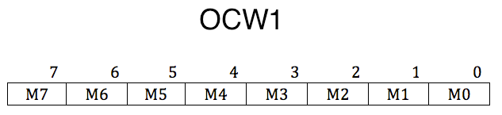

本文来自操作系统真相还原.

我们本节将介绍可屏蔽中断的代理—可编程中断控制器8259A。
8259A 的作用是负责所有来自外设的中断，其中就包括来自时钟的中断，以后我们要通过它完成进程调度。尽管我们实际对8259A编程的部分并不多，但不把它通透介绍一番的话，即使我告诉您应该如何使用它，您也不会真正清楚自己为什么要这么做，这必然不是本书的初衷。所以我一定要帮助大伙儿把8259A 的工作原理搞清楚，我会努力的。

## 1 8259A 介绍

为了让CPU 获得每个外部设备的中断信号，最好的方式是在CPU 中为每一个外设准备一个引脚接收中断，但这是不可能的，计算机中挂了很多外部设备，而且外设数量是没有上限的，无论CPU 中准备多少引脚都不够用，况且，引脚越多，体积越大，我们还嫌目前CPU 的体积大呢。
上一节中我们说到，可屏蔽中断是通过INTR 信号线进入CPU 的，一般可独立运行的外部设备，如打印机、声卡等，其发出的中断都是可屏蔽中断，都共享这一根INTR 信号线通知CPU。大家想想看，任务是串行在CPU 上执行的，CPU 每次只能执行一个任务，如果同时有多个外设发出中断，而CPU 只能先处理一个，它到底先响应哪个呢？还有，为了不使这些中断丢失，是否要为它们单独维护一个中断队列？这些问题如果让CPU 来做的话，似乎有些大材小用了，不仅要占用CPU 时间，而且还要占用内存来存储中断队列，所以，干脆请个专人来做这事吧，这个专业人士就是中断代理，由它负责对所有中断仲裁，决定哪个中断优先被CPU受理。这有点像大臣和皇帝的关系，低阶官员写的奏折只能先交给大臣，由大臣决定是否要呈给皇帝过目。中断代理有很多种，我们这里采用的是较流行的中断代理：Intel 8259A 芯片，就是本节所说的可编程中断控制器（PIC）8259A。
8259A 有哪些功能呢？
8259A 用于管理和控制可屏蔽中断，它表现在屏蔽外设中断，对它们实行优先级判决，向CPU 提供中断向量号等功能。而它称为可编程的原因，就是可以通过编程的方式来设置以上的功能。

对于初学者，8259A 的设置有些复杂，咱们还是多花点篇幅来介绍，希望大伙儿不要嫌我啰嗦。
Intel 处理器共支持256个中断，但8259A 只可以管理8个中断，不知道Intel 这是要闹哪样，所以它为了多支持一些中断设备，提供了另一个解决方案，将多个8259A 组合，官方术语就是级联。有了级联这种组合后，每一个8259A 就被称为1 片。若采用级联方式，即多片8259A 芯片串连在一起，最多可级联9 个，也就是最多支持64 个中断。n 片8259A 通过级联可支持7n+1 个中断源，级联时只能有一片8259A为主片master，其余的均为从片slave。来自从片的中断只能传递给主片，再由主片向上传递给CPU，也就是说只有主片才会向CPU 发送INT 中断信号。

每个独立运行的外部设备都是一个中断源，它们所发出的中断，只有接在中断请求（IRQ：Interrupt ReQuest）信号线上才能被CPU 大神知晓，这也就是大家在开机时，电脑屏幕上会看到的IRQ1…IRQn，这些都是为外部设备所分配的中断号。
我们说下什么是级联。由于单个8259A 芯片只有8 个中断请求信号线：IRQ0～IRQ7，这显然是不够用的，所以它提供了一种组合的方式，可以将多个自己像串联电路一样组合在一起，提供更多的中断请求信号线。这种组合方式就称为级联（cascade），乍一听是否觉得很熟悉？咱们平时用的交换机或hub 都是这样做的，一个交换机上的网线接口是有限的，当上网的人多了接口不够用的时候，只能再买个交换机插在老交换机上做扩展，这就是典型的级联。8259A 也是这样的道理，无非是交换机传输的是数据链路层数据报文，8259A 传输的是外设的中断向量。

在咱们的个人电脑中只有两片8259A芯片，也就是说，一共16个IRQ 接口。不过，单独使用哪个芯片都只能支持8个中断源，它们只有通过级联后才能都利用上，根据前面所说的公式，最多也只是支持7*2+1=15 个中断。为什么不是2*8=16 个？因为级联一个从片，要占用主片一个IRQ 接口，而从片上的IRQ接口不被占用，从片上有专门的接口用于级联（相当于从片上向CPU 发送INT 信号的接口插在了主片上的某个IRQ）。这和级联交换机的原理是一样的，交换机上通向网关的接口是单独的，下级交换机必须用该接口通过网线接在核心交换机的某个普通网卡接口上。

外部设备和8259A 芯片是独立的，它们也得通过信号线连接到8259A，主板电路上已经实现了这些，咱们只要把外设往主板上一插，这些设备自动就和8259A 连接上了。这些设备在发中断的时候都以为是直接发给了CPU，它们并不知道中间还隔着个中断代理，8259A 在收到了中断后，对中断判优，将优先级最高的中断转发
给CPU 处理。有了8259A 这个中断代理，咱们重新审视下可屏蔽中断和CPU 的关系，如图7-11 所示。

8259A 内部的工作流程是怎么样的呢？为了给大家说清楚，咱们得了解下8259A 的内部结构，请见图7-12。
图7-12 所示是8259A 内部结构逻辑示意图，这里有一些信号和寄存器给大家介绍下。

+ INT：8259A 选出优先级最高的中断请求后，发信号通知CPU。
+ INTA：INT Acknowledge，中断响应信号。位于8259A 中的INTA 接收来自CPU 的INTA 接口的中断响应信号。
+ IMR：Interrupt Mask Register，中断屏蔽寄存器，宽度是8 位，用来屏蔽某个外设的中断。
+ IRR：Interrupt Request Register，中断请求寄存器，宽度是8 位。它的作用是接受经过IMR 寄存器过滤后的中断信号并锁存，此寄存器中全是等待处理的中断，“相当于”5259A 维护的未处理中断信号队列。
+ PR：Priority Resolver，优先级仲裁器。当有多个中断同时发生，或当有新的中断请求进来时，将它与当前正在处理的中断进行比较，找出优先级更高的中断。
+ ISR：In-Service Register，中断服务寄存器，宽度是8 位。当某个中断正在被处理时，保存在此寄存器中。

以上介绍的寄存器都是8位，这是有意这样做的，其原因是8259A共8个IRQ接口，可以用8位寄存器中的每一位代表8259A 的每个IRQ 接口，类似于接口的位图，这样在后续的操作中，操作寄存器中的位便表示处理来自对应的IRQ 接口的中断信号。
在“有图有真相”之后，咱们看看当8259A 收到一个中断后会发生什么呢？现在可以介绍8259A 的工作流程了。

当某个外设发出一个中断信号时，由于主板上已经将信号通路指向了8259A 芯片的某个IRQ 接口，所以该中断信号最终被送入了8259A。8259A 首先检查IMR 寄存器中是否已经屏蔽了来自该IRQ 接口的中断信号。IMR 寄存器中的位，为1，则表示中断屏蔽，为0，则表示中断放行。如果该IRQ 对应的相应位已经被置1，即表示来自该IRQ 接口上的中断已经被屏蔽了，则将该中断信号丢弃，否则，将其送入IRR寄存器，将该IRQ接口所在IRR寄存器中对应的BIT置1。IRR寄存器的作用“相当于”待处理中断队列。在某个恰当时机，优先级仲裁器PR会从IRR 寄存器中挑选一个优先级最大的中断，此处的优先级决判很简单，就是 **IRQ接口号越低，优先级越大** ，所以IRQ0 优先级最大。之后，8259A会在控制电路中，通过INT接口向CPU发送INTR信号。信号被送入了CPU的INTR 接口后，这样CPU便知道有新的中断到来了，又有活干了，于是CPU将手里的指令执行完后，马上通过自己的INTA接口向8259A的INTA接口回复一个中断响应信号，表示现在CPU我已准备好啦，8259A你可以继续后面的工作。8259A在收到这个信号后，立即将刚才选出来的优先级最大的中断在ISR寄存器中对应的BIT置1，此寄存器表示当前正在处理的中断，同时要将该中断从“待处理中断队列”寄存器IRR中去掉，也就是在IRR 中将该中断对应的BIT置0。之后，**CPU将再次发送INTA信号给8259A** ，这一次是想获取中断对应的中断向量号，就是我们前面所说的0～255 的“整数”。由于大部分情况下8259A的起始中断向量号并不是0（起始中断向量号被修改，原因后面会说），所以用起始中断向量号+IRQ 接口号便是该设备的中断向量号，由此可见，外部设备虽然会发中断信号，但它并不知道还有中断向量号这回事，不知道自己会被中断代理（如8259A）分配一个这样的整数。随后，8259A将此中断向量号通过系统数据总线发送给CPU。CPU从数据总线上拿到该中断向量号后，用它做中断向量表或中断描述符表中的索引，找到相应的中断处理程序并去执行。

处理流程到这就结束了吗？还早还早，这才刚完成了上半场。如果8259A的“EOI通知（End Of Interrupt）”若被设置为非自动模式（手工模式），中断处理程序结束处必须有向8259A发送EOI的代码，8259A 在收到EOI 后，将当前正处理的中断在ISR寄存器中对应的BIT置0。如果“EOI 通知”被设置为自动模式，在刚才8259A 接收到第二个INTA信号后，也就是CPU向8259A 要中断向量号的那个INTA，8259A 会自动将此中断在ISR 中对应的BIT置0。

并不是进入了ISR 后的中断就高枕无忧等着面见圣上CPU 了，它还是有可能被后者换下来的。比如，在8259A 发送中断向量号给CPU 之前，这时候又来了新的中断，如果它的来源IRQ 接口号比ISR 中的低，也就是优先级更高，原来ISR 中准备上CPU 处理的旧中断，其对应的BIT 就得清0，同时将它所在的IRR中的相应BIT 恢复为1，随后在ISR 中将此优先级更高的新中断对应的BIT 置1，然后将此新中断的中断向量号发给CPU。您看，本来高高兴兴去面圣的，屁股还没坐热，结果还是被换了下来。当然，如果新来的中断优先级较低，依然会被放进IRR 寄存器中等待处理.

以上整个过程就像皇帝上早朝一样，皇帝起床洗漱完毕后到了金銮殿（相当于CPU 开机运行后），说了句：“众位爱卿，有本启奏，无本退朝”。8259A带着几本重要奏折说：“老臣有本要奏”，用声音向皇上的耳朵发了个信号。皇上听到后回复一句：“8259A，有何事啊？”也是用声音向8259A 的耳朵传了个应答信号。8259A 一听，这表示皇上现在心情不错有时间处理奏折，于是把心里最重要的那个奏折挑了出来，剩下的几个奏折准备一会再启奏。这时候皇上说：“呈上来”，于是8259A 便把奏折交给了数据总线太监同学，皇上从太监那里拿到了奏折后，开始处理。

8259A 是“可编程”中断控制器，在了解8259A 的工作原理后，咱们该去了解如何对其编程了。说实话，当初我头一次接触它的时候，觉得它的设置好麻烦，时隔今日，我依然觉得不顺手。对于新手来说确实有点难，不过咱们只做最基本的设置，能让它跑起来就行。

为叙述方便，咱们下面只讨论32位保护模式下的中断情况。

刚才咱们说过，外部设备不知道自己还有个中断向量号，这完全是8259A来分配的，其实这句话并不完全正确，因为8259A是咱们通过编程来设置的，归根结底还是咱们人来控制的，下面给各位说说，
话要从头说起……

软件的舞台要靠硬件的支撑，为开发方便，很多功能都是由硬件原生支持的，因此，CPU 也提供了中断处理的框架。在此框架中，咱们只要填入所需要的数据即可，其他的工作由CPU 自动运作。和中断处理相关的数据结构是中断描述符表和中断向量号，我们要做的工作就是准备这两项。中断描述符表也称为IDT，我们会在下一节中介绍。既然称为“描述符”的表，说明它和全局描述符表GDT 类似，表中的每一项都是8 字节的描述符（这里还是要提一句，实模式下的中断向量表IVT 中的每一项大小是4 字节），我们曾经构建过GDT，再次构建类似的结构一点也不难。不过有区别的是中断描述符表本质上就是中断处理程序地址数组，而中断向量号便是此数组的索引下标，这就是中断向量号是个整数的原因。CPU 不支持“数组名[索引]”的形式，那是高级语言编译器支持的东西，它最终也要编译转换成某种内存寻址方式之一，必须得用最基本的形式—地址来访问内存。当CPU 接收到8259A 送来的中断向量号后要将其乘以8，再加上中断描述符表的起始地址，经过内存寻址，最终定位到目标中断处理程序。
以上说的是中断处理框架的流程，我们要做的确实很简单。
（1）构造好IDT。
（2）提供中断向量号。
外部设备不知道中断向量号这回事，它只负责发中断信号。中断向量号是8259A 传送给CPU 的，而8259A 是由咱们来控制的，中断描述符表也是咱们构造的，不知道大家有没有注意到，我们要做的事其实就是“自圆其说”，自己为外部设备设置好中断向量号，然后自己在中断描述符表中的对应项添加好合适的中断处理程序。
好啦，我不能再啰嗦了，本节到此结束，下节咱们看看如何通过编程8259A 来设置这些。

## 2 8259A 的编程

既然8259A 称为可编程中断控制器，就说明它的工作方式很多，咱们就要通过编程把它设置成需要的样子。对它的编程也很简单，就是对它进行初始化，设置主片与从片的级联方式，指定起始中断向量号以及设置各种工作模式。

其实，不光是咱们要操作8259A，在开机之后的实模式下，BIOS也对它光顾过，8259A 的IRQ0～7已经被BIOS 分配了0x8～0xf的中断向量号。而在保护模式下，大家从表7-1 中已经看到了，中断向量号为0x8～0xf 的范围已经被CPU 占了，分配给了各种异常，咱们还得重新为8259A芯片上的IRQ 接口们分配中断向量号。
中断向量号是逻辑上的东西，它在物理上是8259A上的IRQ 接口号。8259A上IRQ 号的排列顺序是固定的，但其对应的中断向量号是不固定的，这其实是一种由硬件到软件的映射，通过设置8259A，可以将IRQ 接口映射到不同的中断向量号。

在8259A 内部有两组寄存器，一组是初始化命令寄存器组，用来保存初始化命令字（Initialization Command Words，ICW），ICW 共4 个，ICW1～ICW4。另一组寄存器是操作命令寄存器组，用来保存操作命令字（Operation Command Word，OCW），OCW 共3 个，OCW1～OCW3。所以，我们对8259A 的编程，也分为初始化和操作两部分。

+ 一部分是用ICW 做初始化，用来确定是否需要级联，设置起始中断向量号，设置中断结束模式。其编程就是往8259A 的端口发送一系列ICW。由于从一开始就要决定8259A 的工作状态，所以要一次性写入很多设置，某些设置之间是具有关联、依赖性的，也许后面的某个设置会依赖前面某个ICW 写入的设置，所以这部分要求严格的顺序，必须依次写入ICW1、ICW2、ICW3、ICW4。
  
+ 另一部分是用OCW 来操作控制8259A，前面所说的中断屏蔽和中断结束，就是通过往8259A 端口发送OCW 实现的。OCW 的发送顺序不固定，3 个之中先发送哪个都可以。
  
  
  

下面分别说一下每个ICW 和OCW，这是本节的重点，需要花点精力了，其实它们本身并不难，只是咱们接触得少，所以在学习过程中可能会显得不是那么轻松，建议先去洗个脸精神精神回来再看……闲话少说，哥几个走起。

ICW1用来初始化8259A的连接方式和中断信号的触发方式。连接方式是指用单片工作，还是用多片级联工作，触发方式是指中断请求信号是电平触发，还是边沿触发。

注意，ICW1 需要写入到主片的0x20 端口和从片的0xA0 端口，如图7-13 所示。

IC4 表示是否要写入ICW4，这表示，并不是所有的ICW 初始化控制字都需要用到。IC4为1时表示需要在后面写入ICW4，为0则不需要。注意，x86 系统IC4 必须为1。

SNGL 表示single，若SNGL 为1，表示单片，若SNGL 为0，表示级联（cascade）。这里说一下，若在级联模式下，这要涉及到主片（1个）和从片（多个）用哪个IRQ 接口互相连接的问题，所以当SNGL为0时，主片和从片也是需要ICW3 的。

ADI 表示call address interval，用来设置8085 的调用时间间隔，x86 不需要设置。

LTIM 表示level/edge triggered mode，用来设置中断检测方式，LTIM 为0 表示边沿触发，LTIM 为1表示电平触发。

第4位的1 是固定的，这是ICW1的标记，此时您可能不明白标记是什么，不过在本节的最后您将茅塞顿开。

第5～7 位专用于8085 处理器，x86 不需要，直接置为0 即可。

ICW2 用来设置起始中断向量号，就是前面所说的硬件IRQ 接口到逻辑中断向量号的映射。由于每个8259A 芯片上的IRQ 接口是顺序排列的，所以咱们这里的设置就是指定IRQ0 映射到的中断向量号，其他IRQ 接口对应的中断向量号会顺着自动排下去。
注意，ICW2 需要写入到主片的0x21 端口和从片的0xA1 端口如图7-14 所示。

由于咱们只需要设置IRQ0 的中断向量号，IRQ1～IRQ7 的中断向量号是IRQ0 的顺延，所以，咱们只负责填写高5 位T3～T7，ID0～ID2 这低3 位不用咱们负责。由于咱们只填写高5 位，所以任意数字都是8 的倍数，这个数字表示的便是设定的起始中断向量号。这是有意设计的，低3位能表示8 个中断向量号，这由8259A 根据8 个IRQ 接口的排列位次自行导入，IRQ0 的值是000，IRQ1 的值是001，IRQ2的值便是010……以此类推，这样高5 位加低3 位，便表示了任意一个IRQ 接口实际分配的中断向量号。

ICW3 仅在级联的方式下才需要（如果ICW1 中的SNGL 为0），用来设置主片和从片用哪个IRQ 接口互连。注意 ICW3 需要写入主片的0x21 端口及从片的0xA1 端口。

由于主片和从片的级联方式不一样，对于这个ICW3，主片和从片都有自己不同的结构，如图7-15 所示。

  

对于主片，ICW3中置1的那一位对应的IRQ 接口用于连接从片，若为0 则表示接外部设备。比如，若主片IRQ2 和IRQ5 接有从片，则主片的ICW3 为00100100，如图7-16 所示。

 

对于从片，要设置与主片8259A 的连接方式，“不需要”指定用自己的哪个IRQ 接口与主片连接，从片上专门用于级联主片的接口并不是IRQ。您想，如果从片用IRQ 接口连接主片，若主片只级联一个从片，在从片上指定的IRQ 接口便默认与主片上做级联的那个IRQ 接口匹配了。但如果主片级联多个从片时，在从片上还要设置自己用于连接主片的IRQ 接口与主片上连接从片的哪个IRQ 接口（有多个)对接，这反而更麻烦。所以，设置从片连接主片的方法是只需要 **在从片上指定主片用于连接自己的那个IRQ接口就行了** 。在中断响应时，主片会发送与从片做级联的IRQ 接口号，所有从片用自己的ICW3 的低3位和它对比，若一致则认为是发给自己的。比如主片用IRQ2接口连接从片A，用IRQ5接口连接从片B，从片A的ICW3 的值就应该设为00000010，从片B的ICW3的值应该设为00000101。所以，从片ICW3中的低3 位ID0～ID2 就够了，高5位不需要，为0即可。

ICW4 用于设置8259A 的工作模式，当ICW1 中的IC4 为1 时才需要ICW4。
注意，ICW4 需要写入主片的0x21 及从片的0xA1 端口，如图7-17 所示。

ICW4 有些低位的选项基于高位，所以咱们从高位开始介绍。
第7～5 位未定义，直接置为0 即可。
SFNM 表示特殊全嵌套模式（Special Fully Nested Mode），若SFNM 为0，则表示全嵌套模式，若SFNM为1，则表示特殊全嵌套模式。

BUF 表示本8259A 芯片是否工作在缓冲模式。BUF 为0，则工作非缓冲模式，BUF 为1，则工作在缓冲模式。

当多个8259A 级联时，如果工作在缓冲模式下，M/S 用来规定本8259A 是主片，还是从片。若M/S 为1，则表示则表示是主片，若M/S 为0，则表示是从片。若工作在非缓冲模式（BUF 为0）下，M/S 无效。
AEOI 表示自动结束中断（Auto End Of Interrupt），8259A 在收到中断结束信号时才能继续处理下一个中断，此项用来设置是否要让8259A 自动把中断结束。若AEOI 为0，则表示非自动，即手动结束中断，

咱们可以在中断处理程序中或主函数中手动向8259A 的主、从片发送EOI 信号。这种“操作”类命令，通过下面要介绍的OCW 进行。若AEOI 为1，则表示自动结束中断。
μPM 表示微处理器类型（microprocessor），此项是为了兼容老处理器。若μPM 为0，则表示8080 或8085 处理器，若μPM 为1，则表示x86 处理器。
4 个ICW 都介绍过了，下面咱们看看用于操作8259A 的各种OCW的格式。

OCW1 用来屏蔽连接在8259A 上的外部设备的中断信号，实际上就是把OCW1 写入了IMR 寄存器。这里的屏蔽是说是否把来自外部设备的中断信号转发给CPU。由于外部设备的中断都是可屏蔽中断，所以最终还是要受标志寄存器eflags 中的IF 位的管束，若IF 为0，可屏蔽中断全部被屏蔽，也就是说，在IF 为0 的情况下，即使8259A 把外部设备的中断向量号发过来，CPU 也置之不理。

注意，OCW1 要写入主片的0x21 或从片的0xA1 端口，如图7-18 所示。M0～M7 对应8259A 的IRQ0～IRQ7，某位为1，对应的IRQ上的中断信号就被屏蔽了。否则某位为0 的话，对应的IRQ 中断信号则被放行。

OCW2 用来设置中断结束方式和优先级模式。

注意，OCW2 要写入到主片的0x20 及从片的0xA0 端口。
OCW2 的配置比较复杂，各种属性位要配合在一起，组合出8259A 的各种工作模式。如图7-19 所示，由高3 位R、SL、EOI 可以定义多种中断结束方式和优先级循环方式。

在OCW2中比较灵活的是有个开关位：SL，可以针对某个特定优先级的中断进行操作，以下的优先级模式设置和中断结束都可以基于此开关做更细粒度的控制。
OCW2 其中的一个作用就是发EOI 信号结束中断。如果使SL 为1，可以用OCW2 的低3 位（L2～L0）来指定位于ISR 寄存器中的哪一个中断被终止，也就是结束来自哪个IRQ 接口的中断信号。如果SL 位为0，L2～L0 便不起作用了，8259A 会自动将正在处理的中断结束，也就是把ISR 寄存器中优先级最高的位清0。

OCW2 另一个作用就是设置优先级控制方式，这是用R 位（第7 位）来设置的。

为表述方便，IRQ 各个接口在此被表述为“IR 数字”的形式，这也是微机接口中的命名规则。

如果R 为0，表示固定优先级方式，即IRQ 接口号越低，优先级越高。
如果R 为1，表明用循环优先级方式，这样优先级会在0～7 内循环。如果SL 为0，初始的优先级次序为IR0>IR1>IR2>IR3>IR4>IR5>IR6>IR7。当某级别的中断被处理完成后，它的优先级别将变成最低，将最高优先级传给之前较之低一级别的中断请求，其他依次类推。所以，可循环方式多用于各中断源优先级相同的情况，优先级通过这种循环可以实现轮询处理。该循环可总结为如果IR（i）优先级最低，IR（i+1）则优先级最高。其优先级关系如图7-20 所示。

在图7-20 中，顺时针方向的优先级是逐级减小，反之逆时针方向的优先级是逐渐增大。

比如，当前IR3 为最高级别中断请求，处理完成后，IR3 将变成最低级别，IR4 变成最高级别，这一组循环之后的优先级变成了：
IR4>IR5>IR6>IR7>IR0>IR1>IR2>IR3
另外，还可以打开SL 开关，使SL 为1，再通过L2～L1 指定最低优先级是哪个IRQ接口。

举个例子，在R 和SL 都等于1 的情况下，若想指定IR5 为最低的优先级，需要将L2～L0 置为101。
这样，参看图7-20，新的初始优先级循环是：
IR6>IR7>IR0>IR1>IR2>IR3>IR4>IR5
以上就是OCW2 的工作原理，咱们再细说一下各个属性位的意义，还从高位开始说起。
R,Rotation，表示是否按照循环方式设置中断优先级。R 为1 表示优先级自动循环，R 为0 表示不自动循环，采用固定优先级方式。

SL,Specific Level，表示是否指定优先等级。等级是用低3 位来指定的。此处的SL 只是开启低3 位的开关，所以SL 也表示低3 位的L2～L0 是否有效。SL 为1 表示有效，SL 为0 表示无效。
EOI，End Of Interrupt，为中断结束命令位。令EOI 为1，则会令ISR 寄存器中的相应位清0，也就是将当前处理的中断清掉，表示处理结束。向8259A 主动发送EOI 是手工结束中断的做法，所以，使用此命令有个前提，就是ICW4 中的AEOI 位为0，非自动结束中断时才用。

值得注意的是在手动结束中断（AEOI 位为0)的情况下，如果中断来自主片，只需要向主片发送EOI就行了，如果中断来自从片，除了向从片发送EOI 以外，还要再向主片发送EOI。
第4～3 位的00 是OCW2 的标识。
L2～L0 用来确定优先级的编码，这里分两种，一种用于EOI 时，表示被中断的优先级别，另一种用于优先级循环时，指定起始最低的优先级别。
通过前面的介绍，其实整个OCW2 就是各种关键字属性的配合使用，主要就是L2～L0 需要配合R位、SL 位、EOI 位的设置。咱们看看这几种组合，见表7-2。

到现在为止，咱们需要用到的部分已经说完了，还差一个OCW3，虽然咱们用不上，但说实话也不差这一个了，还是捎带着说下。

OCW3 用来设定特殊屏蔽方式及查询方式，如图7-21所示。
注意，OCW3要写入主片的0x20 端口或从片的0xA0 端口。

第7 位未用到。
第6 位的ESMM（Enable Special Mask Mode）和第5 位的SMM（Special Mask Mode）是组合在一起用的，用来启用或禁用特殊屏蔽模式。ESMM 是特殊屏蔽模式允许位，是个开关。SMM 是特殊屏蔽模式位。
只有在启用特殊屏蔽模式时，特殊屏蔽模式才有效。也就是若ESMM 为0，则SMM 无效。若ESMM 为1，SMM 为0，表示未工作在特殊屏蔽模式。若ESMM 和SMM 都为1，这才正式工作在特殊屏蔽模式下。
第4～3 位的01 是OCW3 的标识，8259A 通过这两位判断是哪个控制字。
P,Poll command，查询命令，当P 为1 时，设置8259A 为中断查询方式，这样就可以通过读取寄存器，如IRS，来查看当前的中断处理情况。
RR,Read Register，读取寄存器命令。它和RIS 位是配合在一起使用的。当RR 为1 时才可以读取寄存器。

RIS,Read Interrupt register Select，读取中断寄存器选择位，顾名思义，就是用此位选择待读取的寄存器。有点类似显卡寄存器中的索引的意思。若RIS 为1，表示选择ISR 寄存器，若RIS 为0，表示选择IRR寄存器。这两个寄存器能否读取，前提是RR 的值为1。

讲到这里，有关8259A 的学习也就快到尾声了，但还有件事不吐不快，大家有没有疑惑，8259A 就2个端口地址，它是如何识别4 个ICW 和3 个OCW 的？
如果是初学者，我就当您有这个疑惑了。其实，这是有关内部寄存器寻址的问题，人家8259A 有一套方法辨识自己。
ICW1 和OCW2、OCW3 是用偶地址端口0x20（主片）或0xA0（从片）写入。
ICW2～ICW4 和OCW1 是用奇地址端口0x21（主片）或0xA1（从片)写入。

以上4 个ICW 要保证一定的次序写入，所以8259A 就知道写入端口的数据是什么了。
OCW 的写入与顺序无关，并且ICW1 和OCW2、OCW3 的写入端口是一致的，那8259A 怎样来辨识它们呢？又是自问自答，其实就是各控制字中的第4～3 标识位，通过这两位的组合来唯一确定某个控制字，见表7-3。

OCW1 是怎样确定的呢？OCW 是在初始化之后才有效的，所以在初始化之后写入奇地址端口的数据便被认为是OCW1。
8259A 的编程就是写入ICW 和OCW，下面总结下写入的步骤。
对于8259A 的初始化必须最先完成，步骤是：
+ 无论8259A 是否级联，ICW1 和ICW2 是必须要有的，并且要顺序写入。
+ 只有当ICW1 中的SNGL 位为0 时，这表示级联，级联就需要设置主片和从片，这才需要在主片和从片中各写入ICW3。注意，ICW3 的格式在主片和从片中是不同的。
+ 只能当ICW1 中的IC4 为1 时，才需要写入ICW4。不过，x86 系统IC4 必须为1。

总结再总结，在x86 系统中，对于初始化级联8259A，4 个ICW 都需要，初始化单片8259A，ICW3不要，其余全要。
在以上初始化8259A 之后才可以用OCW 对它操作。
好啦，到此有关8259A 的介绍都结束了，大家有兴趣的话自行参阅相关书籍。