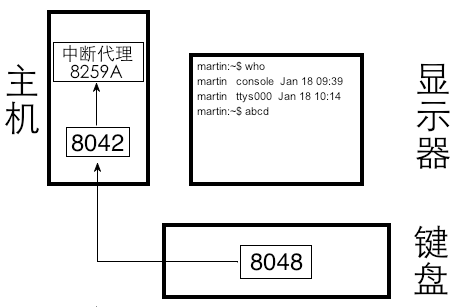
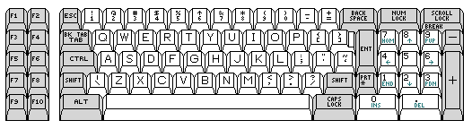
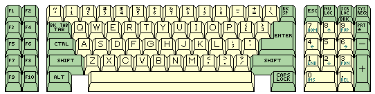
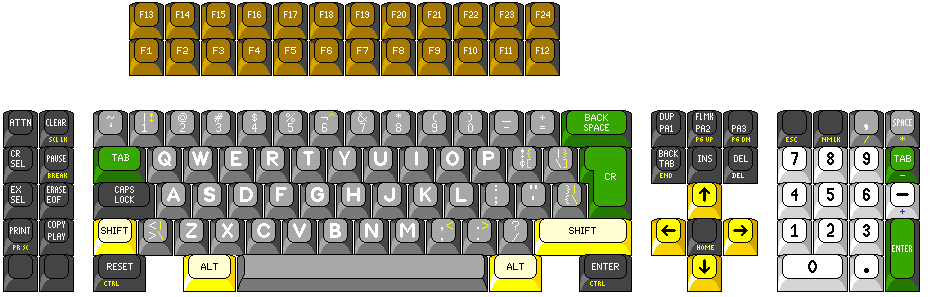
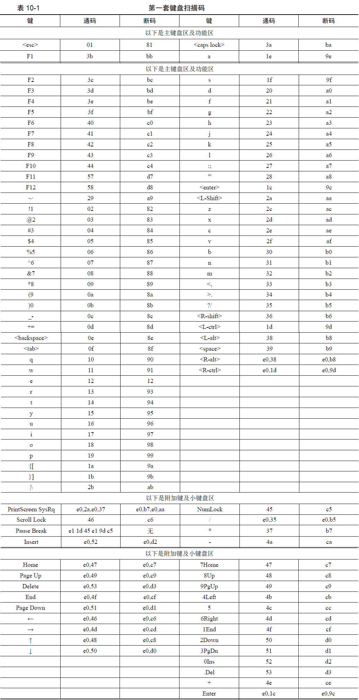
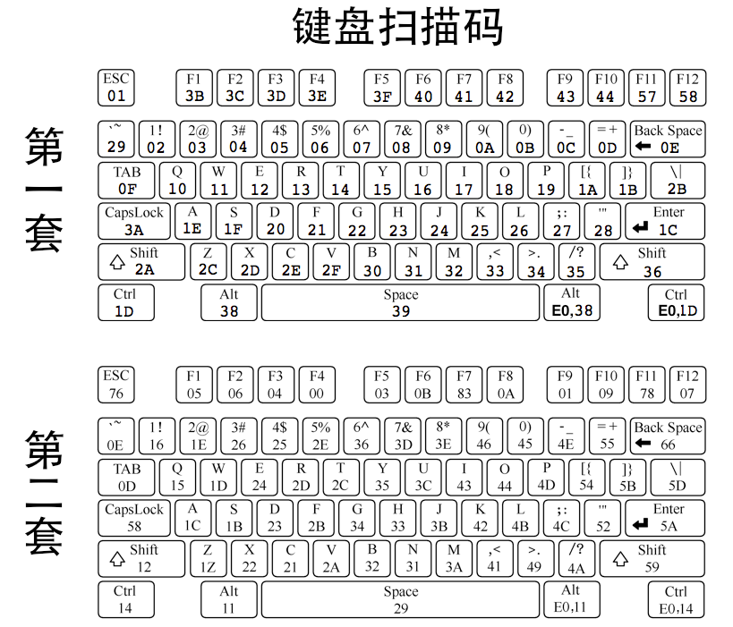
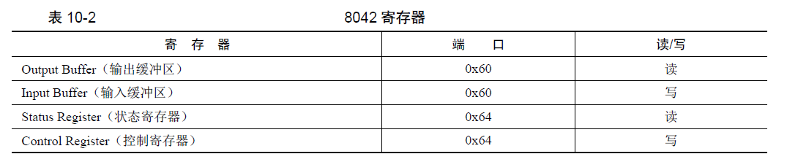
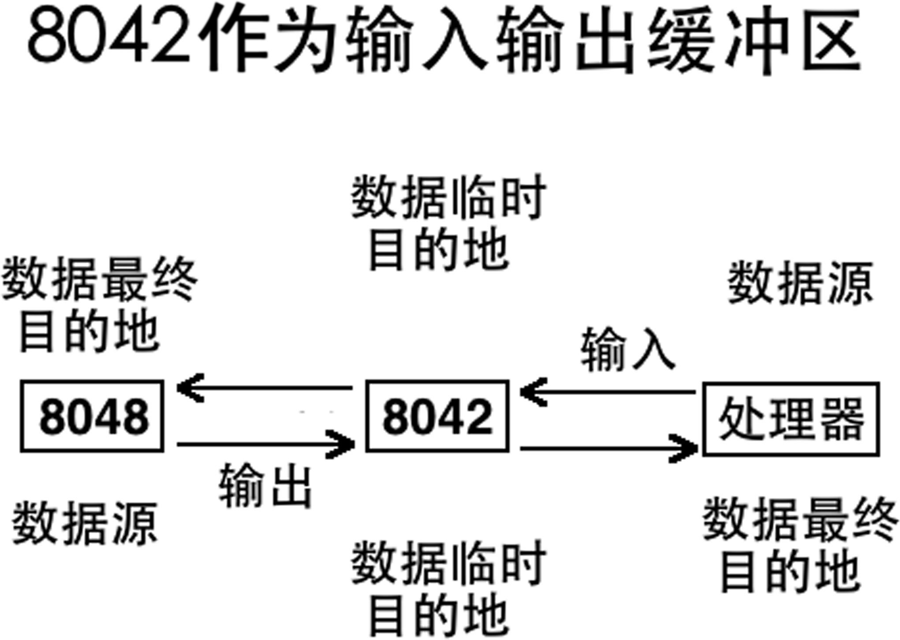

时至今日，我们80后这一代人用过的键盘有三种类型：PS/2 键盘、USB 键盘和蓝牙键盘。虽然PS/2键盘已经很少有人用了，但后来的新型键盘都是基于它发展起来的，基础原理是不变的，因为要考虑兼容性，所以肯定不能将过去的成绩全盘推翻而重新发明一套做法，这就像Intel 处理器虽然早已经发展到I7好多年，但大学教材中依然用8086 处理器作为学习汇编指令的模型一样，原理不变，经典，经得起考验。

因此，咱们也以经典的PS/2 键盘为例展开介绍。

## 1 键盘输入原理简介
计算机是个系统，系统是指由各功能独立的模块组成的整体，相当于在内部按功能分层，一个模块就像个功能独立的黑盒子，上下游模块之间可依赖，相互提供数据。在所有模块的配合下，使这个系统作为整体对外提供服务。

因此，我们平时所熟悉的键盘操作，也是由独立的模块分层实现的，但是并不是简单地由键盘把数据塞到主机里，这涉及两个功能独立的芯片的配合。

键盘是个独立的设备，在它内部有个叫作键盘编码器的芯片，通常是Intel 8048 或兼容芯片，它的作用是：每当键盘上发生按键操作，它就向键盘控制器报告哪个键被按下，按键是否弹起。这个键盘控制器可并不在键盘内部，它在主机内部的主板上，通常是Intel 8042 或兼容芯片，它的作用是接收来自键盘编码器的按键信息，将其解码后保存，然后向中断代理发中断，之后处理器执行相应的中断处理程序读入8042 处理保存过的按键信息。

它们的关系如图10-11 所示。

8048 是键盘上的芯片，其主要责任就是监控哪个键被按下。当键盘上发生按键操作时，8048当然知道是哪个键被按下。但光它自己知道还不行，它毕竟要将按键信息传给8042，必须得让8042知道到底是按下了哪个键，为此8048 必然要和8042达成一个协议，这个协议规定了键盘上的每个物理键对应的唯一数值，说白了就是对键盘上所有的按键进行编码，为每个按键分配唯一的数字，这样双方都知道了每个数值代表哪个键。当某个键被按下时，8048 把这个键对应的数值发送给8042，8042根据这个数值便知道是哪个键被按下了。

您想，键盘上那么多的键，每个键都要有数值，因此所有按键对应的数值便组成了一张“按键-数值”编码映射表，当然人家可不是这么俗套的名字，这张表的官方名称为键盘扫描码。回想一下，当我们想在屏幕上连续输入多个相同的字符时，我们通常都是按下某个按键不松手，结束输入时才松手，也就是键被弹起。比如在聊天工具里输入一堆“………”表示无语的时候，或者刷新网页时长按F5键时，总之，很少有人一下一下地按键。当我们松开手，按键被弹起时就表示输入完成，也就是说，我们也得让8042 知道何时按键被弹起，也就是击键操作何时结束，这样8042 才知道用户在一次持续按键操作中到底输入了多少个相同的字符。因此，键盘扫描码中不仅仅要记录按键被按下时对应的编码，也要记录按键被松开（弹起）时的编码。总之在输入框中看似随意的打字行为，在幕后都有一些硬件在一丝不苟地完成繁重的工作。

一个键的状态要么是按下，要么是弹起，因此一个键便有两个编码，按键被按下时的编码叫通码，也就是表示按键上的触点接通了内部电路，使硬件产生了一个码，故通码也称为 makecode。按键在被按住不松手时会持续产生相同的码，直到按键被松开时才终止，因此按键被松开弹起时产生的编码叫断码，也就是电路被断开了，不再持续产生码了，故断码也称为breakcode。一个键的扫描码是由**通码**和**断码**组成的。

无论是按下键，或是松开键，当键的状态改变后，键盘中的8048芯片把按键对应的扫描码（通码或断码）发送到主板上的8042芯片，由8042处理后保存在自己的寄存器中，然后向8259A发送中断信号，这样处理器便去执行键盘中断处理程序，将8042处理过的扫描码从它的寄存器中读取出来，继续进行下一步处理。

这个键盘中断处理程序是咱们程序员负责编写的，值得注意的是我们只能得到键的扫描码，并不会得到键的ASCII码，扫描码是硬件提供的编码集，ASCII 是软件中约定的编码集，这两个是不同的编码方案。我们的键盘中断处理程序是同硬件打交道的，因此只能得到硬件提供的扫描码，但我们可以将得到的“硬件”扫描码转换成对应的“软件”ASCII 码。假如我们在键盘上按下了空格键，我们在键盘中断处理程序中只能得到空格键的扫描码，该扫描码是0x39（后面会有详细介绍），而不是空格键的ASCII 码0x20。

按键的表现行为是字符处理程序负责的，键盘的中断处理程序便充当了字符处理程序。一般的字符处理程序使用字符编码来处理字符，比如ASCII 码，因此我们可以在中断处理程序中将空格的扫描码0x39转换成ASCII 码0x20，然后将ASCII 码0x20 交给我们的put_char 函数，将ASCII 码写入显存，也就是输出到屏幕。因此，按下空格键可以在屏幕上输出一个空格，就是这么来的。

但咱们也可以不走寻常路，完全可以将扫描码转换成任意字符的ASCII 码，只是这样不符合我们的习惯。比如将空格键的扫描码处理成字符g 的ASCII 码，也就是按空格键时相当于键入字符g，这显然不合理。因此，按键产生什么样的行为，完全是由字处理软件负责的，我们也按照约定俗成的规则，按下什么键就产生对应的字符的ASCII 码。

以上仅是个大致的原理，主机上的8042 芯片是如何处理来自键盘中8048 芯片的扫描码的呢？这涉及到键盘扫描码的分类，咱们下节再说。

## 2 键盘扫描码
任何事物的发展都是新老交替的过程，发展过程中除了要吸取前辈的精华，摒弃它们的糟粕之外，还要考虑到兼容性，计算机能有今天的繁荣，可想而知，工程师们在兼容性方面付出了多大的努力。

键的扫描码是由键盘中的键盘编码器决定的，不同的编码方案便是不同的键盘扫描码，也就是说，相同的键在不同的编码方案下产生的通码和断码也是不同的（即使有相同的例外，也是巧合），不同的编码方案有不同的编码规则。

根据不同的编码方案，键盘扫描码有三套，分别称为scan code set 1、scan code set 2、scan code set 3。至于为什么有这么多套扫描码，一个可能的原因是：键盘扫描码就是对键盘中所有键的编码，编码的目的是为了方便工作，编码时要考虑后续的软硬件对编码处理时也要方便才行，因此编码是有规律的。早期键盘上的键不多，因此扫描码规模也小，旧扫描码的编码方法足够应对。后来计算机逐渐发展，尤其是对多媒体的支持越来越强大，键盘上支持的功能键就多了，再加上为了方便人们使用键盘，在键盘的另一侧也增加了功能相同的按键，比如左右都有shift、alt、ctrl，于是原有的编码方法使得扫描码的处理变得不再高效，因此要跟着扩充、更新或者重新来一套新的，于是便有了新的键盘扫描码。

第一套键盘扫描码必然是由最早的键盘使用的，它就是XT 键盘所用的扫描码。XT 键盘如图10-12 所示。

XT 键盘和今天的键盘确实长得很不一样，F1～F10 这几个功能键都是在键盘的左边。另外，这张图是黑白的，似乎也显得更加久远。

很多用户不喜欢XT键盘上的回车键和左shift 键的位置，因此在AT 键盘上有了改进，如图10-13 所示。

这张图是彩色的，显得很“近代”。

尽管AT 键盘上的backspace 键变得更小了，按起来也困难了，但键的位置布局重新，使计算机用户感到非常顺手，因此AT 键盘一经推出后特别受计算机用户的欢迎。

AT 键盘上所用的扫描码就是第二套键盘扫描码，也就是现在键盘上普通使用的扫描码。您不要觉得键F1～F10 的位置很怪异，这和扫描码无关，言外之意是不管键在哪里，键对应的扫描码是由8048 编码的，键的扫描码和键的物理位置无关。

第三套键盘扫描码用在IBM PS/2 系列高端计算机所用的键盘上，还有一些运行商业版UNIX 系统的计算机也有用到它，不过这种键盘如今很少看到了，因此第三套键盘扫描码也很少到了。这种键盘如图10-14所示。

综上所述，第二套键盘扫描码几乎是目前所使用的键盘的标准，因此大多数键盘向8042 发送的扫描码都是第二套扫描码。

您看，我说的是现在“大多数”键盘用的都是第二套扫描码，但也难免还有用第一套和第三套扫描码的键盘，相同按键在不同键盘扫描码中对应的编码（扫描码）不同，我们在中断处理程序中也得根据扫描码来判断按的是哪个键，那我们如何知道键盘用的是哪套键盘扫描码呢？

任何不兼容的两种事物都可以通过加一个“中间层”的方式解决兼容，这就是8042存在的理由之一，8042是8048和CPU之间的中间层。

我们（程序员）不是不知道键盘用的是哪种扫描码吗，那好，只要8042知道就行。为了兼容第一套键盘扫描码对应的中断处理程序，不管键盘用的是何种键盘扫描码，当键盘将扫描码发送到8042后，都由8042转换成第一套扫描码，这就是我们上一节中所说的8042 的“处理”。

因此，我们在键盘的中断处理程序中只处理第一套键盘扫描码就可以了。那我们介绍下第一套键盘扫描码。请见表10-1。

表有点长，表中的键是以它们在键盘上实际的位置顺序列出的：从左到右、从上到下。

在主键盘区中灰色的部分是为了区分键盘中单独的一行，另外的灰色部分是为了区分附加键和小键盘区。任何键盘扫描码都是有规律的，这主要是为了处理方便。

大多数情况下第一套扫描码中的通码和断码都是1字节大小。您看，表10-1中的通码和断码，它们的关系是：**断码 = 0x80 + 通码**。顺便说一句，在第二套键盘扫描码中，一般的通码是1字节大小，断码是在通码前再加1字节的0xF0，共2 字节，我们的8042工作之一就是根据第二套扫描码中通码和断码的关系将它们解码，然后按照第一套扫描码中通码和断码的关系转换成第一套扫描码。

我们继续回来说第一套键盘扫描码。

对于通码和断码可以这样理解，它们都是一字节大小，最高位也就是第7位的值决定按键的状态，最高位若值为0，表示按键处于按下的状态，否则为1 的话，表示按键弹起。比如按键\<Esc>，不管键盘向8042发送的是第几套扫描码，当我们按下它的时候，最终被8042转换成0x1，当我们松开它的时候，最终会被8042 转换成0x80+0x1=0x81。

完整的击键操作包括两个过程，先是被按下，也许是被按下一瞬间，也许是持续保持被按下，然后是被松开，总之，按下的动作是先于松开发生的，因此每次按键时会先产生通码，再产生断码。比如我们按下字符a时，按照第一套键盘扫描码来说，先是产生通码0x1e，后是产生断码0x9e。

大家一定注意到了，有些按键的通码和断码都以0xe0开头，它们占2字节，甚至Pause键以0xe1开头，占6字节。原因是这样的，并不是一种键盘就要用一套键盘扫描码，最初第一套键盘扫描码是由XT 键盘所使用的，它后来也被一些更新的键盘所使用。XT键盘上的键很少，比如右边回车键附近就没有alt 和ctrl 键，这是在后来的键盘中才加进去的，因此表示扩展extend，所以在扫描码前面加了0xe0作为前缀。比如在XT键盘上，左边有alt键，其通码为0x38，断码为0xb8。右边的alt 键是后来在新的键盘上加进去的，因此，一方面为了表示都是同样功能的alt键，另一方面表示不是左边那个alt，而是右边的alt，于是这个扩展的alt键的扫描码便为“0xe0 和原来左边alt 的扫描码”。因此，右边alt 键的通码便为“0xe0,0x38”，断码为“0xe0,0xb8”。

松开是按下的逆过程，为了体现这个“逆”字，咱们看下截屏键PrintScreen的通码和断码。

PrintScreen的通码是4 字节，其值为：e0，2a，e0，37，给人的感觉是由两个扩展通码组成的，即“e0，2a”为一对，“e0，37”为一对。断码依然是0x80+通码，但由于松开是按下的逆过程，故断码值和通码值的顺序相反，即e0，b7，e0，aa。断码中的“e0，b7”对应通码中的“e0，37”，断码中的“e0，aa”对应通码中的“e0，2a”。

也就是说，当我们按下截屏键PrintScreen 时（假设键盘使用的是第一套键盘扫描码），键盘发送的通码是以e0->2a->e0->37 的顺序，松开PrintScreen 时，键盘发送的断码是以e0->b7->e0->aa的顺序.

虽然8048和8042都知道击键操作何时发生和结束，但我们程序员是如何知道的呢？最终的键盘操作是由咱们来处理的，我们必须知道击键何时发生何时结束，也就是得清楚击键的过程，这样咱们才知道用户到底敲了哪些按键。

为了让我们获取击键的过程，在每一次击键动作的“按下”、“按下保持”和“弹起”三个阶段，确切地说是每次8048向8042发扫描码的时候，8042都会向中断代理（咱们是8259A）发一次中断，即“键被按下”时发中断，“持续按着不松手”时会持续发中断，“松开手，键被弹起”时也发中断，因此，我们的键盘中断处理程序每次都会随着键盘发出的扫描码而去执行，也就是也会收到完整的击键过程，包括键的持续按压状态。

举个例子，通常在Windows 下ctrl+a键是全选，这个按键过程是怎样的呢？也许您没注意过，但步骤基本上是这样的。
（1）ctrl 键先被按下。
（2）保持ctrl 键按住不松手。
（3）按下a 键。
（4）松开ctrl 键。
（5）松开a 键。
一般情况下，尽管我们是按照以上五个步骤完成的文本全选（也许有极少数同学的步骤4 和步骤5 要调换），但其实只要前三个步骤发生时，Windows 就会把当前文本区中的文本全部选中，即步骤四和步骤五并不重要，也就是无论这两个键哪个先被弹起，都不影响当前文本被选中，这是为何呢？

下面咱们分析一下细节，假设键盘使用的是第二套键盘扫描码。

步骤（1）中，假设我们按下的是左边的ctrl 键，此时8048 向8042 发出了\<L-ctrl>键的通码0x14（这是第二套扫描码，可见图10-15），8042 收到0x14 后将其转换为第一套键盘扫描码，即0x1d，将其保存到自己的输出缓冲区寄存器，然后8042向中断代理发中断，随后处理器执行键盘中断处理程序，键盘中断处理程序从8042的输出缓冲区寄存器中获取扫描码，即0x1d。键盘处理程序会判断这次按下的是哪个键，它一看是\<L-ctrl>的通码（其实是\<R-ctrl>也无所谓，一般情况下左右ctrl 都被认为是ctrl 键。它们只是位置不同，并不代表是两个不同的功能，键被放在不同的位置是为方便人们操作，当然这只是传统的作法），它便在某个全局变量中记录ctrl 键已被按下。

步骤（2）中，\<L-ctrl>键持续按住不松手，因此8048会持续向8042 发送0x14，8042每次都将其转换成第一套键盘扫描码0x1d并向中断代理发中断，每次键盘中断处理程序都会从8042中得到0x1d。和步骤1中一样，键盘处理程序一看是\<L-ctrl>的通码，依然会在全局变量中记录下ctrl键被按下，尽管之前已经按下了ctrl，但不重要，键盘处理程序也许只记录上一次按下的是哪个，不关注之前按下了多少次同样的键，当然这取决于具体实现。

步骤（3）中，a 键被按下，此时8048会向8042发出a键的第二套键盘扫描码0x1c（通码），8042将其转换成第一套键盘扫描码0x1e 后保存到自己的输出缓冲区寄存器，之后向中断代理发中断，键盘中断处理程序开始执行，从8042 的输出缓冲区寄存器中获取到0x1e。键盘处理程序判断这次按下的是a 键，查看之前ctrl 键已经被按下了（那个全局变量有记录），因此判断用户按下的是“ctrl+a”组合键。ctrl、alt、shift等控制键一般是与下一次按键组合，这是由于微软给咱们培训的操作习惯，即控制键先被按下，其他普通键后被按下。这次按下的不是控制键，因此把记录ctrl 键是否按下的全局变量清空。然后把“ctrl+a”这一消息上报给上层模块，上层模块判断这是要执行全选的功能，于是文本被全部选中。

步骤（4）中，\<L-ctrl>键被松开，8048 向8042发送它的第二套键盘扫描码0xf0和0x14（断码），前面有提起过，第二套键盘扫描码的断码一般是2字节，由固定的前缀0xf0和其通码组成。8042 将这两个字节转换成第一套键盘扫描码0x9d（断码），随后发中断，键盘中断处理程序一看最高位为1，这是断码，表示键被松开了，不管松开的是什么键，忽略，不做任何处理。

步骤（5）中，a 键被松开，8048 向8042 发送它的第二套键盘扫描码0xf0 和0x1c（断码），8042 将其转换成0x9e 后保存，之后发中断，键盘中断处理程序将其读出，一看是键被弹起，忽略。

过程罗哩罗嗦地说完了，那为什么步骤4 和步骤5 不被处理呢？原因是一般情况下，用户的想法是通过“按”键的方式表达的，强调的是“按”，并不是通过按键松开来表达需求。键被弹起时，一般是用户思想表达完毕的标志，所以步骤4 和步骤5 就忽略了，不再考虑ctrl 键和a 键的状态。

击键产生的扫描码是由键盘中的8048 传给主板上的8042 的，8042 将扫描码转码处理后存入自己的输出缓冲区寄存器中。虽然并不是所有的扫描码都是1 字节，但它们是以字节为单位发送的（也许这样便于区分按下的是否是那些以0xe0 开头的多字节操作码，以便后续处理），因此8042 的输出缓冲区寄存器也是8 位宽度，即每次只能存储一个扫描码，要么是通码，要么是断码。

只要8042 收到1 字节的扫描码后，它就会向中断代理发中断信号。因此按键时所发的中断次数，取决于该键扫描码中包含的字节数，通常情况下键的通码和断码各1 个，因此通常情况下一个字符会发两次中断，但有的按键的扫描码是多个字节，如右alt 键，每按一次将产生4 次中断。可想而知，平时我们打字时，那可是发生了无数次中断啊，对于文字编辑工作来说，中断次数更是天文数字（突然很心疼计算机）。

不知道您注意到没有，表10-1 中并未列出大写字母，不知道您对此是否感到奇怪，如果觉得这很正常那就我就放心了。前面说过啦，键盘只负责输入，具体的表现形式取决于字符处理软件，虽说一般情况下我们先按下\<caps lock>键再按其他字母键时会显示大写字母，但这依然是字符处理软件的功能，只是字符处理软件比较“老实”，它按照约定俗成的规则去表达按键“正常”的行为而已，通常键盘中断处理程序就是充当了字符处理软件的角色，当它收到了\<caps lock>键的通码和断码时，也就是表示\<caps lock>键已经被按下并弹起，此后便将后面获取的字母的扫描码转换成对应的大写字母，这个转换过程是咱们程序员自己控制的，因此，只要咱们愿意，完全可以无视\<caps lock>键，将键入的字母一律展现为小写或大写，甚至展示为数字、标点符号等，当然不建议这么任性，只是想告诉大家，计算机中各种文本，都是字符处理软件的杰作，和键盘关系不大。

总结一下。
+ 扫描码有3 套，现在一般键盘中的8048 芯片支持的是第二套扫描码。因此每当有击键发生时，8048发给8042 的都是第二套键盘扫描码。

+ 8042 为了兼容性，将接收到的第二套键盘扫描码转换成第一套扫描码。8042 是按字节来处理的，每处理一个字节的扫描码后，将其存储到自己的输出缓冲区寄存器。

+ 然后向中断代理8059A 发中断信号，这样我们的键盘中断处理程序通过读取8042 的输出缓冲区寄存器，会获得第一套键盘扫描码。

因此我们可以“假设”现在键盘用的就是第一套扫描键，这样想像比较直接。为了方便对比和“假设”，现将两套扫描码印在同一个键盘上给大伙过目，如图10-15 所示。

好，有关扫描码的部分到这就结束啦，大家下节见。
## 3 8042 简介
本节是对 8042 名副其实的简介，因为咱们的键盘操作非常简单，不涉及对其编程，只用了它一个端口接收扫描码而已，所以讲得太细致的话实在是有些矛盾。
说良心话，本节的内容对于咱们的应用来说还是冗余了，原因是我经常有这样的体会：虽然只用到某方面一点点知识，但不把周边内容也介绍的话，这会让人感到迷茫，甚至不知道自己在做什么……好啦，开始开始。

上节中咱们提到了8042 的输出缓冲区寄存器，这涉及到8042 的编程，因此咱们先把相关内容介绍下。

考虑到本书中对它的应用实在是有限，甚至是过于有限，介绍多了还“扰民”，因此咱们就浅尝辄止吧。有关8042 的资料网上就很多呢，大伙有兴趣自己看看。

话得从头说起，其实在计算机中不只一个处理器，我们常说的处理器是指传统意义上的Intel或AMD的处理器。计算机内部是分层的，各层负责一定的功能，将所有功能串在一起就是一个完整的计算机系统。因此很多外部设备中都有自己的处理器，它们可以响应来自外部的信号和设置硬件本身的功能，最主要的就是它们分担了传统处理器的计算任务，比如显卡的CPU 称为GPU，它承担了图像渲染的工作，这样传统处理器就不用做自己不擅长的事。

和键盘相关的芯片只有8042和8048，它们都是独立的处理器，都有自己的寄存器和内存。

Intel 8048芯片或兼容芯片位于键盘中，它是键盘编码器，相当于键盘的“代言”人，是键盘对外表现击键信息、帮助键盘“说话”的部件。它除了负责监控按键扫描码外，还用来对键盘设置，比如设置键盘上的各种LED 显示灯的开启和关闭，默认情况下NumLock 的LED 灯是亮的，这就是8048 的功劳。

Intel 8042 芯片或兼容芯片被集成在主板上的南桥芯片中，它是键盘控制器，也就是键盘的IO 接口，因此它是8048 的代理，也是前面所得到的处理器和键盘的“中间层”。8048 通过PS/2、USB 等接口与8042通信，处理器通过端口与8042 通信（IO 接口就是外部硬件的代理，它和处理器都位于主机内部，因此处理器与IO 接口可以通过端口直接通信）。

既然8042 是8048 的IO 接口，对8048 的编程也是通过8042 完成的，所以只要学习8042 足矣，8048不再介绍。

8042有4个8位的寄存器，如表10-2所示。

您看，四个寄存器共用两个端口，这说明在不同场合下同一端口有不同的用途。

8042 是连接8048 和处理器的桥梁，8042 存在的目的是：为了处理器可以通过它控制8048 的工作方式，然后让8048 的工作成果通过8042 回传给处理器。此时8042 就相当于数据的缓冲区、中转站，根据数据被发送的方向，8042 的作用分别是输入和输出。

+ 处理器把对8048 的控制命令临时放在8042 的寄存器中，让8042 把控制命令发送给8048，此时8042 充当了8048 的参数输入缓冲区。

+ 8048 把工作成果临时提交到8042 的寄存器中，好让处理器能从8042 的寄存器中获取它（8048）的工作成果，此时8042 充当了8048 的结果输出缓冲区。

8042 作为输入、输出缓冲区的区别，如图10-16 所示。

图10-16 中，上半部分的数据从左到右传送，表示8042 作为输入缓冲区，下半部分数据从右到左传送，表示8042 作为输出缓冲区。

结论：
+ 当需要把数据从处理器发到8042 时（数据传送尚未发生时），0x60 端口的作用是输入缓冲区，此时应该用out 指令写入0x60 端口。

+ 当数据已从8048 发到8042 时，0x60 端口的作用是输出缓冲区，此时应该用in 指令从8042 的0x60 端口（输出缓冲区寄存器）读取8048 的输出结果。

下面介绍下各寄存器的作用。
+ 输出缓冲区寄存器

8 位宽度的寄存器，只读，键盘驱动程序从此寄存器中通过in 指令读取来自8048 的扫描码、来自8048 的命令应答以及对8042 本身设置时，8042 自身的应答也从该寄存器中获取。

注意，输出缓冲区寄存器中的扫描码是给处理器准备的，在处理器未读取之前，8042 不会再往此寄存器中存入新的扫描码。

也许您要问了，8042 是怎样知道输出缓冲区寄存器中的值是否被读取了呢？这个简单，8042 也有个智能芯片，它为处理器提供服务，当处理器通过端口跟它要数据的时候它当然知道了，因此，每当有 in指令来读取此寄存器时，8042 就将状态寄存器中的第0 位置成0，这就表示寄存器中的扫描码数据已经被取走，可以继续处理下一个扫描码了。当再次往输出缓冲寄存器存入新的扫描码时，8042 就将状态寄存器中的第0 位置为1，这表示输出缓冲寄存器已满，可以读取了。

总之一句话，键盘中断处理程序中必须要用in 指令读取“输出缓冲寄存器”，否则8042 无法继续响应键盘操作。

+ 输入缓冲区寄存器

8 位宽度的寄存器，只写，键盘驱动程序通过out 指令向此寄存器写入对8048 的控制命令、参数等，对于8042 本身的控制命令也是写入此寄存器。

+ 状态寄存器

8 位宽度的寄存器，只读，反映8048 和8042 的内部工作状态。各位意义如下。
（1）位0：置1 时表示输出缓冲区寄存器已满，处理器通过in 指令读取后该位自动置0。
（2）位1：置1 时表示输入缓冲区寄存器已满，8042 将值读取后该位自动置0。
（3）位2：系统标志位，最初加电时为0，自检通过后置为1。
（4）位3：置1 时，表示输入缓冲区中的内容是命令，置0 时，输入缓冲区中的内容是普通数据。
（5）位4：置1 时表示键盘启用，置0 时表示键盘禁用。
（6）位5：置1 时表示发送超时。
（7）位6：置1 时表示接收超时。
（8）位7：来自8048 的数据在奇偶校验时出错。

+ 控制寄存器

8 位宽度的寄存器，只写，用于写入命令控制字。每个位都可以设置一种工作方式，意义如下。
（1）位0：置1 时启用键盘中断。
（2）位1：置1 时启用鼠标中断。
（3）位2：设置状态寄存器的位2。
（4）位3：置1 时，状态寄存器的位4 无效。
（5）位4：置1 时禁止键盘。
（6）位5：置1 时禁止鼠标。
（7）位6：将第二套键盘扫描码转换为第一套键盘扫描码。
（8)位7：保留位，默认为0。
其实还有一些控制命令没说，但咱们真心用不上，甚至连上面介绍的四个寄存器咱们也只用上了一个而已，咱们对8042 的介绍到此为止。