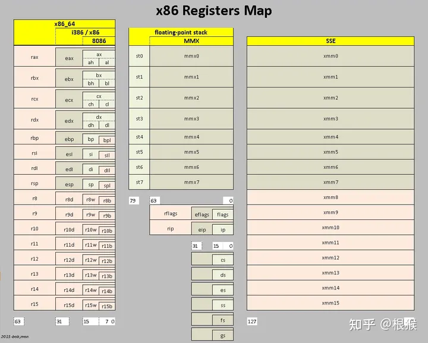
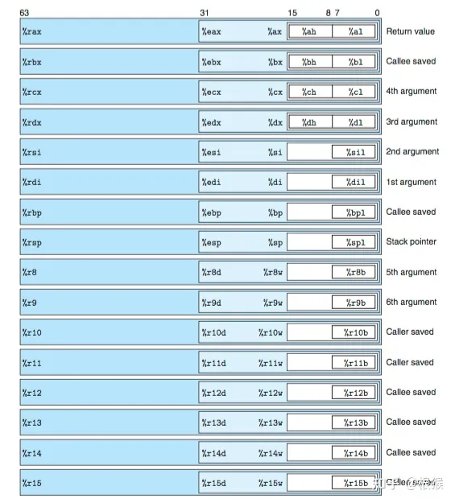
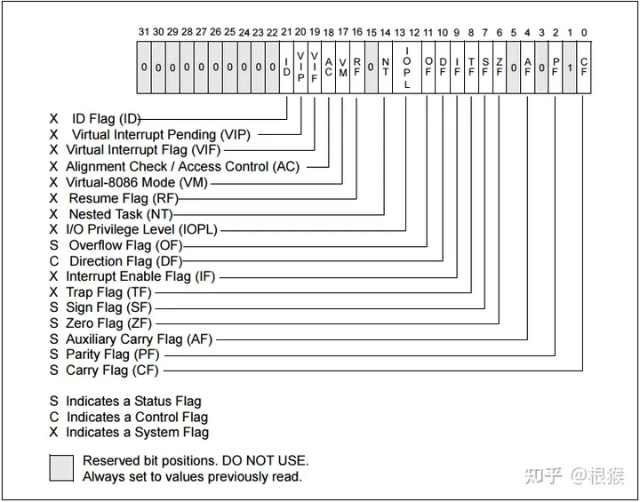
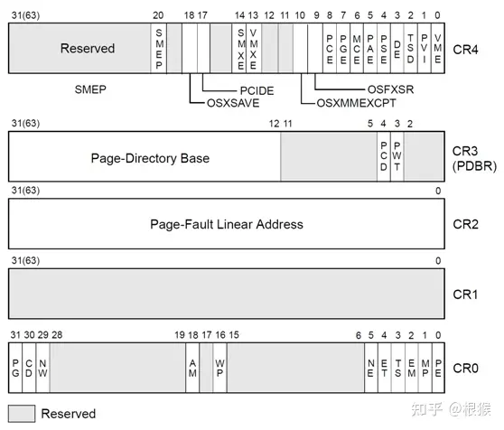

先看图





## 32bit与64bit存在很多差异

- 64位有16个寄存器，32位只有8个。

- - 但是32位使用e开头，而64位前8个使用了r开始。
  - 64bit的寄存器名增加额外8个（r8 - r15），其低位分别用d,w,b指定长度。

- 32位使用栈帧来作为传递的参数的保存位置; 而64位使用寄存器，分别用rdi,rsi,rdx,rcx,r8,r9作为第1-6个参数。rax作为返回值

- 32位用ebp作为栈帧指针，64位取消了这个设定,没有栈帧的指针, rbp作为通用寄存器使用

- 64位支持一些形式的以PC相关的寻址，而32位只有在jmp的时候才会用到这种寻址方式。

## 32位CPU所含有的寄存器有：

- 4个数据寄存器(EAX、EBX、ECX和EDX)
- 2个变址寄存器(ESI和EDI) 和2个指针寄存器(ESP和EBP)
- 6个段寄存器(ES、CS、SS、DS、FS和GS)
- 1个指令指针寄存器(EIP) 1个标志寄存器(EFlags)
- 9个控制寄存器（C0、C1、C2、C3、C4、C5、C6、C7、C8）其中C5～C7架构保留。
- 3保护模式寄存器（GDTR，LDTR，IDTR）

### 数据寄存器

数据寄存器主要用来保存操作数和运算结果等信息，从而节省读取操作数所需占用总线和访问存储器的时间。

32位CPU有4个32位的通用寄存器EAX、EBX、ECX和EDX。

对低16位数据的存取，不会影响高16位的数据。这些低16位寄存器分别命名为：AX、BX、CX和DX，它和先前的CPU中的寄存器相一致。 4个16位寄存器又可分割成8个独立的8位寄存器(AX：AH-AL、BX：BH-BL、CX：CH-CL、DX：DH-DL)，每个寄存器都有自己的名称，可独立存取。

**AX和AL通常称为累加器(Accumulator)**:可用于乘、除、输入/输出等操作(在乘除指令中指定用来存放操作数)

**BX称为基地址寄存器(Base Register):**在计算存储器地址时，可作为基址寄存器使用。

**CX称为计数寄存器(Count Register):**用来保存计数值，如在移位指令、循环指令和串处理指令中用作隐含的计数器(当移多位时，要用CL来指明移位的位数)。

**DX称为数据寄存器(Data Register):**在进行乘、除运算时，它可作为默认的操作数参与运算，也可用于存放I/O的端口地址。DX在作双字长运算时，可把DX和AX组合在一起存放一个双字长数，DX用来存放高16位数据。

32位CPU中，其32位寄存器EAX、EBX、ECX和EDX不仅可传送数据、暂存数据保存算术逻辑运算结果，而且也可作为指针寄存器，所以，这些32位寄存器更具有通用性。

### 变址寄存器

32位CPU有2个32位通用寄存器ESI和EDI。其低16位对应SI和DI，对低16位数据的存取，不影响高16位的数据。

寄存器ESI、EDI、SI和DI称为变址寄存器(Index Register)，**它们主要用于存放存储单元在段内的偏移量**，用它们可实现多种存储器操作数的寻址方式，为以不同的地址形式访问存储单元提供方便。

**变址寄存器不可分割成8位寄存器**。作为通用寄存器，也可存储算术逻辑运算的操作数和运算结果。

它们可作一般的存储器指针使用。在字符串操作指令的执行过程中，对它们有特定的要求，而且还具有特殊的功能。

### 指针寄存器

32位CPU有2个32位通用寄存器EBP和ESP。其低16位对应BP和SP，对低16位数据的存取，不影响高16位的数据。

寄存器EBP、ESP、BP和SP称为指针寄存器(Pointer Register)，**主要用于存放堆栈内存储单元的偏移量**，用它们可实现多种存储器操作数的寻址方式，为以不同的地址形式访问存储单元提供方便。

**指针寄存器不可分割成8位寄存器。**作为通用寄存器，也可存储算术逻辑运算的操作数和运算结果。

它们主要用于访问堆栈内的存储单元，并且规定：

- BP为基指针(Base Pointer)寄存器，用它可直接存取堆栈中的数据；
- SP为堆栈指针(Stack Pointer)寄存器，用它只可访问栈顶。

### 段寄存器

段寄存器是根据内存分段的管理模式而设置的。内存单元的物理地址由段寄存器的值和一个偏移量组合而成

的，这样可用两个较少位数的值组合成一个可访问较大物理空间的内存地址。

CPU内部的段寄存器：

- CS——代码段寄存器(Code Segment Register)，其值为代码段的段值；
- DS——数据段寄存器(Data Segment Register)，其值为数据段的段值；
- ES——附加段寄存器(Extra Segment Register)，其值为附加数据段的段值；
- SS——堆栈段寄存器(Stack Segment Register)，其值为堆栈段的段值；
- FS——附加段寄存器(Extra Segment Register)，其值为附加数据段的段值；
- GS——附加段寄存器(Extra Segment Register)，其值为附加数据段的段值。

在16位CPU系统中，它只有4个段寄存器，所以，程序在任何时刻至多有4个正在使用的段可直接访问；在32位微机系统中，它有6个段寄存器，所以，在此环境下开发的程序最多可同时访问6个段。

32位CPU有两个不同的工作方式：实方式和保护方式。在每种方式下，段寄存器的作用是不同的。有关规定简单描述如下：

实方式： 前4个段寄存器CS、DS、ES和SS与先前CPU中的所对应的段寄存器的含义完全一致，内存单元的逻辑

地址仍为“段值：偏移量”的形式。为访问某内存段内的数据，必须使用该段寄存器和存储单元的偏移量。

保护方式： 在此方式下，情况要复杂得多，装入段寄存器的不再是段值，而是称为“选择子”(Selector)的某个值。

### 指令指针寄存器

32位CPU把指令指针扩展到32位，并记作EIP，EIP的低16位为IP。

指令指针EIP、IP(Instruction Pointer)**是存放下次将要执行的指令在代码段的偏移量**。在具有预取指令功能的系统中，下次要执行的指令通常已被预取到指令队列中，除非发生转移情况。所以，在理解它们的功能时，不考虑存在指令队列的情况。

在实方式下，由于每个段的最大范围为64K，所以，EIP中的高16位肯定都为0，此时，相当于只用其低16位的IP来反映程序中指令的执行次序。

### 标志寄存器



#### 一、运算结果标志位

1、进位标志CF(Carry Flag)

进位标志CF主要用来反映运算是否产生进位或借位。如果运算结果的最高位产生了一个进位或借位，那么，其值为1，否则其值为0。

使用该标志位的情况有：多字(字节)数的加减运算，无符号数的大小比较运算，移位操作，字(字节)之间移位，专门改变CF值的指令等。

2、奇偶标志PF(Parity Flag)

奇偶标志PF用于反映运算结果中“1”的个数的奇偶性。如果“1”的个数为偶数，则PF的值为1，否则其值为0。

利用PF可进行奇偶校验检查，或产生奇偶校验位。在数据传送过程中，为了提供传送的可靠性，如果采用奇偶校验的方法，就可使用该标志位。

3、辅助进位标志AF(Auxiliary Carry Flag)

在发生下列情况时，辅助进位标志AF的值被置为1，否则其值为0：

1. 在字操作时，发生低字节向高字节进位或借位时；
2. 在字节操作时，发生低4位向高4位进位或借位时。

对以上6个运算结果标志位，在一般编程情况下，标志位CF、ZF、SF和OF的使用频率较高，而标志位PF和AF的使用频率较低。

4、零标志ZF(Zero Flag)

零标志ZF用来反映运算结果是否为0。如果运算结果为0，则其值为1，否则其值为0。在判断运算结果是否为0时，可使用此标志位。

5、符号标志SF(Sign Flag)

符号标志SF用来反映运算结果的符号位，它与运算结果的最高位相同。在微机系统中，有符号数采用补码表示法，所以，SF也就反映运算结果的正负号。运算结果为正数时，SF的值为0，否则其值为1。

6、溢出标志OF(Overflow Flag)

溢出标志OF用于反映有符号数加减运算所得结果是否溢出。如果运算结果超过当前运算位数所能表示的范围，则称为溢出，OF的值被置为1，否则，OF的值被清为0。

“溢出”和“进位”是两个不同含义的概念，不要混淆。如果不太清楚的话，请查阅《计算机组成原理》课程中的有关章节。

#### 二、状态控制标志位

状态控制标志位是用来控制CPU操作的，它们要通过专门的指令才能使之发生改变。

1、追踪标志TF(Trap Flag)

当追踪标志TF被置为1时，CPU进入单步执行方式，即每执行一条指令，产生一个单步中断请求。这种方式主要用于程序的调试。

指令系统中没有专门的指令来改变标志位TF的值，但程序员可用其它办法来改变其值。

2、中断允许标志IF(Interrupt-enable Flag)

中断允许标志IF是用来决定CPU是否响应CPU外部的可屏蔽中断发出的中断请求。但不管该标志为何值，CPU都必须响应CPU外部的不可屏蔽中断所发出的中断请求，以及CPU内部产生的中断请求。具体规定如下：

1. 当IF=1时，CPU可以响应CPU外部的可屏蔽中断发出的中断请求；
2. 当IF=0时，CPU不响应CPU外部的可屏蔽中断发出的中断请求。

CPU的指令系统中也有专门的指令来改变标志位IF的值。

3、方向标志DF(Direction Flag)

方向标志DF用来决定在串操作指令执行时有关指针寄存器发生调整的方向。具体规定在第5.2.11节——字符串操作指令——中给出。在微机的指令系统中，还提供了专门的指令来改变标志位DF的值。

#### 三、32位标志寄存器增加的标志位

1、I/O特权标志IOPL(I/O Privilege Level)

I/O特权标志用两位二进制位来表示，也称为I/O特权级字段。该字段指定了要求执行I/O指令的特权级。如果当前的特权级别在数值上小于等于IOPL的值，那么，该I/O指令可执行，否则将发生一个保护异常。

2、嵌套任务标志NT(Nested Task)

嵌套任务标志NT用来控制中断返回指令IRET的执行。具体规定如下：

1. 当NT=0，用堆栈中保存的值恢复EFLAGS、CS和EIP，执行常规的中断返回操作；
2. 当NT=1，通过任务转换实现中断返回。

3、重启动标志RF(Restart Flag)

重启动标志RF用来控制是否接受调试故障。规定：RF=0时，表示“接受”调试故障，否则拒绝之。在成功执行完一条指令后，处理机把RF置为0，当接受到一个非调试故障时，处理机就把它置为1，中国自学编程网整理发布！。

4、虚拟8086方式标志VM(Virtual 8086 Mode)

如果该标志的值为1，则表示处理机处于虚拟的8086方式下的工作状态，否则，处理机处于一般保护方式下的工作状态

## 控制寄存器

x86/x86_64 CPU中提供了控制寄存器，来决定CPU的操作模式和当前执行任务的属性。这些寄存器在32位模式下是32bit，在64位模式中，控制寄存器扩展为64位。
CPU架构中共有CR0、CR1、CR2、CR3、CR4、CR8共6个控制寄存器



- 各个控制寄存器的作用如下：
  CR0：包含当前处理器运行的控制标志。
- CR1：保留。
- CR2：包含发生**页面错误时的线性地址**。
- CR3：页面目录表（Page Directory Table）的**物理地址**。
- CR4：包含处理器扩展功能的标志位。
- C5～C7：保留。
- CR8：提供对任务优先级寄存器（Task Priority Register）的读写（仅在64位模式下存在）。

**CR0**

| Bit  | Label | Description           |
| ---- | ----- | --------------------- |
| 0    | PE    | Protected Mode Enable |
| 1    | MP    | Monitor co-processor  |
| 2    | EM    | x87 FPU Emulation     |
| 3    | TS    | Task switched         |
| 4    | ET    | Extension type        |
| 5    | NE    | Numeric error         |
| 16   | WP    | Write protect         |
| 18   | AM    | Alignment mask        |
| 29   | NW    | Not-write through     |
| 30   | CD    | Cache disable         |
| 31   | PG    | Paging                |

C0可以用两种方式进行读写

```assembly
; 第一种
;其他控制寄存器只能通过此种方式读写
; Write:
mov cr0, reg
 
; Read:
mov reg, cr0

; ----------------------
; 第二种，
; Write:
lmsw reg
 
; Read:
smsw reg
```

**CR1**

Reserved, the CPU will throw a #UD exception when trying to access it.

**CR2**

| Bit       | Label | Description               |
| --------- | ----- | ------------------------- |
| 0-31 (63) | PFLA  | Page Fault Linear Address |

**CR3**

| Bit        | Label | Description                  | PAE          | Long Mode                        |
| ---------- | ----- | ---------------------------- | ------------ | -------------------------------- |
| 3          | PWT   | Page-level Write-Through     | (Not used)   | (Not used if bit 17 of CR4 is 1) |
| 4          | PCD   | Page-level Cache Disable     | (Not used)   | (Not used if bit 17 of CR4 is 1) |
| 12-31 (63) | PDBR  | Page Directory Base Register | Base of PDPT | Base of PML4T/PML5T              |

Bits 0-11 of the physical base address are assumed to be 0. Bits 3 and 4 of CR3 are only used when accessing a PDE in 32-bit paging without PAE.

**CR4**

| Bit  | Label      | Description                                                  |
| ---- | ---------- | ------------------------------------------------------------ |
| 0    | VME        | Virtual 8086 Mode Extensions                                 |
| 1    | PVI        | Protected-mode Virtual Interrupts                            |
| 2    | TSD        | Time Stamp Disable                                           |
| 3    | DE         | Debugging Extensions                                         |
| 4    | PSE        | Page Size Extension                                          |
| 5    | PAE        | Physical Address Extension                                   |
| 6    | MCE        | Machine Check Exception                                      |
| 7    | PGE        | Page Global Enabled                                          |
| 8    | PCE        | Performance-Monitoring Counter enable                        |
| 9    | OSFXSR     | Operating system support for FXSAVE and FXRSTOR instructions |
| 10   | OSXMMEXCPT | Operating System Support for Unmasked SIMD Floating-Point Exceptions |
| 11   | UMIP       | User-Mode Instruction Prevention (if set, #GP on SGDT, SIDT, SLDT, SMSW, and STR instructions when CPL > 0) |
| 13   | VMXE       | Virtual Machine Extensions Enable                            |
| 14   | SMXE       | Safer Mode Extensions Enable                                 |
| 16   | FSGSBASE   | Enables the instructions RDFSBASE, RDGSBASE, WRFSBASE, and WRGSBASE |
| 17   | PCIDE      | PCID Enable                                                  |
| 18   | OSXSAVE    | XSAVE and Processor Extended States Enable                   |
| 20   | SMEP       | Supervisor Mode Execution Protection Enable                  |
| 21   | SMAP       | Supervisor Mode Access Prevention Enable                     |
| 22   | PKE        | Protection Key Enable                                        |
| 23   | CET        | Control-flow Enforcement Technology                          |
| 24   | PKS        | Enable Protection Keys for Supervisor-Mode Pages             |

**CR5 - CR7**

Reserved, same case as CR1.

**CR8**

| Bit  | Label | Description         |
| ---- | ----- | ------------------- |
| 0-3  | TPL   | Task Priority Level |

### 保护模式寄存器

**GDTR**

| Bits  | Label | Description             |
| ----- | ----- | ----------------------- |
| 0-15  | Limit | (Size of GDT) - 1       |
| 16-47 | Base  | Starting address of GDT |

Stores the segment selector of the [GDT](https://link.zhihu.com/?target=https%3A//wiki.osdev.org/GDT).

**LDTR**

| Bits  | Label | Description             |
| ----- | ----- | ----------------------- |
| 0-15  | Limit | (Size of LDT) - 1       |
| 16-47 | Base  | Starting address of LDT |

Stores the segment selector of the [LDT](https://link.zhihu.com/?target=https%3A//wiki.osdev.org/LDT).

**IDTR**

| Bits  | Label | Description             |
| ----- | ----- | ----------------------- |
| 0-15  | Limit | (Size of IDT) - 1       |
| 16-47 | Base  | Starting address of IDT |

Stores the segment selector of the [IDT](https://link.zhihu.com/?target=https%3A//wiki.osdev.org/IDT).

### 汇编中的参数入栈

```c
void test1(int a1, int a2, int a3, int a4, int a5)                  
{                                          
        int a = a5;                                
        int b = a4;                        
}
                         
void test2(int a1, int a2, int a3, int a4, int a5, int a6, int a7, int a8)
{
        int a = 100;                                                
        int b = a8;
        int c = a7;                                                 
        int d = 2;
        int e = 3;                                                  
}       

int main()                                                          
{
        int a = 10;                                                 
        test1(1, 2, 3, 4, 5);                                       
        test2(1, 2, 3, 4, 5, 6, 7, 8);                              
        return 200; 
}
```

汇编代码

```assembly
0000000000401116 <test1>:
  401116:       55                      push   %rbp
  401117:       48 89 e5                mov    %rsp,%rbp
  40111a:       89 7d ec                mov    %edi,-0x14(%rbp)
  40111d:       89 75 e8                mov    %esi,-0x18(%rbp)
  401120:       89 55 e4                mov    %edx,-0x1c(%rbp)
  401123:       89 4d e0                mov    %ecx,-0x20(%rbp)
  401126:       44 89 45 dc             mov    %r8d,-0x24(%rbp)
  40112a:       8b 45 dc                mov    -0x24(%rbp),%eax
  40112d:       89 45 fc                mov    %eax,-0x4(%rbp)
  401130:       8b 45 e0                mov    -0x20(%rbp),%eax
  401133:       89 45 f8                mov    %eax,-0x8(%rbp)
  401136:       90                      nop
  401137:       5d                      pop    %rbp
  401138:       c3                      ret

0000000000401139 <test2>:
  401139:       55                      push   %rbp
  40113a:       48 89 e5                mov    %rsp,%rbp
  40113d:       89 7d dc                mov    %edi,-0x24(%rbp)
  401140:       89 75 d8                mov    %esi,-0x28(%rbp)
  401143:       89 55 d4                mov    %edx,-0x2c(%rbp)
  401146:       89 4d d0                mov    %ecx,-0x30(%rbp)
  401149:       44 89 45 cc             mov    %r8d,-0x34(%rbp)
  40114d:       44 89 4d c8             mov    %r9d,-0x38(%rbp)
  401151:       c7 45 fc 64 00 00 00    movl   $0x64,-0x4(%rbp)
  401158:       8b 45 18                mov    0x18(%rbp),%eax
  40115b:       89 45 f8                mov    %eax,-0x8(%rbp)
  40115e:       8b 45 10                mov    0x10(%rbp),%eax
  401161:       89 45 f4                mov    %eax,-0xc(%rbp)
  401164:       c7 45 f0 02 00 00 00    movl   $0x2,-0x10(%rbp)
  40116b:       c7 45 ec 03 00 00 00    movl   $0x3,-0x14(%rbp)
  401172:       90                      nop
  401173:       5d                      pop    %rbp
  401174:       c3                      ret

0000000000401175 <main>:
  401175:       55                      push   %rbp
  401176:       48 89 e5                mov    %rsp,%rbp
  401179:       48 83 ec 10             sub    $0x10,%rsp
  40117d:       c7 45 fc 0a 00 00 00    movl   $0xa,-0x4(%rbp)
  401184:       41 b8 05 00 00 00       mov    $0x5,%r8d
  40118a:       b9 04 00 00 00          mov    $0x4,%ecx
  40118f:       ba 03 00 00 00          mov    $0x3,%edx
  401194:       be 02 00 00 00          mov    $0x2,%esi
  401199:       bf 01 00 00 00          mov    $0x1,%edi
  40119e:       e8 73 ff ff ff          call   401116 <test1>
  4011a3:       6a 08                   push   $0x8
  4011a5:       6a 07                   push   $0x7
  4011a7:       41 b9 06 00 00 00       mov    $0x6,%r9d
  4011ad:       41 b8 05 00 00 00       mov    $0x5,%r8d
  4011b3:       b9 04 00 00 00          mov    $0x4,%ecx
  4011b8:       ba 03 00 00 00          mov    $0x3,%edx
  4011bd:       be 02 00 00 00          mov    $0x2,%esi
  4011c2:       bf 01 00 00 00          mov    $0x1,%edi
  4011c7:       e8 6d ff ff ff          call   401139 <test2>
  4011cc:       48 83 c4 10             add    $0x10,%rsp
  4011d0:       b8 c8 00 00 00          mov    $0xc8,%eax
  4011d5:       c9                      leave
  4011d6:       c3                      ret
```

先看test1, 参数小于6个，先需要把test1中的局部变量压栈。 然后使用通用寄存器来存储参数，并把参数依次压栈。

test2,参数8个大于默认的6个通用寄存器，要在调用前把多余的参数压栈（2个参数压栈）， 之后通过通用的6个寄存器保存剩余的6个参数，接下来再把test2内部的变量赋值进栈