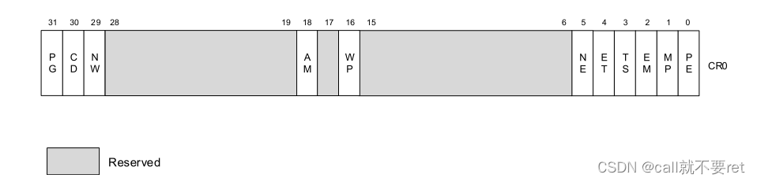

## CR0

研究操作系统很核心的一个关键就是控制寄存器的理解。CR0作为控制寄存器之一，对操作系统有不可言喻的重要性。写一篇博客加深自己对CR0寄存器个个位的含义理解。贴图：

CR0是一个32位的寄存器。每个位都有含义，黑色表示目前没用到属于保留位，指不定以后哪天intel设计了就会用到。我们从左边往右看。

### PG位

我们知道操作系统是存在分页机制的，那么这个标志位就很重要了。

Paging（分页）标志位是CR0寄存器的第31位。当该位被设置时（为1时），启用分页机制；当该位被清除时（为0时），禁用分页机制。当分页被禁用时，所有线性地址都被视为物理地址。也就是说没有分页机制，段机制通过段基址加偏移后就是真实物理地址，如果PE标志（寄存器CR0的第0位）未设置，PG标志则没有影响；在PE标志被清除时设置PG标志会导致通用保护异常（#GP）。

### CD位

Cache Disable（缓存禁用）是CR0寄存器的第30位（bit 30）。当CD和NW标志都被清除时，处理器的内部（和外部）缓存可以对整个物理内存的存储位置进行缓存。当CD标志被设置时，缓存将受到限制，具体限制方式见表格11-5。为了防止处理器访问和更新缓存，必须设置CD标志并使缓存无效，以确保不发生缓存命中。

需要注意的是，CD标志的设置会限制缓存的使用，进而影响系统的性能。在某些情况下，禁用缓存可以确保处理器对内存的访问是基于实际的物理内存而非缓存的副本。这可能在某些特定的系统需求或调试环境中有用。

### NW位

（Not Write-through）是CR0寄存器的第29位（bit 29）。当NW和CD标志都被清除时，对于命中缓存的写操作，启用写回（对于Pentium 4、Intel Xeon、P6家族和Pentium处理器）或写穿（对于Intel486处理器）。此外，也会启用缓存失效周期。

### AM位

Alignment Mask（对齐掩码）是CR0寄存器的第18位（bit 18）。当设置了AM标志时，启用自动对齐检查；当清除AM标志时，禁用对齐检查。对齐检查仅在满足以下条件时进行：AM标志被设置、EFLAGS寄存器中的AC标志被设置、CPL（当前特权级）为3，并且处理器处于保护模式或虚拟8086模式下。

简单来说，CR0.AM用于控制处理器是否执行自动对齐检查。对齐检查可以检测内存操作是否按照预定的对齐要求进行，以确保数据在内存中正确对齐。当AM标志被设置时，处理器会在特定的条件下执行对齐检查，而当AM标志被清除时，对齐检查将被禁用。

### WP位

Write Protect（写保护）是CR0寄存器的第16位（bit 16）。当设置了WP标志时，阻止特权级程序对只读页面进行写操作；当清除WP标志时，允许特权级程序对只读页面进行写操作（不考虑U/S位的设置）。该标志有助于实现创建新进程（forking）时使用的写时复制（copy-on-write）方法，该方法在UNIX等操作系统中被使用。在软件可以设置CR4.CET之前，必须设置此标志，并且只要CR4.CET = 1，就不能清除该标志。

简单来说，CR0.WP用于控制特权级程序对只读页面的写操作。当WP标志被设置时，特权级程序将被禁止写入只读页面，从而保护只读页面的内容不被修改。当WP标志被清除时，特权级程序可以对只读页面进行写操作，即使该页面被标记为只读。这个特性对于实现写时复制（copy-on-write）方法非常有用，该方法用于创建新进程时，将进程的内存映射到相同的物理页面，直到需要修改页面内容时才进行实际的拷贝。

需要注意的是，设置CR0.WP标志是为了支持其他功能（如CR4.CET），并且一旦CR4.CET = 1，就不能清除WP标志。

### NE位

Numeric Error（数值错误）是CR0寄存器的第5位（bit 5）。当设置了NE标志时，启用内部的机制来报告x87 FPU错误；当清除NE标志时，启用PC风格的x87 FPU错误报告机制。当NE标志被清除并且IGNNE#输入被触发时，x87 FPU错误会被忽略。当NE标志被清除并且IGNNE#输入未触发时，未屏蔽的x87 FPU错误会导致处理器断言FERR#引脚以生成外部中断，并在执行下一个等待的浮点指令或WAIT/FWAIT指令之前立即停止指令执行。

FERR#引脚用于驱动外部中断控制器的输入（FERR#引脚模拟Intel 287和Intel 387 DX数学协处理器的ERROR#引脚）。NE标志、IGNNE#引脚和FERR#引脚与外部逻辑一起用于实现PC风格的错误报告。使用FERR#和IGNNE#来处理浮点异常在现代操作系统中已不推荐使用；这种非本机的方法还限制了新型处理器仅能在一个逻辑处理器处于活动状态。

### ET位

Extension Type（扩展类型）是CR0寄存器的第4位（bit 4）。在Pentium 4、Intel Xeon、P6系列和Pentium处理器中，此位被保留。在Pentium 4、Intel Xeon和P6系列处理器中，该标志被硬编码为1。在Intel386和Intel486处理器中，当设置了此标志时，表示支持Intel 387 DX数学协处理器指令。

简而言之，对于Pentium 4、Intel Xeon、P6系列和Pentium处理器，该标志位被保留且固定为1。而对于Intel386和Intel486处理器，当设置了该标志位时，表示支持Intel 387 DX数学协处理器指令。

### MP位

Monitor Coprocessor（监视协处理器）是CR0寄存器的第1位（bit 1）。它控制WAIT（或FWAIT）指令与TS标志（CR0的第3位）的交互作用。如果设置了MP标志，并且TS标志也被设置，那么WAIT指令将引发设备不可用异常（#NM）。如果清除了MP标志，则WAIT指令将忽略TS标志的设置。

### PE位

Protection Enable（保护使能）是CR0寄存器的第0位（bit 0）。当设置了PE标志时，启用保护模式；当清除PE标志时，启用实地址模式。该标志位并不直接启用分页机制，它仅启用段级别的保护。要启用分页，必须同时设置PE和PG标志。

简而言之，设置PE标志可以启用保护模式，该模式下可以提供更强的内存保护和多任务支持；而清除PE标志则进入实地址模式，该模式下没有内存保护和多任务支持。要启用分页机制，必须同时设置PE和PG标志。

需要注意的是，PE标志只是启用保护模式的第一步，要完全启用分页机制，还需要设置PG标志。

CR0控制寄存器我们重点其实只关注PE位，WP位和PG位，对我们查看内核源代码有帮助，其他的可以遇到才查看。
————————————————
版权声明：本文为CSDN博主「call就不要ret」的原创文章，遵循CC 4.0 BY-SA版权协议，转载请附上原文出处链接及本声明。
原文链接：https://blog.csdn.net/qq_30528603/article/details/131143850