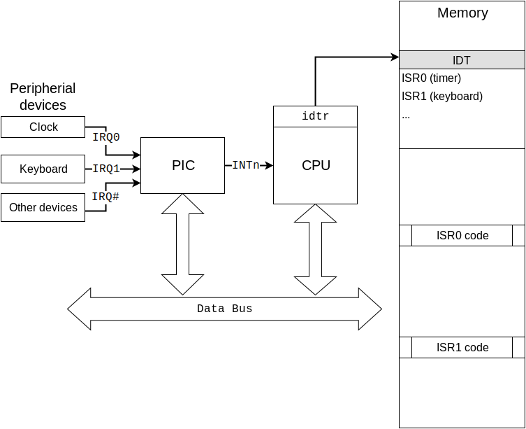
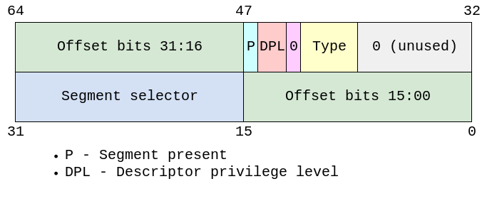

# x86中断基础
原文：Basic x86 interrupts 

作者：Alex Dzyoba

在我的关于多重引导内核的文章中，我们看到了如何加载内核、打印文本，然后停止。然而要让操作系统可用，需要支持键盘输入，将敲击的按键打印在屏幕上。

所需的工作会超出你最初的估计，因为需要初始化x86中断。x86中断是一种古怪而繁琐的机制，拥有超过40年的历史。

## 1. x86中断
中断是设备发送给CPU的事件，用以通知CPU设备有新的消息：比如用户在键盘上输入，或者网络报文到达。如果没有中断，系统需要轮询所有外部设备，这会浪费CPU时间，增加延迟。

中断按照来源可以分为三种类型：

+ 硬件中断。来自硬件设备，比如键盘或网卡。
+ 软件中断。由软件通过int指令产生。在引入sysenter和sysexit指令之前，Linux的系统调用就是通过中断0x80实现的。
+ 异常。在遇到诸如“除零”或“页错误”的异常时，由CPU产生。

x86中断系统由三个部分共同构成，初始化操作也分为三步：

+ 配置可编程中断控制器（PIC）从设备接收中断请求（IRQs），发送给CPU。
+ 配置CPU从PIC接收中断请求，通过中断描述符表（IDT）中定义的调用门（gate），调用相应的中断处理程序。
+ 操作系统需要提供中断服务程序（ISRs）来处理中断。操作系统要支持被中断抢占，并配置PIC和CPU启用中断。

请在阅读文章时回顾下面的参考图。

 

在配置中断之前，我们需要像之前那样设置好GDT。

## 2. 可编程中断控制器（PIC）
PIC是替代CPU连接各种外部设备的硬件，本质上它是一个多路复用器或代理。PIC可以减少CPU引脚，提供多项功能：

+ 通过级联支持更多的中断线。2个级联的PIC可以支持15个中断线。
+ 可以屏蔽特定中断，无需屏蔽全部中断（cli）。
+ 中断排队，即对传递给CPU的中断排序。当某些中断被屏蔽时，PIC将中断加入队列延迟发送，不会直接丢弃中断。

最初的IBM PC有独立的8259 PIC芯片。后来它被集成为南桥/ICH/PCH的一部分。现代PC系统使用高级可编程中断控制器（APIC）来解决多处理器机器上的中断路由问题。但为了向后兼容，APIC可以模拟8259 PIC。只要不使用旧硬件，你实际上使用的是手动配置或由BIOS自动配置的APIC。在本文中，我将使用BIOS自动配置的APIC，不会手动配置PIC。原因有两个：首先PIC有很多常人难以理解的怪异之处。其次，后续我们将为SMP配置APIC。BIOS自动按照IBM PC AT机器的模式配置APIC，即2个级联的PCI和15个中断线。

除了连接引发CPU中断的中断线，PIC还连接CPU数据总线。数据总线用于将IRQ号从PIC发送到CPU，并将配置命令从CPU发送到PIC。配置命令包括PIC初始化、IRQ屏蔽、中断结束（EOI）命令等。

## 3. 中断描述符表（IDT）
中断描述符表（IDT）是一个系统表，保存了中断服务程序（ISR）或简单中断处理程序的描述符。

实模式下有一个中断向量表（IVT）。中断向量表固定在0x0位置，包含以CS和IP描述的中断处理函数指针。这确实不是一种灵活的方式，并且依赖于分段内存管理。自从80286以来，保护模式使用中断描述符表（IDT）。

IDT是内存中的表，由操作系统建立和维护。IDT地址保存在idtr寄存器中。使用lidt指令可以将IDT地址加载到idtr寄存器。IDT只能在保护模式下使用。IDT条目包含门描述符，其中有32位的中断处理程序（ISR）地址、标志位和特权等级。IDT条目是中断门的描述符，类似于GDT中的段描述符。

描述符的主要部分是偏移量。偏移量实质上是由段选择子指定的代码段中ISR的指针。段选择子包含GDT表索引、表指示器（指定GDT或LDT）和特权级别（RPL）。对于中断门，选择子指定的是GDT中的内核代码段。

调用门描述符中的类型（type）域定义了调用门类型：任务、陷阱或中断。对于中断处理函数，需要使用中断调用门。调用中断门时，CPU会清除IF标志位。基本上在设置IDT时，各描述符只有偏移量，即ISR函数地址是不同的。

## 4. 中断服务程序（ISR）
IDT的主要目的是存储指向ISR的指针，CPU在收到中断后自动调用ISR。你不能手动调用中断处理程序。一旦配置好了IDT并打开中断（sti），在发生中断时，在完成一些幕后工作后，CPU将控制传递给中断处理函数。了解这些幕后工作的内容是很重要的。

如果中断发生在用户空间（即中断发生在不同特权级别的代码段），CPU执行下列操作：

+ 在内部临时保存SS、ESP、EFLAGS、CS和EIP的值。
+ 从TSS为新栈（即中断处理函数栈）加载段选择子和栈指针到SS和ESP，切换到新栈。
+ 将临时保存的SS、ESP、EFLAGS、CS和EIP压栈。
+ 如果有错误代码，将错误码压栈。
+ 从中断门或陷阱门加载新代码段的段寄存器和指令指针到CS和EIP寄存器。
+ 如果调用通过中断门进行，清除EFLAGS寄存器的IF标志位。
+ 以新的特权等级开始执行中断处理函数。

如果中断发生在内核空间，CPU不会切换堆栈，这意味着内核空间的中断没有自己的堆栈，而是使用被中断函数的堆栈。在x64系统上，由于red zone的存在，内核中断可能会导致堆栈损坏。这就是内核代码需要使用参数-mno-red-zone编译的原因。关于这点我有一个有趣的故事。

当内核模式下发生中断时，CPU将：

+ 将EFLAGS、CS和EIP的值压栈。
+ 如果有错误码，将其压栈。
+ 从中断门或陷阱门中加载新代码段的段选择子和指令指针到CS和EIP寄存器。
+ 如果调用的是中断门，清除EFLAGS寄存器的IF标志位。
+ 开始执行中断处理程序。

请注意这两种情况的区别在于压栈数据不同。EFLAGS、CS和EIP一定会压栈。当用户空间中断时，还会将SS和ESP压栈。

这意味着当中断处理程序开始执行时，它拥有下面的堆栈：

那么，当控制传递给中断处理程序时，它应该做什么呢？

记住，中断发生在用户空间或内核空间某些代码执行过程的中间，因此首先要做的是在处理中断之前保存被中断过程的状态。过程状态由寄存器的值定义。指令pusha可以将通用寄存器的值保存到栈中。

下一步是修改段寄存器，完全切换到中断处理程序的运行环境。CPU会自动切换CS，因此中断处理程序需要加载4个段寄存器DS、FS、ES和GS。不要忘记保存这些寄存器的原值，并在将来恢复。

当状态已保存、执行环境就绪后，中断处理程序可以开始工作。不过首要的是向PIC发送命令EOI来确认中断。

最后，在完成所有工作之后，中断处理程序要干净的退出。恢复被中断过程的状态（恢复数据段寄存器，执行popa），开启在CPU进入ISR时关闭的中断（sti），并调用iret将控制权返回被中断过程。

下面是基本的ISR处理过程：

+ 保存被中断过程的状态。
+ 保存数据段寄存器。
+ 使用内核数据描述符加载数据段寄存器。
+ 向PIC发送EOI命令确认中断。
+ 处理中断。
+ 恢复数据段寄存器。
+ 恢复被中断过程的状态。
+ 启用中断。
+ 调用iret退出中断处理程序。

## 5. 汇总
现在可以完成全景图，让我们看看键盘事件是如何被处理的：

+ 设置中断：
   + 创建IDT表。
   + 设置编号为9的IDT条目，将中断门指向键盘ISR。
   + 使用lidt加载IDT地址。
   + 发送中断屏蔽码0xfd（11111101）到主PIC，恢复IRQ1。
   + 使用sti启用中断。
+ 用户点击键盘按钮。
+ 键盘控制器在主PIC中引发中断IRQ1。
+ PIC确认中断IRQ1没有被屏蔽，向CPU发送中断号9。
+ CPU检查EFLAGS的IF标志位，确认中断未被屏蔽。
+ （假设当前正在内核模式下运行）
+ CPU将EFLAGS、CS和EIP压栈。
+ 如果PIC有错误码，将其压栈。
+ 查询idtr寄存器指向的IDT，从描述符9中获得段选择子。
+ 检查特权级别，将段选择器和ISR地址加载到CS:EIP。
+ 因为IDT条目是中断门，CPU清除IF标志。
+ 将控制权传递给ISR。
+ ISR接收中断：
    + 使用cli屏蔽中断。
   + 使用pusha保存被中断过程的状态。
   + 将DS压栈。
   + 从内核数据段加载DS、ES、FS、GS。
+ 发送命令EOI（0x20）到主PIC（I/O端口0x20），确认中断。
+ 从键盘控制器（I/O端口0x64）读取键盘状态。
+ 如果状态是1，从键盘控制器（I/O端口0x60）读取键码。
+ 最后，写VGA缓冲区或发送字符到TTY。
+ 从中断处理程序返回：
    + 从堆栈中弹出并恢复DS。
   + 使用popa恢复被中断过程状态。
   + 使用sti启用中断。
   + 调用iret退出中断处理程序。

请注意每次敲击按键时，上述步骤都会发生。也别忘了有几十个其他类型的中断，如时钟、网络数据包等。有些中断是悄悄处理的，你可能都没有注意到。你能想象硬件有多快吗？你能想象你使用的操作开发得有多好吗？现在考虑一下，给操作系统作者和硬件设计师一个大大的表扬。

————————————————
版权声明：本文为CSDN博主「tq1086」的原创文章，遵循CC 4.0 BY-SA版权协议，转载请附上原文出处链接及本声明。
原文链接：https://blog.csdn.net/tq1086/article/details/130162769