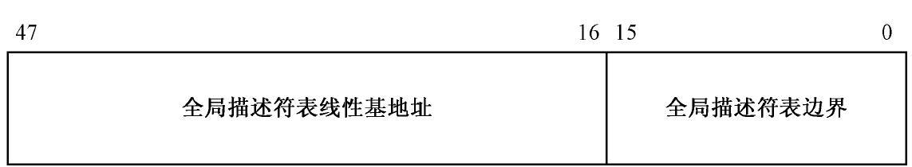
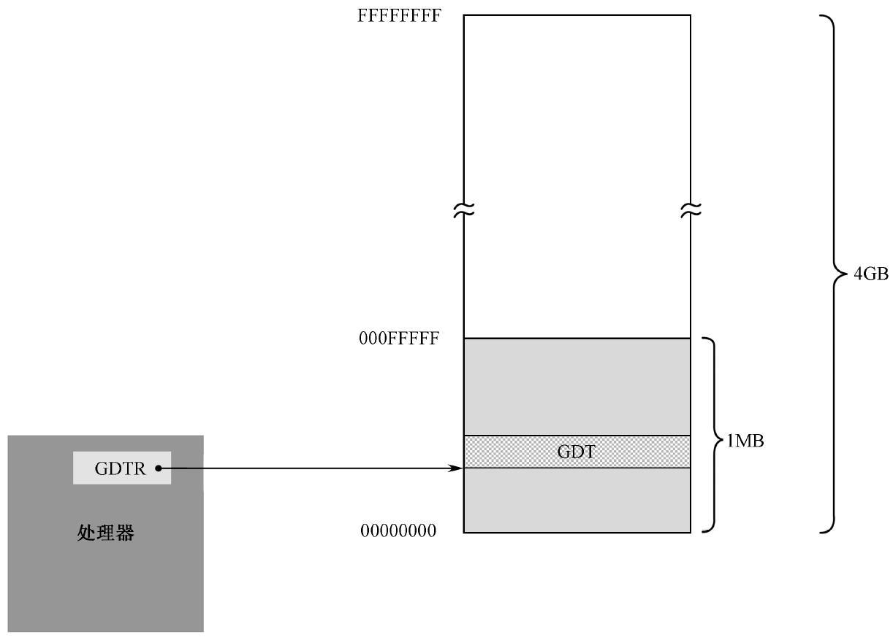
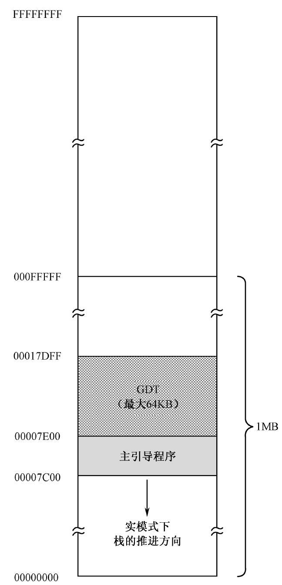
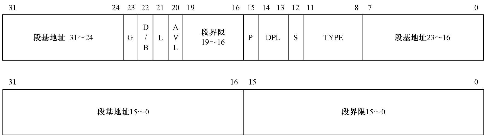
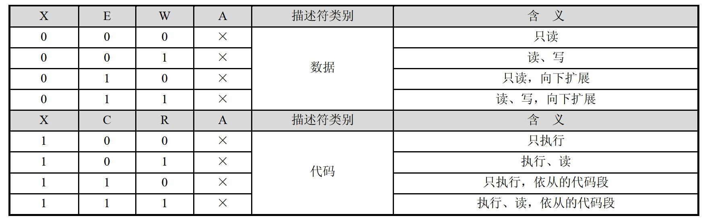

## 1. 全局描述符表

我们知道，为了让程序在内存中能自由浮动而又不影响它的正常执行，处理器将内存划分成逻辑上的段，并在指令中使用段内偏移地址。在保护模式下，对内存的访问仍然使用段地址和偏移地址，但是，在每个段能够访问之前，必须先进行登记。

这种情况好比就像是开公司做生意，在实模式下，开公司不需要登记，卖什么都没有人管，随时都可以开张。但在保护模式下就不行了，开公司之前必须先登记，登记的信息包括住址（段的起始地址）、经营项目（段的界限等各种访问属性）。这样，每当你做的买卖和你的注册项目不符时，就会被阻止。对段的访问也是一样，当你访问的偏移地址超出段的界限时，处理器就会阻止这种访问，并产生一个叫做内部异常的中断。

和一个段有关的信息需要8 个字节来描述，所以称为段描述符（Segment Descriptor），每个段都需要一个描述符。为了存放这些描述符，需要在内存中开辟出一段空间。在这段空间里，所有的描述符都是挨在一起，集中存放的，这就构成一个描述符表。

最主要的描述符表是全局描述符表（ Global Descriptor Table ，GDT），所谓全局，意味着该表是为整个软硬件系统服务的。在进入保护模式前，必须要定义全局描述符表。

如图11-1 所示，为了跟踪全局描述符表，处理器内部有一个48 位的寄存器，称为全局描述符表寄存器（GDTR）。该寄存器分为两部分，分别是32 位的线性地址和16 位的边界。32 位的处理器具有32 根地址线，可以访问的地址范围是0x00000000 到0xFFFFFFFF，共232 字节的内存，即4GB 内存。所以，GDTR 的32 位线性基地址部分保存的是全局描述符表在内存中的起始线性地址，16 位边界部分保存的是全局描述符表的边界（界限），其在数值上等于表的大小（总字节数）减一。

换句话说，全局描述符表的界限值就是表内最后1 字节的偏移量。第1 字节的偏移量是0，最后1 字节的偏移量是表大小减一。如果界限值为0，表示表的大小是1 字节。

因为GDT 的界限是16 位的，所以，该表最大是216 字节，也就是65536 字节（64KB）。又因为一个描述符占8 字节，故最多可以定义8192 个描述符。实际上，不一定非得这么多，到底有多少，视需要而定，但最多不能超过8192 个。

理论上，全局描述符表可以位于内存中的任何地方。但是，如图11-2 所示，由于在进入保护模式之后，处理器立即要按新的内存访问模式工作，所以，必须在进入保护模式之前定义GDT。但是，由于在实模式下只能访问1MB 的内存，故GDT 通常都定义在1MB 以下的内存范围中。当然，允许在进入保护模式之后换个位置重新定义GDT。

## 2.存储器的段描述符
和往常一样，在程序的开始部分要初始化段寄存器。代码清单11-1 第7～9行用于初始化栈，使栈段的逻辑段地址和代码段相同，并使栈指针寄存器SP 指向0x7c00。这是个分界线，从这里，代码向上扩展，而栈向下扩展。

下面开始定义主引导扇区代码所使用的数据段、代码段和栈段。在保护模式下，内存的访问机制完全不同，即，必须通过描述符来进行。所以，这些段必须重新在GDT 中定义。

先是确定GDT 的起始线性地址。代码清单11-1 第96 行， 声明了标号gdt_base 并初始化了一个双字0x00007e00，我们决定从这个地方开始创建全局描述符表（GDT）。这是有意的，如图11-3 所示，在实模式下，主引导程序的加载位置是0x0000:0x7c00，也就是物理地址0x07c00。因为现在的地址是32 位的，所以它现在对应着物理地址0x00007c00。主引导扇区程序共512（0x200）字节，所以，我们决定把GDT 设在主引导程序之后，也就是物理地址0x00007e00 处。因为GDT 最大可以为64KB，所以，理论上，它的尺寸可以扩展到物理地址0x00017dff 处。

相应地，因为栈指针寄存器SP 被初始化为0x7c00，和CS 一样，栈段寄存器SS 被初始化为0x0000，而且栈是向下扩展的，所以，从0x00007c00 往下的区域是实际上可用的栈区域。只不过，该区域包含了很多BIOS 数据，包括实模式下的中断向量表，所以一定要小心。这是没有办法的事，在实模式下，处理器不会为此负责，只能靠你自己。

实模式和保护模式在内存访问上是有区别的，在保护模式下，你不能说访问哪个段就访问哪个段，在访问之前，必须先在GDT 内定义要访问的内存段。也许你觉得多此一举，“想访问哪段内存，我就在GDT 中定义一个描述符，这和直接访问有什么区别？反正也能随心所欲，只不过多了一道手续，这又谈何限制和保护呢？”

实际上并非如此。如果整个计算机系统中只有一个程序在工作，那当然是正确的。问题在于，会有很多程序共同在操作系统上运行。想想你平时玩的电子游戏、音视频播放器、WPS、Word、Excel，它们都依靠Windows 的支撑才能运行。所以，描述符不是由用户程序自己建立的，而是在加载时，由操作系统根据你的程序结构而建立的，而用户程序通常是无法建立和修改GDT 的，也就只能老老实实地在自己的地盘上工作。在这种情况下，操作系统为你的程序建立了几个段，你就只能在
这些段内工作，超出这个范围，或者未按预定的方法访问这些段，都将被处理器阻止。

一旦确定了GDT 在内存中的起始位置，下一步的工作就是确定要访问的段，并在GDT 中为这些段创建各自的描述符。如图11-4 所示，每个描述符在GDT 中占8 字节，也就是2 个双字，或者说是64 位。图中，下面是低32 位，上面是高32 位。

很明显，描述符中指定了32 位的段起始地址，以及20 位的段边界。在实模式下，段地址并非真实的物理地址，在计算物理地址时，还要左移4 位（乘以16）。和实模式不同，在32 位保护模式下，段地址是32 位的线性地址，如果未开启分页功能，该线性地址就是物理地址。页功能将在第16 章和第17 章讲解，而且开启页功能需要做很多准备工作。目前，如果没有特别说明，线性地址就是物理地址。描述符中的段基地址和段界限不是连续的，把它们分成几段似乎不科学。但这也是没有办法的事，这是80286 处理器上带来的后遗症。80286 也是16 位的处理器，也有保护模式，但属于16 位的保护模式。而且，其地址是24 位的，允许访问最多16MB 的内存。尽管80286 的16 位保护模式从来也没形成气候，但是，32 位处理器为了保持同80286 的兼容，只能在旧描述符的格式上进行扩充，这是不得已的做法。

段基地址可以是0～4GB 范围内的任意地址，不过，还是建议应当选取那些16 字节对齐的地址。尽管对于Intel 处理器来说，允许不对齐的地址，但是，对齐能够使程序在访问代码和数据时的性能最大化。这一点，对于那些学过计算机原理，特别是了解内存芯片组织的人来说，是最清楚不过的。

20 位的段界限用来限制段的扩展范围。因为访问内存的方法是用段基地址加上偏移量，所以，对于向上扩展的段，如代码段和数据段来说，偏移量是从0 开始递增，段界限决定了偏移量的最大值；对于向下扩展的段，如栈段来说，段界限决定了偏移量的最小值。

G 位是粒度（Granularity）位，用于解释段界限的含义。当G 位是“0”时，段界限以字节为单位。此时，段的扩展范围是从1 字节到1 兆字节（1B～1MB），因为描述符中的界限值是20 位的。相反，如果该位是“1”，那么，段界限是以4KB 为单位的。这样，段的扩展范围是从4KB 到4GB。

S 位用于指定描述符的类型（Descriptor Type）。当该位是“0”时，表示是一个系统段；为“1”时，表示是一个代码段或者数据段（栈段也是特殊的数据段）。系统段将在以后介绍。

DPL 表示描述符的特权级（Descriptor Privilege Level，DPL）。这两位用于指定段的特权级。共有4 种处理器支持的特权级别，分别是0、1、2、3，其中0 是最高特权级别，3 是最低特权级别。刚进入保护模式时执行的代码具有最高特权级0（可以看成是从处理器那里继承来的），这些代码通常都是操作系统代码，因此它的特权级别最高。每当操作系统加载一个用户程序时，它通常都会指定一个稍低的特权级，比如3 特权级。不同特权级别的程序是互相隔离的，其互访是严格限制的，而且有些处理器指令（特权指令）只能由0 特权级的程序来执行，为的就是安全。

在这里，描述符的特权级用于指定要访问该段所必须具有的最低特权级。如果这里的数值是2，那么，只有特权级别为0、1 和2 的程序才能访问该段，而特权级为3 的程序访问该段时，处理器会予以阻止。特权级将在以后专门讲解，谁也不希望自己的特权级最低，何况现在有随便决定段特权级别的自由。那么，好吧，我们现在一律将特权级设定为最高的0。

P 是段存在位（Segment Present）。P 位用于指示描述符所对应的段是否存在。一般来说，描述符所指示的段都位于内存中。但是，当内存空间紧张时，有可能只是建立了描述符，对应的内存空间并不存在，这时，就应当把描述符的P 位清零，表示段并不存在。另外，同样是在内存空间紧张的情况下，会把很少用到的段换出到硬盘中，腾出空间给当前急需内存的程序使用（当前正在执行的），这时，同样要把段描述符的P 位清零。当再次轮到它执行时，再装入内存，然后将P位置1。

P 位是由处理器负责检查的。每当通过描述符访问内存中的段时，如果P 位是“0”，处理器就会产生一个异常中断。通常，该中断处理过程是由操作系统提供的，该处理过程的任务是负责将该段从硬盘换回内存，并将P 位置1。在多用户、多任务的系统中，这是一种常用的虚拟内存调度策略。当内存很小，运行的程序很多时，如果计算机的运行速度变慢，并伴随着繁忙的硬盘操作时，说明这种情况正在发生。

D/B 位是“默认的操作数大小”（Default Operation Size）或者“默认的栈指针大小” （ Default Stack Pointer Size ） ， 又或者“ 上部边界”（Upper Bound）标志。

设立该标志位，主要是为了能够在32 位处理器上兼容运行16 位保护模式的程序。尽管这种程序现在已经非常罕见了，但它毕竟存在过，兼容，这是Intel 公司能够兴旺发达的重要因素。

该标志位对不同的段有不同的效果。对于代码段，此位称做“D”位，用于指示指令中默认的偏移地址和操作数尺寸。D＝0 表示指令中的偏移地址或者操作数是16 位的；D＝1，指示32 位的偏移地址或者操作数。

举个例子来说，如果代码段描述符的D 位是0，那么，当处理器在这个段上执行时，将使用16 位的指令指针寄存器IP 来取指令，否则使用32位的EIP。

对于栈段来说，该位被叫做“B”位，用于在进行隐式的栈操作时，是使用SP 寄存器还是ESP 寄存器。隐式的栈操作指令包括push、pop 和call 等。如果该位是“0”，在访问那个段时，使用SP 寄存器，否则就是使用ESP 寄存器。同时，B 位的值也决定了栈的上部边界。如果B＝0，那么栈段的上部边界（也就是SP 寄存器的最大值）为0xFFFF；如果B＝1 ， 那么栈段的上部边界（ 也就是ESP 寄存器的最大值） 为0xFFFFFFFF。

对于本书来说，它应当为“1”。本书不过多涉及16 位保护模式，它已经非常罕见了。

L 位是64 位代码段标志（64-bit Code Segment），保留此位给64位处理器使用。目前，我们将此位置“0”即可。

TYPE 字段共4 位，用于指示描述符的子类型，或者说是类别。如表11-1 所示，对于数据段来说，这4 位分别是X、E、W、A 位；而对于代码段来说，这4 位则分别是X、C、R、A 位。

表11-1 中，X 表示是否可以执行（eXecutable）。数据段总是不可执行的，X＝0；代码段总是可以执行的，因此，X＝1。

对于数据段来说，E 位指示段的扩展方向。E＝0 是向上扩展的，也就是向高地址方向扩展的，是普通的数据段；E＝1 是向下扩展的，也就是向低地址方向扩展的，通常是栈段。W 位指示段的读写属性，或者说段是否可写，W＝0 的段是不允许写入的，否则会引发处理器异常中断；W ＝1 的段是可以正常写入的。

对于代码段来说， C 位指示段是否为特权级依从的（Conforming）。C＝0 表示非依从的代码段，这样的代码段可以从与它特权级相同的代码段调用，或者通过门调用；C＝1 表示允许从低特权级的程序转移到该段执行。关于特权级和特权级检查的知识将在第14 章介绍。R 位指示代码段是否允许读出。代码段总是可以执行的，但是，为
了防止程序被破坏，它是不能写入的。至于是否有读出的可能，由R 位指定。R＝0 表示不能读出，如果企图去读一个R＝0 的代码段，会引发处理器异常中断；如果R＝1，则代码段是可以读出的，即可以把这个段的内容当成ROM 一样使用。

也许有人会问，既然代码段是不可读的，那处理器怎么从里面取指令执行呢？事实上，这里的R 属性并非用来限制处理器，而是用来限制程序和指令的行为。一个典型的例子是使用段超越前缀“CS:”来访问代码段中的内容。

数据段和代码段的A 位是已访问（Accessed）位，用于指示它所指向的段最近是否被访问过。在描述符创建的时候，应该清零。之后，每当该段被访问时，处理器自动将该位置“1”。对该位的清零是由软件（操作系统）负责的，通过定期监视该位的状态，就可以统计出该段的使用频率。当内存空间紧张时，可以把不经常使用的段退避到硬盘上，从而实现虚拟内存管理。

AVL 是软件可以使用的位（Available），通常由操作系统来用，处理器并不使用它。如果你把它理解成“好吧，该安排的都安排了，最后多出这么一位，不知道干什么用好，就给软件用吧”，我也不反对，也许Intel 公司也不会说些什么。