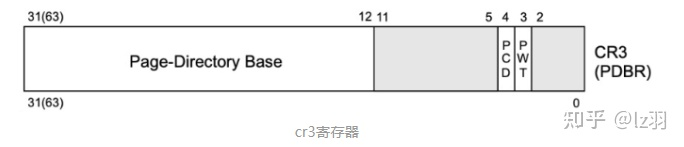

主要记录X86_64位CPU经常出现的寄存器

## 通用寄存器 (general register)

通用寄存器是平时运行程序会使用到的寄存器，也是最多接触的寄存器

| 64-bit | 32-bit | 16-bit | 8-bit (low) |
| ------ | ------ | ------ | ----------- |
| RAX    | EAX    | AX     | AL          |
| RBX    | EBX    | BX     | BL          |
| RCX    | ECX    | CX     | CL          |
| RDX    | EDX    | DX     | DL          |
| RSI    | ESI    | SI     | SIL         |
| RDI    | EDI    | DI     | DIL         |
| RBP    | EBP    | BP     | BPL         |
| RSP    | ESP    | SP     | SPL         |
| R8     | R8D    | R8W    | R8B         |
| R9     | R9D    | R9W    | R9B         |
| R10    | R10D   | R10W   | R10B        |
| R11    | R11D   | R11W   | R11B        |
| R12    | R12D   | R12W   | R12B        |
| R13    | R13D   | R13W   | R13B        |
| R14    | R14D   | R14W   | R14B        |
| R15    | R15D   | R15W   | R15B        |

其中16位的寄存器中，可以访问其高8位的数据

| 16-bit | 8-bit (high) |
| ------ | ------------ |
| AX     | AH           |
| BX     | BH           |
| CX     | CH           |
| DX     | DH           |

### 32位寄存器

- eax：通常用来执行加法，函数调用的返回值一般也放在这里面
- ebx：数据存取
- ecx：通常用作计数器，比如for循环
- edx：暂不清楚
- esp：栈顶指针，指向栈的顶部
- ebp：栈底指针，指向栈的底部，通常用ebp+偏移量的形式来定位函数存放在栈中的局部变量
- edi：字符串操作时，用于存放数据源的地址
- esi：字符串操作时，用于存放目的地址的，和edi两个经常搭配一起使用，执行字符串的复制等操作

### 64位的寄存器

- rax：通常用于存储函数调用返回值
- rsp：栈顶指针，指向栈的顶部
- rdi：第一个入参
- rsi：第二个入参
- rdx：第三个入参
- rcx：第四个入参
- r8：第五个入参
- r9：第六个入参
- rbx：数据存储，遵循Callee Save原则
- rbp：数据存储，遵循Callee Save原则
- r12~r15：数据存储，遵循Callee Save原则
- r10~r11：数据存储，遵循Caller Save原则

## 特殊寄存器 (Special registers)

- 指针寄存器(instruction pointer, RIP.)
  X86-64的RIP可以切分成32位的EIP 和 16位IP，CPU是几位模式下就只能使用对应的指针寄存器。
- 状态寄存器(status register, RFLAGS)

RFLAGS也有32位和16位版本，分别是EFLAGS 和 FLAGS。但是EFLAGS 和 FLAGS可以同时使用。

32位的状态寄存器

- CF： 进位标志
- PF ： 奇偶标志
- ZF ： 零标志
- SF ： 符号标志
- OF ： 补码溢出标志
- TF： 跟踪标志
- IF ： 中断标志

## 段寄存器 (Segment registers)

X86-64一共有6个段寄存器: CS, SS, DS, ES, FS, and GS。

- 除了长模式以外的所有CPU运行模式里，都有一个段选择器 selector, 表示当前使用GDT 还是 LDT。 同时，还需要一个段描述符descriptor, 提供了段的基址和范围。（Linux中基本不使用分段）
- 长模式中，除了 FS 和 GS 之外的所有内容都被视为在一个具有零基地址和64位范围的平面地址空间中。 FS 和 GS 作为特殊情况保留，但不再使用段描述符表，取而代之的是，访问保存在 FSBASE 和 GSBASE 中的MSR寄存器中的基地址。

段寄存器（16位）

## 调试寄存器(Debug registers)

帮助和加速软件调试器的寄存器，如GDB。

- 有6个调试寄存器，分为两种类型：DR0到DR3包含线性地址，每个地址都与一个断点条件相关。
- DR6和DR7是调试状态和控制寄存器。DR6的低位表示遇到了哪些调试条件（在进入调试异常处理程序时），而DR7控制哪些断点地址被启用以及它们的断点条件（例如，当某一地址被写入时）。
- DR4heDR5不清楚具体使用。但它们确实被使用于编码，但分别被当做DR6和DR7，或者在[http://CR4.DE](https://link.zhihu.com/?target=http%3A//CR4.DE)[位3]=1时产生#UD异常。

## 控制寄存器 (Control registers)

x86-64 定义了一组控制寄存器，可用于管理和检查 CPU 的状态。有 16 个“主”控制寄存器，所有这些都可以通过[MOV variant](https://link.zhihu.com/?target=https%3A//www.felixcloutier.com/x86/mov-1)变体访问:

| Name | Purpose                        |
| ---- | ------------------------------ |
| CR0  | Basic CPU operation flags      |
| CR1  | Reserved                       |
| CR2  | Page-fault linear address      |
| CR3  | Virtual addressing state       |
| CR4  | Protected mode operation flags |
| CR5  | Reserved                       |
| CR6  | Reserved                       |
| CR7  | Reserved                       |
| CR8  | Task priority register (TPR)   |
| CR9  | Reserved                       |
| CR10 | Reserved                       |
| CR11 | Reserved                       |
| CR12 | Reserved                       |
| CR13 | Reserved                       |
| CR14 | Reserved                       |
| CR15 | Reserved                       |

所有reserved的控制寄存器在访问时都会产生保护模式异常，不把它们算在本文里。

除了 “主”CRn控制寄存器之外，还有 “扩展”控制寄存器，由XSAVE功能集引入。截至目前，XCR0是唯一指定的扩展控制寄存器。

扩展控制寄存器使用[XGETBV](https://link.zhihu.com/?target=https%3A//www.felixcloutier.com/x86/xgetbv) 和 [XSETBV](https://link.zhihu.com/?target=https%3A//www.felixcloutier.com/x86/xsetbv)而不是MOV的变种。

### CR0

- PG：开启分页模式
- CD：控制Cache高速缓存功能，CD=1关闭该功能
- NW：控制使用通写还是回写，用于维护内存数据一致性，NW=1关闭该功能，数据一致性即通过MESI协议
- AM：控制启用内存对齐自动检查
- WP：控制开启内存写保护，WP=0开启写保护，对只读页面尝试写入将触发异常，这一机制常常被用来实现写时复制功能
- PE：如果PE=1，则保护模式启动，如果PE=0，则在实模式下运行

CR0寄存器

### CR1

保留

### CR2

x86架构中的CR2寄存器是页故障线性地址寄存器，也称为页故障地址寄存器（Page Fault Linear Address Register）。当CPU检测到一个页故障（Page Fault）时，它会将故障发生时的线性地址存储在CR2寄存器中，这个地址指向导致页故障的页面。

内核可以通过读取CR2寄存器来获取引起页故障的地址，然后对该地址所在的页面进行处理，比如进行页面的分配或者进行页面的交换。CR2寄存器的值可以在中断或异常处理例程中读取。

在保护模式下，访问CR2寄存器需要使用特殊的指令，比如MOV CR2, EAX将EAX寄存器的值写入CR2寄存器，或MOV EAX, CR2将CR2寄存器的值读取到EAX寄存器中。在x86_64架构下，CR2寄存器的大小为64位。

### CR3

cr3寄存器和MMU密切相关，保存了当前进程所使用的虚拟地址空间的页目录地址，可以说是整个虚拟地址翻译中的顶级指挥棒，在进程空间切换的时候，CR3也将同步切换。

cr3寄存器的高20位用于保存页目录地址，0-11位记录标记位，所以页目录地址必须是4KB的整数倍。

### CR4

用于控制CPU的特性和操作系统的行为。它的作用如下：

1. 控制分页机制：x86CR4寄存器的最重要作用是控制分页机制。在64位x86处理器中，x86CR4寄存器的第5位（PAE）控制是否启用物理地址扩展（Physical Address Extension，PAE）模式，第7位（PSE）控制是否启用页大小扩展（Page Size Extension，PSE）模式，第12位（PCIDE）控制是否启用页表缓存（Page Directory Cache，PDC）。
2. 启用SMEP和SMAP保护机制：x86CR4寄存器的第20和第21位控制启用Supervisor Mode Execution Protection（SMEP）和Supervisor Mode Access Prevention（SMAP）保护机制。
3. 启用虚拟化扩展：x86CR4寄存器的第13位控制是否启用虚拟化扩展（Virtualization Extension，VME）。
4. 其他：x86CR4寄存器还控制着其他一些特性，如Debugging Extensions（DE）、Machine Check Exception（MCE）和Page Attribute Table（PAT）等。

在Linux内核中，x86CR4寄存器的主要作用是控制分页机制和启用SMEP和SMAP保护机制。

## System table pointer registers

这就是英特尔SDM对这些寄存器的称呼。这些寄存器保存着各种保护模式表的大小和指针。

- 据我所知，它们有四个：GDTR：存放GDT的大小和基址。
- LDTR：保存LDT的大小和基址。
- IDTR：保存IDT的大小和基址。
- TR：保存TSS的选择器和TSS的基址。

GDTR、LDTR和IDTR在64位模式下都是80位：16个低位是寄存器的表的大小，高64位是表的其实地址。

TR同样也是80位。16位用于选择器（其行为与段选择器相同），然后另外64位用于TSS的基本地址。

### GDTR(48bit)

全局描述符表寄存器，CPU现在使用的是分页的内存管理方式，分段的信息存储在GDTR上。在64位的长模式中CS、DS的偏移为0，边界为0xffff。长度这就存储在一个叫全局描述符表（GDT）的表格中，并用gdtr寄存器指向这个表。这个表中的每一项都描述了一个内存段的信息。

### LDTR(16bit)

局部描述符表寄存器，这个寄存器和上面的gdtr一样，同样指向的是一个段描述符表（LDT）。不同的是，GDT是全局唯一，LDT是局部使用的，可以创建多个，随着任务段切换而切换（下文介绍任务寄存器会提到）。

### IDTR(48bit)

中断描述符表寄存器，指向了中断描述符表IDT，这个表的每一项都是一个中断处理描述符，当CPU执行过程中发生了硬中断、异常、软中断时，将自动从这个表中定位对应的表项，里面记录了发生中断、异常时该去哪里执行处理函数。

## MSR（Model Specific Register）

MSR（Model Specific Register）是x86架构中的概念，指的是在x86架构处理器中，一系列用于控制CPU运行、功能开关、调试、跟踪程序执行、监测CPU性能等方面的寄存器。

到Intel Pentium处理器的时候，Intel正式引入RDMSR和WRMSR两个指令用于读和写MSR寄存器，这个时候MSR就算被正式引入。在引入RDMSR和WRMSR指令的同时，也引入了CPUID指令，该指令用于指明具体的CPU芯片中，哪些功能是可用的，或者这些功能对应的MSR寄存器是否存在，软件可以通过CPUID指令查询某些功能是否在当前CPU上是否支持。

每个MSR寄存器都会有一个相应的ID，即MSR Index，或者也叫作MSR寄存器地址，当执行RDMSR或者WRMSR指令的时候，只要提供MSR Index就能让CPU知道目标MSR寄存器。这些MSR寄存器的编号（MSR Index）、名字及其各个数据区域的定义可以在Intel x86架构手册”Intel 64 and IA-32 Architectures Software Developer’s Manual”的[Volume 4](https://link.zhihu.com/?target=https%3A//software.intel.com/sites/default/files/managed/22/0d/335592-sdm-vol-4.pdf)中找到。

参考：

[https://www.owalle.com/2021/12/26/all-registers-x86-64/](https://link.zhihu.com/?target=https%3A//www.owalle.com/2021/12/26/all-registers-x86-64/)

[一口气看完45个寄存器 ——x86/x64架构 - 知乎 (zhihu.com)](https://zhuanlan.zhihu.com/p/502718676)