USB通信协议是一个主从关系的协议，多个USB设备通过USB总 线及集线器（Hub）连接到一个USB主机上，形成一个星状网络，图2- 1是USB网络拓扑。在这个网络中，USB主机管理和配置接入的每一个 设备，从逻辑层面来说，每一个加入的USB设备（除集线器外）都只 能看到USB主机，其他的设备都不可见，所以相互之间不能直接通 信。

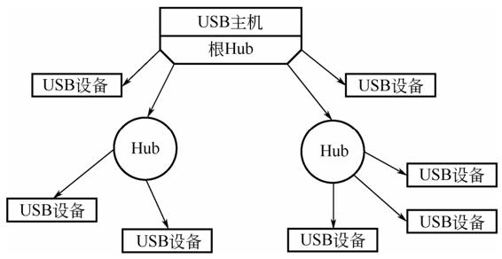

 图2-1 USB网络拓扑

 USB主机会给每一个接入的设备分配一个唯一的地址，发送给 USB设备的数据会在总线上广播，而USB设备会对总线上的数据进行 过滤，使其只接受发送给自己的数据。一个USB主机最多只能分配127 个地址（1～127），并且最多只能连接5层集线器，如图2-2所示。需 要注意的是，第5层Hub只能接USB设备，不能再接Hub。

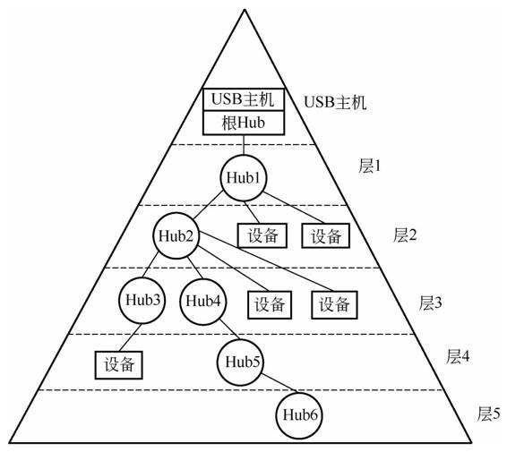

 图2-2 集线器层次 

USB主机和USB设备间的通信是通过管道（Pipe）进行的，如图2- 3所示。在USB协议中，管道是一个逻辑概念，其在USB主机这一端实 际上就是一组缓冲区，用于管道中数据的收发；而在USB设备这一 端，管道对应着一个特定的端点（Endpoint，ENDP），每一个端点都 是一个＜索引，方向＞二元组。USB设备地址、端点索引和端点方向 的组合可以唯一确定USB主机和USB设备间的通信。

 在USB协议中，在一个管道中传输的基本单元就是包 （Packet），它由多个逻辑0和1（也就是差分信号“0”和“1”）构成。多 个包构成了一个事务（Transaction），多个事务构成了一个传输 （Transfer）。本节将基于包、事务和传输来讲解USB的相关协议，主 要包括各类型包及其组成、各类型事务、各类型传输、数据翻转、 USB设备相关请求（Request）。

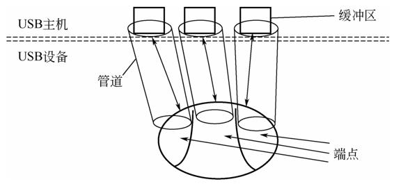

图2-3 USB管道和端点

## 2.1.1 概要

 USB协议层定义了不同类型的包，以及每种包的格式和用途，这 些包是USB协议的最小单位。USB协议中定义了三大类包，包括令牌 （Token）包、数据包和握手包。各类型包通过包标识符（PID）作进 一步区分，为简化起见，我们将PID分别为Setup、IN、OUT、Ping等 的令牌（Token）包称为Setup包、IN包、OUT包、Ping包等。相应 地，数据包和握手包也按此命名，如数据包包括DATA0包、DATA1包 等，握手包包括ACK包、NAK包、STALL包等。

 USB协议层进一步定义了如何使用不同的包的组合来完成一个事 务，根据事务中令牌（Token）包的类型，将事务分为 Setup 事务、IN 事务、OUT事务、Ping事务等。

 在USB协议中，IN和OUT从USB主机的角度来表示数据流动的方 向，IN 表示对于 USB 主机来说数据的流动是“IN”的方向，也就是我 们通常说的USB主机接收数据、USB设备发送数据的情况；OUT表示 对于USB主机来说数据的流动是“OUT”的方向，也就是我们通常说的 USB主机发送数据、USB设备接收数据的情况。

 所有事务全部由USB主机发起，并以一个令牌包开始，如USB主 机使用Setup包来开始一个Setup事务，然后使用DATA0 数据包来发送 数据，接着由USB设备使用ACK包来完成对数据的确认，最终实现一 个带有握手机制的Setup事务来保证数据传输的正确性。事务可以实现 传输数据、发送命令等功能，各种不同事务的组合实现了USB协议层 中定义的传输（Transfer）。 

图 2-4 是传输、事务和包的关系图，其给出了一次成功的控制传 输的示例，控制传输一般用来实现一条USB协议定义的请求 （REQUEST）。从图2-4中可以看出，一个控制传输包括多个事务， Setup事务用来将请求发送给USB设备；IN事务用于USB设备向USB主 机返回请求的响应结果，或者向USB主机传输请求所要求的数据； OUT事务使用握手机制对之前的数据事务的正常结束进行确认。每个 事务包括多个包，每个包由不同的位域构成，后续章节会对各种包、 事务、传输等有更加详细的讲解。 

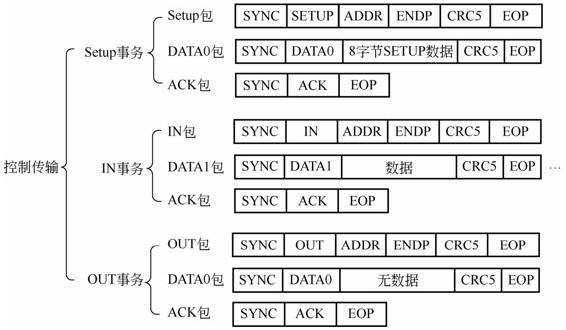

图2-4 传输、事务和包的关系图

## 2.1.2 包

 1.包的组成 

下面将介绍 USB 基本传输单元—包。USB 协议中定义了多种类 型的包、包括令牌（Token）包、数据包和握手包。令牌包全部由USB 主机发出，其他类型包的方向根据实际情况而定。所有包都以同步位 域SYNC开始，并以包结束（EOP）信号结束。各类型包组成位域各 不相同，主要包括包标识符（PID）、包目标地址（ADDR）、包目标 端点（ENDP）、数据、帧索引和循环冗余校验码（CRC），下面将 对各个位域进行详细讲解。

 1）包标识符 包的类型通过长度为8位的包标识符指定，其中包括4位的包类型 位域和与其对应的4位校验位域，校验位域是包类型位域的补码。表2- 1是各类型包的PID位域。其中特殊用途包包括一些应用于特定场合下 的令牌包和握手包。

 表2-1 各类型包的PID位域

 2）包目标地址 

每个USB设备都有一个由USB主机管理分配的地址，USB设备在 被USB主机分配一个地址前将会使用默认的地址0。在收到USB主机分 配的地址后，USB设备将会使用这个新的非0地址，直到USB设备被拔 出、掉电或者复位。

 USB主机发送的包将在总线上广播，所有在总线上的设备需要使 用自己的设备地址对广播的令牌包进行过滤，如果令牌包的地址和端 点号与其自身地址不匹配，该包将会被设备忽略。

 包目标设备的地址长度只有7位，这也是为什么一个USB主机最多 只能管理127个USB设备的原因。所以USB设备的地址由地址位域 ADDR和端点位域ENDP构成，如果令牌包的地址和端点号与USB设备 的地址不匹配，USB设备会忽略该令牌包。同时，发送给一个未初始 化的端点的令牌包也会被忽略。

 地址位域的长度是7位，每个USB设备只有一个唯一的地址，USB 枚举过程中使用默认的地址0。在收到设置地址请求后，USB设备会被 分配一个新的非0地址，如果USB设备不被拔出、掉电或者复位，该地 址将一直存在。

 3）包目标端点 

USB设备和USB主机间的通信建立在一个个单独的管道上，每个 管道在USB设备上都对应一个端点（Endpoint），因此在总线上传输 的每一个包都需要指定其目标端点号。同时端点也是区分方向的， USB主机与USB设备端点1 的IN方向建立的通信管道和与端点1的OUT 方向建立的通信管道是两个不同的通信管道。端点号在包中由4比特表 示，因此USB设备最大可以支持16个双向端点。其中端点0专门用于控 制传输，被称为控制端点，任何USB设备都支持一个默认的控制端点 0，其他端点和具体的功能相关。 

4）数据

 数据长度的范围是 0～1024 字节，不同传输类型在不同速度模式 下的数据位域的长度各不相同。

 5）帧索引

 帧索引的长度是11比特，该位域的初始值为0，由USB主机对其进 行递增，当达到最大值2047时则重新从0开始计数。详细信息见2.1.3 节。

 6）循环冗余校验码

 USB协议规定只有令牌（Token）包和数据包具有循环冗余校验 码，其他的包没有循环冗余校验码。另外，令牌包使用 5 位循环冗余 校验码，数据包使用16位循环冗余校验码。

 2.包格式 

USB 2.0协议中定义了4种包，各类型包的格式各不相同，下面将 介绍令牌包、数据包、握手包和帧开始（Start of Frame，SOF）包的 具体格式。

 1）令牌包

 令牌包包括包标识符（PID）、包目标设备地址（ADDR）、包目 标端点（ENDP）和CRC5校验位域。图2-5是Setup令牌包格式，包括 同步头和包结束符，其中包标识符是0xB4，表明这是一个Setup包，目 标设备地址和目标端点都是0，CRC5是包目标设备地址和包目标端点 的校验值。

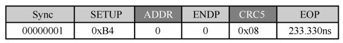

 图2-5 Setup令牌包格式 

令牌包必须由 USB 主机发出，指明了其后续的数据包的目标地址 和端点。

 2）数据包

 数据包包括包标识符（PID）位域、数据位域和CRC16校验位 域。图2-6是数据包格式，其中包标识符是0xC3，表明这是一个 DATA0数据包，数据位域包含8个字节的有效数据，CRC16是数据位 域的校验值。 

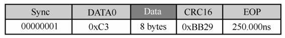

图2-6 数据包格式

 由于数据包中并没有包含其传输的目标地址信息和端点信息，所 以数据包必须紧跟随在令牌包之后。

 3）握手包 

握手包中只有包标识符（PID）位域，图2-7是ACK握手包格式， 其中PID是0x4B，表明这是一个ACK握手包。 

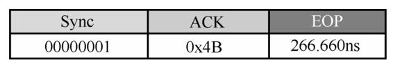

图2-7 ACK握手包格式

 握手包跟随在令牌包或数据包之后，组合成一个完整的事务，是 对一次事务完成的确认，USB主机或者USB设备会根据事务的完成状 态返回相应的握手包。根据包标识符的不同，握手包可分为ACK包、 NAK包、STALL包、NYET包和ERR包，其含义如表2-2所示。

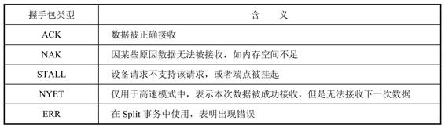

 表2-2 各类型握手包含义

 4）帧开始（SOF）包

 在USB拓扑结构中，USB主机会每隔一定的时间向所有连接上的 USB设备广播SOF包，两个SOF包之间被称为一个帧或者微帧。对于 低速和全速模式，使用的是帧；对于高速模式，使用的是微帧。帧的 时间间隔是 1.00±0.0005 ms，微帧的时间间隔是 125±0.0625μs。SOF 包的作用如下：①USB主机不断向总线上广播 SOF 包，以防止 USB 设备进入挂起状态；②所有的事务必须在一个帧/微帧中进行，一个事 务不能跨越两个帧或者微帧，通过控制帧/微帧中事务的个数，可以实 现USB带宽控制。③用作USB主机和USB设备间时钟同步、调整的一 种机制。

 SOF包包括包标识符（PID）、帧索引和5位循环冗余校验码 （CRC5）位域及EOP位域。图2-8是SOF包格式，其中PID位域是固定 值0xA5，帧索引当前值是512，CRC5是帧索引的循环冗余校验码。

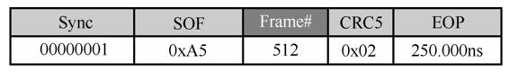

 图2-8 SOF包格式

 USB主机中的根集线器会将SOF包广播给所有的USB设备，所以 SOF包并不需要包含目标设备地址和目标端口信息。

## 2.1.3 事务

 USB 通信中的另一个重要的单元就是事务。事务包括 3 种包、分 别是令牌（Token）包、数据包和握手包。其中数据包是可选的，如用 于设置地址的事务就只含有令牌包和握手包。令牌包的方向一定是 USB主机到USB设备，数据包的方向和令牌包的类型有关，握手包的 方向和数据包的方向相反。如果事务中没有数据包，握手包的方向是 USB设备到USB主机。

 单独的包并没有错误检测机制，传输过程中可能出现各种情况导 致接收方出现错误，事务实际上就是利用令牌包、数据包和握手包实 现了一个带有错误反馈机制的通信，使得USB传输成为一个安全、可 靠的传输。

 1.Setup事务

 图2-9是一次成功的Setup事务，对应Transaction 0，其作用是USB 主机向USB设备发送用于获取设备描述符的标准USB设备请求。该 Setup事务包含：

 ● USB主机发送给USB设备的一个Setup包（Packet 28），该包用 以指明本事务是一个Setup事务（0xB4），以及事务通信的对象为指定 设备的端点0（图2-9中的ADDR字段和ENDP字段）；

 ● USB主机发送给USB设备的用来传输特定请求的数据包（Packet 29），数据长度为固定的8字节，且Setup事务必须使用DATA0包；

 ● USB 设备返回给 USB 主机的表示所有数据已经全部收到的 ACK 包（Packet 30）。

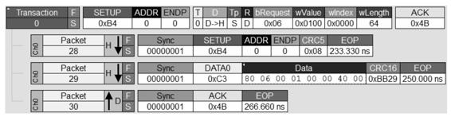

 图2-9 一次成功的Setup事务

 图2-10是Setup事务的处理机制，其中图2-10（a）是USB设备视 图，图2-10（b）是USB主机视图。对于图2-10（a），USB主机向USB 设备发送一个Setup包和DATA0包，如果USB设备接收到DATA0包没有 任何错误（如位填充或者CRC错误），则会向USB主机返回一个ACK 包。如果在此过程中，Setup包或DATA0包出现错误，USB设备会丢弃 收到的包并且不作任何反应。

 对于图2-10（b），如果USB主机向USB设备发送的Setup包或 DATA0包出现错误，USB主机就不会收到USB设备返回的ACK包， USB主机会等待一定时间直到产生超时，此时USB主机将对该Setup事 务进行重传。

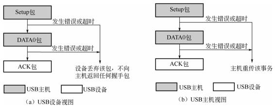

 图2-10 Setup事务的处理机制 

2.OUT事务

 图2-11是OUT事务的处理机制，其中图2-11（a）是USB设备视 图，图2-11（b）是USB主机视图。对于图2-11（a），USB主机向USB 设备发送OUT 包和数据包，如果 USB 设备接收到的数据包没有任何 错误（如位填充或者 CRC 错误），并且数据包的 PID 和自身包序列 匹配，则 USB 设备返回ACK 包；如果低速或全速的 USB 设备因自身 内存空间不够等原因无法接收USB主机发送来的数据，则会向USB主 机返回一个NAK包；如果USB设备的OUT端点被停止（Halt），那么 USB设备向USB主机返回一个STALL包；对于控制传输和批量传输， 如果高速的USB设备成功接收到USB主机发送来的数据但无法接收下 一个数据包中的数据，则会向USB主机返回一个NYET 包（后续章节 会有关于 NYET 包的详细介绍）；需要注意的是，在此OUT事务中， 如果OUT包或者数据包发生错误，USB设备会忽略它们并且不会作任 何反应。

 对于图2-11（b），USB主机会按照上述各种情况收到ACK包、 NAK包、STALL包或者NYET包。如果USB主机向USB设备发送的 OUT包或数据包出现错误，USB主机就不会收到USB设备返回的任何 握手包，USB主机会等待一定时间直到产生超时，此时USB主机将对 该OUT事务进行重传。同时，如果USB设备向USB主机返回一个NAK 握手包，USB主机也会对该OUT事务进行重传。需要注意的是，在高 速模式下的OUT事务中，USB主机收到USB设备返回的NAK包后， USB主机会转而使用Ping事务。

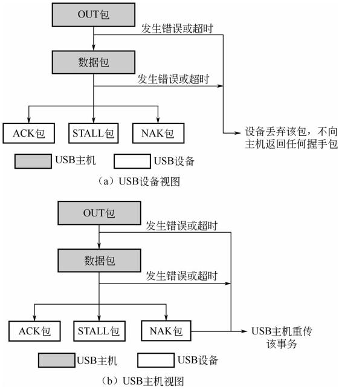

 图2-11 OUT事务的处理机制

 图2-12是一次成功的OUT事务，对应Transaction 25242，其作用是 USB主机向USB设备发送数据。该OUT事务包含：

 ● USB主机发送给USB设备的一个OUT包（Packet 75805），该包 用以指明本事务是一个OUT事务（0x87），以及事务通信的对象为指 定设备的端点2（图2-12中的ADDR字段和ENDP字段）。

 ● USB 主机发送给 USB 设备的用来传输实际数据的数据包 （Packet 75806），此例子中USB主机发送给USB设备的数据长度是8 字节。

 需要说明的是，数据长度不能超过端点所支持的最大包长度。

 ● USB 设备返回给 USB 主机的表示所有数据已经全部收到的 ACK 包（Packet 75807）。

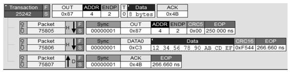

 图2-12 一次成功的OUT事务

 3.IN事务

 图2-13是IN事务的处理机制，其中图2-13（a）是USB设备视图， 图 2-13（b）是USB主机视图。对于图2-13（a），USB主机向USB设 备发送一个IN包，USB设备向USB主机发送数据包。在 USB主机成功 收到后，USB主机向USB设备返回一个ACK包。在该IN事务中，如果 IN包或数据包发生错误，USB主机并不会返回任何握手包。USB主机 向USB设备发送IN包后，如果USB设备没有数据要发送给USB主机， 那么USB设备会直接向USB主机返回一个NAK包。如果USB设备中用 于接收IN包的端点被停止，那么USB设备直接向USB主机返回一个 STALL包。

 对于图2-13（b），如果USB 主机向USB 设备发送的IN包出现错 误，USB主机就不会收到USB设备返回的任何握手包和数据包，USB 主机会等待一定时间直到产生超时，此时 USB 主机将对该 IN 事务进 行重传。另外，如果 USB 设备返回给 USB 主机的数据包出现错误， USB 主机接收不到该数据包并一直等待直到超时，此时USB主机也会 对该IN事务进行重传。

 图2-14是一次成功的IN事务，对应Transaction 25243，其作用是 USB主机向USB设备请求数据。该IN事务包含：

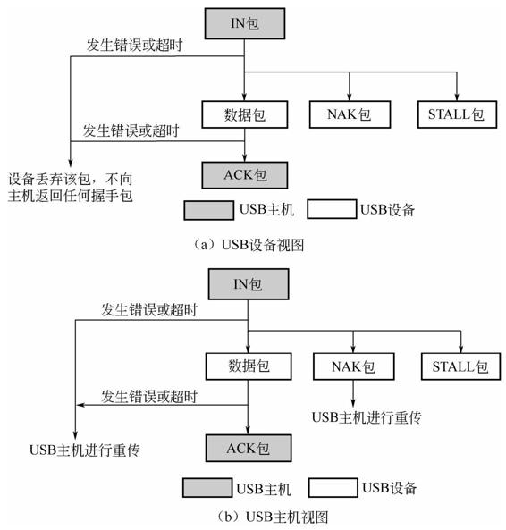

 图2-13 IN事务的处理机制

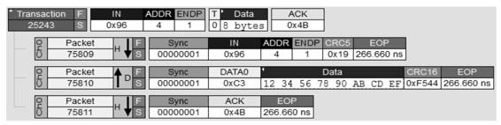

 图2-14 一次成功的IN事务

 ● USB主机发送给USB设备的一个IN包（Packet 75809），该包用 以指明本事务是一个IN事务（0x96），以及事务通信的对象为指定设 备的端点1（图2-14中的ADDR字段和ENDP字段）。

 ● USB 设备发送给 USB 主机的用来传输实际数据的数据包 （Packet 75810），此例子中USB设备发送给USB主机的数据长度是8 字节。需要说明的是，数据长度不能超过端点所支持的最大包长度。

 ● USB 主机返回给 USB 设备的表示所有数据已经全部收到的 ACK 包（Packet 75811）。

 4.Ping事务

 在低速和全速模式下，USB主机使用控制传输或者批量传输向 USB设备发送数据时，如果USB设备因某些原因（如内存空间不足） 无法接收数据，USB设备会向USB主机返回NAK包。如果USB设备一 直无法接收USB主机发送来的数据，那么USB主机会一直向USB设备 发送OUT包和数据包，USB设备会一直返回NAK包。这样，USB总线 上会一直存在OUT包、数据包和NAK包，总线利用率会很低。在低速 或者全速模式下，最大传输包长度只有64字节，但是对于高速设备， 最大传输包长度可以达到512字节，总线带宽会被大量地浪费。因此， 在高速模式下，使用一种新的事务—Ping 事务，来解决这个问题。 USB主机在发送OUT事务之前先使用Ping事务来确定USB设备是否能 够接收数据，如果设备不能接收数据，USB主机会在一定时间后再次 使用Ping事务，直到USB设备能够接收数据为止。由于Ping事务只有 令牌包和握手包，与原有的OUT事务相比，能够节省大量的总线带 宽，从而提高了总线利用率。

 USB主机首先会向USB设备发送一个OUT包和包含要发送的数据 的数据包，USB设备有可能会向USB主机返回一个ACK包、NAK包或 者NYET包。如果USB设备返回NAK包或者NYET包，之后USB主机就 会开始使用Ping事务。

 图2-15是Ping事务的处理机制，其中图2-15（a）是USB设备视 图，图 2-15（b）是USB主机视图。对于图2-15（a），USB主机向 USB设备发送一个Ping包。如果此时USB设备能够接收USB主机将要 发来的数据，则会向USB主机返回一个ACK包；如果USB设备无法接 收USB主机将要发送来的数据，则会向USB主机返回NAK包；如果 Ping包发生错误，USB设备不会返回任何握手包。

 对于图2-15（b），如果USB主机向USB设备发送的Ping包出现错 误，USB主机就不会收到USB设备返回的任何握手包，USB主机会等 待一定时间直到产生超时，此时USB主机将对该Ping事务进行重传。

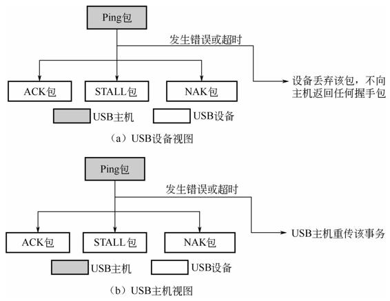

 图2-15 Ping事务的处理机制 

图 2-16 是用于发送数据的 Ping 事务，包括 USB 设备返回 NYET 包的OUT事务（Transaction 70）和USB设备返回ACK包的Ping事务 （Transaction 73），其中OUT事务包含：

 ● USB主机发送给USB设备的一个OUT包（Packet 3314），该包 用以指明本事务是一个OUT事务（0x87），以及事务通信的对象为指 定设备的端点2（图2-16中的ADDR字段和ENDP字段）；

 ● USB 主机发送给 USB 设备的用来传输实际数据的数据包 （Packet 3315），此例子中USB主机发送给USB设备的数据长度是31 字节，需要说明的是，数据长度不能超过端点所支持的最大包长度；

 ● USB设备返回给USB设备NYET包（Packet 3316），表明USB设 备可以接收当前USB主机发送来的数据，但是无法接收USB主机之后 发送来的数据。

 此时，USB主机开始使用Ping事务来检查USB设备是否已经可以 接收数据，该Ping事务包含：

 ● USB主机发送给USB设备的一个Ping包（Packet 3325），该包用 以指明本事务是一个 Ping 事务（0x2D），以及事务通信的对象为指 定设备的端点2（图2-16中的ADDR字段和ENDP字段）；

 ● USB设备返回给USB主机的一个ACK包（Packet 3326），表示 USB设备已经可以接收之后USB主机发送来的数据。 在此之后，USB主机将继续使用OUT事务向USB设备发送数据。

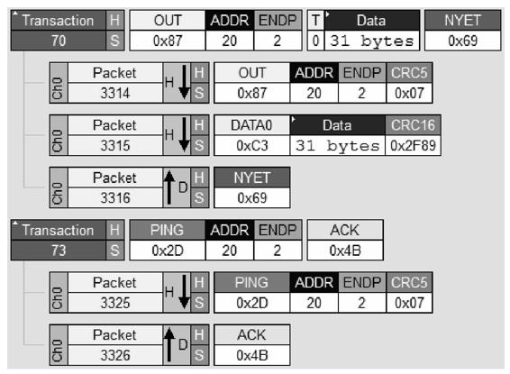

 图2-16 用于发送数据的Ping事务

 5.Split事务

 当一个低速或全速的USB设备连接到一个高速的Hub上时，高速 USB主机需要使用 Split 事务来解决数据从高速模式到低速和全速模式 的转换，Split事务分为SSplit（Start Split）事务和CSplit（Complete Split）事务两种类型。一个SSplit事务和一个CSplit事务两者联合使用 来完成一个低速或全速模式下的常规的事务。

 图2-17是发送数据的Split事务，包括高速USB主机和高速Hub之间 的一个 SSplit 事务和一个 CSplit 事务，两个事务完成高速 USB 主机通 过高速Hub向低速或全速USB设备发送数据。其中，SSplit事务用于高 速USB主机通过高速 Hub 向低速或全速 USB 设备发送数据，CSplit 事 务用于高速 Hub将USB设备返回的握手包返回给USB主机。 

该SSplit事务包含：

 ● USB主机发送给高速Hub的一个Split包（Packet 18848），该包 用以指明本事务是一个Split事务（0x87）。同时图2-17中Split包的S位 域（值为0）进一步指明了这是一个SSplit包，因此协议分析仪进一步 将这个Split事务解析为SSplit事务。另外，图2-17中Split包中的Hub Addr和Port指明了USB主机的事务通信的对象是哪个高速Hub的哪个端 口。

 ● USB主机发送给高速Hub的一个OUT包（Packet 18849），该包 用以指明高速Hub和低速/全速USB设备之间是一个OUT事务 （0x87），以及高速 Hub 的下行端口的事务通信的对象为指定设备的 端点 0 （图2-17中的ADDR字段和ENDP字段）。

 ● USB 主机发送给高速 Hub 的用来传输实际数据的数据包 （Packet 18850），此例子中USB主机发送给USB设备的数据长度是0 字节，需要说明的是，数据长度不能超过端点所支持的最大包长度。

 ● 高速 Hub 返回给 USB 设备的表示所有数据已经全部收到的 ACK 包（Packet 18851）。

 高速USB主机和高速Hub之间完成此次SSplit事务后，高速Hub会 将SSplit事务的OUT包和数据包转发给指定端口的USB设备，USB设备 根据接收情况向高速Hub返回指定的握手包。高速USB主机开始使用 CSplit事务来获取这个握手包，该CSplit事务包含：

 ● USB主机发送给高速Hub的一个Split包（Packet 18852），该包 用以指明本事务是一个Split事务（0x87）。同时图2-17中Split包的S位 域（值为1）进一步指明了这是一个CSplit包，因此协议分析仪进一步 将这个Split事务解析为CSplit事务。另外，图2-17中Split包中的Hub Addr和Port位域指明了USB主机的事务通信的对象是哪个高速Hub的哪 个端口。

 ● USB主机发送给高速Hub的一个OUT包（Packet 18853），该包 用以指明高速Hub和低速/全速USB设备之间是一个OUT事务 （0x87），以及事务通信的对象为指定设备的端点0（图2-17 中的 ADDR 字段和ENDP字段）。

 ● 高速Hub返回给USB主机ACK包（Packet 18854）。需要注意的 是，这个ACK包是低速/全速USB设备的，具体是ACK还是NAK等与 设备和Hub之间的执行结果有关。 

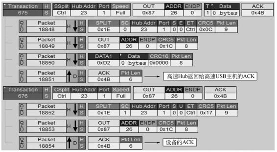

图2-17 发送数据的Split事务

 图2-18是接收数据的Split事务，用于高速USB主机接收来自低速 或全速 USB 设备的数据，也包括 SSplit 事务和 CSplit 事务，其执行流 程与高速USB主机发送数据流程类似，此处不再赘述。

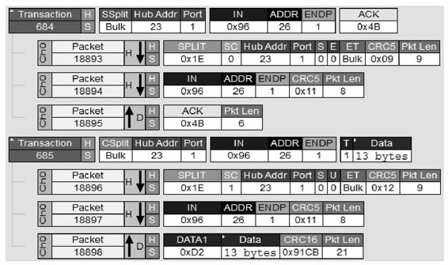

 图2-18 接收数据的Split事务

 在Split事务中，如果高速Hub无法处理Split事务，高速Hub会向 USB主机返回一个NYET包；如果低速或全速USB设备和高速Hub之间 的事务一直没有完成，高速Hub也会向USB主机返回一个NYET包；当 高速Hub端口下的低速或全速USB设备出现错误时，高速Hub会向USB 主机发送一个ERR包。

## 2.1.4 传输

 包是USB传输的最小单位，事务是USB带反馈机制的可靠传输的 最小单位，基于事务，USB协议定义了传输（Transfer）用于完成一组 具有特定目的的事务，其中任意一个事务失败，则整个传输都会失 败。

 USB协议中定义了四种传输类型，包括控制传输、中断传输、批 量传输和同步传输，表 2-3 是各类型传输（Transfer）支持的最大包长 度（字节），USB设备在所有的速度模式下都支持控制传输，而低速 模式不支持同步传输和批量传输。

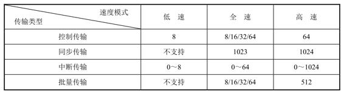

 表2-3 各类型传输（Transfer）支持的最大包长度（字节）

 下面将对各类型传输进行详细介绍。

 1.控制传输

 一个控制传输（Control Transfer）一般用于完成一个特定的请求 （Request），通常这些特定的请求由USB规格说明书定义，特别是 USB设备枚举过程，全部都由控制传输来完成，其完成的请求 （Request）也全部都由USB规格说明书所定义。后续章节会详细讲解 其中每一个请求的含义及用法，这里我们只选取第一个获取设备描述 符 GetDescriptor（）的请求来介绍控制传输的相关知识。

 一个控制传输包括三个阶段，分别是设置阶段（Setup Phase）、 数据阶段（Data Phase）和状态阶段（Status Phase），其中数据阶段是 可选的。设置阶段包含一个Setup事务；数据阶段是零个、一个或多个 的IN或者OUT事务；状态阶段是一个数据长度为0的IN或者OUT事 务。这里需要注意的是，如果数据阶段是IN事务，则状态阶段是一个 OUT事务；如果数据阶段是OUT事务，则状态阶段是一个IN事务；如 果控制传输没有数据阶段，则状态阶段是一个IN事务。

 简单地说，设置阶段由USB主机向USB设备发送特定的请求 （Request）。对于某个特定的请求，其数据阶段中需要传输的数据大 小和方向都是确定的。但不同的请求，其数据阶段也不尽相同，有可 能是USB主机向USB设备发送数据，也有可能是USB设备向USB主机 回传数据，也有可能该请求不需要发送数据，这时就没有数据阶段。 状态阶段则是对数据阶段的反馈，这也是为什么状态阶段数据流的方 向与数据阶段数据流方向相反的原因。 如果在数据阶段中USB主机需要从USB设备端获取数据，所传输 的数据量大小是由USB主机所指定的，但是有可能USB设备并没有足 够多的数据提供给USB主机，所以数据阶段可以在以下两种情况下结 束：

 ● USB主机接收到其所指定大小的数据；

 ● USB主机接收到一个数据包，其数据量大小小于端点0的最大包 长度。

 对于第二种情况还有一种更为特殊情况就是USB设备端所发送的 数据量小于USB主机所指定的大小，但是USB设备端所发送的最后一 个数据包刚好是端点0的最大包长度。例如，USB主机想要从USB设备 端获取255个字节，但是USB设备端只有64个字节的数据，并且USB设 备端点0的最大包长度刚好也是64。在这种情况下，USB设备端必须要 多发送一个0字节长度的数据包通知USB主机没有更多的数据可以发 送。

 图2-19是获取设备描述符的控制传输，这个控制传输用于USB主 机获取USB设备的设备描述符。其中包含一个Setup事务、一个IN事务 和一个OUT事务，分别对应于一个控制传输的设置阶段、数据阶段和 状态阶段。 在本例中，控制传输的设置阶段就是一个 Setup 事务，即图 2-19 中的Transaction 0。该事务用于向USB设备发送用于特定的请求。数据 阶段只包含一个IN事务，即图2-19中的Transaction 4。实际上数据阶段 可以包含多个IN事务，在数据阶段中IN或者OUT事务的多少取决于需 要传输的数据量和USB设备所支持的控制传输的最大包长度。例如， 在本例中，需要传输的数据量是18个字节，而USB设备所支持的控制 传输中数据长度是64，所以只需要一个IN事务即可处理。若传输的数 据长度多于64，则需要多个IN事务才能完成。需要注意的是，当一个 控制传输中有多个事务时，最后一个事务之前的事务的数据长度都是 端点所支持的最大包长度，最后一个事务的数据长度小于或等于端点 所支持的最大包长度。如果最后一个事务的数据长度小于端点支持最 大包长度，则认为数据传输完。

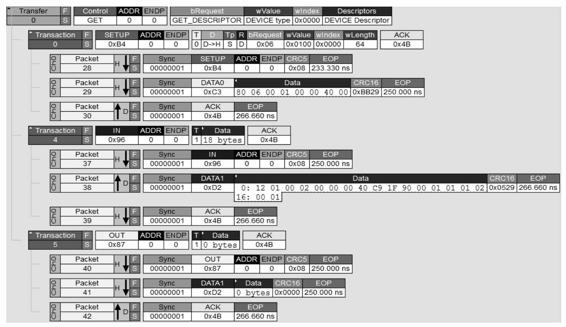

 图2-19 获取设备描述符的控制传输

 在本例中，由于数据阶段是IN事务，所以状态阶段就是一个OUT 事务，并且OUT事务的数据长度一定是0。另外，需要注意的是，控 制传输的设置阶段的数据包的PID必须是DATA0，数据阶段的数据包 的PID必须以DATA1开始并且不断在DATA0和DATA1之间切换，状态 阶段的数据包PID必须是DATA1，关于这一部分内容将在2.1.6节进行 详细介绍。 对于控制传输，我们需要考虑一种非常特殊的情况，如果控制传 输的状态阶段是IN事务，在这个IN事务中，如果USB主机向USB设备 返回的ACK包失败了怎么办？对于USB主机，其会认为这个ACK握手 包已经被USB设备成功接收，从而继续开始发送Setup包执行下一个控 制传输。对于USB设备，它虽然没有接收到这个ACK包，但是它在接 收到USB主机发送来的下一个Setup包时就会默认上一个没有收到的 ACK包已经被收到，从而正常结束上一个控制传输，并正常响应下一 个控制传输。

 所有的USB设备都需要及时处理主机的命令请求，否则就会导致 主机产生超时错误。USB协议规定，任何命令的上限执行时间不能超 过5s。但是对于某些命令，5s是不适用的，这些命令必须在更短的时 间内完成。USB协议虽然规定了命令可以在最多5s内完成，但是USB 设备最好不要使用这个最大值，否则会导致命令请求处理过程消耗过 多的时间，用户体验会很差。

 对于没有数据阶段的标准设备请求，设备必须在收到请求后的 50ms内完成请求的状态阶段；对于需要USB设备向USB主机发送数据 的标准设备请求，设备必须在收到请求后的500ms内把第一个数据包 发送给主机，如果接下来还有数据包，设备必须在前一个数据包成功 传输完成后的500ms内发出数据包。在发出最后一个数据包后，设备 必须在50ms内完成状态阶段；对于需要USB主机向USB设备发送数据 的标准设备请求，设备必须在最多5s内完成数据阶段和状态阶段。

 2.中断传输

 中断传输一般用于传输数据量小、具有周期性且要求响应速度较 快的数据，如键盘、鼠标或者游戏手柄等。图 2-20 是一次成功的中断 传输，用于USB主机向USB设备发送数据。其只有一个OUT事务，该 事务中数据包的数据位域包含了USB主机所发送的8个字节的数据12 34 56 78 90 AB CD EF。需要注意的是，因为该例中只传输了8个字节 的数据，没有超过端点支持的最大包长度，因此一个中断传输 （Transfer）中只要一个事务即可。如果传输的数据长度大于端点支持 的最大包长度，则一个中断传输内需要多个事务。在传输数据时，如 果最后一个事务的数据长度小于端点支持最大包长度，则认为数据传 输完。

 3.批量传输

 批量传输用于传输数据量大、非周期性、对实时性没有要求的数 据，一旦有多余的USB总线带宽，批量传输会立即执行，但当带宽比 较紧张时，批量传输会把带宽让给其他类型的传输。图2-21是一次成 功的MSD类设备的批量传输，用于USB设备向USB主机发送512字节 的数据。这个批量传输包含了8个IN事务，每个IN事务传输了64字节 的数据。

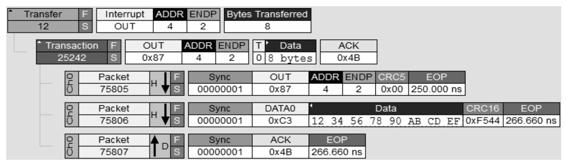

 图2-20 一次成功的中断传输

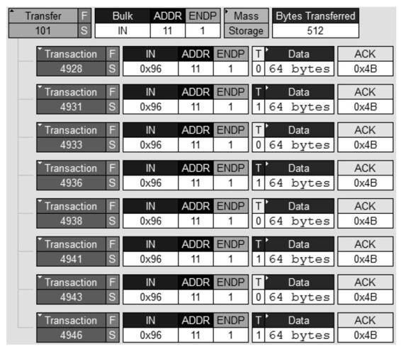

 图2-21 一次成功的MSD类设备的批量传输

 对于CDC类USB设备，其也可以使用批量传输（Transfer）与USB 主机之间传输数据。当CDC类USB设备向USB主机发送数据时，USB 主机发送IN包，USB设备返回包含数据的数据包，USB主机在成功接 收时返回ACK包。对于批量传输的最后一个事务，如果USB主机接收 的数据包中的数据长度小于端点支持的最大包长度，那么USB主机将 知道USB设备已经将数据发送完；如果USB主机接收的数据包中的数 据长度等于端点支持的最大包长度，那么USB主机并不知道USB设备 已经将数据发送完。在这个时候，USB设备就需要向 USB 主机发送一 个数据字段长度为 0 的数据包，来告诉 USB主机其已经将数据发送 完。

 4.同步传输

 同步传输用于传输周期性、低延时性但不需要保证传输质量的数 据，如音频或者视频数据。因此，不论是同步传输的IN事务还是OUT 事务都没有握手阶段。图2-22是一次成功的同步传输，用于USB设备 向USB主机发送数据。其中包含了多个IN事务，每个事务中的数据包 的数据位域包含了USB设备发送给USB主机的数据。从事务中可以看 到，同步传输并没有握手包。需要注意的是，当一个同步传输中有多 个事务时，最后一个事务之前的事务的数据长度都是端点所支持的最 大包长度，最后一个事务的数据长度小于或等于端点所支持的最大包 长度。如果最后一个事务的数据长度小于端点支持最大包长度，则认 为数据传输完。另外，对于全速模式的同步传输，USB设备或者USB 主机应可以接收DATA1包或者DATA0包，但只能发送DATA0包。

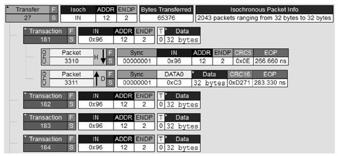

 图2-22 一次成功的同步传输

## 2.1.5 数据翻转

 USB协议提供了USB主机和USB协议之间的数据同步机制，并通 过使用数据翻转（DATA TOGGLE）来实现。USB主机和USB设备之 间使用数据翻转（DATA TOGGLE）来实现多个事务的数据传输同 步，USB主机和USB设备各自维护一个数据包PID，根据PID来发送数 据包。数据接收方根据数据包的接收情况来改变自身的数据包 PID， 而数据发送方根据数据接收方的反馈（握手包）来改变自身的数据包 PID。数据翻转使数据发送方按照一定的PID序列（PID SEQUENCE） 发送数据包，如交替使用DATA0/DATA1包。如果USB主机或USB设备 没有更改自身PID，则当前数据包会被重传。

 需要注意的是，由于同步传输不涉及握手包，因此同步传输不使 用数据翻转机制。通信双方并不能保证数据包是否收发成功，当数据 接收失败时并不会重传。发送方仅仅按照一定的PID序列发送数据 包，接收方根据接收到的数据包PID序列是否正确来进行数据同步。

 1.成功情况

 图2-23是IN事务中返回ACK的数据翻转，初始状态下，USB主机 和USB设备的自身数据包PID都是DATA0。USB主机首先向USB设备发 送一个IN包，USB设备向USB主机返回一个DATA0包，USB主机成功 收到后将自身的数据包PID从DATA0变成DATA1，然后向USB设备返 回一个ACK包。USB 设备成功收到 ACK 包后，将自身的数据包 PID 从 DATA0 变成DATA1，此时一次成功的IN事务（事务i）完成。USB 主机继续向USB设备获取数据，此时向 USB 设备发送一个 IN 包， USB 设备返回一个 DATA1包，USB主机成功收到后将自身的数据包 PID从DATA1变成DATA0，然后向USB设备返回一个ACK包。USB设 备成功收到ACK包后，将自身的数据包PID从DATA1变成为DATA0， 此时另一次成功的IN事务（事务i+1）完成。如果USB主机还有数据需 要从USB设备获取，则重复此过程。

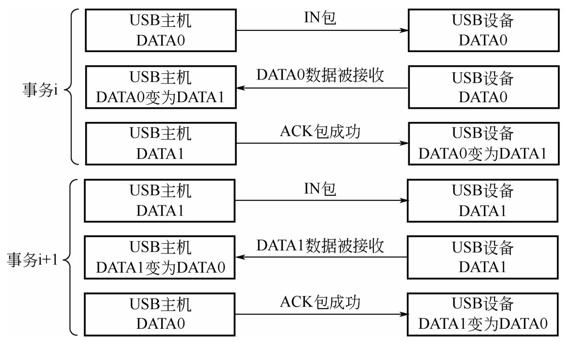

 图2-23 IN事务中返回ACK的数据翻转

 图2-24是OUT事务中返回ACK的数据翻转，其数据翻转的处理和 前文的IN事务中返回ACK的情况类似。 图2-24 OUT事务中返回ACK的数据翻转 2.返回NAK包 图2-25是IN事务中返回NAK的数据翻转，初始状态下，USB主机 和USB设备的自身数据包PID都是DATA0。USB主机首先向USB设备发 送一个IN包，USB设备向USB主机返回一个DATA0包，但由于某些原 因USB主机没有成功收到该数据包，此时保持自身的数据包PID不 变，仍为DATA0，然后USB主机向USB设备返回一个NAK包。USB设 备成功收到NAK包后，也维持自身的数据包PID不变，仍为DATA0， 此时一次失败的IN事务（事务i）完成。USB主机继续向USB设备获取 数据，继续向USB设备发送一个IN包，USB设备返回一个DATA0包， USB主机成功收到后将自身的数据包PID从DATA0变成DATA1，然后 向USB设备返回一个ACK包。USB设备成功收到ACK包后，将自身的 数据包PID从DATA0变成为DATA1，从而完成该IN事务重传。此时 USB主机和USB设备双方的数据包PID保持一致，都为 DATA1，如果 USB 主机还需从 USB 设备获取数据，则继续后续的 IN事务，且USB 设备使用DATA1作为数据包的PID。

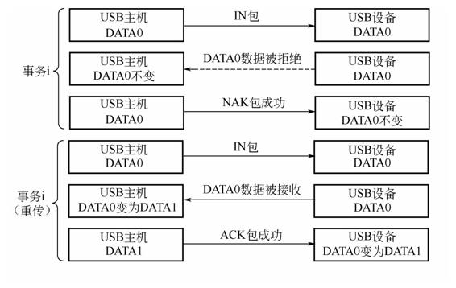

 图2-25 IN事务中返回NAK的数据翻转

 图2-26是OUT事务中返回NAK的数据翻转，其数据翻转的处理和 前文的IN事务中返回NAK的情况类似。

 3.返回ACK包失败

 图2-27是IN事务中ACK失败的数据翻转，初始状态下，USB主机 和USB设备的自身数据包PID都是DATA0。USB主机首先向USB设备发 送一个IN包，USB设备向USB主机返回一个DATA0包，USB主机成功 收到该数据包后将自身的数据包PID由DATA0变为DATA1，然后向 USB设备返回一个ACK包。由于某些原因USB设备没有收到这个ACK 包，则保持自身的数据包PID不变，仍为DATA0，此时一次IN事务 （事务i）完成。USB主机继续向USB设备获取数据，继续向USB设备 发送一个IN包，USB设备返回一个 DATA0 包。USB 主机检查当前自 身的数据包 PID（DATA1）和收到的DATA0包不匹配，则忽略该 DATA0包且不改变自身的数据包PID，同时向USB设备返回一个ACK 包。USB设备成功收到ACK包后将自身的数据包PID从DATA0变成 DATA1，此时完成该IN事务重传。

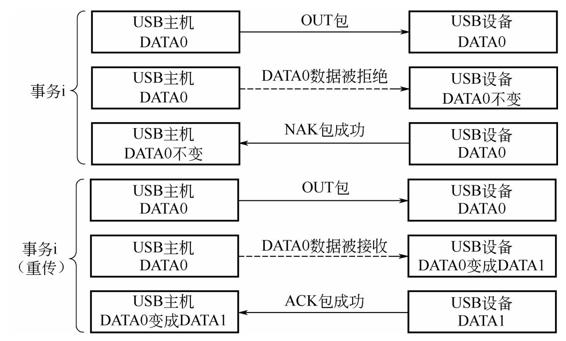

 图2-26 OUT事务中返回NAK的数据翻转

 此时USB主机和USB设备双方的数据包PID保持一致，如果USB主 机还需从 USB 设备获取数据，则继续后续的 IN 事务，USB 设备使用 DATA1作为数据包的PID。

 如果在进行数据传输时IN事务只有一个，那么就没有下一个IN事 务来进行错误检测。正如2.1.5节提到的，控制传输的状态阶段只有一 个IN事务，当这个IN事务中的ACK失败时，USB主机不会继续发送IN 包，而是开始发送新的Setup包。

 图2-28是OUT事务中ACK失败的数据翻转，其数据翻转的处理和 前文的IN事务中ACK失败的情况类似。

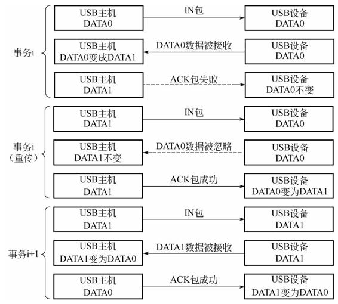

 图2-27 IN事务中ACK失败的数据翻转

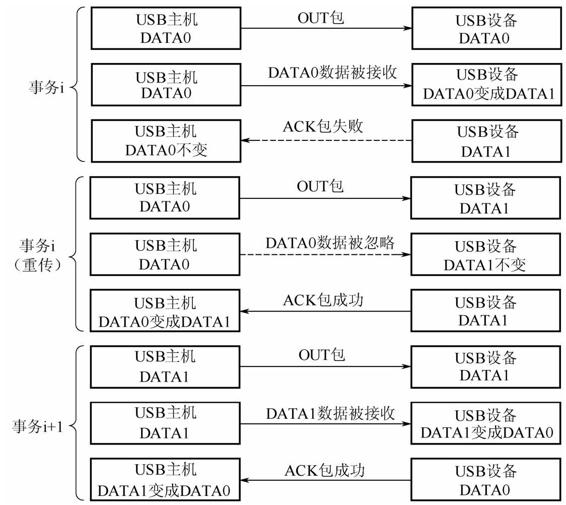

 图2-28 OUT事务中ACK失败的数据翻转

 4.PID序列

 下面介绍各类型传输的PID序列。

 1）控制传输的PID序列

 图2-29是控制传输的PID序列，包括写入数据、读取数据和无数据 阶段的控制传输。图中每一行都是一个控制传输，每一个方格都是一 个事务。 写入数据时，USB主机在Setup事务中向USB设备发送一个DATA0 包，然后在后续OUT事务中向USB设备发送交替的DATA1包和DATA0 包，直到数据发送完。最后状态阶段必须使用一个数据长度为0的 DATA1包。 读取数据和写入数据的包序列是一样的，无数据阶段的控制传输 只有Setup事务中的DATA0包和IN事务中的DATA1包。

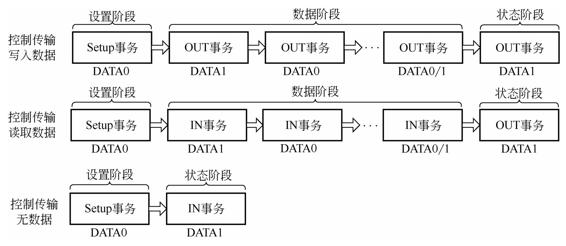

 图2-29 控制传输的PID序列

 2）中断和批量传输的PID序列

 图2-30是批量传输的PID序列，读取数据和写入数据的PID序列一 致。端点在初始化后，从DATA0开始，每成功执行一个事务，翻转一 下（由DATA0变成DATA1或者由DATA1变成DATA0）。数据翻转与传 输个数没有直接联系，只由端点在初始化后处理的事务总数决定。端 点的数据翻转只有在端点重新初始化或者ClearFeature（endpoint halt） 后才会恢复为DATA0。

 图2-30 批量传输的PID序列

 3）高速模式下同步传输的PID序列 全速模式下的同步传输数据发送方只使用DATA0包，因此正常情 况下接收方只会收到DATA0包。在高速模式下，数据发送方会使用 DATA0、DATA1、DATA2、MDATA包，下面重点介绍高速模式下同 步传输的PID序列。 图2-31是高速模式下同步传输读取数据时的PID序列。

 ● 当一个微帧中只有1个事务时，USB设备只使用DATA0包向USB 主机发送数据，直到数据读取完。

 ● 当一个微帧中有2个事务时，USB设备先向USB主机发送一个 DATA1包，再发送一个DATA0包，之后将继续在DATA1包和DATA0包 之间交替，直到数据读取完。

 ● 当一个微帧中有3个事务时，USB设备先向USB主机发送一个 DATA2包，然后再向USB主机发送一个DATA1包，接着再发送DATA0 包，之后将继续按顺序在DATA2、DATA1和DATA0包之间交替，直到 数据读取完。

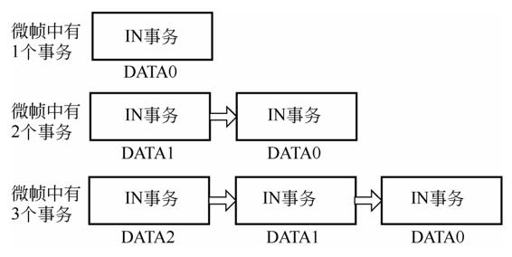

 图2-31 高速模式下同步传输读取数据时的PID序列 图2-32是高速模式下同步传输写入数据时的PID序列。

 ● 当一个微帧中只有1个事务时，USB主机只使用DATA0包向USB 设备发送数据，直到数据写入完。

 ● 当一个微帧中有 2 个事务时，USB 主机先向 USB 设备发送一个 MDATA 包，再发送一个 DATA1 包，之后将继续在 MDATA 包和 DATA1包之间交替，直到数据写入完。

 ● 当一个微帧中有 3 个事务时，USB 主机先向 USB 设备发送一个 MDATA 包，然后再向 USB 设备发送一个 MDATA 包，接着再发送 DATA1包，之后将继续按顺序在MDATA包、MDATA包和DATA1包之 间交替，直到数据写入完。

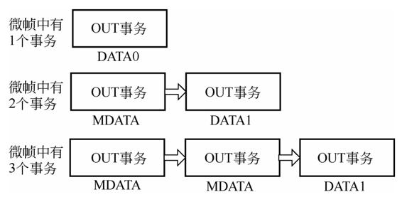

 图2-32 高速模式下同步传输写入数据时的PID序列

## 2.1.6 标准USB设备请求

 USB 主机通过向 USB 设备发送设备请求来获取 USB 设备的信息 和对USB设备进行相关配置。设备请求由长度为8字节的Setup数据指 定，方向总是从USB主机向USB设备。表2-4是Setup数据各位域，各位 域值的具体含义请参考USB协议规范说明书。

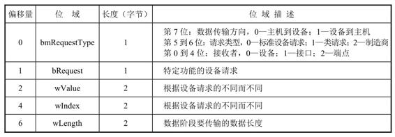

 表2-4 Setup数据各位域 其中bRequest位域指明了USB设备请求的类型，包括标准设备请 求、设备类请求和制造商自定义请求。标准设备请求包括获取描述符 GetDescriptor（）、设置地址 Set_Address（）、设置设备的配置描述 符 Set_Congfiguration（）、获取状态 Get_Status（）等。其中获取描 述符包括获取 USB 设备的设备描述符、配置描述符、接口描述符、端 点描述符及可选的字符串描述符等。对于获取各个描述符的请求 （request），其bmRequestType位域是一样的（8＇b10000000），确定 了数据阶段的数据传输方向是USB设备到USB主机、请求类型是标准 设备请求、接收者为USB设备；其bRequest位域确定了该请求是用于 获取描述符（0x06）；其wValue位域确定了请求的描述符类型，如 0x01代表设备描述符、0x02 代表配置描述符、0x03 代表字符串描述符 等；wIndex 位域确定了请求的描述符的语言ID；wLength位域确定了 请求的描述符的长度。 表2-5给出了在USB 2.0协议中所有的USB标准设备请求。

 表2-5 在USB 2.0协议中所有的USB标准设备请求

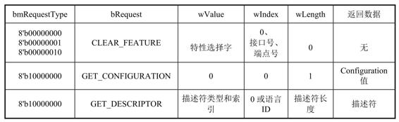

 续表

 对于SET_FEATURE和CLEAR_FEATURE这两种请求，其特性选 择字（Feature Selector)如表2-6所示。

 表2-6 特性选择字

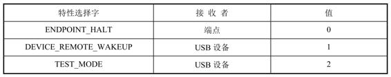

# 2.2 USB描述符

 描述符相当于设备的名片，描述了该USB设备所有的属性和可配 置信息，如设备所属于的类（Class）、接口（interface）信息、端点 （endpoint）信息等。可以说，获得了设备的描述符，就知道了该设备 的类型和用途、通信的参数等，主机就可以对它进行配置，从而使得 通信双方使用相同的参数工作。

 标准的USB设备有6种常用的USB描述符：设备描述符、配置描述 符、字符串描述符、接口描述符、端点描述符、设备限定描述符。另 外，还有一种特殊的描述符称为接口关联描述符，用于将一组有关的 描述符关联起来共同描述一个特定的功能。图2-33是USB描述符结构 框图。

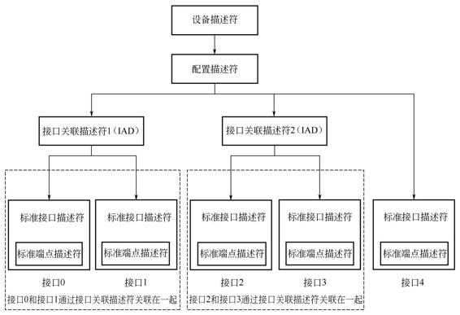

 图2-33 USB描述符结构框图

 在图2-33中，接口0和接口1通过接口关联描述符1关联在一起共同 描述一个功能；接口2和接口3通过接口关联描述符2关联在一起共同描 述另外一个功能；而接口 4 单独描述其他的一个功能。设备描述符指 明了该设备有几个配置描述符，每个配置描述符都分别指明了该配置 描述符中的接口描述符，而接口描述符指明了该接口有几个端点描述 符。当主机需要获取配置描述符时，该配置描述符拥有的接口描述符 和端点描述符的所有信息都一并返回。在同一个配置描述符中的多个 功能（由一个或者多个接口描述符描述）能够同时工作，但是如果 USB设备存在多个配置描述符，USB主机会通过 SetConfiguration（） 使用其中一个，其他的配置描述符中所描述的功能则不能工作。

## 2.2.1 设备描述符

 一个设备有且只有一个设备描述符。设备描述符描述了设备的基 本属性，USB设备描述符的位域如表2-7所示。

 表2-7 USB设备描述符的位域

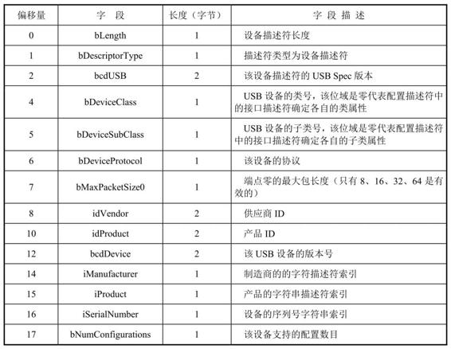

 在设备描述符中只会给出这个设备所支持的配置描述符 （Configuration Descriptor）的数量，设备的配置描述符的索引从1开 始，比如当设备的配置描述符有两个时，这两个配置描述符的索引分 别是1和2。USB主机就是使用这个索引作为 GetDescriptor（Configuration）的参数来分别获取对应的设备的配置描 述符的。 

## 2.2.2 配置描述符

 配置描述符定义了设备的一种配置信息，一个设备可以有一个或 者多个配置描述符。USB配置描述符的位域如表2-8所示。

 表2-8 USB配置描述符的位域

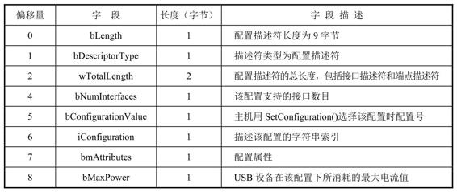

 配置描述符包括了配置的基本信息，如该设备的接口描述符的个 数、配置描述符的长度、供电属性等。配置描述符的长度 （wTotalLength）描述了该配置描述符的总长度，即从该描述符的 bLength 位域开始一直到最后一个端点描述符结尾为止的总长度，包 括该描述符本身的长度，以及配置描述符中所有接口描述符和端点描 述符的总长度。接口数目（bNumInterfaces）表示这个配置有多少个接 口描述符，这些接口是控制接口和非控制接口的合集。该配置描述符 的配置号信息由 bConfigurationValue 决定，主机就是根据这个值决定 在 SetConfiguration（）时给设备选择设置哪个配置描述符，并让设备 处于该配置的工作状态。bmAttributes代表配置的某些属性，第5比特 代表该设备是否支持远程唤醒（Remote Wakeup），第6比特代表该设 备是否支持自供电。bMaxPower代表设备在该配置下所消耗的最大电 流值，以2mA为单位，如当bMaxPower的值是25时，代表设备在该配 置下所消耗的最大电流值为50mA。USB设备多个配置描述符中接口数 目不尽相同，bMaxPower也有可能不一样。USB 主机会根据设备在某 种配置下 bMaxPower 的值来查看其是否有足够的电流可以提供，最终 决定该设备的某种配置是否可用，如果某个设备的所有配置因为USB 主机无法提供足够电流而不可用，该设备将无法正常工作。 当主机需要获取配置描述符时，该配置描述符所拥有的接口描述 符和端点描述符都一并返回。

## 2.2.3 接口描述符

 接口描述符位于配置描述符中，指明了某个特殊的USB类的接 口。接口描述符通过端点完成数据传输，实现特定类的特定功能。例 如，一个设备既有扬声器又有麦克风的功能，那它就至少有两个音频 接口。USB接口描述符的位域如表2-9所示。

 表2-9 USB接口描述符的位域

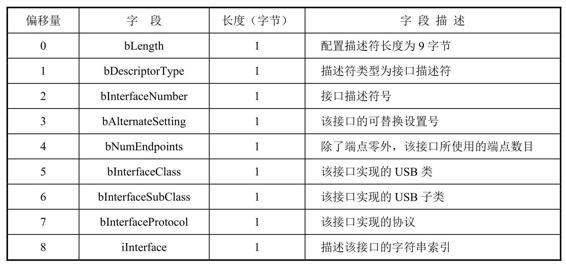

 接口描述符包括该接口的识别号（bInterfaceNumber）、接口的可 替换设置号（bAlternateSetting）、端点数目、类和子类、协议等。接 口的替换设置号主要在音频和视频类中使用，一般用于描述不同声 道、采样率或者帧率、分辨率的组合。接口的可替换设置 0 不包含传 输端点，其他的可替换设置包含传输端点。之所以要有一个不包含任 何传输端点的可替换设置 0，是由 USB音频、视频设备的特性决定 的，该设置用于在设备没有被使用时作为设备的默认设置。当USB设 备存在多个可替换设置时，USB主机通过SetInterface（）来指定某个 接口的可替换设置（Alternate Setting）。如果 USB 主机没有使用 SetInterface（）来指定接口的可替换设置，通信双方默认使用可替换 设置0。端点数目（bNumEndpoints）就是该接口描述符所有支持端点 的数目，不包括控制端点0。

## 2.2.4 端点描述符

 端点描述符包括该端点地址、端点属性、支持的最大包长度、传 输时间间隔等。在主机获取配置描述符时，端点描述符和接口描述符 一起返回。USB端点描述符的位域如表2-10所示。

 表2-10 USB端点描述符的位域

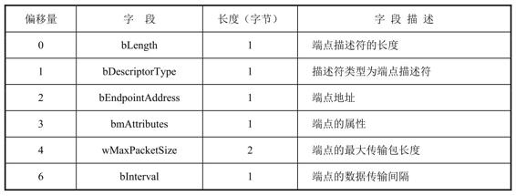

 端点描述符包括该端点地址、端点属性、支持的最大包长度、传 输时间间隔等。端点地址（bEndpointAddress）的第 0～3 比特代表该 端点所使用的地址，第7比特代表该端点是用作输入（IN）还是输出 （OUT）端点。端点属性（bmAttributes）的第0和第1比特代表该端点 的支持的四种传输属性。如果该端点属于ISO端点，属性的第2～3比 特代表该ISO端点的数据同步属于同步、异步、自适应还是无同步类 型，属性的第4～5比特代表该ISO端点属于数据传输端点还是反馈端 点，对于ISO端点的具体介绍参见第5章。传输时间间隔代表该端点的 数据传输间隔了几个帧/微帧，计算方法为2 bInterval-1个帧/微帧。

## 2.2.5 字符串描述符

 字符串描述符是可选的。如果一个设备不支持字符串描述符，需 要将设备描述符、配置描述符、接口描述符中的字符串索引值设成 零，字符串描述符用UNICODE编码。 主机获得设备的某个字符串描述符分两条命令：首先主机发送 USB标准命令GetDescriptor（），其中所使用的字符串的索引值为0， 设备返回一个零字符串描述符的位域，如表2-11所示。

 表2-11 零字符串描述符的位域

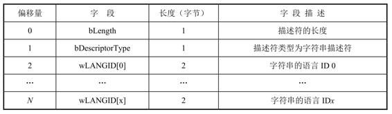

 wLANGID[0]～[x]代表该设备支持的语言，可以从USB设备语言 ID规范中获得具体值，典型值0x0409代表英语。 主机根据自己是否支持该语言，再次发出USB标准命令 GetDescriptor（），指明所要求得到的字符串的索引值和语言。这次 设备所返回的是 UNICODE编码的字符串描述符，UNICODE字符串描 述符的位域如表2-12所示。 

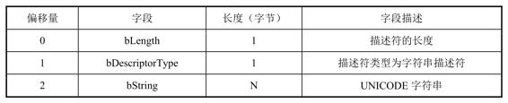

表2-12 UNICODE字符串描述符的位域

## 2.2.6 接口关联描述符

 对于复合USB设备的接口描述符，可以在每个类（Class）要合并 的接口描述符之前加一个接口关联描述符（Interface Association Descriptor，IAD），其作用就是把多个接口定义成一个类设备。 接口关联描述符的位域如表 2-13 所示，bFirstInterface 代表起始的 接口编号，bInterfaceCount代表属于这个IAD的接口数目，编号中间不 能有间隔。在一个类的所有合并接口都结束之后，第二个类的所有需 要合并的接口又以IAD开始。如图2-33所示，IAD1的bFirstInterface为 0，bInterfaceCount为2；IAD2的bFirstInterface为2，bInterfaceCount为 2。对于音频类的IAD，音频流接口号必须以一个连续的顺序放在对应 的音频控制接口号后面。

 表2-13 接口关联描述符的位域

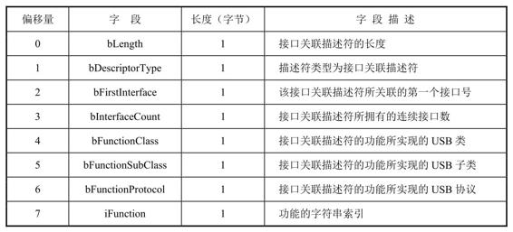

## 2.2.7 设备限定描述符

 设备限定描述符（Device Qualifier Descriptor）用于描述一个能够 同时支持高速和全速模式的USB设备工作在另外一个模式时的设备信 息。例如，当设备工作于全速模式时，设备限定描述符返回它工作于 高速模式下的信息。反之，如果设备工作于高速模式时，设备限定描 述符返回它工作于全速模式下的信息。如果一个设备能够同时支持高 速和全速模式，并且其在高速模式下和全速模式下信息有所不同，则 它必须支持设备限定描述符。 主机同样发出USB标准命令GetDescriptor（），指明所需要获得 的设备限定描述符。如果一个只支持全速模式的设备收到一个获取设 备限定描述符的命令，需要告诉主机这是个错误请求。设备限定描述 符的位域如表2-14所示。

 表2-14 设备限定描述符的位域

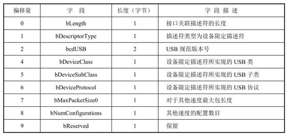

## 2.2.8 其他速度模式下的配置描述符

 其他速度模式下的配置描述符（Other_Speed_Configuration Descriptor）与普通描述符是完全相同的，一般与设备限定描述符一起 使用来描述在其他速度模式下设备的配置信息，在此就不再赘述。

# 2.3 枚举

 当USB设备的速度类型确定之后，USB通信双方将会工作在相同 的速度模式下，随后USB枚举才会开始。USB枚举的本质就是USB主 机获取USB设备的参数信息并且对于可配置参数进行配置的过程。当 枚举结束时，USB设备将会使用在枚举过程中USB主机所配置的参数 进行工作，从而确保通信双方使用相同的参数。同时，需要指出的 是，可配置的参数可以在后续的通信过程中进行修改。

## 2.3.1 设备状态

 枚举完成之前，USB设备要经过一系列的状态变化，才能最终完 成枚举。这些状态是连接状态（attached）、供电状态（powered）、 默认状态（default）、地址状态（address）、配置状态 （configured）、挂起状态（suspended）。当设备状态变为配置状态 时，即可认为USB设备和USB主机间的枚举完成。图2-34是设备端的 状态变化。

 1.连接状态

 正如1.2节所述，USB设备需要和主机先建立物理上的连接。如果 USB设备连接到主机，就处于连接状态。

 2.供电状态

 USB设备可以从USB的VBUS上获取电源，或者通过外部电源获取 电源。通过外部电源供电的设备称为自供电（Self-powered）设备，通 过 VBUS供电的设备称为总线供电（Bus-powered）设备。对于自供电 设备，在连接到主机之前，设备已经通电，但此时设备并不是 USB 协 议定义的供电状态，只有VBUS有电后，才进入供电状态。 当USB设备不是直接与USB主机相连，而是通过集线器间接连接 到USB主机时，只有对应的集线器端口被主机配置使能之后，集线器 端口才会向USB设备的VBUS线供电。当集线器端口复位时，端口在被 重新配置之前都不会向VBUS线供电，相应的USB设备的状态也将变为 连接状态。

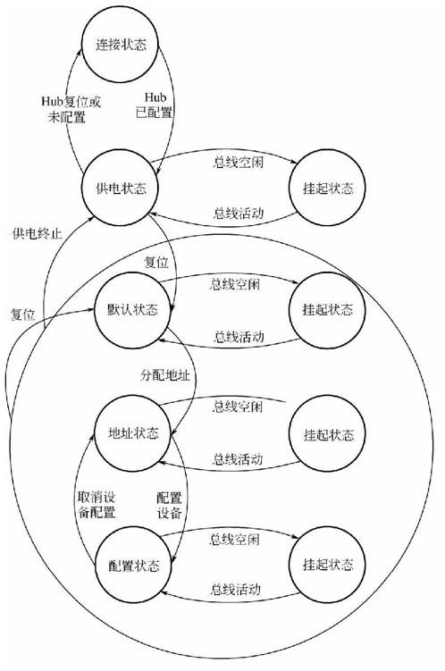

 图2-34 设备端的状态变化

 3.默认状态

 USB设备进入供电状态后，在被复位之前，不能响应总线上的任 何事务（Transaction）。只有当USB设备被复位，处于默认状态后， 才会响应主机发送过来的请求。 4.地址状态

 在USB设备被复位后，且在USB主机给USB设备设置一个新的地 址之前，所有的USB设备使用默认的0地址与主机通信。USB设备收到 主机发送的设置地址 SetAddress（）请求后，USB 设备就会得到一个 唯一的地址。USB设备会保存并使用该地址与主机通信，直到设备被 复位或者断开。即使USB设备在获取唯一的地址之后进入挂起状态， 设备依然会保留这个地址，并在总线恢复后继续使用该地址。在设备 挂起期间，主机也不能把该地址分配给其他的USB设备。

 指定了新的地址的 USB 设备在收到 USB 主机发出的复位信号后 会进入默认状态，之前所指定的地址也将无效，USB 设备需要 USB 主机重新分配地址。

 5.配置状态

 在USB设备的功能能够使用之前，USB设备和USB主机必须协商 确定功能相关的配置项，所有的配置项以描述符的形式提供（详见2.2 节）。USB主机通过获取描述符GetDescriptor（）请求获得USB设备 相关的描述符，通过设置接口 SetInterface（）和设置配置 SetConfiguration（）来设置设备的相关配置项。一旦相关功能参数被 配置后，USB设备就能正常工作了。 正常工作的USB设备在收到USB主机发出的复位信号后会进入默 认状态，之前所指定的地址、所配置的接口（Interface）和配置项 （Configuration）都将无效，需要由USB主机重新指定设备地址，获 取描述符并配置相关配置项，才能使设备再次工作。

 6.挂起状态

 挂起/恢复是USB协议实现低功耗的一种机制，本书将在2.4节详细 介绍挂起与恢复的相关机制。总体上说，除了设备的连接状态，在其 他状态下，当USB总线持续3ms没有活动时，设备就会自动进入挂起 状态。进入挂起状态后，USB设备要维持所有的内部状态，如软件的 状态机，以及设备的地址和配置项等。

## 2.3.2 枚举流程

 USB设备状态从初始的连接状态到最终的配置状态的变化过程就 是整个枚举流程。在USB 2.0协议中，USB设备的状态变迁都是由USB 主机发起的请求（Request）所触发，而这些请求实际上就是一个个的 控制传输（Control Transfer）。不同主机实现的枚举在细节上会略有 不同，但大体流程是一样的。图2-35是枚举的数据包图，是一台运行 Windows 7系统的 PC在枚举一个全速设备时，通过协议分析仪抓取 的。本节以此为例详细介绍USB设备的枚举流程，特别对不同主机上 枚举流程的细微差异进行深入分析，让读者对USB协议有更深入的理 解。

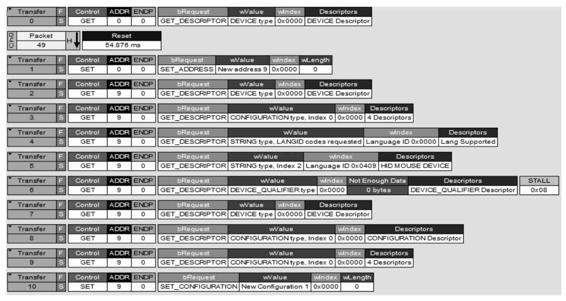

 图2-35 枚举的数据包图

 1.获取设备描述符

 枚举的第一步是获取设备描述符，主机通过GetDescriptor（Device type）请求来获取设备的设备描述符。对于高速设备和低速设备，用 于控制传输的端点0支持的最大包长度是确定的，分别是64字节和8字 节（见表2-3）。但是对于全速设备，端点0支持的最大包长度可能是8 字节、16字节、32字节或者64字节，在USB主机获取到USB设备的设 备描述符之前，USB主机不能确定USB设备端点0的最大包长度，这样 USB主机获取USB设备描述符的请求就有可能不能正常完成。

 下面首先介绍当USB主机不能确定USB设备端点0的最大包长度 时，USB主机与USB设备通信可能存在的问题，然后介绍对应的解决 方案。 在USB主机和USB设备通信前，USB主机必须要指定端点0上的最 大包长度，以便正确检测控制传输中数据阶段的结束（详见 2.1.4 节）。假设USB主机端指定USB端点0的最大包长度为64字节，而实际 USB设备端点0的最大包长度为8字节。由于USB的设备描述符长度为 固定的18字节，USB主机发送的第一个GetDescriptor（Device type）请 求将会要求 USB 设备端发送 18 字节的数据。USB 设备收到该请求 后，准备发送 18 字节的数据，由于其最大包长度为 8 字节，所以 18 字节的数据将会分成 3 个事务完成，分别发送 8 字节、8 字节和 2 字 节。但是由于USB 主机端指定的最大包长度为 64 字节，当 USB 主机 接收到第一个 8字节的事务时，就认为数据阶段已经完成（因为8字节 的包长度小于USB主机端指定的最大包长度），而 USB 设备端此时还 在准备发送第二个 8字节的事务，导致这个控制传输由于通信双方的 状态不同步而无法正常完成。

 在不同的主机系统上，使用了不同的解决方案。下面以Windows 7操作系统和Linux Ubuntu系统为例介绍其解决方案。

 在Windows 7操作系统上，其获取设备描述符的方式如图2-36所 示。

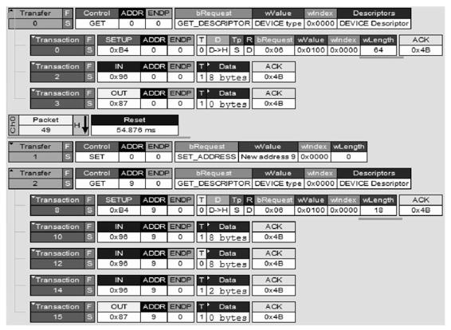

 图2-36 Windows 7获取设备描述符的方式

 主机要求设备返回64字节的设备描述符并默认USB设备端点0的最 大包长度为64字节。如果设备端点0的最大包长度不小于标准设备描述 符的长度（18 字节），设备就可以一次性将 18字节的设备描述符发送 给主机，通信双方状态保持同步；如果设备的端点 0 最大包长度小于 设备描述符的长度，那么此时设备要使用多个事务向主机发送一个完 整的设备描述符，前述的不同步问题会出现。对此，Windows 7系统 在第一次获取设备描述符后，直接进行复位（Reset），将设备状态重 置为初始状态。而由于设备端所支持的最小的最大包长度为8，此时主 机一定能获取到设备描述符的前8个字节；而设备描述符的第8个字节 （详见2.2.1节）就是设备端点 0 所支持的最大包长度。主机可以在后 续的控制传输中使用这个设备端的最大包长度来保证双方正常通信。 图2-36中的“Reset”就是这个解决方案的关键点。 在Ubuntu上，其获取设备描述符的方式如图2-37示。

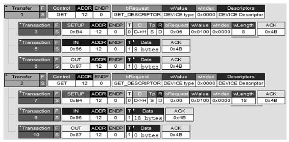

 图2-37 Ubuntu获取设备描述符的方式

 主机第一次获取设备描述符时只获取其前8字节。此时，不管USB 设备端点的最大包长度是多少，USB设备只能发送8字节的数据，同时 通信双方同步结束数据阶段。之后USB主机读取USB设备描述符的第8 个字节，得到设备端点 0 的最大包长度，并用于后续的控制传输。这 个解决方案的关键点就是第一次获取设备描述符时只获取其前8个字 节。 这两种解决方案都能解决实际的问题，但是解决问题的思路有所 不同，Windows 7的解决方案是一种异常处理的方式，而Linux Ubuntu 的解决方案则体现了一种精细控制、避免出错的思想。读者可以根据 自己的实际情况选择相应的解决方案。

 2.设置设备的地址

 如图2-35所示，在Transfer 1中主机发送SetAddress（）请求来设置 设备的地址，在本例中，SetAddress（）请求的 Setup 数据内包含主机 为设备分配的新地址。设备收到地址后，进入地址状态，在该设备从 主机上被断开或者复位之前，设备要一直使用该地址与主机通信。在 本次传输中，USB主机和USB设备都仍然使用地址0进行通信。 设备收到SetAddress（）请求后，必须要在50ms内处理该请求并 完成该请求的状态阶段。在完成状态阶段后，可以有2ms的恢复时 间。在该恢复时间内，USB主机不能使用其刚刚指定的地址与USB设 备通信。在2ms后，设备必须使用该新地址与USB主机进行通信。同 时，设备不能对发送到旧地址的任何请求产生任何回复，除非新旧地 址是一样的。

 3.获取完整设备描述符

 当设备的新地址设置完成后，USB主机将会使用新的地址与USB 设备进行通信。如图2-35所示，在Transfer 2中，USB主机使用新地址9 与USB设备进行通信，以获取完整的18个字节的USB设备描述符。 USB设备描述符的第18个字节表示该设备配置描述符的数目，当 USB主机获取到完整的设备描述符后，USB主机就可以获取USB设备 的配置描述符了。

 4.获取配置描述符

 由于每个设备配置描述符的长度都不一样，USB主机无法提前得 知USB设备的配置描述符长度。USB设备的配置描述符的第3个和第4 个字节表示USB 设备的配置描述符长度，而更重要的是，USB设备的 配置描述符的第9个字节代表该配置下USB设备的最大消耗电流值（详 见2.2.2节）。所以USB主机会先获取配置描述符的前9个字节，以获取 该配置描述符的总长度和最大消耗电流值，如果该配置下的最大消耗 电流值超过USB主机可提供的额度，该配置将不可用。如果设备中所 有的配置都不可用，该设备将不可用，枚举的流程将中止。 在不同的主机系统上，获取配置描述符上采取不同的策略。 Windows 7操作系统获取配置描述符的过程如图2-38所示。 运行在 Windows 7 上的主机在第一次获取配置描述符时，在 Transfer 3中要求设备发出最多255字节的配置描述符。之后，在 Transfer 8中主机再次发出请求，获取设备配置描述符的前 9 个字节。 获取到配置描述符的总长度后，USB 主机在 Transfer 9 中使用该长度 作为参数发出 GetDescriptor （Configuration）请求，要求USB设备提 供完整的配置描述符。获取到设备的配置描述符后，主机通过解析配 置描述符就可以知道该设备的具体功能。

 图2-38 Windows 7操作系统获取配置描述符的过程

 与Windows 7相比，运行在Ubuntu上的主机获取设备描述符的方 式的差别在于Ubuntu并不会要求设备发送最多255字节的配置描述符， 其只会先获取配置描述符的前 9 字节，然后再获取完整的配置描述 符。因其过程与Windows 7主机基本一致，在此就不再赘述。

 5.获取字符串描述

 当USB主机遍历USB设备所有的配置描述符，确定有可用的配置 后，主机通过GetDescriptor（String type）标准请求获取该设备的一些 字符串格式的信息，如设备制造商、产品信息和序列号等。这些字符 串格式的信息是用字符串描述符的形式提供的，而这些信息所对应的 字符串描述符的索引是在USB设备的设备描述符中提供（详见2.2.1 节）。 如果2-35所示，USB主机首先在Transfer 4中获取了字符串所使用 的语言，本例中是用的语言是英语，其语言ID为0xxxx；之后在 Transfer 5中获取了设备的xxx信息。

 6.获取限定描述符

 如图2-35所示，在Transfer 6中USB主机也会尝试去获取USB设备 的限定描述符，以获取USB设备在其他速度模式下的信息。 USB 设备不一定会支持限定描述符，在这种情况下，USB 设备会 回复STALL表示设备不支持该描述符。这种控制传输的失败并不影响 设备的正常枚举和使用。USB主机会再次获取USB设备的设备描述符 （Transfer 7）、配置描述符（Transfer 8）并进行后续的流程。

 7.配置设备的配置描述符

 USB主机获取USB设备的某个配置描述符后，会解析该配置描述 符中所有的接口信息和端点信息，之后主机就可以发出 SetConfiguration（）请求来通知 USB 设备使用哪一个配置。即使 USB 设备只有一个配置描述符，这个SetConfiguration（）请求也不能被省 略。该命令中包含一个配置值，这个配置值是主机从设备的配置描述 符中解析得来的。 USB 设备收到 SetConfiguration（）请求后，会判断配置值是否合 法。如果合法，设备就进入配置状态。设备会根据配置值选择对应的 配置描述符，进行初始化操作，如初始化该配置中所有接口中所有的 端点。初始化完成后，设备就具备与主机进行数据传输的能力，此时 枚举阶段结束。 如图2-35所示，在Transfer 10中，USB主机使用 SetConfiguration（）配置成功后，整个枚举流程结束。后续的USB通 信将主要发生在配置描述符的接口/端点描述符所描述的端点上。

# 2.4 挂起和恢复

 为了降低 USB 设备的整体功耗，使 USB 设备有更长的续航时 间，在USB 2.0 规格说明书中定义了两种电源管理事件：挂起和恢 复。挂起会导致USB设备进入低功耗模式并且相应的功能不可用；恢 复则相反，会使USB设备退出低功耗模式同时恢复相应的功能。

## 2.4.1 挂起

 从时间角度来说，一个USB设备的挂起分为两个阶段：挂起事件 的产生和进入挂起状态。 当检测到USB总线空闲状态持续超过3ms时，设备的USB控制器 就会产生挂起事件。设备必须在收到事件后的7ms内进入实际的挂起 状态，即低功耗模式。挂起状态的主要表象是设备从 USB 的 VBUS上 汲取的电流不超过500µA的电流。一个例外是，如果高功耗USB设备 的远程唤醒功能被使能了（如果该设备支持远程唤醒功能），那么该 设备在总线挂起后从 USB 的 VBUS上汲取的电流不能超过2.5mA。 图2-39是低速模式下USB总线的挂起状态（通道3是D-信号，通道 2是D+信号）。 在进入挂起状态后，USB设备必须保持D+或D-的电阻上拉状态， 以保证USB总线处于空闲J状态，从而使得USB主机或Hub能够检测到 设备仍处于连接状态。

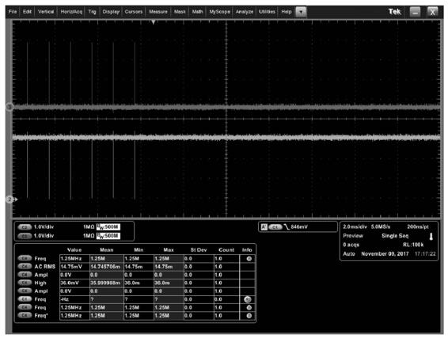

 图2-39 低速模式下USB总线的挂起状态

 当挂起总线时，USB主机首先根据USB设备是否支持远程唤醒且 系统是否需要开启USB设备的远程唤醒功能来决定是否开启设备的远 程唤醒功能。其次，USB主机通过停止总线的所有活动使得总线空闲 至少3ms。从总线挂起开始到总线恢复过程中，主机必须一直保持 VBUS状态，以确保设备不会断开连接。 这里有一点是需要解释的，对于高速模式的设备在进入挂起状态 后，它将切换到全速模式（挂起后的空闲状态和全速模式一样）。

 挂起分为两种情况：全局总线挂起和部分总线挂起。

 1.全局总线挂起

 当没有任何事务需要处理时，USB 主机为了降低整个系统的功耗 会停止总线的所有传输。USB总线的每个设备在收到挂起事件后，各 自进入挂起状态。 USB主机通过根端口实现全局总线挂起，所以在有无Hub的情况 下，主机软件对于全局总线挂起的操作流程基本类似。

 2.部分总线挂起

 当主机系统需要有选择性地让总线上的某些设备进入挂起状态 时，主机通过向设备所对应的Hub发送 SetPortFeature（PORT_SUSPEND）命令。Hub收到命令后将对应下行 端口和设备之间的总线挂起（停止转发任何数据，使下行端口的总线 一直处于空闲状态），该设备在收到挂起事件后进入挂起状态。部分 总线挂起主要针对有Hub的情况，主机通过控制设备连接Hub的端口实 现对设备的挂起。 在实际开发过程中，经常有开发者在挂起总线时将 VBUS禁止导致 USB设备不是进入挂起而是进入断开状态。 是否进入挂起状态完全由USB主机决定，USB设备无法自行进入 挂起状态，目前也没有任何已定义的命令或者方式能够让 USB 设备主 动通知 USB主机使其能够让该设备进入挂起状态。

## 2.4.2 恢复

 在挂起后，总线上任何的非空闲状态都可以唤醒总线，如被动的 SE0信号（如移除 USB 设备等）、复位信号和恢复信号等。本节主要 介绍使用恢复信号的方式唤醒总线。 恢复信号主要是指由主机或者设备发起的用于将总线从挂起状态 唤醒。恢复信号时序由两部分组成：不小于20ms的全速/低速的K状态 （20ms的K信号主要是用于确保总线上的所有设备都能够被唤醒）和 结束标志。在不同速度模式下，结束标志是不同的。当总线原本（挂 起前）处于全速/低速模式时，结束标志是两位的低速SE0状态及一位 的当前速度的J状态（两位的SE0状态持续时间在1.25µs到1.5µs之 间），如图2-40所示。而如果总线挂起前处于高速模式，结束标志是 高速的空闲状态SE0，如图2-41所示。

 图2-40 全速/低速模式下的恢复信号

 图2-41 高速速模式下的恢复信号

 图2-42是恢复信号的错误EOP波形。USB主机发出的用于唤醒低 速设备的恢复信号的两位SE0状态持续时间大约为10µs。该值已经远 远超过USB规范规定的1.25µs到1.5µs的范围。在实际测试中发现这个 错误的EOP会导致大部分的USB设备不会被唤醒。

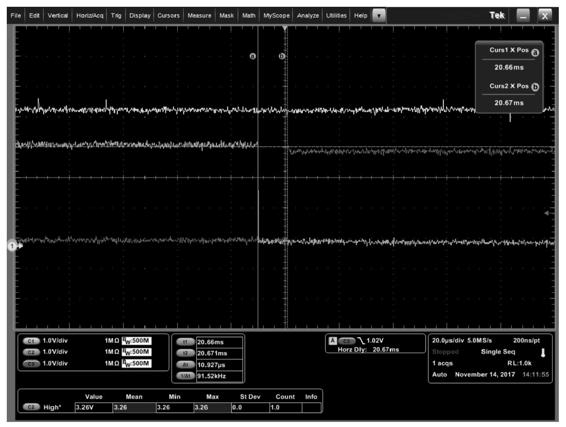

 图2-42 恢复信号的错误EOP波形

 由于恢复信号的发起者不同，主机和设备在整个总线恢复中起到 的角色和介入的时间各有不同。以下主要从两个方面讨论：主机主动 发起的恢复和设备主动发起的恢复。同时由于Hub的存在，本节将从 上述两个方面分别讨论Hub在总线恢复中起到的作用。

 1.主机主动发起的恢复

 由于总线挂起情况不同，主机唤醒总线的方式也是不同的。本节 将分别从两种总线挂起状态讲述恢复。

 1）全局总线挂起 在全局总线挂起的情况下，主机通过直接驱动根端口产生恢复信 号唤醒总线。不管网络拓扑结构中有无Hub，主机处理都是相同的。 当Hub检测到上行端口的恢复信号时，Hub无条件将信号转发给所有使 能的下行端口，如图2-43所示。

 图2-43 上行端口的恢复信号在Hub上的流向

 2）部分总线挂起 主机首先找到被唤醒设备所在网络拓扑结构中的离设备最近的处 于活动状态（非挂起状态）的 Hub。然后，向该 Hub发送 ClearPortFeature（PORT_SUSPEND）命令。Hub在收到命令后向该命 令所对应的端口发送恢复信号。此时，该 Hub 的行为和全局总线挂起 的 USB主机唤醒总线的行为类似。在收到主机的端口恢复请求后， Hub 通过驱动总线向该端口发送复位信号，从而唤醒目标端口所连接 的部分总线。

 2.设备主动发起的恢复

 设备主动发送恢复信号需要同时满足以下三个前提条件：

 ● 设备支持远程唤醒功能（配置描述符的bmAttributes属性的Bit5 如果是1）。

 ● 主机开启了设备的远程唤醒（SetFeature （DEVICE_REMOTE_WAKEUP））功能。

 ● 设备检测到总线空闲状态至少持续了5ms（3ms的挂起时间及 2ms的等待时间，以保证Hub进入挂起状态并准备好转发恢复信号）。 由于全局总线挂起和部分总线挂起在设备主动发起恢复信号的情 况下，主机、Hub和设备的各自行为是一致的，所以本节将统一介 绍。 设备产生恢复信号至少需要持续1ms，但是不能超过15ms。在停 止发送恢复信号后，设备保持它的信号引脚处于高阻态。如果主机和 设备之间存在挂起状态的Hub，那么该Hub在收到恢复信号后需尽可能 快地（必须在1ms之内）将信号传播给它的上行端口和其他使能的下 行端口，如图2-44所示。同时该Hub在15ms内（从检测到上行端口的 恢复信号开始计时）必须停止向上行端口发送恢复信号，且开始将上 行端口的恢复信号转发到所有使能的下行端口。设备产生的恢复信号 将一直向上行端口传播，直到到达主机或者非挂起的Hub。当主机或 者活动状态的 Hub 检测到恢复信号后，其必须在1ms以内产生恢复信 号，同时驱动信号的持续时间不得小于20ms。这里需要强调的是，如 果主机和设备之间存在活跃的Hub，该Hub将充当主机的角色，即驱动 USB总线产生恢复信号并不会向上传播下行端口的恢复信号。

 图2-44 下行端口的恢复信号在挂起的Hub上的流向

 图2-45是全速设备主动发起的恢复信号示例，在该示例中，局部 设备被挂起并且该设备设置了远程唤醒功能。Hub A和Hub B是高速设 备，挂起的设备是全速设备。Hub A与Hub B所连接的总线被系统挂 起，所以Hub B是挂起状态，Hub A是活动状态。tn是挂起的设备远程 唤醒总线的过程中的主要时间节点，具体各时间节点的具体事件如 下：

 t0：挂起的设备在该时刻通过驱动 USB 总线产生信号 K 开始远程 唤醒USB总线。

 t1：挂起的Hub B在收到下行端口的K状态后将恢复信号传播到上 行端口和所有使能的下行端口。当前示例中，Hub B从检测到K信号到 开始驱动恢复信号的时间间隔是900µs。

 t2：活动状态的Hub A在挂起的端口（Hub B所连接的端口）上检 测到K状态后驱动总线向Hub B发送K信号。当前示例中，Hub A从检 测到K信号到开始驱动恢复信号的时间间隔是900µs。

 t3：在驱动USB总线产生的K信号持续一段时间（如10ms）后，挂 起的设备停止驱动总线。

 t4：Hub B在驱动USB总线产生的K信号持续一段时间（如10ms） 后，停止驱动总线并将下行端口的信号转播给所有使能的端口。

 t5：Hub A在驱动总线产生恢复信号一段时间后（不小于20ms）产 生恢复结束信号。由于Hub B工作在高速模式，Hub A驱动的恢复信号 的结束阶段是高速的SE0。而Hub B在检测到高速SE0后获知总线恢复 进入了结束阶段，它根据每个端口连接设备的速度发送对应速度模式 的结束信号。例如，端口处于全速或低速模式，那Hub B将会驱动总 线产生两位的低速SE0及一位该端口速度模式下的J信号。如果端口处 于全速模式，那J信号就是全速J信号。否则，J信号就是低速J信号。 如果端口处于高速模式，那Hub B将会驱动总线产生高速SE0。 在恢复信号时序完成后，主机或者非挂起的Hub必须在3ms内产生 SOF包，以防止总线再次进入挂起状态。同时，USB 主机系统必须提 供 10ms 的恢复时间，在此期间主机不能访问任何刚刚恢复的设备。

 图2-46是两种典型的全局总线挂起和恢复流程图。主机在挂起总 线前，将所有支持远程唤醒功能的设备全部使能。图2-46的左侧是主 机主动恢复总线的流程图，右侧是设备主动恢复总线的流程图。

 图2-45 全速设备主动发起的恢复信号示例

 图2-46 两种典型的全局总线挂起和恢复流程图

 另外，本节开始也提到过设备移除事件也会唤醒总线。如果设备 直接连接主机，处于睡眠状态的主机会被一个设备移除事件唤醒；如 果设备通过Hub连接主机，那么所连接的Hub会收到一个设备移除事 件。这里存在两种情况：Hub处于挂起状态和Hub处于活动状态。

 1）Hub处于挂起状态 当设备移除时，如果Hub的远程唤醒功能在挂起前已经被系统使 能了，那么Hub会在被设备移除事件唤醒后向上行端口发送恢复信 号，此情形和设备主动发起的恢复信号类似。至于Hub在向上行端口 发送恢复信号的同时会不会向所有的下行端口发送恢复信号由具体的 Hub决定。不管如何实现，有一个结果可以确定—USB网络中的每一 个设备收到的恢复信号都不会小于20ms。 如果Hub的远程唤醒功能没有被系统使能，那么Hub可能会被唤 醒，也可能不会，由具体的Hub决定，但是Hub一定不会将恢复信号转 播给上行端口和任何下行端口。在这种情形下，设备的移除不会被系 统感知，也不会唤醒总线。

 2）Hub处于活动状态 如果设备移除，主机会收到Hub的端口状态变化通知。在收到端 口变化消息后，USB主机通过获取端口状态获知设备被移除，然后开 始设备移除事件的相关处理。

## 2.4.3 高速模式下的挂起信号和复位信号的区别

 在高速模式下，复位信号和挂起信号的起始部分是相同的。也就 是说，高速设备在检测到持续空闲状态（SE0）时，并不知道该信号 的具体含义。因此，USB 设备在检测到连续的空闲（3ms）时，它必 须在第 3.125ms 内恢复到全速模式（移除高速终端电阻，并且用1.5kΩ 的电阻将D+上拉）。在恢复到全速模式后，高速设备在 100µs 到 875µs 之间开始检测总线状态。如果总线处于全速的J状态，则设备认 为这是一个总线挂起事件。设备开始总线挂起相关的处理。如果总线 是全速的 SE0 状态，则设备认为这是一个复位事件，开始高速检测握 手逻辑。高速设备检测到总线 3ms 的空闲后进入挂起状态，其波形如 图 2-47所示。高速设备在进入高速模式后收到总线复位事件，其波形 如图 2-48所示。高速设备在检测到总线空闲3ms后通过移除高速终端 电阻加载全速上拉电阻，开始检测总线状态。如果总线是全速J状态， 则USB设备认为收到的是总线挂起事件。否则USB设备认为收到的是 总线复位事件。

 图2-47 高速模式下设备进入挂起状态的波形

 图2-48 高速设备的复位信号波形

 这里需要补充说明的是，一般的USB控制器在设计时，为了降低 功耗，正常状态和低功耗模式状态使用了不同的电源和时钟电路。无 论主机（使能了远程唤醒功能）还是设备，在进入低功耗模式前都需 要确保其恢复信号监测模块的时钟和电源都已使能，以确保主机或者 设备能够正确地检测到对方的恢复信号。在实际开发中，往往有部分 开发者忽视主机低功耗模式的电源和时钟使能，导致USB主机无法检 测到USB设备发出的恢复信号，从而导致唤醒不成功。

# 2.5 端点停止

 握手包中有一个STALL包，由USB设备方发出，用来表示某个端 点不能发送或者接收数据，或者表示不支持控制传输的某种请求。端 点一旦发出STALL包，表示其处于停止状态，在停止状态被清除前， 该端点不能行使其功能。同时，只有USB设备可以返回STALL包， USB主机在任何情况下都不能发送STALL包。针对USB设备的不同端 点，STALL包在两种不同的情况下使用：功能停止（Function Stall） 和协议停止（Protocol Stall）。

## 2.5.1 功能停止

 功能停止（Function Stall）是指USB设备端点的停止（Halt）特性 被设置导致该端点不能行使其功能。设备端点的停止特性被设置有两 种情况：USB设备设置和USB主机设置。功能停止一般不会在控制端 点0中使用。 需要注意的是，在功能停止的情况下，同一端点的不同方向上的 停止特性相互独立，如IN端点1处于停止状态不影响OUT端点1的通 信。

 1.USB设备设置停止特性

 对于非控制端点，如果USB设备无法正常响应USB主机发出的请 求，USB设备主动把该端点置为停止（Halt）状态，并使用STALL包 通知主机。USB主机可以通过ClearFeature（ENDPOINT_HALT）请求 来清除该端点的停止状态。在该端点的停止状态被清除前，对于主机 对该端点的任何请求，USB设备会一直回复STALL包。 图2-49是设备设置端点停止特性示例。由于某些原因，大容量存 储设备主动设置端点为停止状态，主机收到STALL包后，通过 ClearFeature（）清除端点的停止状态并继续通信。其流程如下：

 图2-49 设备设置端点停止特性示例

 （1）USB主机发送一个Inquiry请求，希望设备返回长度为0xff的 数据，而当前的USB设备可以返回数据的长度不足，设备根据纯批量 传输协议（Bulk-Only Transport），把IN端点1主动置为停止（Halt） 状态并返回STALL包。

 （2）USB 主机收到 IN 端点 1 返回的 STALL 包后，使用 ClearFeature （ENDPOINT_HALT）清除IN端点1的停止状态。

 （3）USB主机通过READ CAPACITY（10）命令成功地获取了设 备的信息。可以看到，IN端点1恢复了正常状态并可以返回相应的数 据完成与USB主机的正常通信。 

2.USB主机设置停止特性

 当发生错误时，USB 主机也可以通过 SetFeature（ENDPOINT_HALT）请求主动将USB设备的端点设置为停 止状态。在错误被处理后，USB主机可以通过 ClearFeature（ENDPOINT_HALT）请求将该端点的停止状态清除。在 该端点的停止特性被清除前，对主机发送给该端点的任何请求，USB 设备会一直回复STALL包。 图2-50是主机首先设置端点停止特性，其次再清除停止特性状 态，最后恢复正常通信的例子。USB主机在Transfer 15中通过 SetFeature（ENDPOINT_HALT）

 图2-50 主机设置停止特性示例

 将设备的OUT端点2设置为停止状态。之后在Transaction 138中， 当主机试图与被停止的端点通信时，USB 设备回复 STALL 包。由于 本次事务（Transaction 138）未传输成功，协议分析仪无法将其解析成 一个完整的传输（Transfer），因此事务（Transaction 138）以一个单 独的事务显示。主机在Transfer 16通过 ClearFeature（ENDPOINT_HALT）清除掉OUT端点2的停止状态后， USB设备在Transfer 17中就能正常响应主机，并完成传输。 需要注意的是，无论是设备设置停止特性还是主机设置停止特 性，对于中断和批量端点，在收到ClearFeature（ENDPOINT_HALT） 的请求后，该端点上的数据PID值应该置为DATA0，否则就可能因主 机和设备之间不同步而导致错误。

## 2.5.2 协议停止

 协议停止（Protocol Stall）只能在控制端点 0 上使用。如果设备不 支持USB主机发送的某个请求，或者该请求的参数不合法，或者存在 其他与USB规范冲突的行为，设备会在控制传输（Control Transfer） 的数据或者状态阶段返回STALL包。对于协议停止，其与功能停止的 不同之处在于：

 ● 当USB设备在收到USB主机发送的下一个Setup包时，USB设备 的控制端点0的停止状态要被自动清除并正常响应该Setup包。

 ● 在收到下一个Setup事务前，设备对于控制端点0上的通信，无 论IN还是OUT方向都会持续回复STALL包。

 图2-51是协议停止示例，其流程如下：

 （1）在Transaction 27中，主机通过 Get_Descriptor（DEVICE_QUALIFIER）请求获取设备的限定描述符 （Device Qualifier Descriptor），设备回复确认（ACK）握手包表示已 经收到该请求。由于设备并没有限定描述符，无法响应该请求，设备 将控制端点0设置为停止状态。

 （2）在Transaction 29中，主机发IN包获取设备的限定描述符，设 备回复了STALL包，同时设备自动清除控制端点0的停止状态。

 （3）在Transaction30中，主机通过Get_Descriptor（DEVICE）请 求获取设备的设备描述符，设备回复ACK包表示已经收到该请求且其 停止状态位已被清除。 （4）在Transaction 32和Transaction 33中，设备正常响应主机的通 信，完成USB主机获取设备描述符的请求。

 图2-51 协议停止示例

