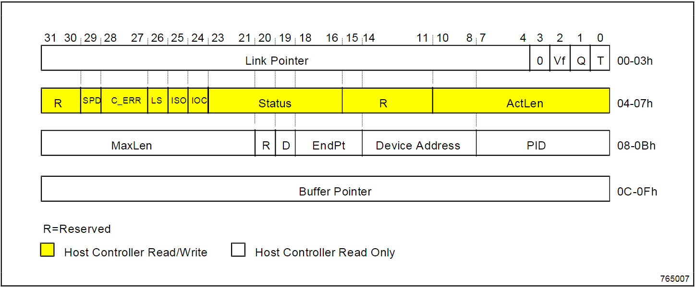
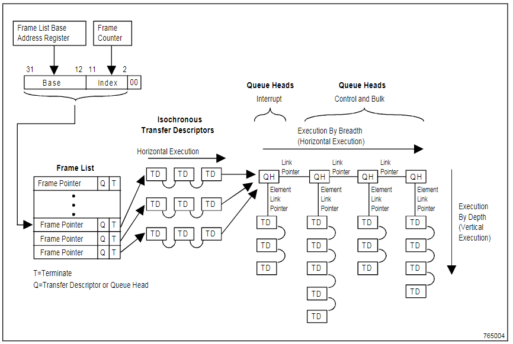

这篇文章简要讲述一下qemu是如何来实现一个uhci usb控制器的.

就我目前看到的,uhci的实现其实很简单,如果你想要更多的参考资料,那就参考<<Universal Host Controller Interface (UHCI) Design Guide>>,毕竟很难再找到比这个还要详细的资料了.
## 数据结构

### UHCIState

```c
// usb-uhci.c
#define NB_PORTS 2
typedef struct UHCIState {
    PCIDevice dev;
    uint16_t cmd; /* cmd register */
    uint16_t status; /* 状态寄存器 */
    /* 中断使能寄存器 */
    uint16_t intr; /* interrupt enable register */
    uint16_t frnum; /* frame number */
    /* frame list的基址 */
    uint32_t fl_base_addr; /* frame list base address */
    uint8_t sof_timing;
    uint8_t status2; /* bit 0 and 1 are used to generate UHCI_STS_USBINT */
    QEMUTimer *frame_timer;
    UHCIPort ports[NB_PORTS]; /* 模拟的usb端口 */
} UHCIState;
```

qemu用UHCIState的实例来描述一个uhci usb控制器.

cmd代表命令寄存器,它的取值如下:

```c
// usb-uhci.c
#define UHCI_CMD_GRESET   (1 << 2) /* Global reset */
#define UHCI_CMD_HCRESET  (1 << 1) /* Host reset */
#define UHCI_CMD_RS       (1 << 0) /* Run/Stop -- 1表示Run, 0表示Stop */
```

status代表状态寄存器,它的取值如下:

```c
#define UHCI_STS_HCHALTED (1 << 5) /* HC Halted */
#define UHCI_STS_HCPERR   (1 << 4) /* Host Controller Process Error: the schedule is buggy */
#define UHCI_STS_HSERR    (1 << 3) /* Host System Error: PCI problems */
#define UHCI_STS_RD       (1 << 2) /* Resume Detect */
#define UHCI_STS_USBERR   (1 << 1) /* Interrupt due to error */
#define UHCI_STS_USBINT   (1 << 0) /* Interrupt due to IOC */
```

usb控制器需要注册到pci接口上.

```c
void usb_uhci_init(PCIBus *bus, int devfn)
{
    UHCIState *s;
    uint8_t *pci_conf;
    int i;

    s = (UHCIState *)pci_register_device(bus,
                                        "USB-UHCI", sizeof(UHCIState),
                                        devfn, NULL, NULL);
    pci_conf = s->dev.config;
    // ...
    
    for(i = 0; i < NB_PORTS; i++) { /* 注册usb端口 */
        qemu_register_usb_port(&s->ports[i].port, s, i, uhci_attach);
    }
    s->frame_timer = qemu_new_timer(vm_clock, uhci_frame_timer, s);

    uhci_reset(s);

    /* Use region 4 for consistency with real hardware.  BSD guests seem
       to rely on this.  */
    pci_register_io_region(&s->dev, 4, 0x20, 
                           PCI_ADDRESS_SPACE_IO, uhci_map);
}
```

当我们将一个设备插上usb控制器的usb端口时,会调用uhci_attach函数,这个函数会设置对应的寄存器,来通知内核.

```c
/* 设备连接上端口
 * @param port1 usb端口的抽象
 * @param dev usb设备
 */
static void uhci_attach(USBPort *port1, USBDevice *dev)
{
    UHCIState *s = port1->opaque;
    UHCIPort *port = &s->ports[port1->index];

    if (dev) {
        if (port->port.dev) {
            usb_attach(port1, NULL);
        }
        /* set connect status */
        /* 连接状态发生更改 -- UHCI_PORT_CSC
         * 设备已经连接上了 -- UHCI_PORT_CCS
         */
        port->ctrl |= UHCI_PORT_CCS | UHCI_PORT_CSC;

        /* update speed */
        if (dev->speed == USB_SPEED_LOW)
            port->ctrl |= UHCI_PORT_LSDA; /* 低速设备连接上了 */
        else
            port->ctrl &= ~UHCI_PORT_LSDA;
        port->port.dev = dev;
        /* send the attach message 
         * 发送attach消息
         */
        dev->handle_packet(dev, 
                           USB_MSG_ATTACH, 0, 0, NULL, 0);
    } else {
        /* set connect status */
        if (port->ctrl & UHCI_PORT_CCS) {
            port->ctrl &= ~UHCI_PORT_CCS; /* 设备当前不存在 */
            port->ctrl |= UHCI_PORT_CSC; /* 连接状态发生了更改 */
        }
        /* disable port */
        if (port->ctrl & UHCI_PORT_EN) {
            port->ctrl &= ~UHCI_PORT_EN; /* 端口现在不使能 */
            port->ctrl |= UHCI_PORT_ENC; /* 端口使能状态发生了更改 */
        }
        dev = port->port.dev;
        if (dev) {
            /* send the detach message */
            dev->handle_packet(dev, 
                               USB_MSG_DETACH, 0, 0, NULL, 0);
        }
        port->port.dev = NULL;
    }
}
```


### Transfer Descriptor



我们首先看一下00-03h:

| Bit  | 描述                                                         |
| ---- | ------------------------------------------------------------ |
| 31:4 | Link Pointer(LP).指针,指向另外一个TD或者QH.                  |
| 3    | 保留                                                         |
| 2    | Depth/Breadth Select(Vf).暂时用不到.                         |
| 1    | QH/TD Select(Q). 1代表是QH,0代表是TD.这个字段用于指示LP指向的到底是QH还是TD. |
| 0    | Terminate(T).如果为1,那么Link Pointer字段无效(类似链表的最后一个元素),否则有效. |

接下来是04-07h:

| Bit   | 描述                                                         |
| ----- | ------------------------------------------------------------ |
| 31:30 | 保留                                                         |
| 29    | Short Packet Detect(SPD).1表示启用,0表示禁用.                |
| 28:27 | 忽略.                                                        |
| 26    | Low Speed Device(LS).如果为1表示为低速设备,0代表全速设备.    |
| 25    | Isochronous Select(IOS).1代表是Isochronous Transfer Descriptor,0代表Non-isochronous Transfer Descriptor. |
| 24    | Interrupt on Complete(IOC).这个bit表示控制器在完成此TD的传输之后,应该触发一个中断. |
| 23:16 | Status.用于指示状态.                                         |
| 15:11 | 保留                                                         |
| 10:0  | Actual Length(ActLen).实际长度.                              |

最后是0C-OFh:

| Bit   | 描述                                                         |
| ----- | ------------------------------------------------------------ |
| 31:21 | Maximum Length(MaxLen).本次传输所允许的最大长度.             |
| 20    | 保留                                                         |
| 19    | Data Toggle(D).这个bit用于一个usb端点和主机的同步数据传输,它决定了要传输或者期望哪一个数据PID(Data PID), 0代表DATA0,1代表DATA1. |
| 18:15 | Endpoint(EndPt).设备的端点号                                 |
| 14:8  | Device Address.设备地址                                      |
| 7:0   | Packet Identification(PID).用于描述包的类型.                 |

Qemu中,TD的定义如下:
```c
typedef struct UHCI_TD {
    uint32_t link; /* 要么指向另外一个TD,要么指向一个QH,要么指向空(PTR_TERM) */
    uint32_t ctrl; /* see TD_CTRL_xxx */
    uint32_t token;
    uint32_t buffer;
} UHCI_TD;
```


### Queue Head


00-03h:

| Bit  | 描述                                                         |
| ---- | ------------------------------------------------------------ |
| 31:4 | Queue Head Link Pointer(QHLP).这个字段指向下一个待处理的data object. |
| 3:2  | 保留                                                         |
| 1    | QH/TD Select(Q).1代表QH,0代表TD.这个bit用于指示link pointer指向的到底是TD还是QH. |
| 0    | Terminate(T).如果为1,表示这是最后一个QH(指针无效),0表示指针有效. |

04-07h:
| Bit  | 描述                                                         |
| ---- | ------------------------------------------------------------ |
| 31:4 | Queue Element Link Pointer(QELP).这个字段是指针,指向待处理的下一个TD或者QH. |
| 3    | 保留                                                         |
| 2    | 保留                                                         |
| 1    | QH/TD Select(Q).1表示为QH,0表示为TD.这个字段用于指示QELP指示的是QH还是TD. |
| 0    | Terminate(T).1代表指针无效,或者已经没有有效的队列元素了.     |

Qemu中,QH的定义如下:
```c
/* Queue Head */
typedef struct UHCI_QH {
    uint32_t link; /* 对照上图的link pointer */
    uint32_t el_link; /* 对照上图的element link pointer */
} UHCI_QH;
```

## 处理流程

一旦要接收或者发送数据,就会执行uhci_frame_timer,处理流程中,最为核心的,就是这个函数.

了解uhci的运行原理,离不开下面这张经典的图:



注意图中的Frame List,它是一个数组,最多1024个元素,每一个元素代表一个frame.

frame其实是一个指针,指向TD(Transaction Descriptor)或者QH(Queue Head). TD描述的就是最终要在USB总线上传输的数据包,它是主机控制器的基本执行单位.

UHCI spec定义了两类TD,Iso TD和non-ISO TD.即等时TD和非等时TD.我们知道USB一共四种传输方式,中断,批量,控制,等时.这其中等时传输最帅,所以它的TD也会有所不同,虽然从数据结构的格式来说是一样的,但是作用不一样.从这张调度图来看,等时的TD也是专门被列出来了.主机控制器驱动程序负责填充TD,主机控制器将会去获取TD,然后执行相应的数据传输.

QH是列表头,它将各个非等时TD连接起来,组织成了若干队列.

FrameList Base Address Register中存储了Frame List数组的基址, Frame Counter是一个计数器,表示当前已经处理到了哪一个frame.

```c
static void uhci_frame_timer(void *opaque)
{
    UHCIState *s = opaque;
    int64_t expire_time;
    uint32_t frame_addr, link, old_td_ctrl, val;
    int int_mask, cnt, ret;
    UHCI_TD td;
    UHCI_QH qh;

    if (!(s->cmd & UHCI_CMD_RS)) { /* 控制器已经停止 */
        qemu_del_timer(s->frame_timer);
        /* set hchalted bit in status - UHCI11D 2.1.2 */
        s->status |= UHCI_STS_HCHALTED;
        return;
    }
    /* 每一个frame的大小为4字节 */
    frame_addr = s->fl_base_addr + ((s->frnum & 0x3ff) << 2);
    cpu_physical_memory_read(frame_addr, (uint8_t *)&link, 4); /* 读取4字节的frame */
    le32_to_cpus(&link);
    int_mask = 0;
    cnt = FRAME_MAX_LOOPS;
    /* frame要么指向一个TD,要么指向一个QH */
    while ((link & 1) == 0) { /* link的最后一个bit为0,代表终结,不为0 */
        if (--cnt == 0)
            break;
        /* valid frame */
        if (link & 2) { /* link的第2个bit为1,表示是Queue Head */
            /* QH -- queue head 队列头部, QH将多个非等时TD连接起来 */
            cpu_physical_memory_read(link & ~0xf, (uint8_t *)&qh, sizeof(qh));
            le32_to_cpus(&qh.link);
            le32_to_cpus(&qh.el_link);
        depth_first:
            if (qh.el_link & 1) {
                /* no element : go to next entry */
                link = qh.link; /* 遍历下一个队列 */
            } else if (qh.el_link & 2) {
                /* QH */
                link = qh.el_link; /* 指向下一个元素 */
            } else {
                /* TD */
                if (--cnt == 0)
                    break;
                /* 读取出一个transaction descriptor */
                cpu_physical_memory_read(qh.el_link & ~0xf, 
                                         (uint8_t *)&td, sizeof(td));
                le32_to_cpus(&td.link);
                le32_to_cpus(&td.ctrl);
                le32_to_cpus(&td.token);
                le32_to_cpus(&td.buffer);
                old_td_ctrl = td.ctrl;
                ret = uhci_handle_td(s, &td, &int_mask);
                /* update the status bits of the TD */
                if (old_td_ctrl != td.ctrl) {
                    val = cpu_to_le32(td.ctrl);
                    cpu_physical_memory_write((qh.el_link & ~0xf) + 4, 
                                              (const uint8_t *)&val, 
                                              sizeof(val));
                }
                if (ret < 0)
                    break; /* interrupted frame */
                if (ret == 0) {
                    /* update qh element link */
                    qh.el_link = td.link;
                    val = cpu_to_le32(qh.el_link);
                    /* 继续读取 */
                    cpu_physical_memory_write((link & ~0xf) + 4, 
                                              (const uint8_t *)&val, 
                                              sizeof(val));
                    if (qh.el_link & 4) {
                        /* depth first */
                        goto depth_first;
                    }
                }
                /* go to next entry */
                link = qh.link;
            }
        } else { /* Transaction Descriptor */
            /* TD */
            cpu_physical_memory_read(link & ~0xf, (uint8_t *)&td, sizeof(td));
            le32_to_cpus(&td.link);
            le32_to_cpus(&td.ctrl);
            le32_to_cpus(&td.token);
            le32_to_cpus(&td.buffer);
            old_td_ctrl = td.ctrl;
            ret = uhci_handle_td(s, &td, &int_mask);
            /* update the status bits of the TD */
            if (old_td_ctrl != td.ctrl) {
                val = cpu_to_le32(td.ctrl);
                cpu_physical_memory_write((link & ~0xf) + 4, 
                                          (const uint8_t *)&val, 
                                          sizeof(val));
            }
            if (ret < 0)
                break; /* interrupted frame */
            link = td.link;
        }
    }
    s->frnum = (s->frnum + 1) & 0x7ff; /* 更新帧号 */
    if (int_mask) {
        s->status2 |= int_mask;
        s->status |= UHCI_STS_USBINT;
        uhci_update_irq(s);
    }
    /* prepare the timer for the next frame */
    expire_time = qemu_get_clock(vm_clock) + 
        (ticks_per_sec / FRAME_TIMER_FREQ);
    qemu_mod_timer(s->frame_timer, expire_time);
}
```

uhci读取到一个TD之后,立马就会处理这个TD,对应的函数为uhci_handle_td,它的处理思想和简单,那就是将报文转发给usb端口上的设备,然后根据设备的回应,然后设置对应的寄存器的标志位.

```c
/* return -1 if fatal error (frame must be stopped)
          0 if TD successful
          1 if TD unsuccessful or inactive
*/
static int uhci_handle_td(UHCIState *s, UHCI_TD *td, int *int_mask)
{
    uint8_t pid;
    uint8_t buf[1280];
    int len, max_len, err, ret;

    if (td->ctrl & TD_CTRL_IOC) {
        *int_mask |= 0x01;
    }
    
    if (!(td->ctrl & TD_CTRL_ACTIVE))
        return 1;

    /* TD is active */
    max_len = ((td->token >> 21) + 1) & 0x7ff; /* 提取bit21 ~ bit31的数据 */
    /* bit0 ~ bit7 ==> PID 
     * bit8 ~ bit14 ==> 设备地址
     * bit15 ~ bit18 ==> 端点号
     * bit19 ==> data toggle
     * bit20 ==> 保留
     * bit21 ~ bit31 ==> 这次传输的最大允许字节
     */
    pid = td->token & 0xff; 
    switch(pid) {
    case USB_TOKEN_OUT:
    case USB_TOKEN_SETUP:
        cpu_physical_memory_read(td->buffer, buf, max_len);
        ret = uhci_broadcast_packet(s, pid, 
                                    (td->token >> 8) & 0x7f, /* 设备号 */
                                    (td->token >> 15) & 0xf, /* 端点号 */
                                    buf, max_len);
        len = max_len;
        break;
    case USB_TOKEN_IN: /* 读取数据 */
        ret = uhci_broadcast_packet(s, pid, 
                                    (td->token >> 8) & 0x7f,
                                    (td->token >> 15) & 0xf,
                                    buf, max_len);
        /* 这里说明一下,ret代表设备的处理结果 */
        if (ret >= 0) {
            len = ret;
            if (len > max_len) {
                len = max_len;
                ret = USB_RET_BABBLE;
            }
            if (len > 0) { /* 将设备返回的结果直接写回去 */
                /* write the data back */
                cpu_physical_memory_write(td->buffer, buf, len);
            }
        } else {
            len = 0;
        }
        break;
    default:
        /* invalid pid : frame interrupted */
        s->status |= UHCI_STS_HCPERR;
        uhci_update_irq(s);
        return -1;
    }
    if (td->ctrl & TD_CTRL_IOS)
        td->ctrl &= ~TD_CTRL_ACTIVE;
    if (ret >= 0) {
        td->ctrl = (td->ctrl & ~0x7ff) | ((len - 1) & 0x7ff);
        td->ctrl &= ~TD_CTRL_ACTIVE;
        if (pid == USB_TOKEN_IN && 
            (td->ctrl & TD_CTRL_SPD) &&
            len < max_len) {
            *int_mask |= 0x02;
            /* short packet: do not update QH */
            return 1;
        } else {
            /* success */
            return 0;
        }
    } else {
        switch(ret) {
        default:
        case USB_RET_NODEV: /* 不存在此设备 */
        do_timeout:
            td->ctrl |= TD_CTRL_TIMEOUT; /* 打上超时标记 */
            err = (td->ctrl >> TD_CTRL_ERROR_SHIFT) & 3;
            if (err != 0) { /* 获得错误标志 */
                err--;
                if (err == 0) {
                    td->ctrl &= ~TD_CTRL_ACTIVE;
                    s->status |= UHCI_STS_USBERR; /* 更新状态寄存器 */
                    uhci_update_irq(s);
                }
            }
            td->ctrl = (td->ctrl & ~(3 << TD_CTRL_ERROR_SHIFT)) | 
                (err << TD_CTRL_ERROR_SHIFT);
            return 1;
        case USB_RET_NAK:
            td->ctrl |= TD_CTRL_NAK; /* 打上标志,说明接收到了NAK */
            if (pid == USB_TOKEN_SETUP)
                goto do_timeout;
            return 1;
        case USB_RET_STALL: /* 出错 */
            td->ctrl |= TD_CTRL_STALL;
            td->ctrl &= ~TD_CTRL_ACTIVE;
            return 1;
        case USB_RET_BABBLE:
            td->ctrl |= TD_CTRL_BABBLE | TD_CTRL_STALL;
            td->ctrl &= ~TD_CTRL_ACTIVE;
            /* frame interrupted */
            return -1;
        }
    }
}
```

