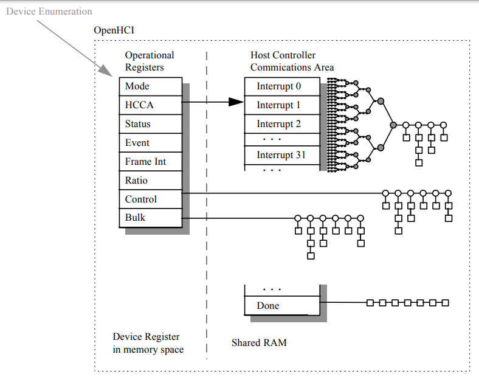
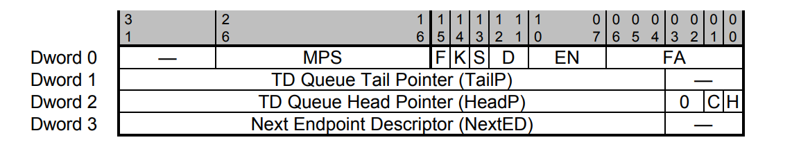
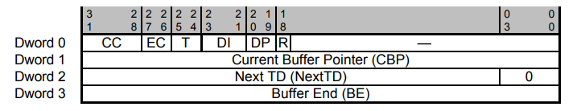
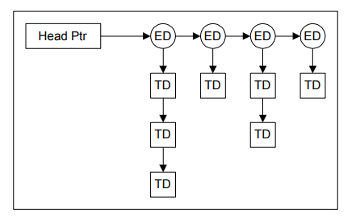

本文将简要介绍一下ohci控制器的实现.

关于ohci控制器,最好的参考资料还是<<Open Host Controller Interface Specification for USB>>, 如果你需要更加详细的参考,强烈建议去翻一下此书.我这里只会介绍Qemu中实现ohci控制器所需的一些知识.

## 约定

HC -- Host Controller

HCCA -- Host Controller Communication Area

在Host Controller以及Host Controller Driver之间存在两个交流通道.第一个通道使用位于HC上的一组操作寄存器.HC是该通道上所有通信的目标.操作寄存器包括控制,状态和指针列表寄存器.操作寄存器集中有一个指向共享内存中名为HCCA的位置.HCCA是第二个交流通道.HC是此通道上所有通信的源头,HCCA中包括指向中断端点描述符的头指针,完成队列的头指针,与帧处理有关的状态信息.

```c
/* Host Controller Communications Area */
struct ohci_hcca {
    uint32_t intr[32]; /* interrupt endpoint descriptor list */
    uint16_t frame, pad;
    uint32_t done; /* 完成队列 */
};
```




```c
/* 初始化ohci */
void usb_ohci_init(struct PCIBus *bus, int num_ports, int devfn)
{
    OHCIState *ohci;
    int vid = 0x106b;
    int did = 0x003f;
    int i;


    if (usb_frame_time == 0) {
		// ...
        dprintf("usb-ohci: usb_bit_time=%lli usb_frame_time=%lli\n",
                usb_frame_time, usb_bit_time);
    }

    ohci = (OHCIState *)pci_register_device(bus, "OHCI USB", sizeof(*ohci),
                                            devfn, NULL, NULL);
    if (ohci == NULL) {
        fprintf(stderr, "usb-ohci: Failed to register PCI device\n");
        return;
    }
	// ...

    ohci->mem = cpu_register_io_memory(0, ohci_readfn, ohci_writefn, ohci);

    pci_register_io_region((struct PCIDevice *)ohci, 0, 256,
                           PCI_ADDRESS_SPACE_MEM, ohci_mapfunc);

    ohci->num_ports = num_ports;
    for (i = 0; i < num_ports; i++) {
        qemu_register_usb_port(&ohci->rhport[i].port, ohci, i, ohci_attach);
    }

    ohci_reset(ohci);
}
```

## 数据结构

### Endpoint Descriptor



FA -- FunctionAdress usb设备地址.

EN -- EndpointNumber usb端点的地址.

D -- Direction 2个bit.用于指示方向.

S -- Speed 用于指示端点的传输速率, S=0的时候,代表全速,S=1的时候,代表低速

K -- sKip 如果这个bit被设置的话,那么HC将继续处理链表上的下一个ED

F -- Format 这个bit用于指示连接在这个ED上的TD,如果这是一个Control, Bulk或者Interrupt Endpoint,那么F为0,说明General TD format被使用,如果这是一个Isochronous Endpoint,那么F=1.

MPS -- MaximumPacketSize 最大包大小

TailP -- TDQueueTailPointer 如果TailP和HeadP相同,那么这个链表中不包含HC可以处理的任何TD.否则链表中包含可以处理的TD

H -- Halted 这个bit由HC设置,意味着这个端点的TD Queue的处理被终止,通常是因为在处理TD的时候遇到了错误.

C -- toggleCarry 这个bit是数据toggle carry bit,当一个TD被retired的时候,这个字段记录了此TD的data toggle value(LSb的data toggle字段),不适用于Isochronous Endpoint.

HeadP -- TDQueueHeadPointer 指向此端点(endpoint)的下一个待处理的TD

NextED -- NextED 如果非0,那么这个字段指向链表上下一个ED

Qemu中,ed的定义如下:

```c
/* Bitfields for the first word of an Endpoint Desciptor.  */
#define OHCI_ED_FA_SHIFT  0
#define OHCI_ED_FA_MASK   (0x7f<<OHCI_ED_FA_SHIFT)
#define OHCI_ED_EN_SHIFT  7
#define OHCI_ED_EN_MASK   (0xf<<OHCI_ED_EN_SHIFT)
#define OHCI_ED_D_SHIFT   11
#define OHCI_ED_D_MASK    (3<<OHCI_ED_D_SHIFT) /*direction 包括in以及out*/
#define OHCI_ED_S         (1<<13) /* ed_lowspeed */
#define OHCI_ED_K         (1<<14) /* ed_skip */
#define OHCI_ED_F         (1<<15) /* ed_iso */
#define OHCI_ED_MPS_SHIFT 7
#define OHCI_ED_MPS_MASK  (0xf<<OHCI_ED_FA_SHIFT)

/* Flags in the head field of an Endpoint Desciptor.  */
#define OHCI_ED_H         1 /* halted */
#define OHCI_ED_C         2 /* toggle carry */

/* endpoint descriptor */
struct ohci_ed {
    uint32_t flags;
    uint32_t tail;
    uint32_t head;
    uint32_t next;
};
```

###  Transfer Descriptor



R -- bufferRounding 如果这个bit为0,那么说明最新的TD中包含的数据恰好和定义的data buffer的长度一致,否则的话,数据会比定义的buffer要小.

DP -- Direction/PID 这两个bit指示了数据的流向.

DI -- DelayInterrupt 这个字段包含了这个TD的中断延时次数(interrupt delay count),

T -- DataToggle 这2个bit用来产生数据PID值(DATA0或者DATA1),每一次成功传输/接收了一个数据包之后,这个值都会更新,当data toggle的值从ED中的toggleCarry取得的时候,MSb的这个字段为0,data toggle的值从LSb的这个字段中取得的话,MSb的这个字段为1.


EC -- ErrorCount 每出现一次传输错误,这个值会递增.如果ErrorCount是2,并且另外一个错误发生了,那么error type将会被记录到ConditionCode字段之中,并且被放置到done队列之中,当一个事务正确完成,ErrorCount将会被重置为0.

CC -- ConditionCode 这个字段表示最近一次尝试的事务的状态.

CBP -- CurrentBufferPointer 包含下一个要传输给/读取的端点的内存的物理地址.0代表长度为0的数据包或者所有的byte都已经被传输完毕了.

NextTD -- NextTD 指向下一个TD

BE -- BufferEnd 此TD在buffer中最后一个bit的物理地址

在qemu之中,td的定义如下:

```c
/* Bitfields for the first word of a Transfer Desciptor.
 * 参考ohci.h
 */
#define OHCI_TD_R         (1<<18) /* round: short packets OK? */
#define OHCI_TD_DP_SHIFT  19 
#define OHCI_TD_DP_MASK   (3<<OHCI_TD_DP_SHIFT) /* direction/pid */
#define OHCI_TD_DI_SHIFT  21
#define OHCI_TD_DI_MASK   (7<<OHCI_TD_DI_SHIFT)
#define OHCI_TD_T0        (1<<24) /* DATA0 */
#define OHCI_TD_T1        (1<<24) /* DATA1 */
#define OHCI_TD_EC_SHIFT  26
#define OHCI_TD_EC_MASK   (3<<OHCI_TD_EC_SHIFT) /* error count */
#define OHCI_TD_CC_SHIFT  28
#define OHCI_TD_CC_MASK   (0xf<<OHCI_TD_CC_SHIFT) /* condition code */
/* OHCI_TD_CC_STALL
 * OHCI_TD_CC_DATAOVERRUN
 * OHCI_TD_CC_UNDEXPETEDPID
 */
#define OHCI_DPTR_MASK    0xfffffff0

#define OHCI_BM(val, field) \
  (((val) & OHCI_##field##_MASK) >> OHCI_##field##_SHIFT)

#define OHCI_SET_BM(val, field, newval) do { \
    val &= ~OHCI_##field##_MASK; \
    val |= ((newval) << OHCI_##field##_SHIFT) & OHCI_##field##_MASK; \
    } while(0)

/* General transfer descriptor */
struct ohci_td {
    uint32_t flags;
    uint32_t cbp;
    uint32_t next;
    uint32_t be;
};
```

### OHCIState

qemu中定义了一个OHCIState结构体来描述OHCI控制器.

```c
typedef struct {
    struct PCIDevice pci_dev;
    target_phys_addr_t mem_base;
    int mem;
    int num_ports;

    QEMUTimer *eof_timer; /* 定时器 */
    int64_t sof_time;

    /* OHCI state */
    /* Control partition */
    uint32_t ctl; /* 控制寄存器 */
    uint32_t status;
    uint32_t intr_status;
    uint32_t intr;

    /* memory pointer partition */
    uint32_t hcca;
    uint32_t ctrl_head, ctrl_cur;
    uint32_t bulk_head, bulk_cur;
    uint32_t per_cur;
    uint32_t done;
    int done_count;

    /* Frame counter partition */
    uint32_t fsmps:15;
    uint32_t fit:1;
    uint32_t fi:14;
    uint32_t frt:1;
    uint16_t frame_number; /* frame号 */
    uint16_t padding;
    uint32_t pstart;
    uint32_t lst;

    /* Root Hub partition */
    uint32_t rhdesc_a, rhdesc_b;
    uint32_t rhstatus;
    OHCIPort rhport[OHCI_MAX_PORTS];
} OHCIState;
```

## 处理流程

定时器的回调函数为ohci_frame_boundary,如何处理,可以参照上面的图, 先处理hcca中的ed,然后处理control链表上的ed,以及bulk链表上的ed.

```c
/* Do frame processing on frame boundary 
 * 定时器回调函数,处理frame
 */
static void ohci_frame_boundary(void *opaque)
{
    OHCIState *ohci = opaque;
    struct ohci_hcca hcca;

    cpu_physical_memory_rw(ohci->hcca, (uint8_t *)&hcca, sizeof(hcca), 0);

    /* Process all the lists at the end of the frame */
    if (ohci->ctl & OHCI_CTL_PLE) { /* periodic list enable */
        int n;

        n = ohci->frame_number & 0x1f; /* 读取当前已经处理到的队列的索引值?? */
        ohci_service_ed_list(ohci, le32_to_cpu(hcca.intr[n]));
    }
    if ((ohci->ctl & OHCI_CTL_CLE) && (ohci->status & OHCI_STATUS_CLF)) {
        if (ohci->ctrl_cur && ohci->ctrl_cur != ohci->ctrl_head)
          dprintf("usb-ohci: head %x, cur %x\n", ohci->ctrl_head, ohci->ctrl_cur);
        if (!ohci_service_ed_list(ohci, ohci->ctrl_head)) {
            ohci->ctrl_cur = 0;
            ohci->status &= ~OHCI_STATUS_CLF;
        }
    }
    /* 启用了bulk list,并且bulk list已经填充好了 */
    if ((ohci->ctl & OHCI_CTL_BLE) && (ohci->status & OHCI_STATUS_BLF)) {
        if (!ohci_service_ed_list(ohci, ohci->bulk_head)) {
            ohci->bulk_cur = 0;
            ohci->status &= ~OHCI_STATUS_BLF;
        }
    }

    /* Frame boundary, so do EOF stuf here */
    ohci->frt = ohci->fit;

    /* XXX: endianness */
    ohci->frame_number = (ohci->frame_number + 1) & 0xffff;
    hcca.frame = cpu_to_le32(ohci->frame_number);

    if (ohci->done_count == 0 && !(ohci->intr_status & OHCI_INTR_WD)) {
        if (!ohci->done)
            abort();
        if (ohci->intr & ohci->intr_status)
            ohci->done |= 1;
        hcca.done = cpu_to_le32(ohci->done); /* 记录下done链表 */
        ohci->done = 0;
        ohci->done_count = 7;
        ohci_set_interrupt(ohci, OHCI_INTR_WD);
    }

    if (ohci->done_count != 7 && ohci->done_count != 0)
        ohci->done_count--;

    /* Do SOF stuff here */
    ohci_sof(ohci);

    /* Writeback HCCA */
    cpu_physical_memory_rw(ohci->hcca, (uint8_t *)&hcca, sizeof(hcca), 1);
}
```

### 处理ED

OHCI采用两级列表传输机制,OHCI通过建立一系列的端点描述符(ED)和传输描述符(TD)进行事务处理的安排.

OHCI建立每个端点的端点描述符,在内存区域分配相应的数据结构,每个ED提供了与端点有关的信息,如设备地址,端点号和端点特性等.每个ED与一个TD序列相连,TD包含了用于执行某个传输的特定信息: 内存缓冲区位置,传输方向等必要信息.

它们的关系可以参照下图:



```c
/* Service an endpoint list.  Returns nonzero if active TD were found. 
 * 处理一个endpoint list
 */
static int ohci_service_ed_list(OHCIState *ohci, uint32_t head)
{
    struct ohci_ed ed;
    uint32_t next_ed;
    uint32_t cur;
    int active;

    active = 0;
    if (head == 0)
        return 0;

    for (cur = head; cur; cur = next_ed) { /* 遍历ED */
        if (!ohci_read_ed(cur, &ed)) { /* 读取出ED */
            fprintf(stderr, "usb-ohci: ED read error at %x\n", cur);
            return 0;
        }

        next_ed = ed.next & OHCI_DPTR_MASK; /* 下一个endpoint */
        /* H表示这个ED的TD Queue的处理终止, K被设置的话,表示要继续处理下一个ED */
        if ((ed.head & OHCI_ED_H) || (ed.flags & OHCI_ED_K))
            continue;

        /* Skip isochronous endpoints.  */
        if (ed.flags & OHCI_ED_F)
          continue;

        while ((ed.head & OHCI_DPTR_MASK) != ed.tail) { /* HeadP != TailP的话,表示还有TD待处理 */
            active = 1;
            if (ohci_service_td(ohci, &ed))
                break;
        }
        ohci_put_ed(cur, &ed);
    }

    return active;
}
```

### 处理TD

ohci_service_td用于处理传输描述符(TD).

```c
/* Read/Write the contents of a TD from/to main memory. 
 * 从一个TD中读/写数据到主内存
 */
static void ohci_copy_td(struct ohci_td *td, uint8_t *buf, int len, int write)
{
    uint32_t ptr;
    uint32_t n;

    ptr = td->cbp; /* TD的指针 */
    n = 0x1000 - (ptr & 0xfff);
    if (n > len)
        n = len;
    cpu_physical_memory_rw(ptr, buf, n, write);
    if (n == len)
        return;
    ptr = td->be & ~0xfffu;
    buf += n;
    cpu_physical_memory_rw(ptr, buf, len - n, write);
}

/* 处理传输描述符 */
static int ohci_service_td(OHCIState *ohci, struct ohci_ed *ed)
{
    int dir;
    size_t len = 0;
    uint8_t buf[8192];
    char *str = NULL;
    int pid;
    int ret;
    int i;
    USBDevice *dev;
    struct ohci_td td;
    uint32_t addr;
    int flag_r;

    addr = ed->head & OHCI_DPTR_MASK; /* addr是ED中下一个待处理TD的地址 */
    if (!ohci_read_td(addr, &td)) { /* 读取出TD */
        fprintf(stderr, "usb-ohci: TD read error at %x\n", addr);
        return 0;
    }

    dir = OHCI_BM(ed->flags, ED_D); /* OHCI_ED_D */
    switch (dir) {
    case OHCI_TD_DIR_OUT:
    case OHCI_TD_DIR_IN:
        /* Same value.  */
        break;
    default:
        dir = OHCI_BM(td.flags, TD_DP); /* DP字段,指示数据的流向 */
        break;
    }

    switch (dir) {
    case OHCI_TD_DIR_IN:
        str = "in";
        pid = USB_TOKEN_IN;
        break;
    case OHCI_TD_DIR_OUT:
        str = "out";
        pid = USB_TOKEN_OUT;
        break;
    case OHCI_TD_DIR_SETUP:
        str = "setup";
        pid = USB_TOKEN_SETUP;
        break;
    default:
        fprintf(stderr, "usb-ohci: Bad direction\n");
        return 1;
    }
    if (td.cbp && td.be) { /* 表示不是最后一个TD */
        if ((td.cbp & 0xfffff000) != (td.be & 0xfffff000)) {
            len = (td.be & 0xfff) + 0x1001 - (td.cbp & 0xfff);
        } else {
            len = (td.be - td.cbp) + 1;
        }

        if (len && dir != OHCI_TD_DIR_IN) {
            ohci_copy_td(&td, buf, len, 0);
        }
    }

    flag_r = (td.flags & OHCI_TD_R) != 0;
    ret = USB_RET_NODEV;
    for (i = 0; i < ohci->num_ports; i++) {
        dev = ohci->rhport[i].port.dev;
        if ((ohci->rhport[i].ctrl & OHCI_PORT_PES) == 0) /* 排除掉没有使能的端口 */
            continue;

        ret = dev->handle_packet(dev, pid, OHCI_BM(ed->flags, ED_FA),
                                 OHCI_BM(ed->flags, ED_EN), buf, len);
        if (ret != USB_RET_NODEV)
            break;
    }

    if (ret >= 0) {
        if (dir == OHCI_TD_DIR_IN) {
            ohci_copy_td(&td, buf, ret, 1);
        } else {
            ret = len;
        }
    }

    /* Writeback */
    if (ret == len || (dir == OHCI_TD_DIR_IN && ret >= 0 && flag_r)) {
        /* Transmission succeeded.  */
        if (ret == len) {
            td.cbp = 0;
        } else {
            td.cbp += ret;
            if ((td.cbp & 0xfff) + ret > 0xfff) {
                td.cbp &= 0xfff;
                td.cbp |= td.be & ~0xfff;
            }
        }
        td.flags |= OHCI_TD_T1;
        td.flags ^= OHCI_TD_T0;
        OHCI_SET_BM(td.flags, TD_CC, OHCI_CC_NOERROR); /* 没有发生错误 */
        OHCI_SET_BM(td.flags, TD_EC, 0);

        ed->head &= ~OHCI_ED_C;
        if (td.flags & OHCI_TD_T0) /* DATA0 */
            ed->head |= OHCI_ED_C;
    } else {
        if (ret >= 0) {
            dprintf("usb-ohci: Underrun\n");
            OHCI_SET_BM(td.flags, TD_CC, OHCI_CC_DATAUNDERRUN);
        } else {
            switch (ret) {
            case USB_RET_NODEV:
                OHCI_SET_BM(td.flags, TD_CC, OHCI_CC_DEVICENOTRESPONDING);
            case USB_RET_NAK:
                dprintf("usb-ohci: got NAK\n");
                return 1;
            case USB_RET_STALL:
                dprintf("usb-ohci: got STALL\n");
                OHCI_SET_BM(td.flags, TD_CC, OHCI_CC_STALL); /* 打上标记 */
                break;
            case USB_RET_BABBLE:
                dprintf("usb-ohci: got BABBLE\n");
                OHCI_SET_BM(td.flags, TD_CC, OHCI_CC_DATAOVERRUN);
                break;
            default:
                fprintf(stderr, "usb-ohci: Bad device response %d\n", ret);
                OHCI_SET_BM(td.flags, TD_CC, OHCI_CC_UNDEXPETEDPID);
                OHCI_SET_BM(td.flags, TD_EC, 3);
                break;
            }
        }
        ed->head |= OHCI_ED_H;
    }

    /* Retire this TD 
     * 回收TD
     */
    ed->head &= ~OHCI_DPTR_MASK;
    ed->head |= td.next & OHCI_DPTR_MASK; /* ed->head指向一个待处理的TD */
    /* 将TD加入done链表 */
    td.next = ohci->done; /* next字段指向下一个TD */
    ohci->done = addr; 
    i = OHCI_BM(td.flags, TD_DI); /* DI 中断延时次数 */
    if (i < ohci->done_count)
        ohci->done_count = i;
    ohci_put_td(addr, &td);
    return OHCI_BM(td.flags, TD_CC) != OHCI_CC_NOERROR;
}
```

