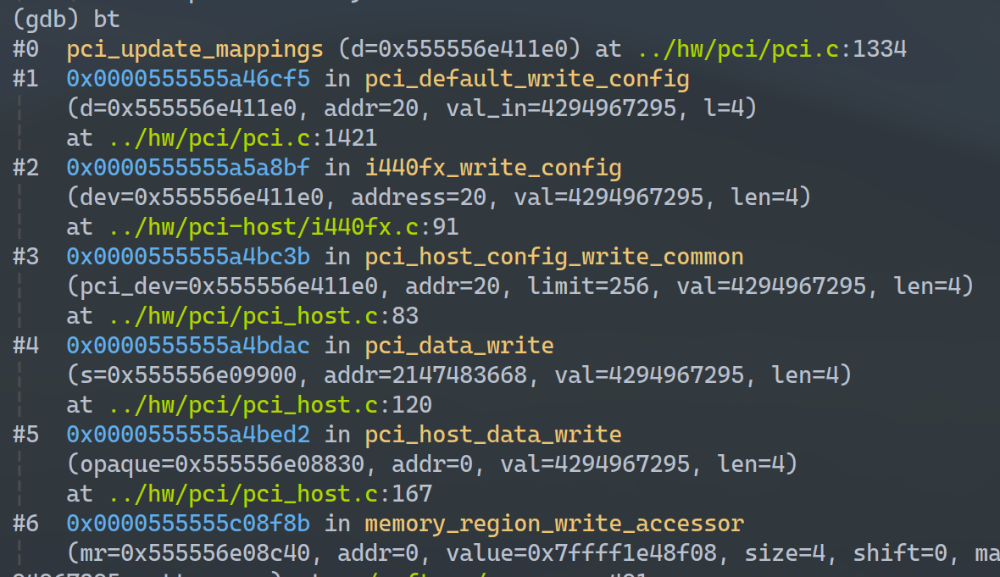
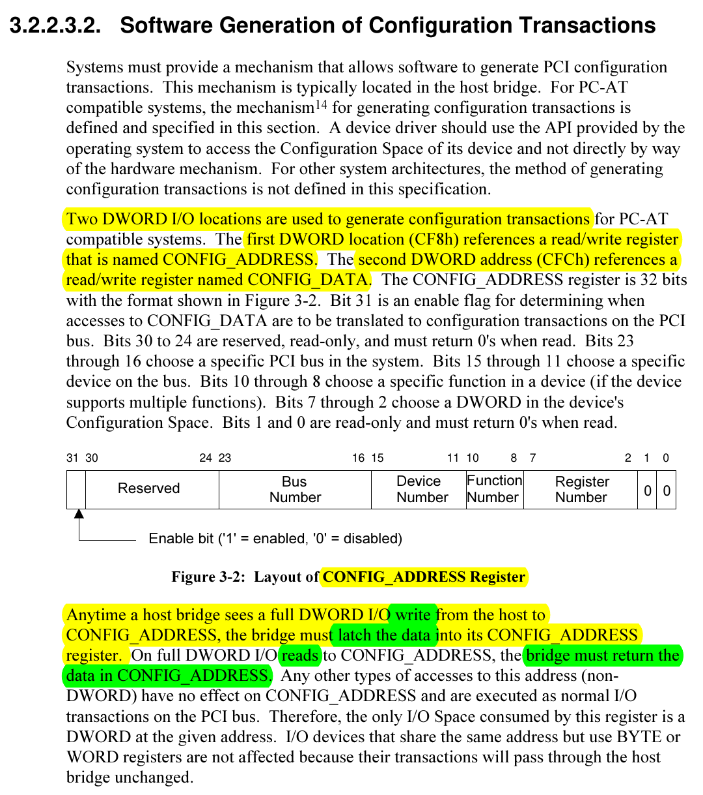
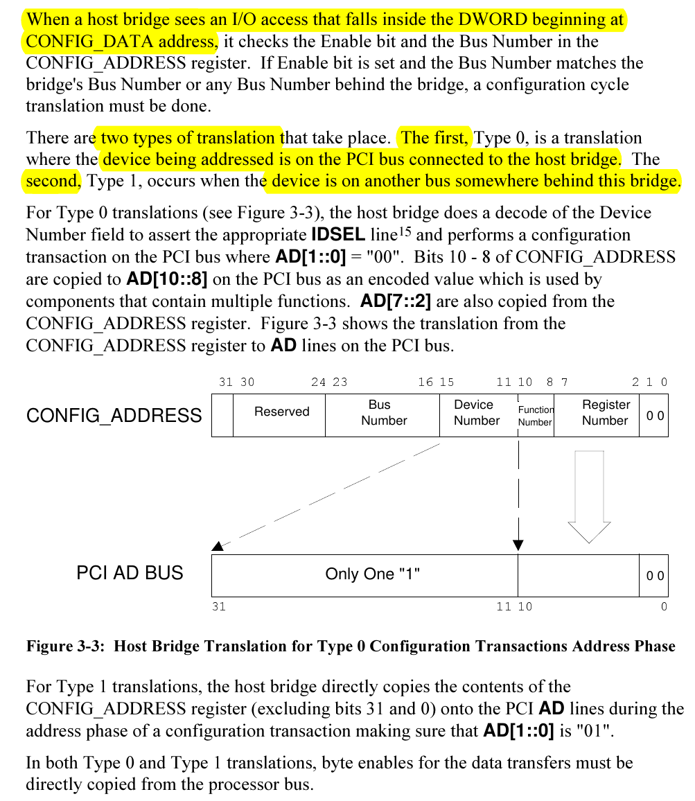
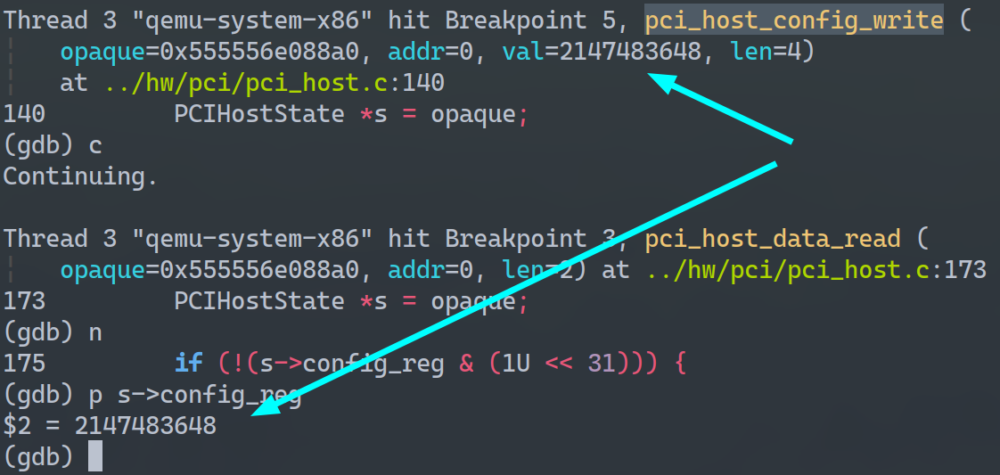
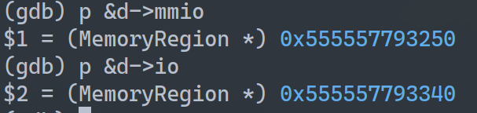
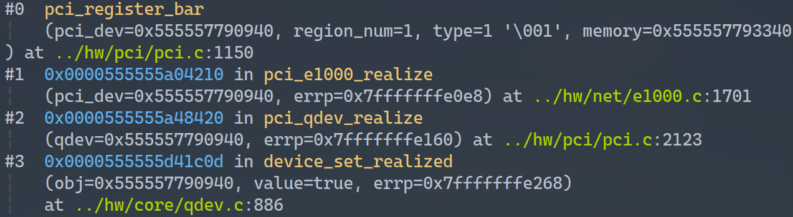
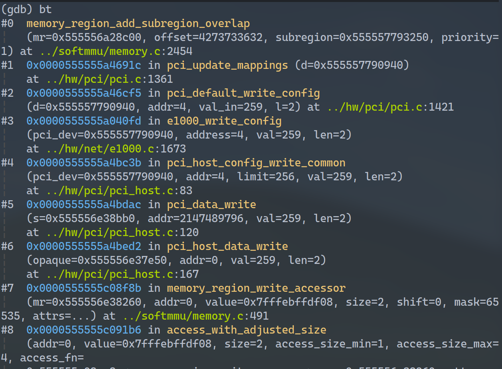
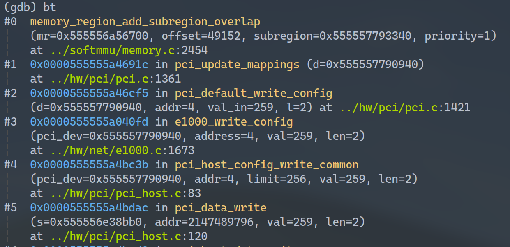
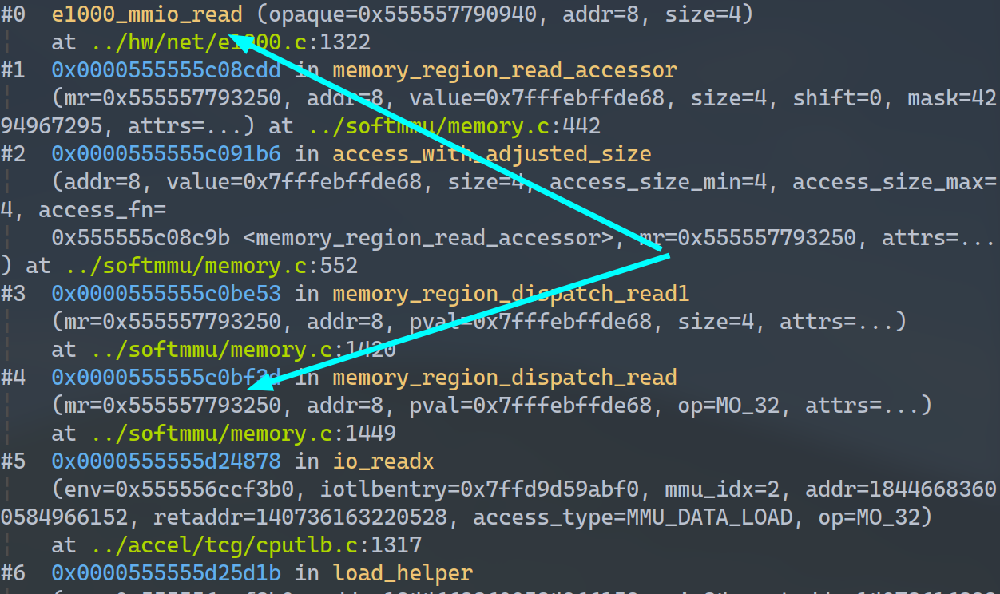

文章来自[QEMU总线模拟 - 66Ring's Blog](https://66ring.github.io/2021/09/10/universe/qemu/qemu_bus_simulate/)
# Abstract

设备之间通过总线互联通信，如果将所有设备都挂在到sysbus(即所谓的内部总线：连接cpu、内存、pic总线控制器等设备的总线)将会增加主板的布线难度，而且cpu并不需要实时与外围设备通信。因此没必要每个设备都直接与cpu连接。

现代cpu通过sysbus直接连接一个控制芯片，这个控制芯片再管理外围设备。控制芯片将数据汇总后再与cpu通信。

这个过程对应到QEMU中的就是：

- cpu通过sysbus找到pcihost
- pcihost通过pcibus找到pci设备完成cpu的指令

本文主要说明QEMU的怎么模拟实现这个过程的

# Preface

PCI设备有如下三种不同内存：

- MMIO
- PCI IO space
- PCI configuration space

其中pci configuration space 是用来配置pci设备的，其中也包含了关于pci设备的特定信息。而config空间中的BAR: Base address register可以用来确定设备需要使用的内存或I/O空间的大小，也可以用来存放设备寄存器的地址。

与pci设备通信，先会通过pcihost找到对应的pci设备，修改其config空间、传递指令信息。之后会调用`pci_update_mappings`更新pci设备的内存映射，因为可能接下来就要通过mmio/pio与pci设备通信了。如: gdb追踪`pci_host_config_write`、`pci_host_data_write`、`pci_update_mappings`的执行。

会发现`pci_host_config_write`传递指令信息保存到`config_reg`，`pci_host_data_write`根据`config_reg`修改config空间，之后会调用`pci_update_mappings`。`pci_update_mappings`会根据修改的config空间的信息更新内存映射。



下文将对其进行详细说明

# 模拟方法

pcihost模拟是主要功能是：根据cpu的指令找到pci设备，然后”转发”指令给pci设备

pcibus模拟的主要功能是：维护pci设备信息，为pcihost索引目标设备提供依据

pci设备模拟的主要功能是：维护自己的config空间和操作对应的回调函数，设备的内存空间映射将会根据config空间的内容完成

要了解pci总线模拟应该搞清楚以下问题：

- 如何给设备编号：初始化程序扫描总线上每个插槽并编号

  - 对应规范文档:
    - 设备编号：pci-pci-bridge specifiation: 13.2. Device Number and Slot Number Assignment Rules，约138页
  - 对应qemu: `qemu/hw/pci/pci.c:do_pci_register_device`，当指定`devfn=-1`时自动扫描可用设备号

- cpu如何知道设备编号：初始化时初始化程序从

  ```
  IRQ Routing Table
  ```

  获取设备号信息

  - 对应规范文档:
    - 设备号信息初始化：pci-pci-bridge specifiation: 13.6. Run-Time Algorithm for Determining Chassis and Slot Number。约145页
  - 对应qemu: TODO，没有找到，可能是操作系统中完成的？

- pcihost如何找到pci设备

  - 对应规范文档:
    - 3.2.2.3.2. Software Generation of Configuration Transactions。约33页
  - 对应本文章节:
    - [pcibus](https://66ring.github.io/2021/09/10/universe/qemu/qemu_bus_simulate/#pcibus)
  - 对应qemu:
    - `qemu/hw/pci/pci_host.c:pci_dev_find_by_addr()`

- pci总线规范中几个比较重要的协议内容

  - 对应规范文档:
    - config space的编码规范：Figure 6-1，约191页
    - 设备控制：6.2.2. Device Control，约193页
    - 设备状态控制：6.2.3. Device Status，约196页
    - BAR寄存器：6.2.5. Base Addresses，约201页
  - 对应本文章节:
    - 设备控制(对应Figure 6-1的command register)和状态控制(对应Figure 6-1的status register)等：[bus transaction](https://66ring.github.io/2021/09/10/universe/qemu/qemu_bus_simulate/#bus-transaction)中举例的接口根据addr参数读写各个寄存器
    - BAR寄存器功能：[设备IO空间](https://66ring.github.io/2021/09/10/universe/qemu/qemu_bus_simulate/#设备IO空间)
  - 对应qemu:
    - 设备控制和状态控制等：`qemu/pci/pci.c:pci_default_write_config`，根据addr参数修改对应寄存器内容

- 如何给设备分配IO空间

  - 对应规范文档:
    - BAR寄存器：6.2.5. Base Addresses，约201页
  - 对应本文章节:
    - [设备IO空间](https://66ring.github.io/2021/09/10/universe/qemu/qemu_bus_simulate/#设备IO空间)
  - 对应qemu:
    - 设备BAR：`qemu/pci/pci.c:pci_register_bar`
    - 根据BAR进程内存空间映射：`qemu/pci/pci.c:pci_update_mappings`

- cpu与pci设备通信的流程：中途经过什么设备，做了什么操作，如何读写设备等

  - 对应规范文档:
    - 整体流程概述：3.2.2.3.2. Software Generation of Configuration Transactions。约33页
  - 对应本文章节:
    - 中途做了什么操作：[控制流程](https://66ring.github.io/2021/09/10/universe/qemu/qemu_bus_simulate/#控制流程)
    - 如何读写设备：[bus transaction](https://66ring.github.io/2021/09/10/universe/qemu/qemu_bus_simulate/#bus-transaction)
  - 对应qemu:
    - 修改config空间的接口：`qemu/pci/pci.c:pci_default_write_config`
    - `CONFIG_ADDRESS`阶段：`qemu/pci/pci_host.c:pci_host_config_read`，`qemu/pci/pci_host.c:pci_host_config_write`
    - `CONFIG_DATA`阶段：`qemu/pci/pci_host.c:pci_host_data_read`，`qemu/pci/pci_host.c:pci_host_data_write`

## pcihost

### 控制流程

pcihost对pci设备控制流程可以分为两阶段

- ```
  CONFIG_ADDRESS
  ```

  - cpu访问`CONFIG_ADDRESS`对应的端口时触发，将命令保存到pcihost的config寄存器中

- ```
  CONFIG_DATA
  ```

  - cpu访问`CONFIG_DATA`对应的端口时触发，根据config寄存器中内容进行相应的操作

#### CONFIG_ADDRESS

以i440fx北桥芯片这个pcihost为例，他使用两个pio来接收，cpu的指令信息。CF8h处的地址空间称为*CONFIG_ADDRESS*，CFCh处的地址空间称为*CONFIG_DATA*。

参考[i440fx规范文档](https://wiki.qemu.org/images/b/bb/29054901.pdf)，其pci相关的核心内容如下：

- i440fx设备的IO端口：3.1. I/O Mapped Registers，约17页
  - 主要内容：`CONFIG_ADDRESS`寄存器在CF8h端口，`CONFIG_DATA`寄存器在CFCh端口
  - 对应qemu的模拟：`qemu/hw/pci-host/i440fx.c:i440fx_pcihost_realize`
- pci config空间与各寄存器的功能：3.2. PCI Configuration Space Mapped Registers
  - 主要内容：说明了config空格各个字段的内容，访问config空间的格式(TYPE0和TYPE1)
  - 对应qemu的模拟：`qemu/hw/pci-host/i440fx.c:pci_host_conf_le_ops`和`qemu/hw/pci-host/i440fx.c:pci_host_data_le_ops`

```
static void i440fx_pcihost_realize(DeviceState *dev, Error **errp)
{
    PCIHostState *s = PCI_HOST_BRIDGE(dev);
    SysBusDevice *sbd = SYS_BUS_DEVICE(dev);

    sysbus_add_io(sbd, 0xcf8, &s->conf_mem);
    sysbus_init_ioports(sbd, 0xcf8, 4);

    sysbus_add_io(sbd, 0xcfc, &s->data_mem);
    sysbus_init_ioports(sbd, 0xcfc, 4);

    /* register i440fx 0xcf8 port as coalesced pio */
    memory_region_set_flush_coalesced(&s->data_mem);
    memory_region_add_coalescing(&s->conf_mem, 0, 4);
}
```

当对CH8h端口写时，pcihost会将数据用锁存器(latch)保存起来。当对CH8h端口读时，pcihost就会返回*CONFIG_ADDRESS\*中的数据。pci规范文档中说明如下(约在32页, \*3.2.2.3.2. Software Generation of Configuration Transactions*)：



qemu中的模拟如下，qemu中用`s->config_reg`做锁存器，向对`CONFIG_ADDRESS`写入的数据。读时就直接返回`s->config_reg`

```
static void pci_host_config_write(void *opaque, hwaddr addr,
                                  uint64_t val, unsigned len)
{
    PCIHostState *s = opaque;

    PCI_DPRINTF("%s addr " TARGET_FMT_plx " len %d val %"PRIx64"\n",
                __func__, addr, len, val);
    if (addr != 0 || len != 4) {
        return;
    }
    s->config_reg = val;
}

static uint64_t pci_host_config_read(void *opaque, hwaddr addr,
                                     unsigned len)
{
    PCIHostState *s = opaque;
    uint32_t val = s->config_reg;

    PCI_DPRINTF("%s addr " TARGET_FMT_plx " len %d val %"PRIx32"\n",
                __func__, addr, len, val);
    return val;
}
```

#### CONFIG_DATA

从上图中也可以看到各个字节的含义，*CONFIG_DATA*相关的操作会围绕*CONFIG_ADDRESS*中的内容进行。

当对*CONFIG_DATA*写时，首先会检查*CONFIG_ADDRESS*的第31bit来使能*CONFIG_DATA*。如果使能了*CONFIG_DATA*相关的操作才会继续执行。

```c
static void pci_host_data_write(void *opaque, hwaddr addr,
                                uint64_t val, unsigned len)
{
    PCIHostState *s = opaque;

    if (s->config_reg & (1u << 31))
        pci_data_write(s->bus, s->config_reg | (addr & 3), val, len);
}

static uint64_t pci_host_data_read(void *opaque,
                                   hwaddr addr, unsigned len)
{
    PCIHostState *s = opaque;

    if (!(s->config_reg & (1U << 31))) {
        return 0xffffffff;
    }
    return pci_data_read(s->bus, s->config_reg | (addr & 3), len);
}
```

pcihost首先会根据总线号来判断目标设备的挂载在当前总线上(Type 0)还是子总线上(Type 1)。为简单起见这里只讨论Type 0。

找到总线后pcihost会解析出设备号找到pci设备然后执行**configuration transaction**(后文会说明configuration transaction)。(约在pci规范文档的33页, *3.2.2.3.2. Software Generation of Configuration Transactions*)



对应到qemu中代码如下：`pci_dev_find_by_addr`先根据总线号找到设备，`pci_host_config_write_common`发起configuration transactin。

```c
void pci_data_write(PCIBus *s, uint32_t addr, uint32_t val, unsigned len)
{
    PCIDevice *pci_dev = pci_dev_find_by_addr(s, addr);
    uint32_t config_addr = addr & (PCI_CONFIG_SPACE_SIZE - 1);

    if (!pci_dev) {
        return;
    }

    pci_host_config_write_common(pci_dev, config_addr, PCI_CONFIG_SPACE_SIZE,
                                 val, len);
}

void pci_host_config_write_common(PCIDevice *pci_dev, uint32_t addr,
                                  uint32_t limit, uint32_t val, uint32_t len)
{
    pci_adjust_config_limit(pci_get_bus(pci_dev), &limit);
    if (limit <= addr) {
        return;
    }

    assert(len <= 4);
    /* non-zero functions are only exposed when function 0 is present,
     * allowing direct removal of unexposed functions.
     */
    if (pci_dev->qdev.hotplugged && !pci_get_function_0(pci_dev)) {
        return;
    }

    trace_pci_cfg_write(pci_dev->name, PCI_SLOT(pci_dev->devfn),
                        PCI_FUNC(pci_dev->devfn), addr, val);
    pci_dev->config_write(pci_dev, addr, val, MIN(len, limit - addr));
}
```

#### 编码说明

在pci规范*3.2.2 Addressing*章节中(约28页)定义了各个字段的编码与含义，如做pio时用会根据pio的编码规范解码，做mmio是用mmio的解码方式。这里仅对一部分进行说明：

##### Configuration Space Decoding

对于*CONFIG_ADDRESS*中的字段:

- funtion number: 选择多功能设备中的功能
- register number: 选择目标设备config空间中的寄存器
  - 我用寄存器(register)代表config空间中各个字段的内容

### configuration transaction

在pci规范结尾的*Glossary*中，说明了configuration transaction是一种用来初始化系统和配置系统的bus transaction。

> configuration transaction: Bus transaction used for system initialization and configuration via the configuration address space.

### bus transaction

在实际pci总线硬件电路中，为了完成一次读写(read/write transaction)，一次transaction包含一个地址解析过程和多个数据解析过程，如先给出地址信号再给出数据信号，等待ready信号，然后再数据传输写回。具体细节可以看pci规范*3.3 Bus Transactions*。

但在虚拟机看来pcibus一次transaction就是一次访存。在下面的例子函数会证明这点。

??以下多为猜测:??

在configuration transaction章节中我们介绍了configuration transaction是用来配置和初始化系统的。所以我们对pci通信的流程做如下抽象：

1. cpu指令先传递到pcihost解析

2. pcihost根据

   CONFIG_ADDRESS

   ，找到目标设备，并配置config空间，发起

   ```
   configuration transactions
   ```

   执行修改

   - 配置config空间可以包括：(1)控制设备、(2)为设备准备io空间等

3. bus transaction再根据`configuration transactions`后config空间的内容进行操作

下面我们通过一个函数深刻理解这点，并将给出`(1)、(2)等`内容的对应关系

```
void pci_default_write_config(PCIDevice *d, uint32_t addr, uint32_t val_in, int l)
{
    int i, was_irq_disabled = pci_irq_disabled(d);
    uint32_t val = val_in;

    assert(addr + l <= pci_config_size(d));

    for (i = 0; i < l; val >>= 8, ++i) {
        uint8_t wmask = d->wmask[addr + i];
        uint8_t w1cmask = d->w1cmask[addr + i];
        assert(!(wmask & w1cmask));
        d->config[addr + i] = (d->config[addr + i] & ~wmask) | (val & wmask);
        d->config[addr + i] &= ~(val & w1cmask); /* W1C: Write 1 to Clear */
    }
    if (ranges_overlap(addr, l, PCI_BASE_ADDRESS_0, 24) ||
        ranges_overlap(addr, l, PCI_ROM_ADDRESS, 4) ||
        ranges_overlap(addr, l, PCI_ROM_ADDRESS1, 4) ||
        range_covers_byte(addr, l, PCI_COMMAND))
        pci_update_mappings(d);

    if (range_covers_byte(addr, l, PCI_COMMAND)) {
        pci_update_irq_disabled(d, was_irq_disabled);
        memory_region_set_enabled(&d->bus_master_enable_region,
                                  pci_get_word(d->config + PCI_COMMAND)
                                    & PCI_COMMAND_MASTER);
    }

    msi_write_config(d, addr, val_in, l);
    msix_write_config(d, addr, val_in, l);
}
```

可见应函数中的`d->config[addr + i] =`和`msi_write_config`等对应：(1)控制设备。函数中的`pci_update_mappings`对应：(2)为设备准备io空间。准备了io空间后就可以直接通过qemu总线模拟的地址翻译找到目标设备做模拟了(见最后一章：实例说明BAR的作用)。

在下面的调用栈中可以看到，pcihost调用执行了`pci_data_write`，即触发`CONFIG_DATA`相关事件。然后在`pci_data_write -> pci_host_config_write_common`中调用回调函数发起`configuration transaction`: `pci_dev->config_write() -> pci_default_write_config`

```c
void pci_host_config_write_common(PCIDevice *pci_dev, uint32_t addr,
                                  uint32_t limit, uint32_t val, uint32_t len)
{
    pci_adjust_config_limit(pci_get_bus(pci_dev), &limit);
    if (limit <= addr) {
        return;
    }

    assert(len <= 4);
    /* non-zero functions are only exposed when function 0 is present,
     * allowing direct removal of unexposed functions.
     */
    if (pci_dev->qdev.hotplugged && !pci_get_function_0(pci_dev)) {
        return;
    }

    trace_pci_cfg_write(pci_dev->name, PCI_SLOT(pci_dev->devfn),
                        PCI_FUNC(pci_dev->devfn), addr, val);
    pci_dev->config_write(pci_dev, addr, val, MIN(len, limit - addr));
}
```


## pcibus

为了pcihost能完成根据bus number查找总线、根据device number查找设备、根据function number调用设备功能等操作，qemu中通过`PCIBus`的层级结构模拟了多条总线的情况，通过`PCIBus`的`PCIDevice *devices[PCI_SLOT_MAX * PCI_FUNC_MAX]`成员模拟了挂载的设备。通过device number和function number共同索引(一共8bit，对应规范中device number和function number两个register)，每个成员对应一个function。

通过pcihost中的`pci_dev_find_by_addr`函数可见，解析了`CONFIG_ADDRESS`的内容得到总线号和设备功能号`devfn`，然后返回对应功能。这是对PCIBus对挂载设备的模拟。

```c
static inline PCIDevice *pci_dev_find_by_addr(PCIBus *bus, uint32_t addr)
{
    uint8_t bus_num = addr >> 16;
    uint8_t devfn = addr >> 8;

    return pci_find_device(bus, bus_num, devfn);
}

PCIDevice *pci_find_device(PCIBus *bus, int bus_num, uint8_t devfn)
{
    bus = pci_find_bus_nr(bus, bus_num);

    if (!bus)
        return NULL;

    return bus->devices[devfn];
}
```

再看`pci_find_bus_nr`，看看PCIBus是如何模拟多总线的情况的：

```
static PCIBus *pci_find_bus_nr(PCIBus *bus, int bus_num)
{

    ...
    /* Consider all bus numbers in range for the host pci bridge. */
    if (!pci_bus_is_root(bus) &&
        !pci_secondary_bus_in_range(bus->parent_dev, bus_num)) {
        return NULL;
    }
    ...
    /* try child bus */
    for (; bus; bus = sec) {
        QLIST_FOREACH(sec, &bus->child, sibling) {
            if (pci_bus_num(sec) == bus_num) {
                return sec;
            }
            /* PXB buses assumed to be children of bus 0 */
            if (pci_bus_is_root(sec)) {
                if (pci_root_bus_in_range(sec, bus_num)) {
                    break;
                }
            } else {
                if (pci_secondary_bus_in_range(sec->parent_dev, bus_num)) {
                    break;
                }
            }
        }
    }
	...
}
```

`PCIBus`结构体用`child`链表表示了所有子总线，这样就模拟了总线的层次结构。通过比较总线号，最终返回目标总线。

```
struct PCIBus {
	...
    QLIST_HEAD(, PCIBus) child; /* this will be replaced by qdev later */
    QLIST_ENTRY(PCIBus) sibling;/* this will be replaced by qdev later */
	...
}
```

## pcidevice

每个pci设备都有自己的config空间，config空间可以用来记录设备的信息，也可以用来控制设备执行各种功能，(详见pci规范文档*6.1. Configuration Space Organization
*)。

在qemu中，config空间就是`PCIDevice`结构体中的`uint8_t *config;`成员模拟的，在初始化是就会申请这段空间(pci设备的config空间为256byte, pcie设备的config空间为4kb)

```
static PCIDevice *do_pci_register_device(PCIDevice *pci_dev,
                                         const char *name, int devfn,
                                         Error **errp)
{
    PCIConfigReadFunc *config_read = pc->config_read;
    PCIConfigWriteFunc *config_write = pc->config_write;

	/* ... */
	memory_region_init(&pci_dev->bus_master_container_region, OBJECT(pci_dev),
                       "bus master container", UINT64_MAX);
    address_space_init(&pci_dev->bus_master_as,
                       &pci_dev->bus_master_container_region, pci_dev->name);

    pci_config_alloc(pci_dev);

    pci_config_set_vendor_id(pci_dev->config, pc->vendor_id);
    pci_config_set_device_id(pci_dev->config, pc->device_id);
    pci_config_set_revision(pci_dev->config, pc->revision);
    pci_config_set_class(pci_dev->config, pc->class_id);
	/* ... */
	bus->devices[devfn] = pci_dev;
	/* ... */
}
```


之后对config空间的操作，包括pcihost与pci设备通信和读写设备状态都会通过`uint8_t *config`完成。如：

```c
static inline void pci_config_set_vendor_id(uint8_t *pci_config, uint16_t val)
{
    pci_set_word(&pci_config[PCI_VENDOR_ID], val);
}

void pci_default_write_config(PCIDevice *d, uint32_t addr, uint32_t val_in, int l)
{
    ...
    for (i = 0; i < l; val >>= 8, ++i) {
        uint8_t wmask = d->wmask[addr + i];
        uint8_t w1cmask = d->w1cmask[addr + i];
        assert(!(wmask & w1cmask));
        d->config[addr + i] = (d->config[addr + i] & ~wmask) | (val & wmask);
        d->config[addr + i] &= ~(val & w1cmask); /* W1C: Write 1 to Clear */
    }
    if (ranges_overlap(addr, l, PCI_BASE_ADDRESS_0, 24) ||
        ranges_overlap(addr, l, PCI_ROM_ADDRESS, 4) ||
        ranges_overlap(addr, l, PCI_ROM_ADDRESS1, 4) ||
        range_covers_byte(addr, l, PCI_COMMAND))
        pci_update_mappings(d);
	...
    msi_write_config(d, addr, val_in, l);
    msix_write_config(d, addr, val_in, l);
}
```

# 执行流程

QEMU中对sysbus的模拟就是将设备与MemoryRegion绑定，cpu执行指令，经过翻译后能够找到对应的MemoryRegion从而找到相应的设备。这里就是cpu找到pcihost的过程。

pcihost模拟是主要功能是：根据cpu的指令找到pci设备，然后”转发”指令给pci设备

pcibus模拟的主要功能是：维护pci设备信息，为pcihost索引目标设备提供依据

pci设备模拟的主要功能是：维护自己的config空间和操作所需的回调函数，设备的内存空间映射将会根据config空间的内容完成

QEMU中的总线模拟将有pcibus模拟和pci设备模拟共同完成：pcibus提供设备的连接关系、pci设备提供config空间的信息

## 读写设备config空间

读写config空间可以分为两个阶段:

- `CONFIG_ADDRESS`，指令传输
- `CONFIG_DATA`，指令执行

gdb调试的表现为：总是会先调用`pci_host_config_write`为`s->config_reg`赋值，然后会调用data read/write解析刚才传入的`s->config_reg`



### 指令传输

指令传输阶段的任务是将cpu的命令保存到`config_reg`中，方便在指令执行阶段根据pci协议规范解析命令。

```
static void pci_host_config_write(void *opaque, hwaddr addr,
                                  uint64_t val, unsigned len)
{
    PCIHostState *s = opaque;

    PCI_DPRINTF("%s addr " TARGET_FMT_plx " len %d val %"PRIx64"\n",
                __func__, addr, len, val);
    if (addr != 0 || len != 4) {
        return;
    }
    s->config_reg = val;
}
```

可见将指令(`val`)赋值给了PCIHost的config寄存器`config_reg`。

### 指令执行

指令执行阶段会解析`config_reg`中保存的指令。

```
memory_region_write_accessor -> pci_host_data_write -> pci_data_write

static void pci_host_data_write(void *opaque, hwaddr addr,
                                uint64_t val, unsigned len)
{
    PCIHostState *s = opaque;

    if (s->config_reg & (1u << 31))
        pci_data_write(s->bus, s->config_reg | (addr & 3), val, len);
}

void pci_data_write(PCIBus *s, uint32_t addr, uint32_t val, unsigned len)
{
    PCIDevice *pci_dev = pci_dev_find_by_addr(s, addr);
    uint32_t config_addr = addr & (PCI_CONFIG_SPACE_SIZE - 1);

    if (!pci_dev) {
        return;
    }

    pci_host_config_write_common(pci_dev, config_addr, PCI_CONFIG_SPACE_SIZE,
                                 val, len);
}
```

先是在`pci_dev_find_by_addr`中利用`config_reg`找到的目标pci设备，根据注释中指出的pci规范进行解析，从而能够找到目标设备。

```
/*
 * PCI address
 * bit 16 - 24: bus number
 * bit  8 - 15: devfun number
 * bit  0 -  7: offset in configuration space of a given pci device
 */

/* the helper function to get a PCIDevice* for a given pci address */
static inline PCIDevice *pci_dev_find_by_addr(PCIBus *bus, uint32_t addr)
{
    uint8_t bus_num = addr >> 16;
    uint8_t devfn = addr >> 8;

    return pci_find_device(bus, bus_num, devfn);
}

PCIDevice *pci_find_device(PCIBus *bus, int bus_num, uint8_t devfn)
{
    bus = pci_find_bus_nr(bus, bus_num);

    if (!bus)
        return NULL;

    return bus->devices[devfn];
}
```

找到目标设备后在`pci_host_config_write_common`中利用`config_reg`找到目标设备config空间：

先是取出要操作的地址(即操作目标设备config空间的那个字段)。然后对该空间进行读写`pci_host_config_write_common`，其中会根据PCI设备类型执行相应回调函数完成操作。

```
uint32_t config_addr = addr & (PCI_CONFIG_SPACE_SIZE - 1); 	// addr & 0x11

pci_host_config_write_common(pci_dev, config_addr, PCI_CONFIG_SPACE_SIZE,
                                 val, len);
```

## 设备IO空间

为了能为pci设备分配IO空间，会在设备config空间中记录该设备内存映射相关的信息。这就是config空间中的BAR(Base Address Register)的功能。


如图所示，BAR(Base Address Register)是PCIconfig空间中从0x10到0x24的6个register，用来定义PCI需要的配置空间大小以及**配置PCI设备占用的地址空间**。

BAR根据mmio和pio有两种不同的布局，其中bit0用于指示是内存是mmio还是pio，详见下图：


每个PCI设备在BAR中描述自己需要占用多少地址空间，bios会通过pci枚举探测pci设备，然后读取其BAR进行合理的地址空间分配。这个过程读应QEMU中虚拟机reset阶段执行的`pci_update_mappings`，后文将会说明这点。

pci设备的BAR设置可以使用`pci_register_bar`完成，其中`io_regions`数组表示设备的BARs，数组中的每一项表示BARs中的一个寄存器，`pci_register_bar`完成一项BAR的设置(`pci_dev->io_regions[region_num]`)。

```
void pci_register_bar(PCIDevice *pci_dev, int region_num,
                      uint8_t type, MemoryRegion *memory)
{
    PCIIORegion *r;
    uint32_t addr; /* offset in pci config space */
    uint64_t wmask;
    pcibus_t size = memory_region_size(memory);

    /* ... */

    r = &pci_dev->io_regions[region_num];
    r->addr = PCI_BAR_UNMAPPED;
    r->size = size;
    r->type = type;
    r->memory = memory;
    r->address_space = type & PCI_BASE_ADDRESS_SPACE_IO
                        ? pci_dev->bus->address_space_io
                        : pci_dev->bus->address_space_mem;
	/* ... */
}
```

以e1000网卡设备为例，其实例化函数`pci_e1000_realize`中设置了BAR0和BAR1，并在BAR中记录地址与MR绑定，最后虚拟机reset阶段统一将所有设备的所以BAR映射到内存中。

```
pci_register_bar(pci_dev, 0, PCI_BASE_ADDRESS_SPACE_MEMORY, &d->mmio);
pci_register_bar(pci_dev, 1, PCI_BASE_ADDRESS_SPACE_IO, &d->io);
```

`pci_register_bar`仅是设置了BAR的的内容，真正根据BAR信息完成pci设备内存映射的是`pci_update_mappings`。

虚拟设备创建完成后进入虚拟机reset阶段`qemu_system_reset`，这个阶段会遍历所有的pci设备和所有的`io_regions`然后调用`pci_update_mappings`，根据之前`pci_register_bar`中设置的`addr`和对应的`memory`，为各个pci设备映射内存空间。

```
static void pci_update_mappings(PCIDevice *d)
{
...
    for(i = 0; i < PCI_NUM_REGIONS; i++) {
        r = &d->io_regions[i];

        /* this region isn't registered */
        if (!r->size)
            continue;

		//get the address info stored in specific bar
        new_addr = pci_bar_address(d, i, r->type, r->size);

        /* This bar isn't changed */
        if (new_addr == r->addr)
            continue;

        /* now do the real mapping */
        if (r->addr != PCI_BAR_UNMAPPED) {
            memory_region_del_subregion(r->address_space, r->memory);
        }
        r->addr = new_addr;
        if (r->addr != PCI_BAR_UNMAPPED) {
            memory_region_add_subregion_overlap(r->address_space,
                                                r->addr, r->memory, 1);
        }                                       
    }   
    pci_update_vga(d);
}
```

TODO
映射完成后就能通过mmio和pio的方式访问pci设备了??

Q??，映射后就是不是就直接访存了?如cpu直接访存mm，copy数据到VGA的mmio就能显示到屏幕了?

Q?? config space和设备读写的关系如何?该了config空间的某一点后就能能够命令设备读写?那这个过程是怎样的??

## 基础设施

这里的基础设施指的是PCI相关结构体和API。如pcihost要找到pci设备需要哪些结构，pci设备config空间该如何维护等。

pcibus维护一个pci设备列表`PCIDevice bus->devices[256]`记录挂在pci总线上的设备，pcihost可以根据pcibus协议解析cpu传入的addr获得pci设备的索引，从而找到目标pci设备。

```
struct PCIBus {
    BusState qbus;
	/* ... */
    PCIDevice *devices[PCI_SLOT_MAX * PCI_FUNC_MAX];
    PCIDevice *parent_dev;
    MemoryRegion *address_space_mem;
    MemoryRegion *address_space_io;
	/* ... */
};
```

pci设备的config空间由pci设备自己维护(PCIDevice结构的`uint8_t *config`成员)。设备实例化时会初始化这段空间(`uint8_t *config`，256byte的config空间)，并挂载上总线`bus->devices[devfn] = pci_dev`。之后的设备内存空间映射和config空间读写都依赖于`*config`。

```
struct PCIDevice {
    DeviceState qdev;
    bool partially_hotplugged;

    /* PCI config space */
    uint8_t *config;
	/* ... */
}
```


pci协议规范规定了config空间中各个bit的含义，在`hw/pci/pci.c`中提供了许多API、`pci_regs.h`中定义了许多config空间相关的宏，方便我们对config空间进行操作。如`pci_config_set_vendor_id`API可以完成config空间vendor id段的填写：

```
static inline void
pci_config_set_vendor_id(uint8_t *pci_config, uint16_t val)
{
    pci_set_word(&pci_config[PCI_VENDOR_ID], val);
}
```

`do_pci_register_device`可以方便的配置一个PCI设备。

```
static PCIDevice *do_pci_register_device(PCIDevice *pci_dev,
                                         const char *name, int devfn,
                                         Error **errp)
{
    PCIConfigReadFunc *config_read = pc->config_read;
    PCIConfigWriteFunc *config_write = pc->config_write;

	/* ... */
	memory_region_init(&pci_dev->bus_master_container_region, OBJECT(pci_dev),
                       "bus master container", UINT64_MAX);
    address_space_init(&pci_dev->bus_master_as,
                       &pci_dev->bus_master_container_region, pci_dev->name);

    pci_config_alloc(pci_dev);

    pci_config_set_vendor_id(pci_dev->config, pc->vendor_id);
    pci_config_set_device_id(pci_dev->config, pc->device_id);
    pci_config_set_revision(pci_dev->config, pc->revision);
    pci_config_set_class(pci_dev->config, pc->class_id);
	/* ... */
	bus->devices[devfn] = pci_dev;
	/* ... */
}
```

# 实例说明BAR的作用

BAR主要是用了知道如何为pci设备做内存映射的，如mmio等操作就需要知道那段内存空间是给哪个设备做mmio的。下面通过e1000网卡设备来说明BAR在pci总线模拟流程的作用。

```
gdb	 \
  -ex "b e1000_mmio_setup" \
  -ex "b e1000_mmio_read" \
  -ex "b e1000_mmio_write" \
  -ex "b e1000_io_write" \
  -ex "b e1000_io_read" \
  -ex "b pci_register_bar" \
  -ex "b pci_update_mappings" \
  --args \
qemu-system-x86_64 \
  -machine kernel-irqchip=off \
  -m 8G \
  -nic tap,model=e1000 \
  ./ubuntu14.qcow
```

首先在`e1000_mmio_setup`中e1000设备会准备他的mmio和pio空间，此时并没有映射被虚拟机内存空间，仅是初始化了MemoryRegion结构体。

```
static void
e1000_mmio_setup(E1000State *d)
{
	/* ... */
    memory_region_init_io(&d->mmio, OBJECT(d), &e1000_mmio_ops, d,
                          "e1000-mmio", PNPMMIO_SIZE);
    memory_region_init_io(&d->io, OBJECT(d), &e1000_io_ops, d, "e1000-io", IOPORT_SIZE);
	/* ... */
}
```

其mmio和io对应的MemoryRegion为：



接下里在设备具现化的过程中调用`pci_register_bar`，会用这些MR配置BAR，为之后的内存映射提供依据：

```
void pci_register_bar(PCIDevice *pci_dev, int region_num,
                      uint8_t type, MemoryRegion *memory)
{
	/* ... */
    r = &pci_dev->io_regions[region_num];
    r->addr = PCI_BAR_UNMAPPED;
    r->size = size;
    r->type = type;
    r->memory = memory;
    r->address_space = type & PCI_BASE_ADDRESS_SPACE_IO
                        ? pci_get_bus(pci_dev)->address_space_io
                        : pci_get_bus(pci_dev)->address_space_mem;
	/* ... */
}
```



最后，会有几种时机真正的为pci设备映射内存空间，这里列出两种(其他情况有待补充):

- 一种是虚拟设备创建完毕，虚拟机进入reset阶段，遍历所有pci设备调用`pci_update_mappings`为pci设备映射内存
- 另一种是在修改config空间、通知要内存映射后才建立内存映射

这里e1000设备是第二种情况，在`e1000_write_config`修改config空间后才建立内存映射

 

可以看到将`e1000_mmio_setup`中创建的`(MemoryRegion* 0x555557793250)d->mmio`(**xxxx3250**)和`d->io`(**xxxx3340**)映射到了内存空间，之后便能通过该MR进行mmio操作。

最后直接就能直接通过mmio访问设备(内存翻译)：



**值得注意的是**并不是所有设备都会通过`pci_update_mappings`完成内存映射，如VGA在初始化MemoryRegion的时候就直接`add_subregion`完成了映射(也许是因为VGA地址空间固定吧)。然后再调用`pci_register_bar`方便后续接收config空间的指令：

```
static void pci_std_vga_realize(PCIDevice *dev, Error **errp)
{
    vga_common_init(s, OBJECT(dev));
    vga_init(s, OBJECT(dev), pci_address_space(dev), pci_address_space_io(dev), true);

	// ...
    pci_register_bar(&d->dev, 0, PCI_BASE_ADDRESS_MEM_PREFETCH, &s->vram);

    /* mmio bar for vga register access */
    if (d->flags & (1 << PCI_VGA_FLAG_ENABLE_MMIO)) {
        memory_region_init_io(&d->mmio, OBJECT(dev), &unassigned_io_ops, NULL,
                              "vga.mmio", PCI_VGA_MMIO_SIZE);
		// ...
        pci_std_vga_mmio_region_init(s, OBJECT(dev), &d->mmio, d->mrs,
                                     qext, edid);

        pci_register_bar(&d->dev, 2, PCI_BASE_ADDRESS_SPACE_MEMORY, &d->mmio);
    }
}

void vga_init(VGACommonState *s, Object *obj, MemoryRegion *address_space,
              MemoryRegion *address_space_io, bool init_vga_ports)
{
    // ...
    vga_io_memory = vga_init_io(s, obj, &vga_ports, &vbe_ports);
    memory_region_add_subregion_overlap(address_space,
                                        0x000a0000, vga_io_memory,
	// ...
}

void pci_std_vga_mmio_region_init(VGACommonState *s,
                                  Object *owner,
                                  MemoryRegion *parent,
                                  MemoryRegion *subs,
                                  bool qext, bool edid)
{
    // ...
    memory_region_init_io(&subs[0], owner, &pci_vga_ioport_ops, s,
                          "vga ioports remapped", PCI_VGA_IOPORT_SIZE);
    memory_region_add_subregion(parent, PCI_VGA_IOPORT_OFFSET,
                                &subs[0]);
    // ...
}
```

可见在`vga_init`和`pci_std_vga_mmio_region_init`中初始化MR后就直接做了内存映射，然后再调用`pci_register_bar`配置BAR空间。

> 博客内容遵循 署名-非商业性使用-相同方式共享 4.0 国际 (CC BY-NC-SA 4.0) 协议
>
> 本文永久链接是：http://github.com/66ring/2021/09/10/universe/qemu/qemu_bus_simulate/