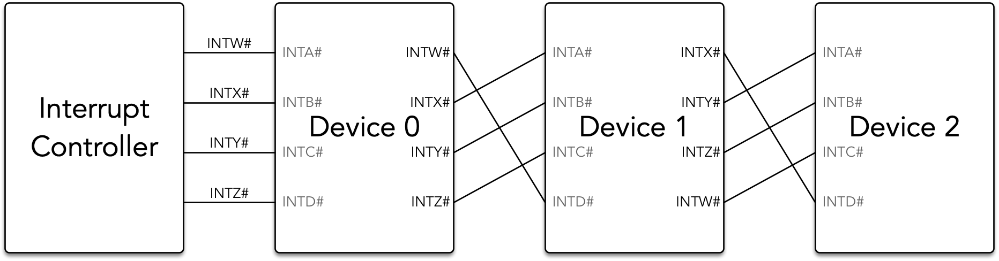
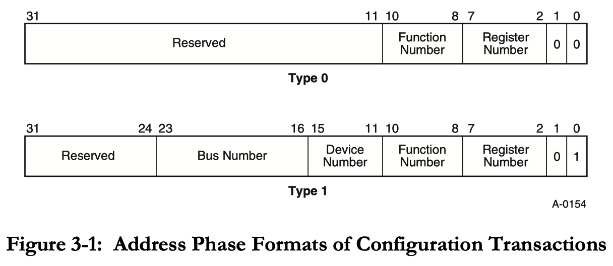
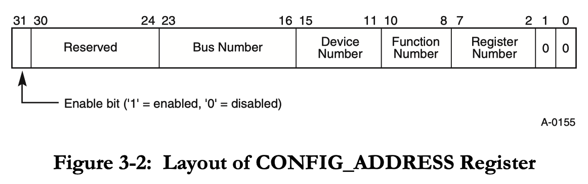
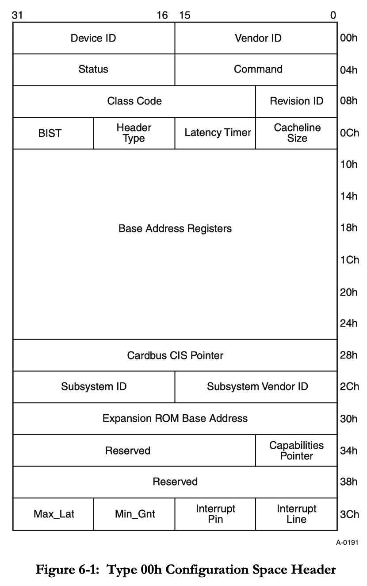
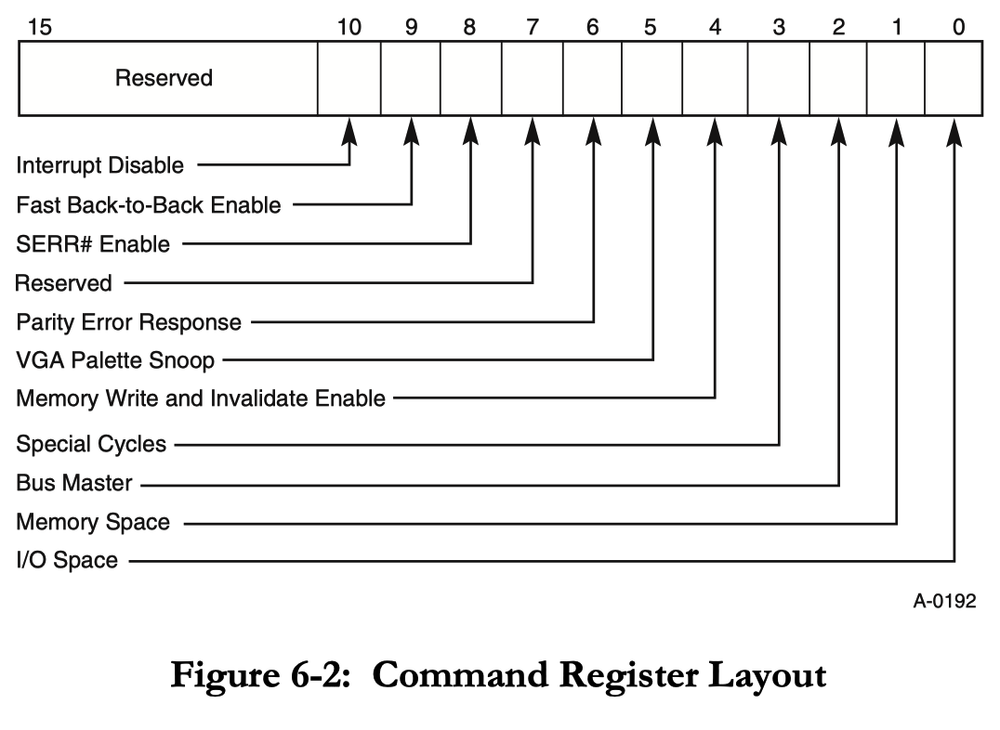
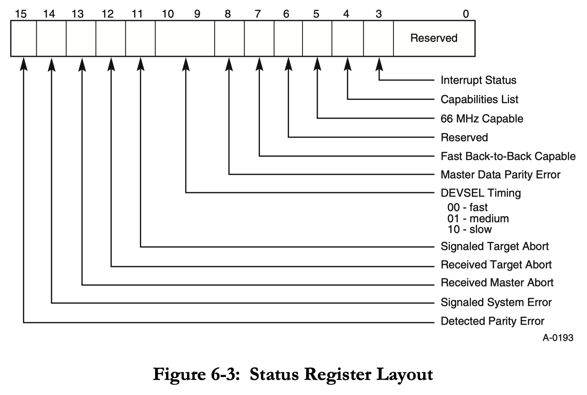
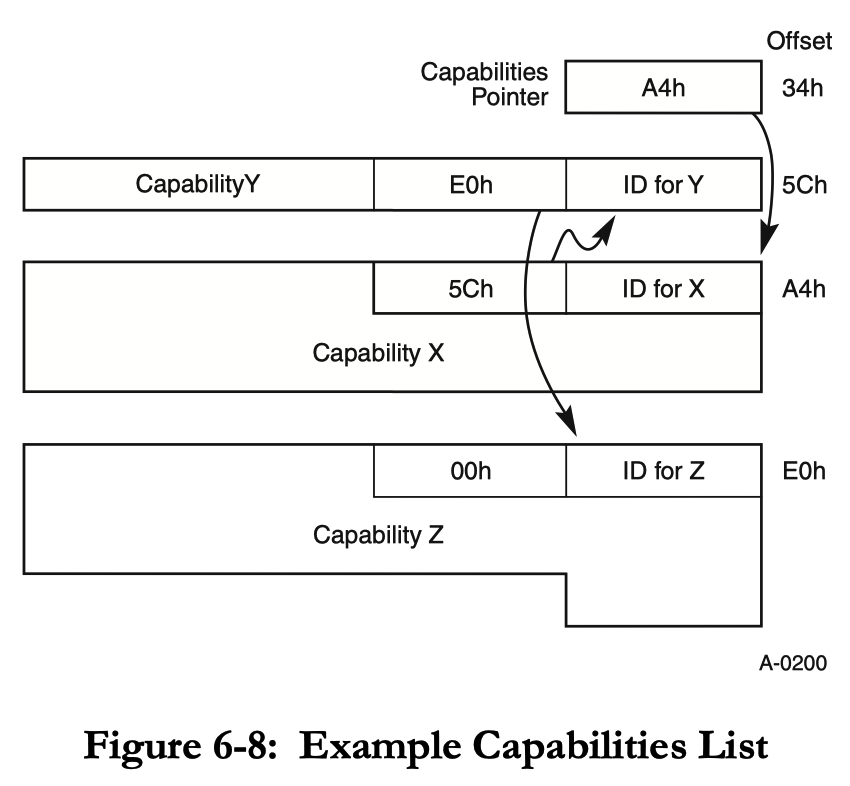
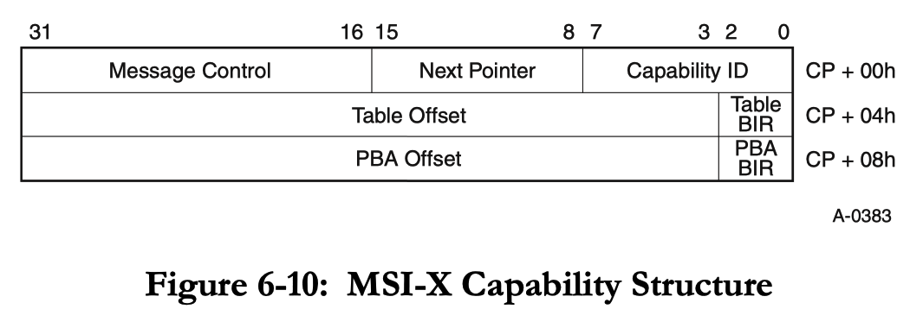
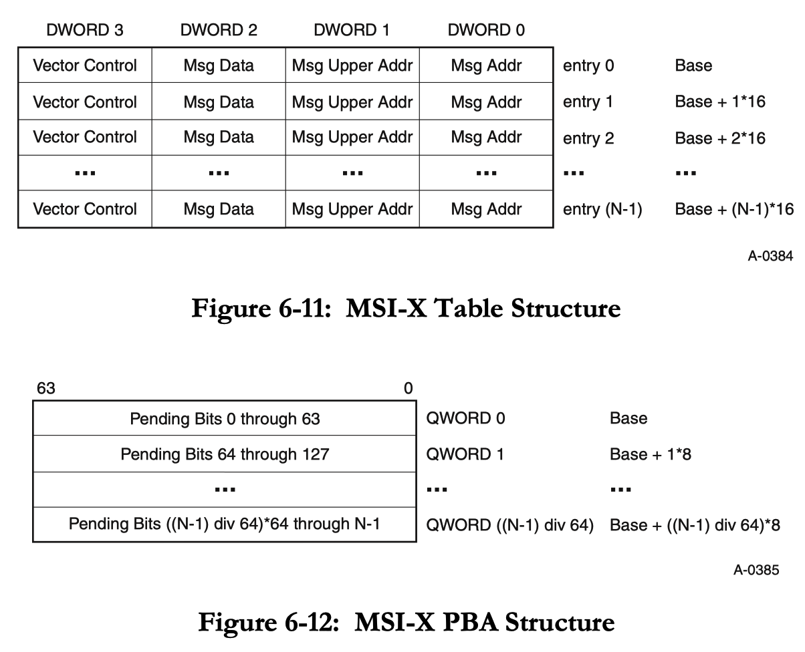

本文来自[PCI Local Bus (i.e. Conventional PCI) | tcbbd的博客](https://tcbbd.moe/ref-and-spec/pci/#Overview)
# Overview

## History

PCI（Peripheral Component Interconnection）标准是由Intel牵头建立的。大约在1990年，一个来自Intel的Architecture Development Lab的团队设计了PCI并制造了第一个样品，到1992年，PCI规范1.0版正式出炉。

它在服务器端迅速取代了IBM的MCA（Micro Channel Architecture）总线以及Compaq领导的EISA（Extended Industry Standard Architecture）总线，随后在个人PC端取代了VESA Local Bus和ISA总线，在1995年Mac电脑也采用了PCI总线。至此，PCI基本一统天下，除了显卡还需AGP接口进行通信。

MCA总线是IBM计划中取代ISA的下一代总线，但最终只在服务器领域有一些应用，并未成功推广。这是因为IBM试图利用专利壁垒，向所有MCA设备生产商收取高额专利费，这导致PC Clone市场的参与者不愿使用MCA总线。

EISA总线是Compaq领导的“九人帮”（九家PC Clone公司）制定的ISA总线的扩展，用于对抗IBM的MCA总线。它与MCA总线最大的不同就在于它能够兼容ISA总线，因此得到了更多应用，到了后期（96年左右）连IBM自己也开始生产EISA总线的机器。不过因为成本原因，EISA总线未在个人PC市场推广开来。

> **PS:** 事实上，甚至连ISA这个名称也是因EISA总线而诞生的，此前ISA总线被称为PC/AT-Bus或I/O Channel。而且，ISA总线在EISA规范发表后，才随着EISA顺便得到了标准化。

VESA Local Bus是在i486时代短暂流行的总线，它起源于VESA组织对当时显卡厂商混乱的私有总线的标准化行为。显卡厂商使用私有总线，则是因为其不愿采用MCA总线而受IBM控制（且MCA总线成本高），而EISA总线又无法达到其要求的性能。显然这种情形到PCI出世就得到了扭转，于是VESA Local Bus迅速被淘汰，成了一代短命总线。

PCI-X是IBM、HP和Compaq合作推出的PCI升级版，其规范制定于1998年，它将总线频率翻倍（PCI-X 2.0又翻了四倍），并且默认使用64位宽（PCI默认为32位宽，PCI 2.1起引入了64位宽），从而可以达到更高的速度。与此同时，Intel也在酝酿下一代的总线架构，即PCIe，当时还称之为3GIO（3rd Generation I/O），两者一度是竞争的关系，不过最终PCIe彻底取代了PCI和PCI-X，PCI-X只是作为PCI的一个改进而存在。

## Characteristics

受限于90年代的硬件条件，PCI总线仍是一种并行总线，到2000年以后USB、PCIe等串行总线才开始涌现。PCI总线支持Bus Mastering，即允许总线上的任意设备成为Master，独占总线一段时间，主动发起总线事务，因此PCI能够很好地支持First-party DMA（上一代的ISA总线主要使用Third-party DMA）。由于多个设备可能同时想成为Master，PCI总线具备仲裁功能，一般来说仲裁器集成在总线或Host Bridge中，但也可以作为单独的硬件实现（例如在PPC中就是如此）。

PCI实际上支持设备之间直接通信，当一个设备成为Master，而另一个设备为总线事务的Target时，自然就实现了两个设备的直接通信，只不过这种方式在PC上几乎不使用。

一条PCI总线上最多可以挂载32个Device（因为Device ID只有5位，详下），为了支持更多设备，PCI总线上可以挂载PCI-to-PCI Bridge，它呈现为一个特殊的设备，占据一个位置，但其下游又可以挂载32个设备。借助PCI-to-PCI Bridge，PCI总线的架构实际上是一棵总线树，这棵树的根节点（通常为Bus 0）与CPU之间则通过Host Bridge连接。对于一些NUMA机器，可能会有多个Host Bridge及其下辖的PCI总线树（例如每个Socket一棵树，此时根节点就不一定为Bus 0了），我们将每棵树称为一个PCI Segment Group，通常来讲两个Segment Group之间不能直接通信，需要借助CPU中转，不过PCI 3.0中增加了PCI Peer-to-Peer功能，借助这个功能可以实现跨Segment Group通信。

Host Bridge本身也会作为其Segment Group的根总线上的一个设备呈现，通常是作为Bus 0的Device 0。由CPU发起的对设备的读写，都会被PCI总线视为Host Bridge发起的读写。

# Signal Definition & Bus Operation

PCI规范定义了PCI设备的信号定义、总线操作、电气特性、机械规格、编程接口等，我们主要关心的是其编程接口，在下一节介绍。另外其信号定义及总线操作对理解PCI也会有帮助，在本节简要介绍。

## Interrupt Signals

每个设备可以有4个中断信号，即`INTA#`、`INTB#`、`INTC#`和`INTD#`，该中断信号是Level-Triggered的，低电位表示Asserted，高电位表示De-asserted。这四个信号实际上是可选的，即设备可以缺少这四个信号，此时采用MSI (Message Signaled Interrupt)/MSI-X方式发送中断，而采用传统中断信号的方式则被称为INTx方式。

MSI于PCI 2.2引入，MSI-X于PCI 3.0引入。所谓MSI即通过发起内存事务来表示中断的中断通知方式，需要Memory Controller和PCI Device配合实现。

PCI规范并未规定设备的INTx#信号具体与中断控制器（e.g. IOAPIC for x86）如何连接，理论上可以每个设备的每个有效INTx#信号，单独接一根线到中断控制器，也可以所有设备的所有INTx#信号共享同一根线连到中断控制器。

不过PCI规范中推荐了一种实现方式，并且似乎成为了主流的实现方式，这种方式规定所有设备的INTx#信号，最终归并到中断控制器上的4根输入信号线，不妨称为`INTW#`、`INTX#`、`INTY#`、`INTZ#`。我们为所有设备编号，若设备A的`INTA#`接到`INTW#`上，则设备B的`INTA#`接到`INTX#`上，设备C的`INTA#`接到`INTY#`上，以此类推，轮换排列。设备有多个输出信号时，若`INTA#`接到`INTX#`上，则`INTB#`接到`INTY#`上，`INTC#`接到`INTZ#`上，其余情形照此。示意图如下：

## Operation of PCI Transactions

> 以下我们将事务的发起者称为Master Device，其响应者称为Target Device，两者统称PCI Agent。

### Arbitration

PCI总线支持Bus Mastering，设备若要发起事务，首先要获得总线的独占权，成为Master。每个设备都有一根`REQ#`信号线和一根`GNT#`信号线，若设备欲发起事务，则Assert其`REQ#`信号线即可。同时可能有多个设备试图成为Master，此时就由总线仲裁器进行仲裁，选取其中一个Assert其`GNT#`信号线，设备收到`GNT#`信号后方可发起事务。

### Transaction Basics

PCI中Address和Data共用数据线，即`AD[31:0]`（64位则还包含`AD[63:32]`），因此其总线事务分为两个阶段，第一阶段指定地址，第二阶段传输数据。PCI中总线事务基本都是支持Burst传输的，即一个地址阶段后，可以连续进行多个数据传输阶段，直到Master或Target有一方终止该事务为止。PCI规范定义了三个地址空间，即Memory、I/O和Configuration空间（详下），其中Memory和I/O事务都是Burst的，仅Configuration事务不是Burst的。

随地址或数据同时传输的，还有`C/BE[3:0]#`（64位还包含`C/BE[7:4]#`），在第一阶段表示Command，第二阶段表示Byte Enable。Command用于表示该事务是哪种操作，例如I/O Read或Memory Write，Byte Enable用于表示数据线上哪些Byte有效，例如取0101b则第0、第2个字节有效。

Device成为Master后，通过Assert其`FRAME#`信号线表示事务开始，随后的一个周期就会向`AD`和`C/BE#`写入地址和Command，这就是事务的地址阶段。此时所有的设备都能收到这个地址以及Command，其中一个设备发现地址落在了自己映射的地址范围内，便会Assert其`DEVSEL#`信号线，表示该设备是Target Device。

> `DEVSEL#`信号要求在`FRAME#`信号置上后过1、2或3个周期置上（至少要过1周期，用于传输和匹配地址），我们分别称为Fast、Medium和Slow。一个设备的`DEVSEL#`信号延迟属于这三种中的哪一种，可以通过查看该设备Configuration空间中的Status寄存器获知。

随后起作用的是Master的`IRDY#`和Target的`TRDY#`信号线，分别表示Master和Target准备好进行Data Transfer了，当它们都处于Asserted状态时，就会进行一轮数据传输。显然，Target的`TRDY#`信号要在`DEVSEL#`信号被置上的同时或之后才能被置上，在此之前尚不知道哪个Device的`TRDY#`信号线要起作用。

当Master欲结束当前事务时，它应将`FRAME#`信号Deassert，但保持`IRDY#`为Assert状态，这就表示下一轮数据传输将是最后一轮，当完成这一轮后，`FRAME#`和`IRDY#`信号都为Deassert，表示Master不再占据总线。

### Transaction Termination

除了上述正常结束事务的方式，还可以由于其他原因导致事务结束。对于Master而言，它要结束事务，总是通过将`FRAME#`信号Deassert，再将`IRDY#`信号Deassert（若`IRDY#`尚未Assert则先Assert之，再Deassert`FRAME#`，最后Deassert`IRDY#`）这样的操作顺序，但因其事务结束的原因可能不同：

- *Completion*：事务正常结束
- *Timeout*：Master的`GNT#`信号被Deassert且其Latency Timer已经超时，则应该结束当前事务
- *Master-Abort*：Master发现Target无响应，例如`DEVSEL#`信号过了3个周期仍未置上，则它可以主动结束该事务。PCI规范规定，在PC兼容机上，Host Bridge发起的读事务发生Master-Abort时，必须向CPU返回全1的结果。

Latency Timer是一个可以通过设备Configuration空间配置的计时器，单位以总线周期计。从`FRAME#`被置上起，Latency Timer开始倒计时，当它到期时，若`FRAME#`还未被Deassert，但`GNT#`已经被Deassert，则事务立即终止（最多能再完成其最后一轮）。若`GNT#`还未被Deassert，则事务进行到`GNT#`被Deassert时立即终止（最多能再完成其最后一轮）。也就是说，一个设备至少能独占总线直到Latency Timer到期或其主动结束事务为止。

Target也可以利用`STOP#`信号线来通知Master结束当前事务：

- *Retry*：可以视为Disconnect的一种特殊情况，即尚未进行数据传输就结束事务，此时`TRDY#`尚未置上，只需置上`STOP#`即可。Master必须不断重试被Retry终止的事务，直到其成功或由于其他原因结束。
- *Disconnect*：在任意一轮数据传输，Assert`STOP#`即可触发Disconnect终止当前事务，若此时`TRDY#`为Asserted状态则当前轮的数据传输可以完成，否则不再传输数据立即停止事务
- *Target-Abort*：以上两种情况代表Target具备完成传输的能力，但暂时没有资源进行数据传输，于是暂停当前事务，这个事务接下来可以重试。若Target遇到错误导致事务无法继续，例如其只允许访问4字节中的1个字节，但Master却试图访问全部4个字节，则会通过Target-Abort的方式结束事务，具体方法是Deassert`DEVSEL#`信号并同时Assert`STOP#`信号。

## Commands

PCI规范总共定义了12种Command，如下：

- 0000b: Interrupt Acknowledge
- 0001b: Special Cycle
- 0010b: I/O Read
- 0011b: I/O Write
- 0110b: Memory Read
- 0111b: Memory Write
- 1010b: Configuration Read
- 1011b: Configuration Write
- 1100b: Memory Read Multiple
- 1101b: Dual Address Cycle
- 1110b: Memory Read Line
- 1111b: Memory Write and Invalidate

### Misc

Interrupt Acknowledge是一种特殊的读事务，它由Host Bridge（更进一步是由CPU）发起，Target是Interrupt Controller（即Interrupt Controller会Assert其`DEVSEL#`信号），其Address无意义，Data即读到的数据为中断向量号（Interrupt Vector）。

> **Legacy Feature:** 这个Interrupt Acknowledge其实是源自x86早期的PIC（即8259A芯片）的产物，PCI Spec中的*Interrupt Controller*一词实际上就是想指代PIC。我们知道，PIC向CPU通知中断时分成两步进行：它首先通过`INT`信号线发送中断信号，CPU收到该信号后，便会向PIC发送`INTA`信号，于是PIC再执行第二步向CPU发送中断向量号，至此一个完整的中断才算完成。
> 过去PIC和CPU之间直接连接，到了IOAPIC和PCI出现以后，为向前兼容仍保留了PIC，但是作为PCI总线上的一个Device存在。这里的Interrupt Acknowledge起到的作用，类似于此前CPU向PIC发起的`INTA`信号，它的效果就是从PIC中读到当前中断的向量号。

Special Cycle是一种特殊的广播事务，其Address无意义，当前总线上的所有设备都是其潜在目标（上游、下游总线上的设备则不是），因而没有设备会Assert`DEVSEL#`信号，这也就导致Master-Abort是Special Cycle事务的正常结束方式，这个Master-Abort不会被记录在Master的Configuration空间中的Status寄存器中。显然，事务只会进行一轮数据传输，`AD[15:0]`表示Special Cycle Message，`AD[31:16]`表示Message dependent的额外数据（可选），PCI Spec 附录A中定义了几个Message。

Dual Address Cycle是用于向32位设备传输64位的地址的，需要两个周期来传输地址，故名Dual Address Cycle。

### Read/Write Processing

注意到Memory具备多个读写Command，它们的含义分别如下：

- Memory Read：普通的读取，不做任何预取
- Memory Read Line：Target进行预取，一次取一个Cache Line的数据，待消耗完毕后再取下一个Cache Line
- Memory Read Multiple：只要`FRAME#`信号处于Asserted状态，Target就不断进行预取直到内部的缓存存满为止
- Memory Write：普通的写入
- Memory Write and Invalidate：表示只有当进行若干轮数据传输，缓存的数据积累到一整个Cache Line，才一次性写入一整个Cache Line，将原本的Cache Line直接Invalidate。使用该Command时，Byte Enable必须全都为1，这样才能保证整个Cache Line被填满。

> 这里的Cache Line大小需要在Master Device的Configuration空间中的Cacheline Size寄存器设置。若Master没有该寄存器，则Cache Line按16或32字节计。

对于I/O事务，其Address就是一个32位的地址，对于Memory事务，其Address则必须是4字节对齐的，Address的末两位用于表示Burst Order：

- 00b表示Linear Increment，即地址每一轮数据传输+4
- 10b表示Cacheline Wrap，即地址先遍历完一个Cache Line，再遍历下一个Cache Line
  - 若起始地址在Cache Line Boundary，则和Linear Increment没有区别
  - 否则，地址每次+4直到到达Cache Line Boundary，然后Wrap回到Cache Line的开头继续，待一轮完成后，以起始地址+Cacheline Size为地址进行下一轮。例如Cache Line为64字节，起始地址为0x0C，则地址一路递增到0x3C，接着下一次取0x00，然后是0x04、0x08，最后变为0x4C，如此循环。

### Configuration Address Decoding

PCI的组织结构是一台机器可以有多个PCI Bus，每个PCI Bus下有若干Device，每个Device可以有多个Function，Function是最小的单元。每个Function具备自己的独立的Configuration Space，大小为256字节。

要访问该Configuration Space，就取`C = 1010b`（Configuration Read）或`C = 1011b`（Configuration Write）即可，此时地址的格式如下（其中Type 0为PCI Bus内部通信使用，遇到PCI-PCI Bridge会被翻译，Type 1才包含完整的信息）：

首先考察Type 1地址：为了确定一个Function，我们需要指定8位的Bus Number，5位的Device Number以及3位的Function Number（即地址第8-23位），这总计16位信息通常简称为BDF，是Function的唯一编号。地址中的第2-7位则是用于选择Configuration Space中具体的偏移量。

> 于是我们也可以知道一个系统最多256根PCI Bus，一个Bus下最多支持32个Device，每个Device最多只有8个Function

利用BDF编号，Host Bridge或PCI-to-PCI Bridge可以找到Target Device，此时会Assert其`IDSEL`信号线，选中该设备，并同时在总线上发起一个Type 0地址的Configuration事务。作为回应，该设备会Assert其`DEVSEL#`信号线，配合Bridge完成该事务（必须`IDSEL`信号和Type 0 Configuration事务两者齐备，才允许Assert`DEVSEL#`信号）。

PCI规范原则上不限制系统访问Configuration Space的方式，甚至发明新指令专门用于访问Configuration Space也是可以的。但它专门为PC-AT兼容机规定了访问方式，必须通过访问位于I/O地址`0xCF8`和`0xCFC`的两个寄存器，即`CONFIG_ADDRESS`和`CONFIG_DATA`，来访问Configuration Space。其中`CONFIG_ADDRESS`的格式规定如下（`CONFIG_DATA`就是单纯的数据没有格式要求）：

可以看到基本上和Bus内部使用的Configuration Address是一样的，要指定BDF编号以及Configuration Space内部的偏移量。不过，最高位（第31位）取1时才会产生Configuration Read/Write，否则为通常的I/O Read/Write。

## Error Handling

PCI设备具备`PAR`信号线，即奇偶校验位，它满足`AD[31:0]`、`C/BE[3:0]#`和`PAR`中1的数量加起来为偶数。若检查到上述信号线中1的数量加起来为奇数，则说明出现了一个奇偶校验错误（Parity Error），此时Target设备Configuration空间中的Status寄存器的第15位*Detected Parity Error*会被置上。

除了Detected Parity Error，PCI中与Error Reporting有关的还有Configuration空间中的以下四个位：

- Command寄存器的第6位：*Parity Error Response*
- Command寄存器的第8位：*SERR# Enable*
- Status寄存器的第8位：*Master Data Parity Error*
- Status寄存器的第14位：*Signaled System Error*

首先，Parity Error Response决定了设备是否需要对奇偶校验错误作出响应，若取0则设备忽略该错误，像正常事务一样进行处理，不会设置Status寄存器的第8、第14位（但仍会设置Detected Parity Error），也不会Assert`PERR#`或`SERR#`信号线。以下只讨论Parity Error Response取1的情况。

### Termination upon Error Condition

Address校验显然是由Target设备进行，若Target发现一个Address校验错误，它可以有三种选择：

- 忽略该错误，照常处理事务
- 接受该事务，并主动发起Target-Abort
- 无视该事务，从而导致Master-Abort

Data校验则是写入事务由Target进行，读取事务由Master进行，若设备发现一个Data校验错误，则它可以选择不继续进行Burst Transfer（即不进行下一轮数据传输），但必须完成本轮数据传输（即使该轮传输的数据最终被设备丢弃）。

### Error Recovery

PCI规范规定了两种报告错误的方式，即`PERR#`和`SERR#`信号。其中`SERR#`信号用于表示（依靠设备自身）不可恢复的System Error，它应当触发一个「Critical Interrupt」，例如NMI或Machine Check。操作系统可能具备更多信息从而可以从该错误中恢复，但也允许其立即停止运作。

若SERR# Enable = 1，则遇到以下情形设备会Assert`SERR#`信号来报告一个系统错误，并会设置Status寄存器的Signaled System Error位：

- Target设备检测到Address校验异常
- Target设备检测到Special Cycle事务的Data校验异常
- 其他系统错误（Implementation Defined）

对于其他情形，也就是非Special Cycle事务的Data校验异常，通过`PERR#`信号报告校验错误。若是读事务，则Master负责Assert`PERR#`，若是写事务，则Target负责Assert`PERR#`。所有设备的`PERR#`信号线实际上都是相连的，当Target将`PERR#`Assert时，Master可以侦听到该事件。在两种情况下，Master都能获知发生了Data校验错误，并会置上Status寄存器的Master Data Parity Error位。

PCI规范并未规定`PERR#`信号线应如何连接，以及设备和OS应当如何处理Data校验错误，这些都是Platform和Device Specific的。因此，`PERR#`可以触发一个中断，也可以什么都不触发，甚至将它和`SERR#`短接也是允许的。若`PERR#`不触发中断，则可以通过Master设备发送中断来通知Data校验错误。

# Configuration Space

PCI Configuration Space大小为256字节，由标准定义的Header和Device定义的其余部分构成，其中Header的前16字节是固定的，Header的其余部分根据Header Type的取值而不同，目前Header Type可以取0、1或2，分别表示Device、PCI-to-PCI Bridge和CardBus Bridge。这里只介绍普通Device的Header，其格式如下所示：

- Vendor ID、Device ID必须实现，Revision ID可选，它们用于标识一个设备。
- Header Type必须实现
  - Bit 0-6表示Header类型，此处取0表示Device
  - Bit 7表示该Function是否属于一个Multi-Function Device，取1表示属于
- Class Code必须实现，它的High Byte表示Base Class，Middle Byte表示Sub-Class，Low Byte表示Interface，也就是说是一个按层次分类的分类码。PCI规范预先规定了许多Classification，详细可查阅PCI Spec 3.0 附录D。

## Command & Status

Command和Status寄存器也是必须实现的。Command的格式如下：

- 第0位，表示是否启用I/O Space，即是否响应I/O事务

- 第1位，表示是否启用Memory Space，即是否响应Memory事务

- 第2位，表示是否允许设备成为Master

- 第3位，表示是否响应Special Cycle广播事务

- 第4位，表示允许该Master设备发起Memory Write and Invalidate事务

- 第5位，表示是否启用VGA Palette Snoop，若启用则忽略对VGA Palette寄存器的写入，转而Snoop总线上对另一个设备VGA Palette的写入

  > 该特性用于显卡和其他VGA Compatible设备之间VGA Palette的同步

- 第6位，表示是否对奇偶校验错误作出反应，若取0则不会Assert`PERR#`或`SERR#`以及设置Status寄存器的第8、第14位

- 第8位，表示是否启用`SERR#`信号线，若启用则会通过该信号报告System Error

- 第9位，表示是否启用对不同Target的Fast Back-to-Back Transactions

- 第10位，表示是否禁止INTx中断，若取1则设备只使用MSI/MSI-X中断机制

所谓Fast Back-to-Back Transactions就是指同一个Master发起的两个连续事务之间，可以省略中间的Bus Idle周期，直接「背靠背」地进行下一个事务。Master对于同一个Target的两个连续事务，默认支持背靠背模式，但对不同Target的连续事务，则要先设置Command寄存器的第9位，才允许进行。

Status寄存器有些特殊，它的位只能被Reset，即从1变为0，要想Reset一个位，就向该位写入1，例如向Status写入0x4000，就会清除第14位。Status的格式如下：

- 第3位，取1表示该设备当前有正在处理的INTx中断（即某个INTx#信号处于Asserted状态）
- 第4位，表示是否支持Capability List
- 第5位，表示是否支持运行在66 MHZ
- 第7位，表示是否支持对不同Target的Fast Back-to-Back Transactions
- 第8位，表示Master设备检测到了一个Data校验错误（它自己检测到或通过Target设备的`PERR#`信号间接得知）
- 第9-10位，表示`DEVSEL#`信号在`FRAME#`信号后延迟几周期置上，Fast、Medium和Slow三种取值分别代表1、2和3周期
- 第11位，表示Target发起了一个Target-Abort
- 第12位，表示Master收到了一个Target-Abort
- 第13位，表示Master遇到了一个Master-Abort
- 第14位，表示设备报告了一个System Error（即Assert了`SERR#`信号）
- 第15位，表示设备检测到了一个奇偶校验错误（Parity Error）

其中第3-5、7、9、10位是只读的，其余位可以Reset。

Status寄存器的第7位，表示的是Target是否支持作为背靠背事务的目标，软件应当先检查确认了Master的所有潜在Target都支持背靠背事务，再设置Master的Command寄存器的第9位，启用对不同Target的背靠背事务。

## Base Address Registers

在Configuration Space的0x10-0x24设备最多可以实现6个BAR（Base Address Register），用于在Memory或I/O空间映射其寄存器等内部状态。BAR的格式如下：

硬件首先通过只读的`BAR[bit 0]`表示该BAR映射的是Memory还是I/O空间。I/O BAR总是32位的，且`BAR[bit 1]`固定为0，而Memory BAR可以是32位或64位的，通过只读的`BAR[bit 2:1]`来标识。此外，Memory BAR还通过只读的`BAR[bit 3]`表示它映射的区域是否是可预取的。

BAR的设计是巧妙的，它用一个寄存器就能表示一个地址范围。首先，它是所要表示的地址范围的基地址。其次，它所映射的范围的大小必须是2的整数幂，并且必须是对齐的，因此其最低N位为Don’t Care Bits，无论写入什么，都会返回0（除了Memory BAR的末4位和I/O BAR的末2位）。这样，软件只要向BAR写入全1的值，再进行读取，看哪些位被重置成了0，即可得知该BAR Region的大小。

## Other Fields

- Cacheline Size：即上文提到的Memory Read Line、Memory Read Multiple、Memory Write and Invalidate事务以及Cacheline Wrap模式的Memory事务使用的Cacheline Size
- Latency Timer：Master至少能独占总线的周期数，上文已介绍过
- Built-in Self Test（BIST）：
  - 第0-3位，0表示通过自检，非0表示未通过自检，非0值具体代表什么错误是Device Specific的
  - 第6位，向其写入1以进行自检，待自检完成后该位自动变回0
  - 第7位，只读，返回1表示支持自检功能，否则不支持
- CardBus CIS Pointer：当CardBus和PCI Bus集成在同一个电路中时，该Field可用于指向CardBus Information Structure
- Interrupt Line：表示该Function使用的中断信号线连接到系统的Interrupt Controller的哪一个引脚，该Field的含义是Architecture Specific的，例如在x86上其含义就是IOAPIC的24个IRQ引脚中的哪一个
- Interrupt Pin：表示该Function使用中断信号线，取0表示禁用INTx中断，取1表示使用`INTA#`，取2表示使用`INTB#`，取3表示使用`INTC#`，取4表示使用`INTD#`
- MIN_GNT和MAX_LAT：只读，用于提示如何设置Latency Timer的值，前者表示33 MHZ下设备需求的Burst长度（单位为1/4微秒），后者表示设备每隔多久要请求一次总线所有权（单位为1/4微秒）
- Subsystem Vendor ID和Subsystem ID：用于标识利用核心芯片进行PCI卡外围开发的厂商，例如公版vs非公显卡

CardBus是早期用于笔记本电脑的一种扩展接口，它的前身是PCMCIA，基于PCMCIA的产品一般称为PC卡。PC卡采用16位总线进行通讯，而CardBus在不改变扩展卡的物理接口的情况下，升级为了32位的PCI总线进行通讯，因此许多人仍将CardBus卡称为PC卡。CardBus的下一代技术为ExpressCard，基于PCIe总线，诞生于2003年，但在此后的竞争中败给了USB，从此销声匿迹。

## Capability List & MSI

自PCI 2.1后的一些扩展是以Capability List的形式加入的。Capability List是一个链表，Header中的Capabilities Pointer（`Header[0x34]`）指向该链表的第一项，一个典型的Capability List如图所示：

链表中的每一项，第一个字节是Capability ID，由PCI规范规定，详见PCI规范附录H，第二个字节是下一项的偏移量，随后是该项的内容，随Capability不同而不同。

MSI/MSI-X是作为PCI的一项Capability添加到PCI规范中的，它是仅有的写入PCI规范正文的Capability，而其余Capability则都是在另外的规范中定义，与PCI规范本身关系不大。此外，MSI和MSI-X实际上分配了不同的Capability ID，也就是具有不同的Capability Structure，一个设备可以同时支持MSI和MSI-X，但同时只能启用其中的一个功能。

### MSI Capability Structure

MSI的Capability ID为0x05，MSI Capability Structure的格式如下：

根据Message Control的取值不同，MSI Capability Structure可以有四种格式，其中两种使用32位地址，两种使用64位地址。Message Data即MSI Transaction写入的数据，其Low Byte为中断向量号（Interrupt Vector）。

Message Address和Message Data的格式由各个架构自己定义，对于x86架构，Message Address就是位于0xFEE00000 - 0xFEEFFFFF的一块地址区域（和LAPIC的地址范围重合），Message Address/Data的格式定义于Intel SDM Vol.3的第10章。

Message Control的格式如下：

- 第0位为MSI Enable，开机时默认为0，表示禁用MSI
- 第1-3位为Multiple Message Capable，表示设备支持多少Vector，设备遇到不同的事件，可以使用不同的Vector来产生中断
  - 其取值为X，则支持2X个Vector，X最大为5，即允许使用32个不同的Vector
  - 设备使用的Vector号受到Message Data的限制，它只能改变Message Data的末X位来变更Vector，从而产生2X个不同的Vector
- 第4-6位为Multiple Message Enable，表示软件允许设备使用多少个Vector，取X则只允许Device改动Message Data的末X位，即使用2X个Vector
- 第7位为64 Bit Address Capable，决定了Message Address是否为64位
- 第8位为Per-vector Masking Capable，决定了是否有Mask Bits和Pending Bits这两个域

Per-vector Masking是MSI的可选特性，但是MSI-X的必须特性（MSI-X中实际是MSI-X Table的Per-entry Masking，详下），并且PCIe规范强烈建议支持MSI的设备也支持Per-vector Masking。

上面已经提到MSI允许设备使用多个Vector，这里Mask Bits和Pending Bits的每个Bit就对应于一个Vector（若无该Vector就取0）：

- Mask Bits由软件设置，其某个位取1，表示禁止发送对应的Vector
- Pending Bits由设备设置，当某个Vector被Mask，而设备又产生了一个中断从而生成该Vector的MSI Message时，Pending Bits中该Vector对应的位就会置为1，当Mask取消后，设备就会立即发送该Vector对应的MSI Message，并将该位清零

### MSI-X Capability and Table Structure

MSI-X的Capability ID为0x11，MSI-X Capability Structure的格式如下：

可以看到它实际上将真正的配置移到了MSI-X Table和PBA（Pending Bit Array）中去了，这两个结构都位于Memory而不是Configuration Space。我们通过最低3位（BIR, BAR Indicator Register）指定一个BAR Region（必须是Memory Region不能是I/O Region），其余位则用于指定在该Region中的偏移量（Offset是32位而不是29位的，末3位取0），从而可以索引到MSI-X Table和PBA。

Message Control的格式如下：

- 第0-10位为Table Size，表示MSI-X Table的大小，若MSI-X Table有N项，则其取值为N-1
- 第14位为Function Mask，取1表示屏蔽该Function的中断，取0则根据Per-vector Mask只屏蔽部分Vector
- 第15位为MSI-X Enable，开机时默认为0，表示禁用MSI-X

MSI-X Table和PBA的格式如下：

MSI-X Table每个条目大小为16字节，最多2048个条目，也就是说设备最多可以为2048个不同事件分配不同的Vector。设其有N个条目，则PBA就是一个有N个Bit的bitmap，每64位为一组，最后一组不足64位的补零。MSI-X Table条目的Vector Control项仅第0位有效，其余均为保留位，它的含义是屏蔽该条目，禁止发送对应的MSI Message，屏蔽后积压的中断会体现在PBA中的对应Bit上。

- **本文作者：** tcbbd
- **本文链接：** https://tcbbd.moe/ref-and-spec/pci/
- **版权声明：** 本博客所有文章除特别声明外，均采用 [BY-NC-SA](https://creativecommons.org/licenses/by-nc-sa/4.0/deed.zh) 许可协议。转载请注明出处！