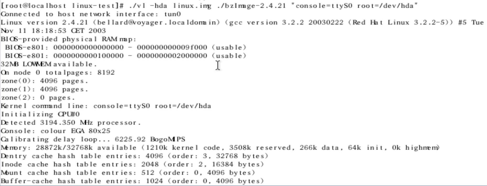

# qemu_reading

个人的qemu阅读笔记.预期要阅读的qemu代码版本为2.8.1.预期要参考书籍为QEMUKVM源码解析与应用.


虽然本人想一上来就能读透2.8.1的代码,但是草草看了一眼,发现代码复杂度过高,难度过大.在之前没有任何知识储备的情况下,阅读体验太差,容易放弃.

不过,要知道,一个项目并不是一开始就是这么桀骜难懂的,最开始的一些版本一定是足够简洁易懂的.所以本人采用了一种迂回的方式,那就是从qemu的最简单版本开始,啃透了,然后进入下一个高阶版本继续来啃,这样的话,阅读体验会好很多.


这篇文章会随着阅读进度的推进而逐渐完善,持续的时间预估在半年左右,不过不管怎么样,我总会读完qemu的核心代码的,阅读笔记也会逐渐变得完备.

和之前的读码笔记一样,我还是想说一句,读这份代码,其实对本人的工作的帮助极其有限,我读这份代码,仅仅是源于兴趣,qemu实现的功能是十分有意思的,一份简短的代码,就能让你熟知硬件和操作系统是如何来进行交互的,可以从另外一个层面加深你对软硬件的理解.

## 个人的推荐

个人觉得值得一读的几个版本:

1. v0.1.6 这个版本第一次实现了一个简易的汇编代码转换器,而且是可以正常工作的那种,虽然说从i386转换到i386比较鸡肋,不过参考一下它的实现思想是很有必要的,在qemu的后续版本,会实现i386 -> arm等架构的汇编转换,思想是类似的,需要注意的,仅仅只有技术细节,不感兴趣的同学,大可以忽略不管.
2. v0.4.4 这个版本模拟的一台x86 pc,而且可以运行linux内核了,可以说,麻雀虽小,五脏俱全. 这个版本代码的模块化思想还不是很完善,而且qemu模拟的硬件都过分简洁,不过这正是我们所追求的,此版本代码量还没有过分膨胀,涉及的硬件知识还在可以接受的范围之内,可以充分体验到qemu的核心思想,一切皆内存.qemu的后续版本,硬件模拟的代码越来越正式,越来越复杂,想要完全弄懂,难度就陡然上升了.
3. v0.8.2 这个版本发布于06年,历经了3年的开发,功能已经相当完善了,这个版本新增了一些重要的特性,比如说smp,也就是多核,新增了usb接口的模拟,这些新特性都值得一看.

4. v0.10.6 新加入了tcg,这个功能值得一读.

读完上面4个版本,qemu的设计思想,发展的脉络,我们基本上就捋得很清楚了.后续的代码基本也可以很快上手.

## 如何追踪代码

至于2005年之前的qemu版本,个人推荐还是自己搭建一个redhat9的虚拟机.

下面是个人搭建的环境:

```shell
[root@localhost root]# uname -a
Linux localhost.localdomain 2.4.20-8 #1 Thu Mar 13 17:18:24 EST 2003 i686 athlon i386 GNU/Linux
[root@localhost root]# gcc --version
gcc (GCC) 3.2.2 20030222 (Red Hat Linux 3.2.2-5)
Copyright (C) 2002 Free Software Foundation, Inc.
This is free software; see the source for copying conditions.  There is NO
warranty; not even for MERCHANTABILITY or FITNESS FOR A PARTICULAR PURPOSE.
```

个人尝试了一圈,也就这个版本能正常将最原始的代码编译出来了.

我这里分享一下镜像链接,这个是上古时代的redhat.

https://pan.baidu.com/s/1HjCW1pH6NURwnRFZTr2jxA 提取码: 89u5

## 如何来测试代码

### v0.1.6

只需要搭建环境就可以跑,不需要折腾.

### v0.4.4

v0.4.4版本所涉及的测试文件vl-test-xxx.tar.gz,我在网上找了一圈,都因为年代久远,找不到了,不过v0.5.1版本之后的测试文件,是能够找到的.

我自己摸索了一下,发现对这些文件修改一下,也能满足测试的需求.

至于地址,自然是找一下网页的历史快照[Wayback Machine (archive.org)](http://web.archive.org/)

搜索一下qemu.org这个网址的历史快照.

```shell
[root@localhost linux-test]# ls 
bzImage-2.4.21  bzImage-2.5.74  linux.img  vl
[root@localhost linux-test]# ./vl -hda linux.img bzImage-2.4.21 "console=ttyS0 root=/dev/hda"
[root@localhost linux-test]# cat /etc/vl-ifup 
#!/bin/sh
sudo /sbin/ifconfig $1 172.20.0.1
```

不得不说,看到几千行代码,就能虚拟出一台简易的x86设备,就足够让人兴奋不已了.



ps: 找到这个可用的镜像,费了我好大的力气,不过好在运气比较好,最终还是找到了.
